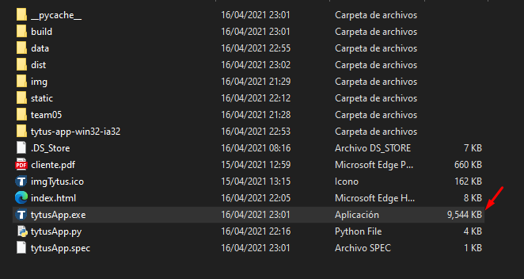
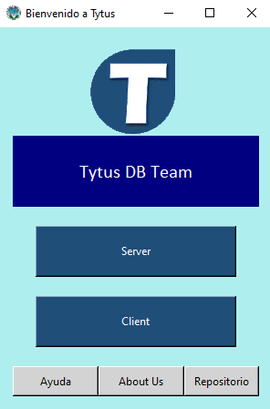

# MANUAL INSTALACION
:beginner: [Descargar instalador](https://n9.cl/7d6j3)

 

Bienvenido al equipo TytusDB, en este apartado encontrará el manual de instalación del DBMS, paso a paso, procederemos a descargar el instalador.

     

        Figura 1. Descarga del instalador
     

     

Esto procederá a descargar un archivo .zip, el cual procedermos a descomprimir. La podemos almacenar en cualquier lugar que usted desee.

     

        Figura 2. Instalador descargado
     

     

 La carpeta descomprimida cuenta con todo lo necesario para el correcto funcionamiento del proyecto, lo único necesario para el uso de Tytus es hacer uso del archivo llamado tytusApp.exe

     

        Figura 3. Estructura de carpetas del proyecto
     

     

 Podremos crear un acceso directo para el ejecutable para tener de una forma más fácil acceso a la aplicación, al dar doble click sobre el ejecutable se desplegará el menú de inicio de Tytus con las diversas opciones disponibles.

     

        Figura 3. Estructura de carpetas del proyecto
     

     

<footer>
 

:v: <i>Tytus Team, 2020. </i>
</footer>
