# MANUAL DE USUARIO - Tytus DB

## Indice
- [Presentación](#:computer:-Presentación)
- [Requerimientos del sistema](#:computer:-Requerimientos-del-sistema)
- [Ejecución](#:arrow_forward:-Ejecución)
- [Botones](#:mag_right:-Botones)
  

---

## :computer: Presentación
Tytus DB un proyecto Open Source para desarrollar un administrador de bases de datos. Está compuesto por tres componentes interrelacionados: 
* Administrador de almacenamiento de la base de datos
* administrador de la base de datos: este administrador se compone a su vez de un servidor y de un cliente
* SQL Parser

Este proyecto se centra específicamente en el deasarrollo del componente SQL Parser.

Para poder hacer uso del SQL Parser te presentamos los requerimientos mínimos del sistema donde se correrá el programa y una guía para navegar en la aplicación.

## :computer: Requerimientos del sistema
 ### Software
 Su máquina debe de contar con la instalación física de: 
* [Python 3](https://www.python.org/downloads/) 
* [Graphviz](https://graphviz.org/) 

* Sistema Operativo: Independiente

### Hardware

RAM: Minimo 4GB

Procesador: Minimo 2 núcleos de 

## :arrow_forward: Ejecución
 Descarga el pruyecto del prepositorio de [TytusDB](https://github.com/tytusdb). 

 Puede ejecutarse con los siguiente pasos. 

1.Ingresar a la carpeta del instalador y ejecutar TytusApp.exe
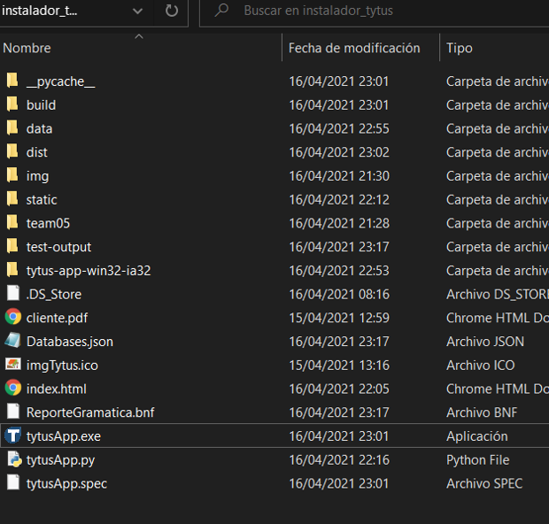

2.Acontinuación se desplega el menú de Tytus, donde visualizaremos los distintos botones que son Server, client, ayuda, about us y  repositorio

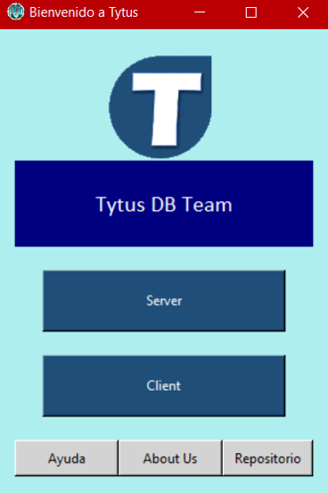

3.Presionar el botón Server primero como paso inicial para ejecutar Tytus, se desplegara un mensaje y abrirá una consola
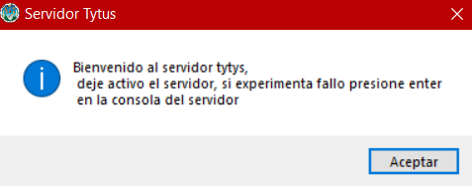
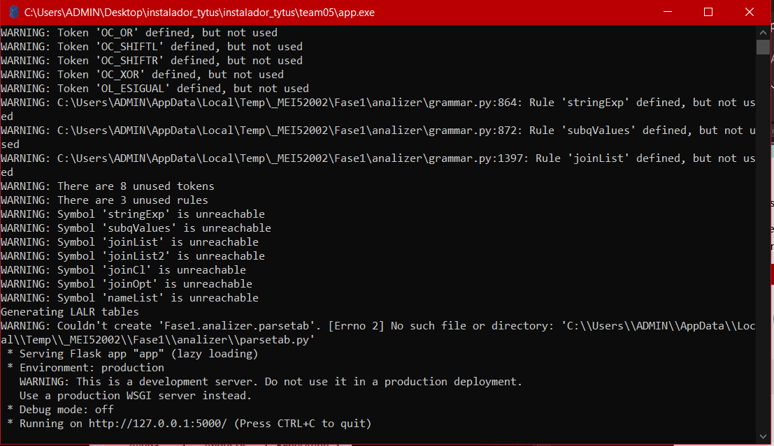

La consola nos muestra que esta escuchando el servidor en este caso en http://127.0.0.1:5000/ 

4.Presionar el boto Cliente, aparecerá un mensaje y una ventana donde estaremos escribiendo nuestro lenguaje sql

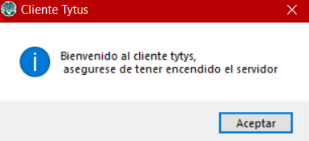
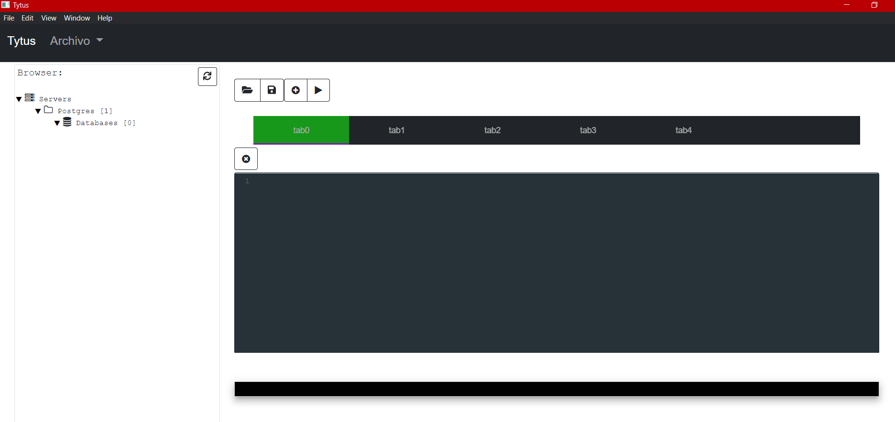

 
## :mag_right:Botones 
Al inicio se te mostrará una ventana como esta: 

* **Crear una Base de datos:** Dar click en el botón archivo y luego crear base de datos
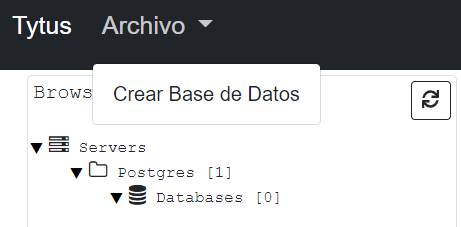
Nos pedirá el nombre de la base de datos, en este caso le llamaremos hello
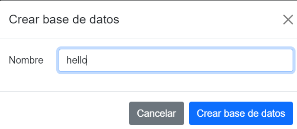

* **Explorador :** En esta parte podremos ver las bases de datos y las tablas existentes.
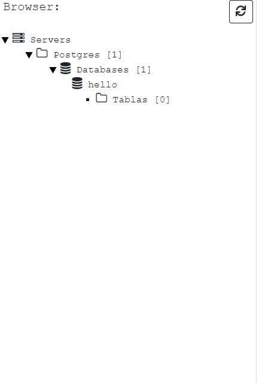

* **Ventana es donde escribiremos el lenguaje de SQL:** En esta area podemos escribir todas nuestra instrucciones SQl y PGSQL
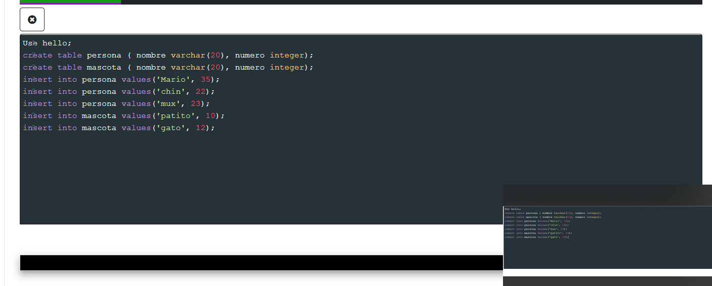

* **Salida:** Acá verificamos si existe algún error o si esta correcta nuestra instrucción
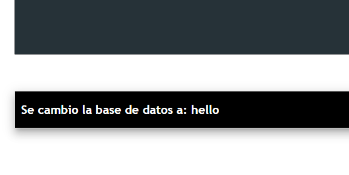

* **Botones de acción:** En primer lugar tenemos abrir un archivo, guardar el código sql, añadir una nueva ventana y ejecutar las instrucciones.

