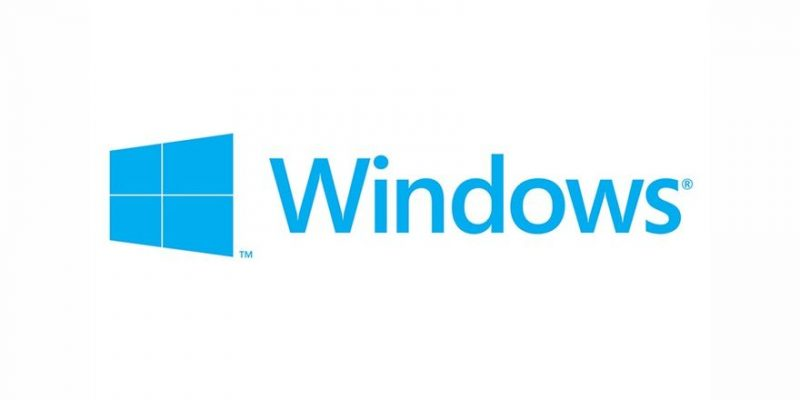

# <center> TytusDB </center>
 El siguiente Trabajo consta de la Union de 3 proyectos relizados en vacaciones de diciembre en la Universidad de San Carlos de Guatemala , la primer parte del proyecto la      realizo el curso de estructuras de datos , manejando ellos el almacenado de datos , la segunda parte le corresponde al curso de compiladores 2 en el cual se integro un          interprete muy similar a postgreSQL  y por ultimo el curso de bases de datos realizo la vista del cliente.

<div align="center">
     <p align="center">
        Figura 1. Tytus
     </p>
     
</div>

## Proyectos Utilizados:

<ul>
 <li> Grupo 18 de Estructuras de datos
 <li> Grupo 5 de Sistemas de bases de datos 1
 <li> Grupo 29 de Organizacion De Llenguajes Y Compiladores 2
</ul>


### Problemas Encontrados en la Elaboracion del Proyecto

---

<ol> 
    <li><a href="#i1">Compatibilidad

            
   <li><a href="#i2">Dependencias
    
    
   <li><a href="#i3">Funcionalidad
    
   
   <li><a href="#i4">Conflictos
   

     


---

### <div id="i1"> **Compatibilidad**:
El siguiente proyecto solo soporta ser ejecutado en sistemas operativos windows , de preferencia windows 10 aunque es soportado para las demas distrubuciones de windows es decir:
 <ul type="square">

 <li> Windows 10
 <li> Windows 8.1
 <li> Windows 8
 <li> Windows vista
 <li> Windows 7

 </ul>

<div align="center">
     <p align="center">
        Figura 2. Windows
     </p>
     
</div>


por tanto para sistemas Operativos como Linux o Mac presenta problemas ya que no es compatible.

### :hammer: DEPENDENCIAS:

el proyecto necesita de ciertas dependencias para poder funcionar de forma correcta , de preferencia se acoseja tener pipenv lo cual nos permite instalar todas las dependencias necesarias para python por medio de los siguientes comandos:
```
$ pip install --user pipenv
$ pipenv install
$ pipenv shell
$ python app.py
```
y a partir de ello se instalarian las dependencias necesarias:
<ul>


<li> Python una version mayor a la 3.8.5 de preferencia
<li> Versión más reciente de Pip
<li> libreria Numpy
<li> libreria Pandas
<li> libreria de graphviz para python
<li> libreria de criptography

</ul>

### :heavy_check_mark: FUNCIONALIDAD:

la funcionalidad no esta al 100% pero segun las pruebas de testeo realizadas , contiene las funciones basicas de slqpostgre como creado de tablas y algunos queries.


### :beetle: CONFLICTOS
<div align="center">
     <p align="center">
        Figura 3. Conflictos
     </p>
     
</div>


<ul>

<li><p style='text-align: justify;'> La parte de Compiladores 2 y estructura de Datos no poseía integracion entre ellas por lo que hizo un poco mas trabajosa la union entre ambos proyectos. </p>


<li><p style='text-align: justify;'> tuvimos la experiencia de contar con un conflicto mas especifico en el server de la parte de bases de datos ya que posee un .exe que los antivirus lo toman como que si fuera virus, borrando asi archivos primordiales de la aplicacion afectando el funcionamiento , pero  en realidad no es un virus , es un falso positivo , por librerias de terceros de python, entonces para correrlo sin problemas se recomienda desactivar el antivirus.</p>


<li><p style='text-align: justify;'> otro conflicto que al menos nos paso a la hora de unirlo fue la sintaxis de los imports en los modulos por lo que se tuvo que cambiar , ademas alguno metodos les faltaban parametros para funcionar pora funcionar correctamente asi que eso tambien fue incorporado de nuestra parte.Mas que todo daba problemas a la hora de importar las funciones en la parte de compiladores 2 ya que no especificaban el modo de alamcenamiento por lo que se coloco por default un modo de almacenamiento directamente en la parte de edd.</p>


<li><p style='text-align: justify;'> Tambien podria pasar que a la hora de levantar el servidor de la parte de sistemas de bases de datos 1 , no sea capaz de responder peticiones , esto puede suceder por la libreria de graphviz entonces se recomienda volver a instalar esta libreria desde cero en nuestro sistema operativo.</p>


<li>Otro problema a considerar es en la parte del cliente de la aplicacion de Angular, se necesita cambiar de pesataña para poder empezar a escribir un query , este es como el bug que posee.</p>

</ul>

