# GENERACIÓN DE EJECUTABLES
## MODULOS EJECUTABLES DE TUTYS DB

 

Tytus está conformado de tres módulos fundamentales:
 * El Servidor
    * Parser
    * Storage
 * El Cliente
 * El Instalador

De forma general se puede decir que:
 - El Servidor incluye la integración del Parser y el Storage.
 - El Cliente consume al servidor y muestra una interfaz de usuario para el uso del DBMS.
 - El Instalador brinda la integración de los dos módulos mencionados anteriormente.

## :floppy_disk: SERVER
En la parte del servidor fue utilizado el del team05, fase2, del curso de base de datos 1, el cual utiliza herramientas como flask. Dentro de la carpeta llamada <i>Fase1</i> se puede ver las dependencias de compiladores haciendo referencia a la carpeta <i>Analizer</i>, y la parte de estructura de datos haciendo referencia a la carpeta <i>Storage</i>

     

        Figura 1. Dependencias funcionales del Servidor.
     

     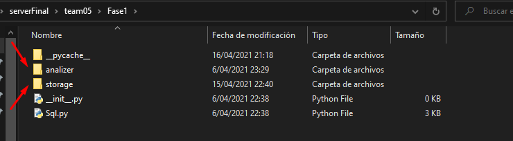

 

Para la realización del ejecutable procedemos a hacer uso de pyinstaller, esa librería nos ayudará a crear un .exe con todas las dependencias necesarias para que la parte del servidor se ejecute de manera correcta, el parámetro --onefile es para generar un ejecutable que contenga todo lo necesario, además se le agregó un icono. 

     

        Figura 2. Generación del servidor ejecutable.
     

     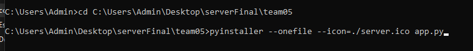

 

El archivo ejecutable se aloja en la carpeta llamada <i>dist</i>.

     

        Figura 3. Elementos generados del ejecutable.
     

     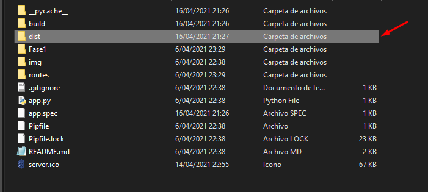

 

## :computer: CLIENT
Para el cliente se utilizó tecnologías como Electron para la generación de una aplicación de Escritorio basada en Angular, el proceso de compilación de la aplicación web de Angular para una de escritorio requiere de tiempo según el tamaño del programa, conserva las mismas propiedades de la página web, pero presentandolo en un formato de una aplicación de escritorio. El ejecutable se llama <i>tutys-app.exe</i>.

     

        Figura 4. Aplicación de escritorio basada en Angular.
     

     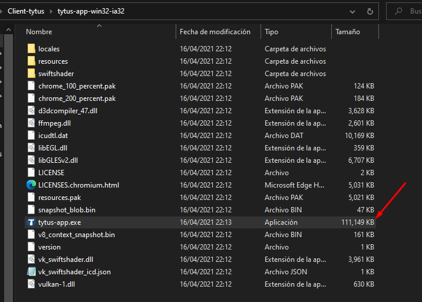

 

## :rocket: INSTALLER
Es el componente final, encargado de la integración gráfica del servidor y el cliente, es un ejecutable de interfaz de usuario para el consumo e interacción del DBMS. Realizado con Tkinter, brinda una interfaz donde se muestra al usuario diversas acciones que están disponbles por realizar. Se le agrega el campo --windowed para no mostrar la consola.

     

        Figura 5. Generación del ejecutable del instalador.
     

     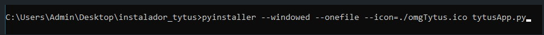

 

# Manual para aplicacion de Escritorio 

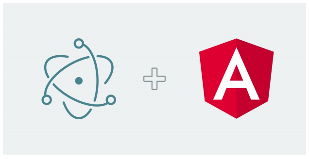

# Angular 11 Con Electron

Realizo este paso para pasar mi aplicación Realizada en Angular a una aplicación de Escritorio, todo esto
gracias a Electron

## 
Primera Parte

- Verificamos que nuestro proyecto este corriendo como proyecto de angular, con el comando
    “Ng serve”

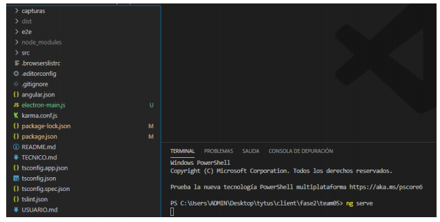

- Efectivamente vemos que esta corriendo en Nuestro Buscador Predeterminado

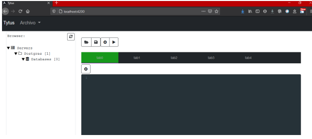

- Nos dirigimos a la siguiente direccion e instalamos electron con npm i -D
electron@latest

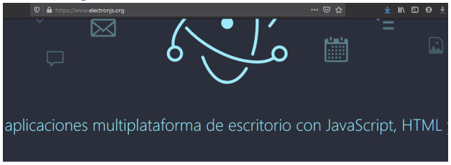

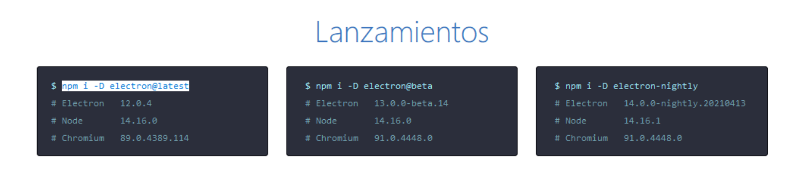

- Nos dirigimos a la guía rápida para electron en el siguiente link
https://www.electronjs.org/docs/tutorial/quick-start
Acá nos explica rápidamente como realizar los paso para configurar electron, recomendación
tener a la mano esta información porque será una guía para lo siguiente de este Manual.

-  A continuación escribimos el comando “Ng build” para que me cree la carpeta llamada “dist”

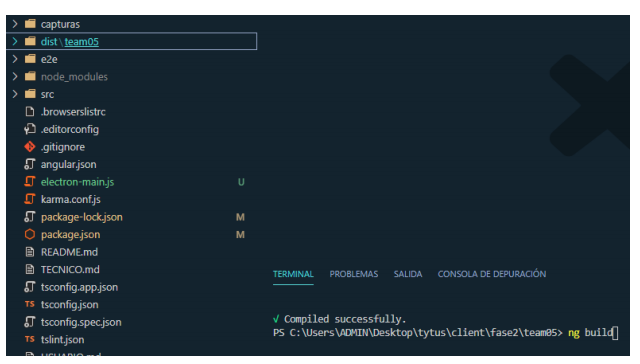

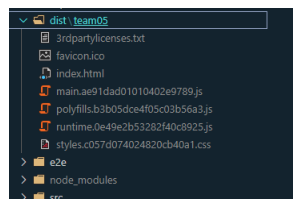

- A continuación creamos un archivo “electron-main.js” acá ira la configuración que esta en la
pagina de guía que accedimos antes, la siguiente información

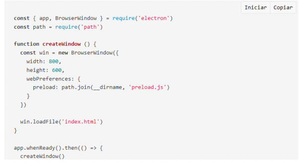

- Cambiamos la línea Numero 13 por la direccion de nuestra Carpeta Dist

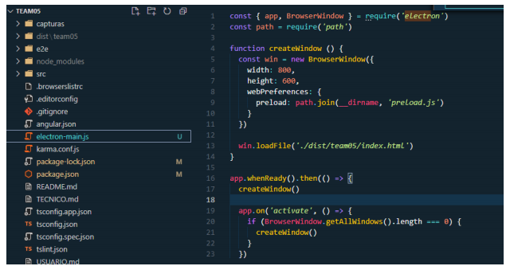

- Ahora nos dirigimos a el archivo “package.json” vamos a agregar unas líneas
Agrego la línea 5, 6, 7

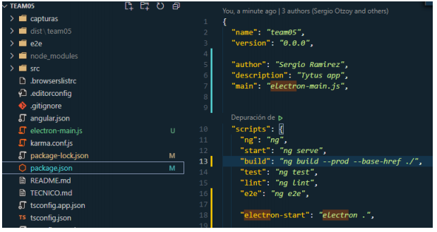

- También voy a Modificar la línea 13 y voy a agregar la línea 18

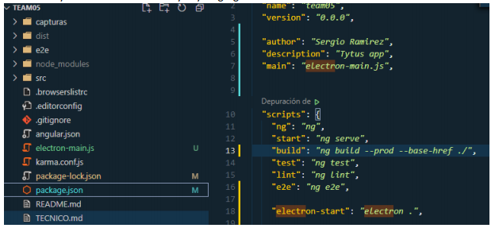

- Luego de Realizado los pasos anteriores voy a Iniciar elentron con el siguiente comando “npm
run electron-start”, podremos visualizar una ventana tipo apliccion de escritorio

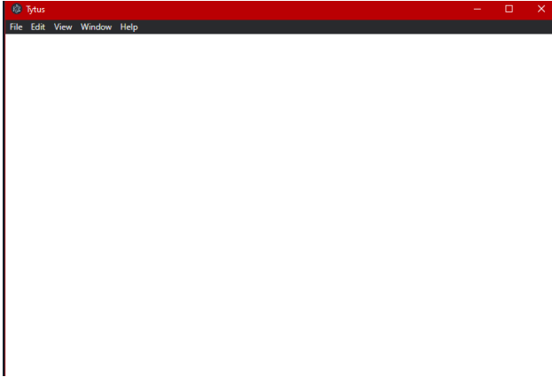

- Luego corremos el siguiente comando para que se muestre nuestra aplicación dentro de esta
ventana ng build –base-href “./” 

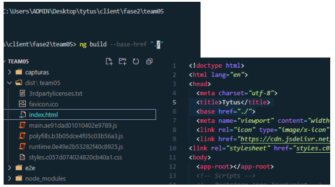

- Luego probamos de nuevo con “npm run electron-start”, y podremos ver ya nuestra aplicación
corriendo dentro de la ventana 

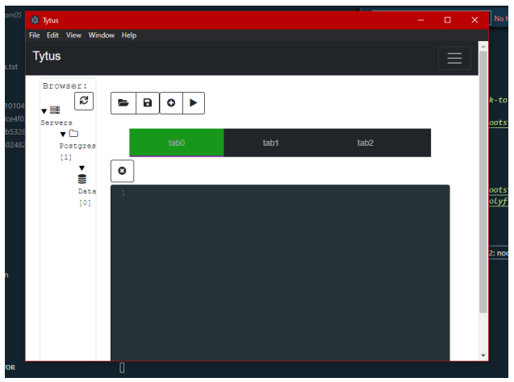

## Segunda Parte
Acá generamos el .exe de la aplicación anterior
- Escribo el comando “npm run build”
- Luego instalamos con el siguiente comando “npm install electron-packager -g” para crear un
paquete
-  Luego agregamos las siguientes líneas en el archivo “package.json” , línea 20,21,22,23 

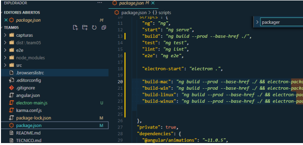

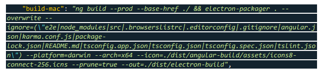

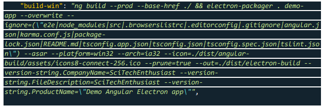

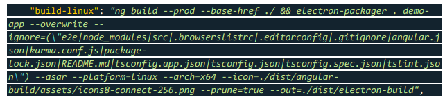

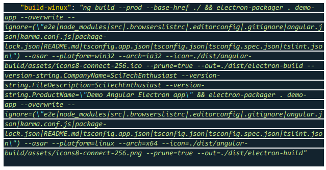

-  Para generar el paquete para Windows seria con el comando “npm run build-win”

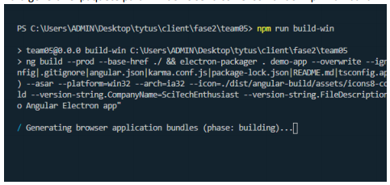

-  Nos muestra donde esta alojado nuestro package dist\electron-build\demo-app-win32-ia32 y lo buscamos

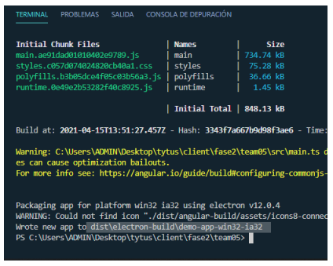

- Se encuentra en nuestra carpeta dist

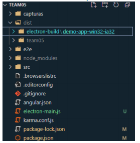

- Acá, podemos ver nuestro .exe

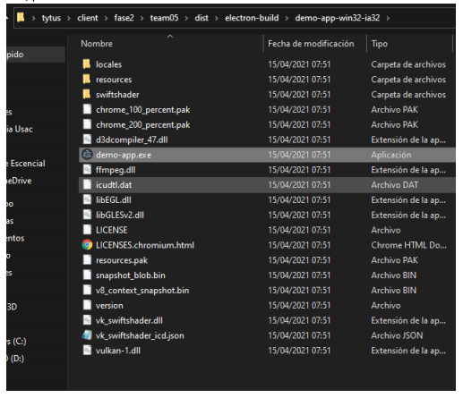

<footer>
 

<i>:triangular_flag_on_post: Tytus Team, 2020. </i>
</footer>
