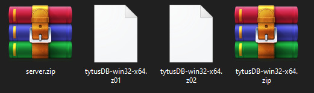
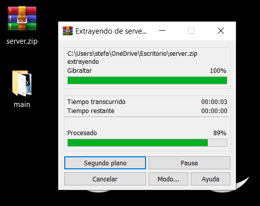
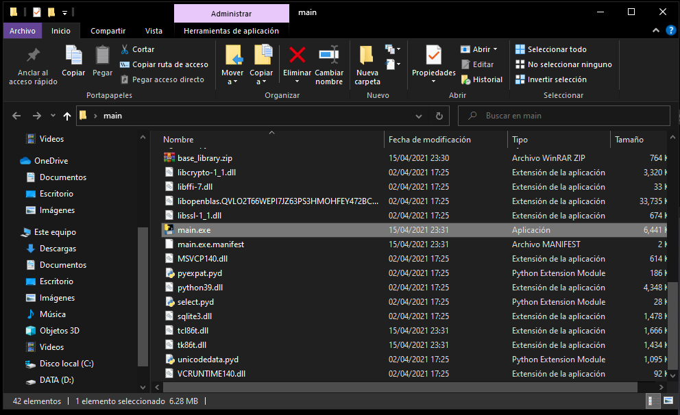
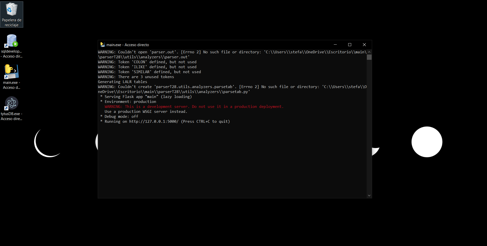
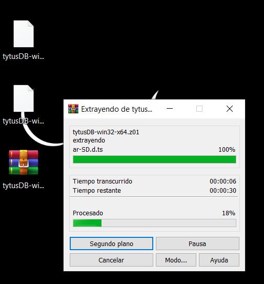
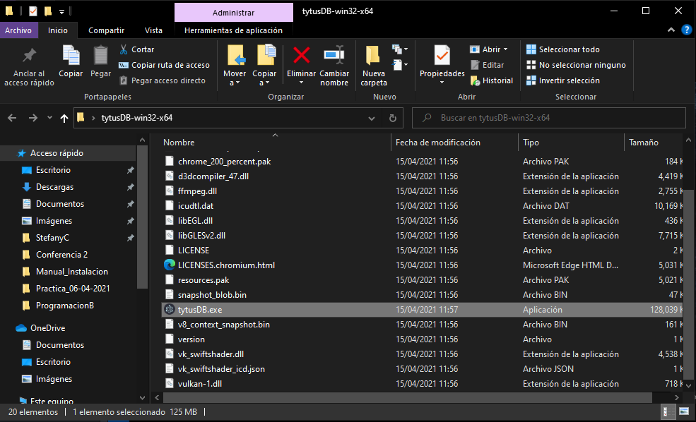
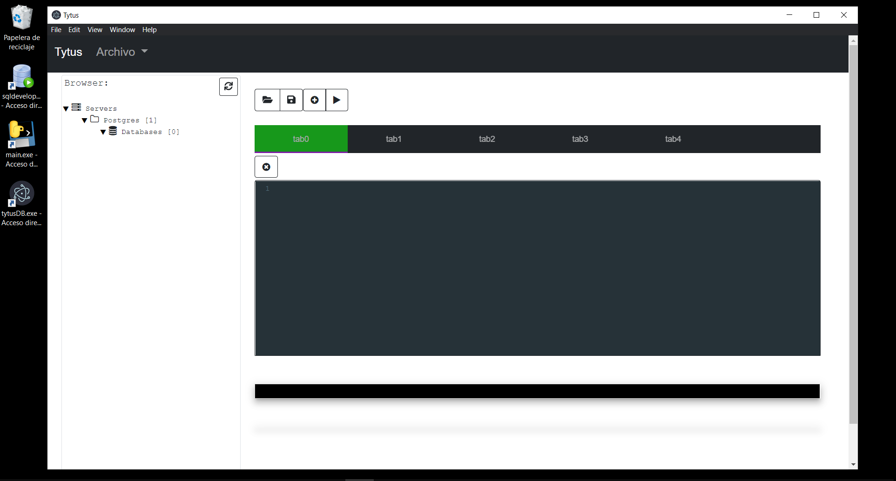

# Manual de Instalación

## Contenido 
- [Instalación del Servidor](#server) 
- [Instalación del Cliente](#client) 

## Instalación del Servidor 

* Descargar el .zip necesario para poder instalar el servidor hecho en python. 

    
    
 server.zip

 * Una vez descargado el archivo debemos descomprimir el archivo server.zip en una carpeta dentro de nuestro equipo. 

 

    
    
 Descomprimir archivo .zip  

* Ubicar el archivo main.exe dentro de la carpeta. 

    
    
 Buscar main.exe  

* Crear un acceso directo dentro del Escritorio para poder acceder facilmente al servidor. 

    
    
 Acceso Directo main.exe  

* Servidor ejecutandose en el equipo instalado. 

    
    
 Servidor 

## Instalación del Cliente  

* Descargar el .zip necesario para poder instalar la aplicación hecha en python. 

    
    
 tytusDB-win32-x64.zip

 * Una vez descargado el archivo debemos descomprimir el archivo tytusDB-win32-x64.zip en una carpeta dentro de nuestro equipo. 

 

    
    
 Descomprimir archivo .zip  

* Ubicar el archivo tytusDB.exe dentro de la carpeta. 

    
    
 Buscar tytusDB.exe 

* Crear un acceso directo dentro del Escritorio para poder acceder facilmente a la aplicación. 

    
    
 Tytus DB 

