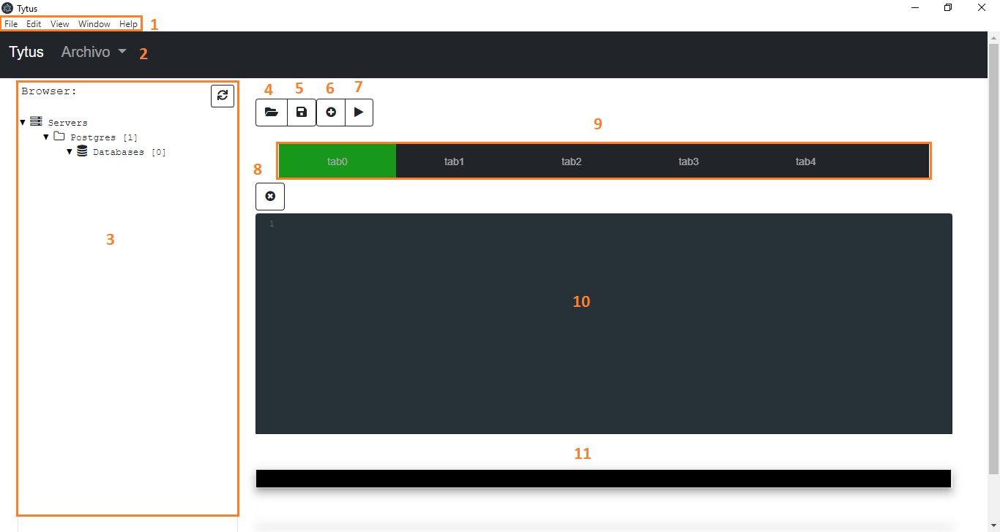
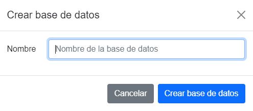
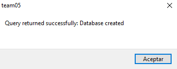
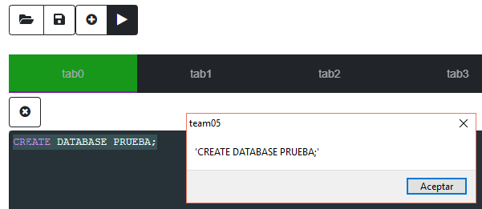
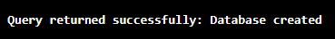

# Manual de usuario

- [Antes de comenzar](#previo)
- [Componentes de la interfaz](#interfaz)
- [Funcionalidad TytusDB](#funcionalidad)

*Antes de comenzar asegurese de tener todo instalado, para más información dirigirse al [Manual de Instalación](./Manual_de_Installacion.md).*

Una vez con todos los archivos instalados deberá ejecutar el servidor, dentro de la carpeta server encontrará un archivo llamado main.exe haga doble click sobre este archivo para levantar su servidor, una vez el servidor esté corriendo puede ejecutar la aplicación para ello dentro de la carpeta tytusDB-win32-x64 debera buscar el archivo tytusDB.exe, hacer doble click para ejecutar.

## Componentes de la Interfaz 

La aplicación cuenta con una interfaz intuitiva, algunos de sus componentes listados a continuación:
 1. **Barra superior de pestañas**: en la parte superior se tienen diversas pestañas con distintas funcionalidades que podrán ser de utilidad para el usuario.
 2. **Archivo**: esta pestaña le permite crear una base de datos con mayor facilidad. [Ver ejemplo](#ejemplo)
 3. **Barra lateral**: en la barra izquierda podrá encontrar un esquema del servidor, las bases de datos creados sus tablas y campos. En esta barra encontrará un botón de actualización que le permitira visualizar  los cambios mas recientes sobre el esquema. 
 4. **Botón para cargar archivo**: podra importar al editor de código cualquier archio con extensión .sql que haya guardado previamente, o que desee probar.
 5. **Botón para guardar archivo**: podra guardar el trabajo que haya realizado en el editor.
 6. **Botón para agregar pestaña**: puede agregar multiples pestañas de editor, para trabajar en distintos archivos, o simplemente consultarlos.
 7. **Botón para ejecutar**: podrá correr los comandos exisitentes en el editor (pestaña actual).
 8. **Botón para limpiar editor**: podrá limpiar rapidamente en codigo existente en el editor (pestaña actual).
 9. **Barra de pestañas**: podrá seleccionar la pestaña en la que desea trabajar. Así mismo podrá colocar código en cualquiera ejecutando solo la que desee.
 10. **Editor de lenguaje SQL**: espacio de trabajo para consultas, creaciones, actualizaciones, etc.
 11. **Consola de Salida**: en este apartado podrá verificar los resultados de las acciones realizadas.

    
    
 Interfaz y sus componentes 

 

## Funcionalidad DBMS TytusDB 

Con el fin de facilitar la interacción del usuario con el DBMS TytusDB a continuación se proporciona un listado especificado de las funciones del lenguaje SQL disponibles para el usuario, algunas funciones aún no se encuentran optimizadas o siguen en proceso de desarrollo para estar a disposición de los usuarios de interés.

| No. |      Función      |         Sintaxis        | Disponible | No Disponible | Observaciones |
|:---:|:-------------------:|:---------------------:|:----------:|:-------------:|:-------------:|
|  1  | Create Database     | CREATE DATABASE dbname;                            |      X     |               |[Variacion](#variacion)|
|  2  | Show Databases      | SHOW DATABASES;                                    |      X     |               |               |
|  3  | Use Database        | USE DATABASE dbname;                               |      X     |               |               |
|  4  | Alter Database      |            -                                       |            |       X       | En desarrollo |
|  5  | Drop Database       | DROP DATABASE dbname;                              |      X     |               |               |
|  6  | Create Table        | CREATE TABLE tbname( *cols* );                     |      X     |               |[Variacion](#variacion)|
|  7  | Show Tables         | SHOW TABLES;                                       |      X     |               |               |
|  8  | Extract Table       |            -                                       |            |       X       | En desarrollo |
|  9  | Extract Range Table |            -                                       |            |       X       | En desarrollo |
|  10  | Alter Add PK       |            -                                       |      X     |               |Funcionamiento interno|
|  11 | Alter Drop PK       |            -                                       |            |       X       | En desarrollo |
|  12 | Alter Add FK        |ALTER TABLE tb1 ADD FOREIGN KEY ( ) REFERENCES tb2( ) ;|     X     |               |[Variacion](#variacion)|
|  13 | Alter Add Index     |            -                                       |            |       X       | En desarrollo |
|  14 | Alter Add Column    | ALTER TABLE tbname ADD COLUMN colname datatype;    |      X     |               |               |
|  15 | Alter Drop Column   |            -                                       |            |       X       | En desarrollo |
|  16 | Drop Table          | DROP TABLE tbname;                                 |      X     |               |               |
|  17 | Insert              | INSERT INTO tbname ( *filds* ) VALUES ( *...* ) ;  |      X     |               |               |
|  18 | Load CSV            |            -                                       |            |       X       |   Pendiente   |
|  19 | Extract Row         |            -                                       |            |       X       |   Pendiente   |
|  20 | Update              | UPDATE tbname SET *...* WHERE *...* ;              |            |       X       | En desarrollo |
|  21 | Delete              | DELETE FROM tbname WHERE *...* ;                   |            |       X       | En desarrollo |
|  22 | Truncate            |            -                                       |            |       X       | En desarrollo |
|  23 | Select              | SELECT * FROM tbname;                              |      X     |               |               |

*Nota: TytusDB Al igual que en otros DBMS es case-insensitive, las instrucciones en lenguaje SQL al igual que los identificadores pueden ser ingresados con mayúsculas y minúsculas sin afectar el resultado. Lo indispensable es el uso de punto y coma al finalizar nada instruccción.*

 

###  VARIACIONES  

Algunas instrucciones poseen variaciones significativas en su sintaxis, se listan a continuación:  

 - **create database**: *CREATE DATABASE IF NOT EXIST dbname OWNER = 'root' MODE = 1;*
 - **create table**: Donde **cols** hace referencia a las columnas que tendrá la tabla. Se definen como el codigo a continuación.
    ~~~
    (  
        columnName datatype [opcionality],
        columnName datatype [opcionality],
        ...
        columnName datatype [opcionality]
    ); 
    ~~~
 - **Alter Add FK**:  Donde **tb1** y **tb2** debe ser sustituidos por el nombre de la tabla a alterar y la tabla a referencia respectivamente. Además, dentro de los parentesís **()** , se colocan los nombres de los atributos a crear y referenciar respectivamente.

 

###  EJEMPLOS Y RESPUESTAS
Con el fin de facilitar la interacción del usuario con el DBMS TytusDB a continuación se muestran ejemplos de uso y los dos tipos de respuestas que el BDMS proporciona. 

- **Archivo - Crear BD**:  Se requiere el nombre de la base de datos por medio de una ventana emergente, al finalizar, el DBMS nos notificará el resultado de la forma que se muestra en la segunda imagen.  
  

    

  
 

    
    
 Notificación Emergente 

 

- **Script - Crear Database**:  Se debe ingresar el script correctamente, ejecutar el código y el DBMS nos notificará el resultado de la operación por medio de la consola.  

    

  
 

    
    
 Notificación por Consola 

