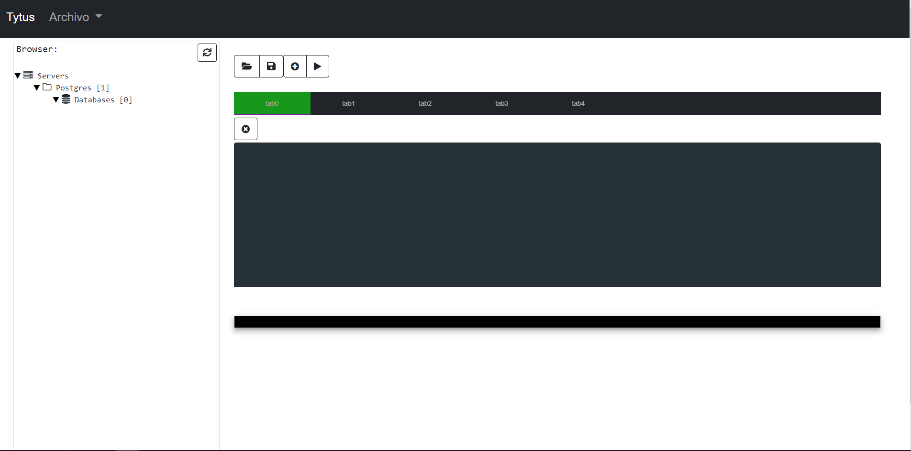
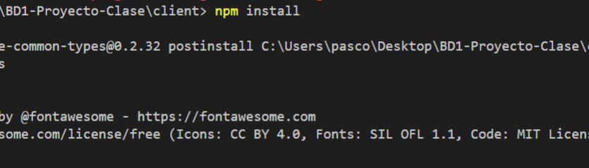
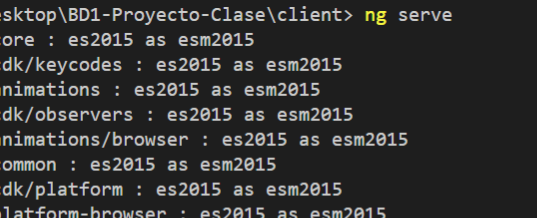
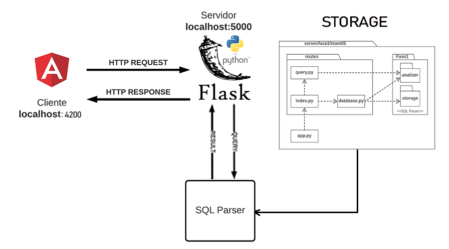

# Proyecto 

## Table of contents 
- [Proyecto](#proyecto)
  - [Table of contents](#table-of-contents)
  - [Instaladores](#instaladores)
    - [Windows](#windows)
    - [Linux](#linux)
  - [Desinstalacion](#desinstalacion)
    - [Windows](#windows-1)
    - [Linux](#linux-1)
  - [Instalacion en el server para usarlo sin instalador](#instalacion-en-el-server-para-usarlo-sin-instalador)
  - [Utilizacion cliente sin instalador](#utilizacion-cliente-sin-instalador)
- [DOCUMENTACIÓN BASE DE DATOS FASE 1](#documentación-base-de-datos-fase-1)
  - [SISTEMA DE GESTOR DE BASES DE DATOS](#sistema-de-gestor-de-bases-de-datos)
  - [FRONT END](#front-end)
  - [REST API](#rest-api)
  - [INTEGRACION](#integracion)
  - [BACK END](#back-end)
  - [CONSIDERACIONES](#consideraciones)
  - [ARQUITECTURA](#arquitectura)
  - [ANEXO](#anexo)

## Instaladores 
Para poder instalar los instaladores se deben de descargar los siguientes archivos del siguiente link:

[INSTALDORES](https://drive.google.com/drive/folders/1x8ZcGm4r6WMHhJo2HrsXUIGXTRueGE4f?usp=sharing)

Una vez dentro del link tenemos dos opciones 

### Windows
1. Si escogemos esta carpeta no tenemos que descargar la carpeta client como zip luego descomprimirla en algun directorio de nuestro agrado. Tambien debemos de ingresar a la carpeta server y descargar el ejecutable que se encuentra

**NOTA: es necesario desactivar el antivirus**

2. Una vez hecho el paso anterior, abrimos el archivo ejecutable que bajamos app.exe 
   

cuando se haya abierto el ejecutable dejamos abierto la terminal.

**NOTA siempre que quiera usar el cliente debemos de ejecutar este ejecutable, si no se nos almacenara la informacion**

3. realizado el paso anterior ahora procedemos a irnos donde decomprimimos el zip del cliente y tendremos la siguiente vista 
   
   
  
ejecutamos el que se nombra **tytusdb-0.0.1-setup.exe** una vez realizado se nos abrira la siguiente ventana 

una vez terminada la instalacion obtendremos la siguiente vista 

Bien hecho eso podemos empezar a utilizar la base de datos 

**NOTA para poder volver a ejecutar el cliente nos tenemos que situal en la siguiente ruta C:\Users\YOUR_USER\AppData\Local\tytusdb**

### Linux

Si nuestro sistema operativo es linux podemos descarga el .deb que se encuentra en la carpeta y para instalarlo se usa el siguiente paquete 

    sudo dpkg -i tytus_0.0.1_amd64.deb

Lo podemos encontrar en la barra de herramientas y lo abrimos y obtenemos la misma vista que en la de windows.

## Desinstalacion 

### Windows 
Para windows tenemos que dirigirnos al panel de control -> Programas -> Programas y Caracteristicas 
Una vez situados aqui buscamos el nombre de la aplicacion en este caso se llama tytusdb 

una vez cuando le demos en instalar se nos abrira y solo lo cerramos y practicamente esta desinstalado de nuestro sistema 
### Linux
Para este sistema operativo solo basta con correr el siguiente comando 

## Instalacion en el server para usarlo sin instalador
Tener en cuenta lo siguiente debemos de estar dentro de la carpeta si no usamos 
    
    cd server 
Luego utilizamos el siguiente comando 
    
    pip install -r requirements.txt

Si les da problema el anterior comando usen pip3, pero en windows por defecto siempre es pip

Una vez realizado lo anterior solo se corre el siguiente comando para levantar el server 

    python app.py 

Esto debe de estar levantado para poder usar el cliente 

## Utilizacion cliente sin instalador
Tener en cuenta lo siguiente debemos de estar dentro de la carpeta si no usamos 
    
    cd client 

Corremos el siguiente comando para ejecutar el cliente 

    npm install 

Una vez instalado los modulos necesarios, levantamos el cliente con el siguiente comando 

    ng serve 

Nota: deben de tener instalado Angular y NodeJS en su computadora 

#
# DOCUMENTACIÓN BASE DE DATOS FASE 1
## SISTEMA DE GESTOR DE BASES DE DATOS

Un sistema manejador de bases de datos (SGBD, por sus siglas en inglés) o DataBase Management System (DBMS) es una colección de software muy específico, orientado al manejo de base de datos, cuya función es servir de interfaz entre la base de datos, el usuario y las distintas aplicaciones utilizadas.

El objetivo principal del SGBD es precisamente el manejar un conjunto de datos y convertirlos en información relevante para las empresas.

Para el SGBD tuvimos la necesidad de usar las siguientes aplicaciones para el funcionamiento del mismo.

## FRONT END
  
  Es la interfaz con la que interactúa el usuario final, le permite el uso de una manera segura, sencilla y ordenada
 
  Para la construcción del front end se utilizó, Angular cli
Para levantar la interfaz del cliente antes de todo se debe de instalar las dependencias que trae por defecto angular, eso se consigue utilizando los siguientes comandos:
  
  * ***npm install -g @angular/cli***, este comando sirve para instalar el framework de angular más reciente.

  * ***npm install***, este comando sirve para instalar todas las dependencias utilizadas en el proyecto.
  * ***npm install electron-packager --save-dev***, crear un build que es utilizado por installer-windows y debian
  * ***npm install electron-installer-windows --save-dev***, crea .exe aplicaciones
  * ***npm install electron-installer-debian --save-dev***, crea .deb aplicaciones

    

    

    
    

    

  * ***ng serve***, para ejecutar el proyecto
    

    

    
    

    

  * ***http://localhost:4200/login***, al terminar de levantar o ejecutar angular, podemos observar nuestra página en esa dirección. 

## REST API

    Es un conjunto de definiciones y protocolos utilizados para diseñar e integrar un software de aplicaciones. Se considera como el contrato entre un proveedor de información y un usuario, donde se establece el contenido que se requiere del consumidor (la llamada) y el que necesita el productor (la respuesta).

    Para la construcción del API se utilizó Node JS. La instalación de este se realiza desde la página oficial, en esta viene incluido el Node Package Manager (npm) que permite obtener cualquier librería con una línea de código.

## INTEGRACION
  
  Basicamente para poder realizar la integracion de EDD solo se copio la carpeta del grupo que tenia mejor su proyecto en este caso fue el 18, seguidamente se utilizo el proyecto del grupo 5 de bases de datos y aqui en la carpeta Fase1/storage/storageManager agregamos los archivos de EDD, de ahi solo se hizo un reemplace en todos los imports, ya que solo se estaba utilizando el jsonmode, pero ahora se utilizan todos los modos asignados avl, b-tree, b-plus etc, tambien se hizo un arreglo en la parte del update ya que los compañeros de estructuras no programaron bien esta parte, pero solo se pudo arreglar el update para el modo del arbol b, ya que los otros modos no dio tiempo. 
  
## BACK END

    Es la parte del desarrollo web que se encarga de que toda la lógica de una página web funcione. 
    Para la construcción del backend se utilizó el lenguaje python. Además se utilizaron siguientes comandos:

    * **pip install flask**, es una herramienta necesaria para la creación de aplicaciones web.
    * **pip install flask-colors**, es una extensión para flask que mejora el servidor web integrado con colores.
    * **pip install gunicorn**, es una herramienta que sirve como puerta de enlace de servidor web python.
    * **pip install numpy**, es una herramienta para la creación de vectores y matrices multidimensionales, junto con una gran colección de funciones matemáticas.
    * **pip install graphviz**, es una herramienta para la generación de grafos. 
    * **pip install pandas**, es una biblioteca para la manipulación y análisis de datos.
    * **pip install ply**, ply es una herramienta de análisis para python.
    * **pip install prettytable**, es una biblioteca que muestra fácilmente los datos tabulares en un formato de tabla ascii.
    * **pip install simplejson**, es una herramienta que codifica y decodifica los formatos json.
    * **pip install pyintaller**, compilador para generar el .exe

    

## CONSIDERACIONES 

  * la función update no funciona dado que es error de compiladores.
  * la función de encriptación no funciona, dado que es un error de compiladores
  * las cadenas no aceptan tildes, ojo con eso.
  * los límites de las cadenas no están bien definidas, a veces coloca rangos que no están dentro del parámetro requerido.

## ARQUITECTURA

    

    

    
    

    

## ANEXO

    los proyectos que se utilizaron se descargaron en la siguiente página:
    https://github.com/tytusdb/tytus

    directorio client -  F2 del Grupo 5
    directorio servidor - F1 del Grupo 29
    directorio storage - F2 del Grupo 18

