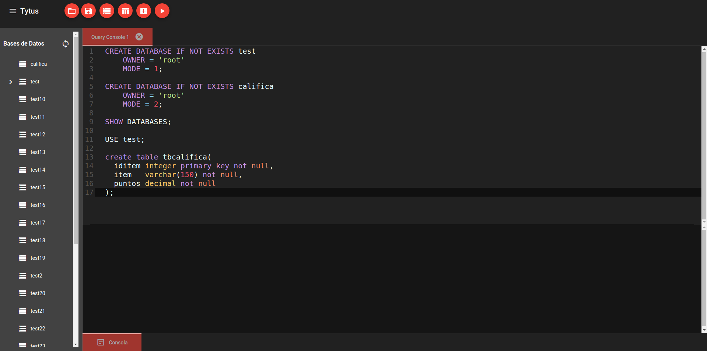

# Grupo #10

---

**Universidad de San Carlos de Guatemala**

**Facultad de Ingenieria**

**Escuela de Ciencias y Sistemas**

**Sistemas de Bases de Datos I**

**Ing. Luis Espino**

**Aux. Jonnathan Castillo**

---

## Integrantes

| Carné     | Nombre                          |
| --------- | ------------------------------- |
| 201504220 | José Andres Rodas Arrecis       |
| 201708850 | Marco Antonio Reyes Garcia      |
| 201800984 | Alex Fernando Méndez López      |
| 201503961 | Fernando Augusto Armira Ramírez |

---

## Estructura Del Proyecto

```
.
`-- team10/
    |-- client
    |-- doc
    |-- server/
    |   |-- routes
    |   |-- static
    |   |-- templates
    |   `-- utililities/
    |       |-- analisys_parser
    |       `-- storage
    `-- README.MD
```

### Descripción de la Estructura

| Carpeta/Archivo                   | Descripción                                                  |
| --------------------------------- | ------------------------------------------------------------ |
| client                            | en esta carpeta se encuentra cada uno de los componentes y servicios necesarios para el funcionamiento del cliente web, este fue realizado en Angular |
| doc                               | en esta carpeta se encuentra los archivos relacionados con la documentación |
| server                            | en este carpeta se encuentra cada uno de los archivos necesarios para el funcionamiento del servidor web. |
| server/routes                     | en esta carpeta se encuentran los archivos de cada uno de las rutas o endpoints del servidor web para realizar peticiones. |
| server/static                     | en esta carpeta se encuentran los archivos estáticos para par el funcionamiento del cliente web. |
| server/templates                  | en este carpeta se encuentra el archivo index.html el cual se muestra en la ruta principal del servidor. |
| server/utilities                  | en esta carpeta se encuentra tanto como el los archivos para el sql parser así como el los archivos del administrador de almacenamiento. |
| server/utilities/analisys_paraser | en esta carpeta se encuentra todo los archivos relacionados al sql parser (parser, query tool, type checker) |
| server/utilities/storage          | en esta carpeta se encuentra todos los archivos relacionados con el administrador de almacenamiento, en este caso se uso la estructura de datos AVL. |

---

## Documentación

- [Manual Técnico](./doc/ManualTécnico_G10.md)
- [Manual de Usuario](./doc/ManualdeUsuario_G10.md)
- [Manual de Instalación](./doc/ManualdeInstalacion_G10.md)

---

## Código fuente tomado de:

+ **Cliente & Servidor**
  +  *Grupo:*  5
  + *Observación:* como base se tomo este proyecto pero fue modificado tanto el cliente como el server. 
+ **Analizador & Parser** 
  + *Grupo:*  29
+ **Almacenamiento** 
  + *Grupo:*  16

---

## DBMS GUI


