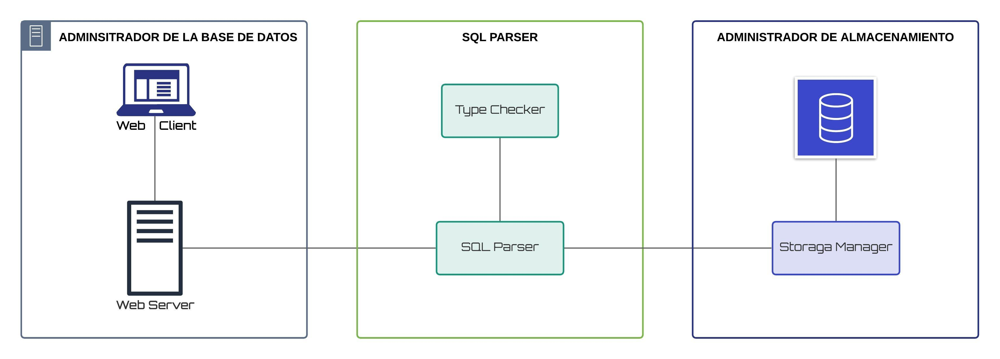

**Universidad de San Carlos de Guatemala**

**Facultad de Ingenieria**

**Escuela de Ciencias y Sistemas**

**Sistemas de Bases de Datos I**

**Ing. Luis Espino**

**Aux. Jonnathan Castillo**

**Grupo 10**

## Integrantes

| Carné     | Nombre                          |
| --------- | ------------------------------- |
| 201504220 | José Andres Rodas Arrecis       |
| 201708850 | Marco Antonio Reyes Garcia      |
| 201800984 | Alex Fernando Méndez López      |
| 201503961 | Fernando Augusto Armira Ramírez |

# Manual Técnico

## Introducción

En este manual técnico se dará un detalle de los componentes que tiene Tytus DB para su funcionamiento.

El siguiente manual trata de mostrar una descripción clara y precisa de los procesos y herramientas que se utilizaron al momento de unificar cada uno de los componentes de TytusDB que estaban por separado. 

Además se incluye una descripción y explicación de cada uno de los componentes, de esta forma tratar de facilitar al programador la  comprensión del funcionamiento  y futuro mantenimiento.

## Objetivos

### General

Brindar una herramienta robusta y completa que permita la gestión y control de datos a un nivel eficiente y funcional. Basada en una estructura específica que maximiza el tiempo de búsqueda, siendo el objetivo principal ser óptima para un DataBase Management System (DBMS).

### Específicos

* El objetivo del presente manual es entregar herramientas apropiadas para el futuro mantenimiento y mejoramiento del DBMS. 

* Impulsar a los desarrolladores  a poder mejorar esta herramienta. 

## Sobre TytusDB

Es un proyecto Open Source para desarrollar un administrador de bases de datos. Está compuesto por tres componentes interrelacionados:

1. Administrador de almacenamiento de la base de datos

2. SQL Parser

3. El administrador de la base de datos este administrador se compone a su vez de: 
   
   1. Un servidor 
   
   2. Cliente Web



## Estructura Del Proyecto

```
.
`-- team10/
    |-- client
    |-- doc
    |-- server/
    |   |-- routes
    |   |-- static
    |   |-- templates
    |   `-- utililities/
    |       |-- analisys_parser
    |       `-- storage
    `-- README.MD
```

### Descripción de la Estructura

| Carpeta/Archivo                   | Descripción                                                                                                                                           |
| --------------------------------- | ----------------------------------------------------------------------------------------------------------------------------------------------------- |
| client                            | en esta carpeta se encuentra cada uno de los componentes y servicios necesarios para el funcionamiento del cliente web, este fue realizado en Angular |
| doc                               | en esta carpeta se encuentra los archivos relacionados con la documentación                                                                           |
| server                            | en este carpeta se encuentra cada uno de los archivos necesarios para el funcionamiento del servidor web.                                             |
| server/routes                     | en esta carpeta se encuentran los archivos de cada uno de las rutas o endpoints del servidor web para realizar peticiones.                            |
| server/static                     | en esta carpeta se encuentran los archivos estáticos para par el funcionamiento del cliente web.                                                      |
| server/templates                  | en este carpeta se encuentra el archivo index.html el cual se muestra en la ruta principal del servidor.                                              |
| server/utilities                  | en esta carpeta se encuentra tanto como el los archivos para el sql parser así como el los archivos del administrador de almacenamiento.              |
| server/utilities/analisys_paraser | en esta carpeta se encuentra todo los archivos relacionados al sql parser (parser, query tool, type checker)                                          |
| server/utilities/storage          | en esta carpeta se encuentra todos los archivos relacionados con el administrador de almacenamiento, en este caso se uso la estructura de datos AVL.  |

## <u> COMPONENTE:</u> Administrador de Almacenamiento

Este componente es el encargado de gestionar el almacenamiento de las bases de datos, proporcionando un conjunto de funciones para extraer la información.

#### Modo de Almacenamiento

En este momento TytusDB tiene un modo de almacenamiento, la estructura de almacenamiento lo realiza mediante un árbol AVL 

#### Registros de almacenamiento

Cada registro que corresponde a una tupla de una tabla será almacenado en cada nodo del AVL. Cada atributo será débilmente tipado, a efectos de no verificar tipo en este punto, ya que lo realiza el parser de SQL.

#### ¿Dónde encontrar más información sobre el administrador de almacenamiento?

Puede acceder al manual técnico en siguiente enlace:

* [Administrador de Almacenamiento](../server/utilities/storage/docs/TechnicalManual.md)

## <u>COMPONENTE:</u> SQL Parser

Este componente proporciona al servidor una función encargada de interpretar sentencias del subconjunto del lenguaje SQL especificado en la siguiente [documentación](https://github.com/tytusdb/tytus/tree/main/docs/sql_syntax)

#### Componentes

Está compuesto por dos sub componentes:

- **SQL Parser:** es el intérprete de sentencias de SQL, que proporcionará una función para invocar al parser, al recibir una consulta el parser luego del proceso interno y de la planificación de la consulta debe invocar las diferentes funciones proporcionadas por el componente de administrador de almacenamiento.

- **Type Checker:** es un sub componente que ayudará al parser a la comprobación de tipos. Al crear un objeto cualquiera se debe crear una estructura que almacenará los tipos de datos y cualquier información necesaria para este fin.

#### Gramáticas

Para el desarrollo de SQL parser crearon 2 gramáticas:

1. [Ascendente](../server/utilities/analisys_parser/docs/Grammar/Asc.md)
2. [Descendente](../server/utilities/analisys_parser/docs/Grammar/Desc.md)

#### Códigos de error

Cuando se utilice el paquete del parser de SQL y para mantener una sola manera de retornar errores cuando estos ocurran, se determinó utilizar los [Códigos de error de PostgreSQL](https://www.postgresql.org/docs/13/errcodes-appendix.html).

#### ¿Dónde encontrar más información sobre el administrador de almacenamiento?

Puede acceder al manual técnico en siguiente enlace:

- [SQL Parser](../server/utilities/analisys_parser/docs/ManualTecnico/ManualTecnico.md)

## <u>COMPONENTE:</u> Administrador de la Base de Datos (DBMS)

El DBMS ya se encuentra todo integrado, para ejecutarlo puede ser por medio de dos formas: 

1. Usando los ejecutables correspondiente a su sistema operativo, los ejecutables o instalador lo puede encontrar en esta dirección [Ejecutables/Instalador](../release) 

2. Descargando el repositorio y usando un IDE o un editor de texto o la consola ejecutar el archivo `app.py` que se encuentra dentro del la carpeta server.

### Probando el DBMS desde el código

#### Requisitos

* Tener instalado python

#### Levantar el servidor web

1. Clonar el repositorio 
   
   ```shell
   git clone
   ```

2. Entrar a la carpeta del repositorio y luego al la carpeta `server/`
   
   ```shell
   cd team10/server
   ```

3. Instalar las librerías y dependencias necesarios,  puede hacerlo de dos formas: 
   
   + Usando usando un entorno virtual, a traves de `pipenv`:
     
     > **`pipenv`** es un entorno virtual que Python ofrece para ejecutar una aplicación en un entorno **controlado y apartado**. De esta forma, no es necesario instalar las dependencias manualmente si no únicamente ejecutar una serie de comandos:
     
     ```shell
     pip install pipenv
     pipenv install
     pipenv shell
     python app.py
     ```
     
     > **Explicación de los comandos**
     > 
     > 1. Instala las librerías necesarias para crear y correr un entorno virtual. Se puede saltar si ya está instalado pipenv.
     > 2. Crea el entorno virtual e instala las dependencias en ese entorno.
     > 3. "Abre" una consola para el entorno virtual recién creado
     > 4. Dentro de esa consola, se ejecuta la aplicación
   
   + En dado caso de no usar `pipenv`, instalar las dependecias manualmente atravez de gestores de paquetes para python como: `pip`  o `conda` u otro que sea de su  preferencia,  en la siguiente tabla se describen las dependencias necesarias:
     
     | Librería    | Documentación                                                                  | Instalación usando pip    |
     | ----------- | ------------------------------------------------------------------------------ | ------------------------- |
     | Flask       | [Doc](https://flask.palletsprojects.com/en/1.1.x/installation/)                | `pip install Flask`       |
     | Flask-Cors  | [Doc](https://flask-cors.corydolphin.com/en/latest/index.html)                 | `pip install Flask-Cors`  |
     | Numpy       | [Doc](https://numpy.org/install/)                                              | `pip install numpy`       |
     | Graphviz    | [Doc](https://graphviz.readthedocs.io/en/stable/)                              | `pip install graphviz`    |
     | Pandas      | [Doc](https://pandas.pydata.org/pandas-docs/stable/getting_started/index.html) | `pip install pandas`      |
     | Ply         | [Doc](https://ply.readthedocs.io/en/latest/ply.html)                           | `pip install ply`         |
     | Prettytable | [Doc](https://pypi.org/project/prettytable/)                                   | `pip install prettytable` |
     | SimpleJson | [Doc](https://pypi.org/project/simplejson/)                                   | `pip install simplejson` |
     
     ```bash
     pip install Flask Flask-Cors numpy graphviz pandas ply prettytable simplejson
     ```

4. Ejecutar el archivo **`app.py`**
   
   ```shell
   python app.py
   ```
   
   La aplicación debería estar corriendo en [localhost:5000](http://localhost:5000/)

### Probando el cliente web desde el código

El cliente web para TytusDB fuer realizado en Angular. 

#### Requisitos

* Tener instalado `npm`

* Tener instalado `cli-angular`

#### Levantar cliente web

1. Clonar el repositorio
   
   ```shell
   git clone
   ```

2. Entrar a la carpeta del repositorio y luego al la carpeta `cliente/`
   
   ```shell
   cd team10/client
   ```

3. Instalar las dependencias necesarios, usando cualquier gestor de paquetes para node, puede `npm` o `yarn` u otro que sea de su preferencia. 
   
   ```bash
   npm install 
   ```

4. Levantar la aplicación
   
   ```shell
   ng serve
   ```
   
   La aplicación debería estar corriendo en [localhost:4200](http://localhost:4200)

## Ejecutables:

Actualmente la aplicación funciona tanto en Linux como en Windows. 

* Para Linux se cuenta solo con un ejecutable, [Ejecutable](../release/Linux). 

* Para Windows se cuenta con un ejecutable y un instalador [Ejecutable/Instalador](../release/Windows).  

El manual de instalación lo puede encontrar en el siguiente apartado, [Manual de Instalación](./ManualdeInstalacion_G10.md).

### Creando un nuevo ejecutable

Para crear los ejecutables independientemente de que sistema operativo se use, se utilizó el siguiente utilitario: 

+ `pyinstaller` , la documentación la puede encontrar ingresando a esta dirección , [doc pyinstaller](https://www.pyinstaller.org/) . 

#### Instalando pyinstaller

La instalación se realizara usando ```pyp```:

```shell
pip install pyinstaller
```

> **Nota:**  Para  realizar un nuevo ejecutables es recomendable que las dependencias usadas en la aplicación estén instaladas localmente, es decir no estar usando un entorno virtual.

#### Creando un nuevo ejecutable para GNU/Linux

1. Estar dentro de la carpeta `server`
   
   ```shell
   cd server
   ```

2. Ejecutar el siguiente comando para crear el ejecutable 
   
   ```shell
   pyinstaller --onefile \
       --add-data="templates:templates" \
       --add-data="static:static" \
       --name TytusDB \
       --clean \
       app.py
   ```
   
   **Descripción de los argumentos**
   
   | Argumento    | Descripción                                                                                                                       |
   | ------------ | --------------------------------------------------------------------------------------------------------------------------------- |
   | `---onefile` | crear en un solo archivo el ejecutable                                                                                            |
   | `--add-data` | agrega ficheros o archivos no binarios al ejecutable. <br/>La sitaxis es la siguiente `SOURCE:DESTINATION` o `SOURCE;DESTINATION` |
   | `--name`     | nombre a  asignar al ejecutable y al archivo de spec, es opcional por defecto toma el nombre del archivo base.                    |
   | `--clean`    | limpia el cache  de PyInstaller, y elimina los archivos temporales  luego de construir el ejecutable,                             |
   | `app.py`     | archivo principal, en este caso se llama `app.py`                                                                                 |

3. **Salida:** luego de ejecutar el comando como salida se obtiene el ejecutable dentro de la carpeta `dist/` 

#### Creando un nuevo ejecutable para Windows

1. Estar dentro de la carpeta `server`
   
   ```shell
   cd server
   ```

2. Ejecutar el siguiente comando para crear el ejecutable
   
   ```shell
   pyinstaller --onefile ^
    --add-data="templates;templates" ^
    --add-data="static;static" ^
    --name TytusDB ^
    --clean ^
    --windowed ^
    --icon="icon.ico" ^
    app.py

   ```
   
   **Descripción de los argumentos**
   
   | Argumento    | Descripción                                                                                                                      |
   | ------------ | -------------------------------------------------------------------------------------------------------------------------------- |
   | `---onefile` | crear en un solo archivo el ejecutable                                                                                           |
   | `--add-data` | agrega ficheros o archivos no binarios al ejecutable. <br>La sitaxis es la siguiente `SOURCE:DESTINATION` o `SOURCE;DESTINATION` |
   | `--name`     | nombre a  asignar al ejecutable y al archivo de spec, es opcional por defecto toma el nombre del archivo base.                   |
   | `--clean`    | Limpia la cache  de PyInstaller, y elimina los archivos temporales  luego de construir el ejecutable,                            |
   | `--windowed` | Windows y Mac OS X: no proporcionan una ventana de consola para i/o estándar, opción especifica para Windows y Mac OS X          |
   | `--icon`     | agrega un icono al ejecutable, opción especifica para Windows y Mac OS X                                                         |
   | `app.py`     | archivo principal, en este caso se llama `app.py`                                                                                |

3. **Salida:** luego de ejecutar el comando como salida se obtiene el ejecutable dentro de la carpeta `dist/`

#### Haciendo modificaciones al cliente web

Luego de realizar las modificaciones necesarias o mejoras al cliente web será necesario pasarlo de desarrollo a producción, esto lo haremos con cualquiera de los siguientes comandos:

```shell
ng build 

o

ng build --prod 
```

el mas recomendable seria el segundo `ng build --prod`

Al finalizar este comando se creara una carpeta `dist` que tendrá todo el código que el navegador pude interpretar.

> **Nota:** nuestra aplicación ya construida debe ser mostrado dentro de un servidor de lo contrario no se verá nada. 

Para que se vea reflejado esos cambios sera necesario compiar los archivos de la carpeta dist, a los siguientes directorios de la carpeta server. 

* Archivos de tipo .css o .js deben de copiarse dentro de `server/static`

* El archivo de tipo .html debend e copiarse dentro de `server/templates` 

Ya que esta pagina será servida en por el servidor web creando en python, para las  importaciones de los archivos css o js dentro del archivo `index.html`, se deben de realizarse una modificación en la forma de importarlos, ***de lo contrario habrá errores***,  por ejemplo:

**Para las importaciones de los archivos css**

Originalmente estarían de esta forma:

```html
<link rel="stylesheet" href="styles.053076303846433e984f.css">
```

Deben de pasar a esta forma:

```html
<link rel="stylesheet" href="{{ url_for('static', filename='styles.053076303846433e984f.css') }}">
```

**Para las importaciones de los archivos js**

Originalmente estarían de esta forma:

```html
<script src="runtime.0e49e2b53282f40c8925.js" defer="">
```

Deben de pasar a esta forma:

```html
<script src=" {{ url_for('static', filename='runtime.0e49e2b53282f40c8925.js')}} " defer="">
```

**Para las importaciones de los archivos .ico**

Originalmente estarían de esta forma:

```html
<link rel="icon" type="image/x-icon" href="favicon.ico">
```

Deben de pasar a esta forma:

```html
<link rel="icon" type="image/x-icon" href="{{  url_for('static', filename='favicon.ico') }} ">
```


