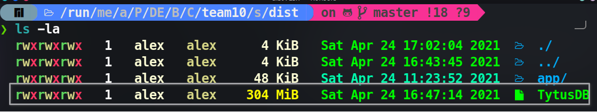
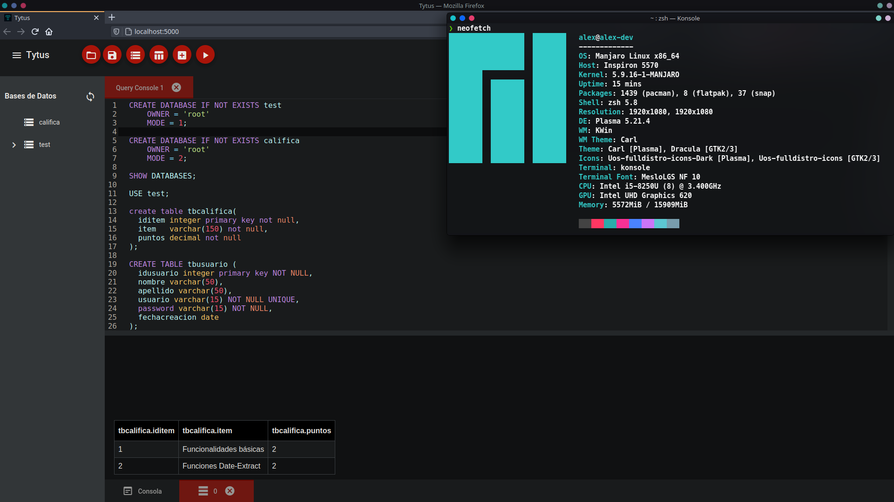
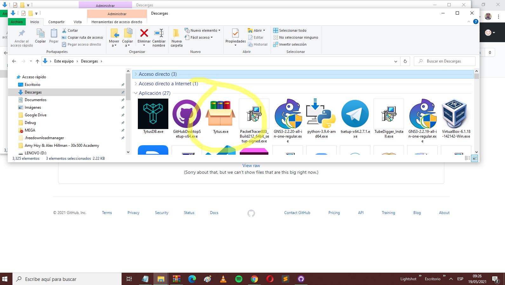
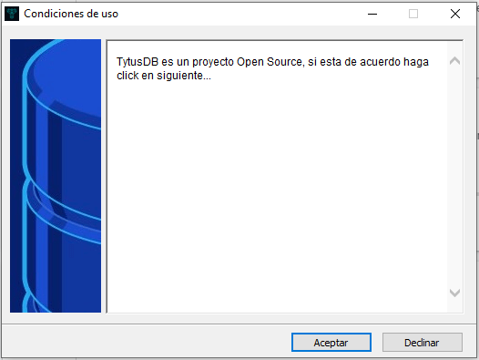
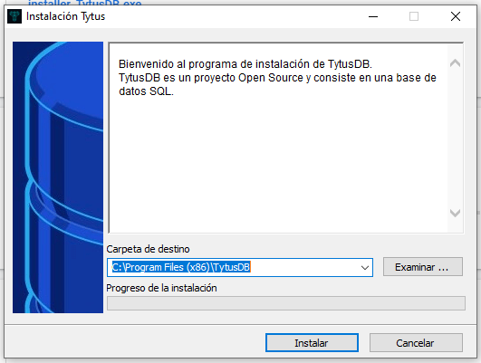
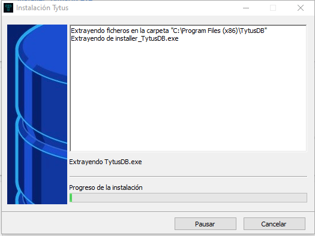
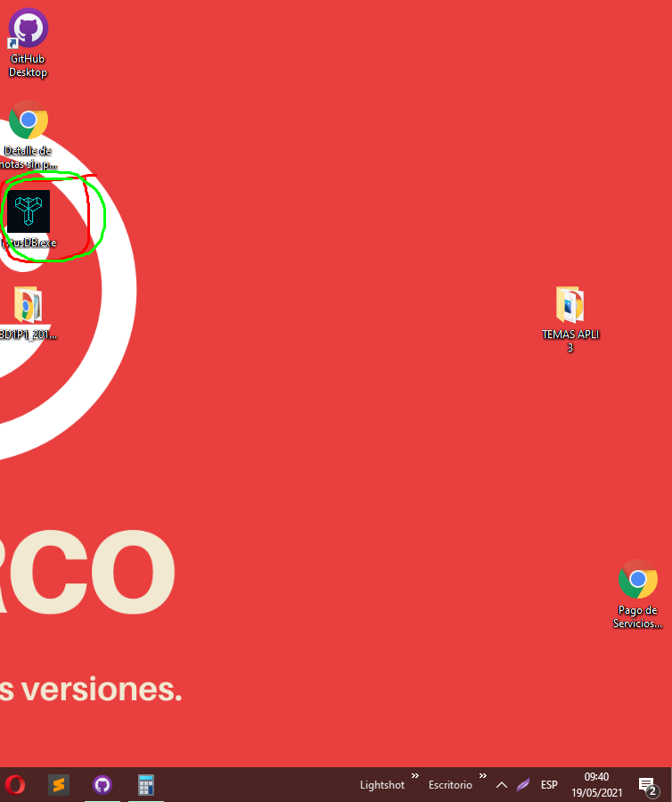
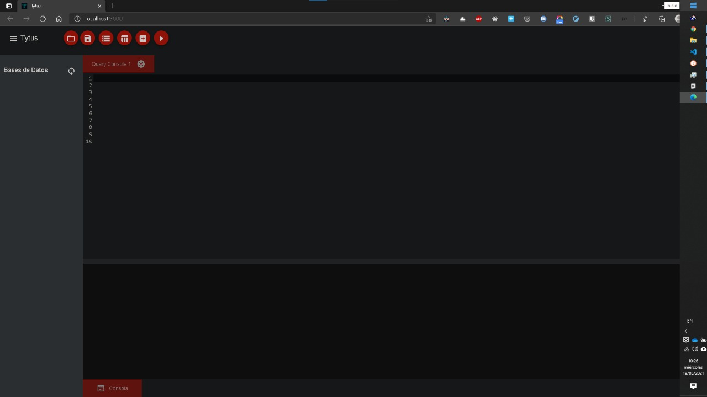

# Manual de Instalación

## Ejecución de TytusDB en Linux

Para Linux no hay un instalador como tal, lo que hay es de un archivo ejecutable.

1. Descargar el binario correspondiente para Linux, [Descargar](../release/Linux) y guardarlo en cualquier ruta de preferencia.

2. Descomprimir el archivo zip.

3. Luego de descargarlo y descomprimirlo asegurarse de el archivo tenga permisos de ejecución

   + **Usando la consola**  y estando en el directorio donde se almaceno el archivo
     
     ```shell
     ls -la
     ```
     
     Debería de estar aparecer algo semejante a esto
     
     
     
     | Letra | Descripción                            |
     |:-----:| -------------------------------------- |
     | r     | el archivo tiene permisos de lectura   |
     | w     | el archivo tiene permisos de escritura |
     | x     | el archivo tiene permisos de ejecución |
     
     En caso de que no tenga permisos de ejecución, se los podemos dar con el siguiente comando:
     
     ```shell
     chmod +x TytusDB 
     ```

   + **Usando la interfaz gráfica** 
     
     + Click derecho sobre la aplicación de TytusDB
     
     + Ir a la pestaña de permisos 
     
     + Corroborar que la casilla de ejecución este activa
     
     
     
     En caso de que no este activa la casilla, activarla para que pueda ejecutarse. 

4. Ejecutar la aplicación 

   + Usando la consola
     
     ```shell
     ./TytusDB
     ```

   + O haciendo doble click sobre el archivo. 

5. La aplicación estará corriendo en [localhost:5000](http://localhost:5000/)

   

> **NOTA**
> 
> + Al ejecutarse pro primera vez el programa creara en el mismo directorio donde se este ejecutando una carpeta llamada *data* en el cual se almacenaran los base de datos, tablas , etc. 
> 
> + AL crear la primera base de datos se creara un archivo con el nombre *Databases.json* el cual ayudara en la carga de datos para el parser. 
> 
> Por lo tanto no deben de borrarse por ningún motivo este directorio y archivo para no afectar el funcionamiento de TytusDB

## Instalación y Ejecución de TytusDB en Windows

1. Descargar el [instalador](../release/Windows)  y abrirlo

   

2. Damos clic en Aceptar

   

3. Ahora seleccionamos la carpeta para la instalación, por defecto archivos de programa, clic en extraer

   

4. Esperamos a que se complete la instalación

   

5. Instalación completa, icono en escritorio.

   

6. Ahora ya puede ser ejecutado la aplicación y esta estará corriendo en [localhost:5000](http://localhost:5000/)

   

