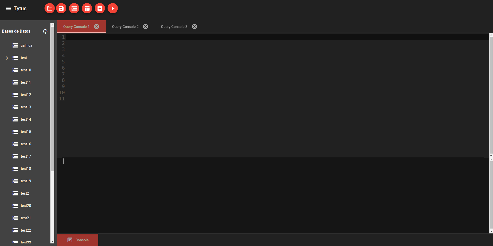
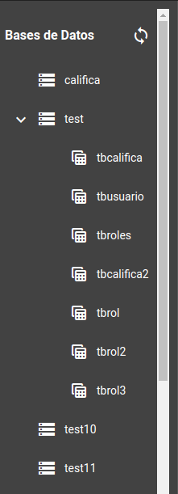
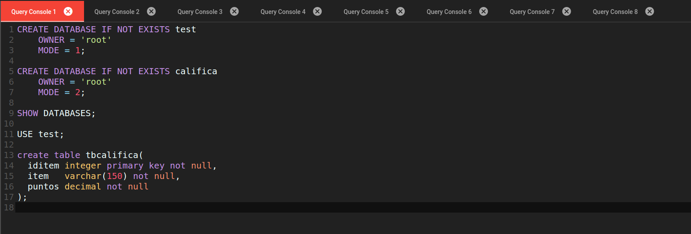
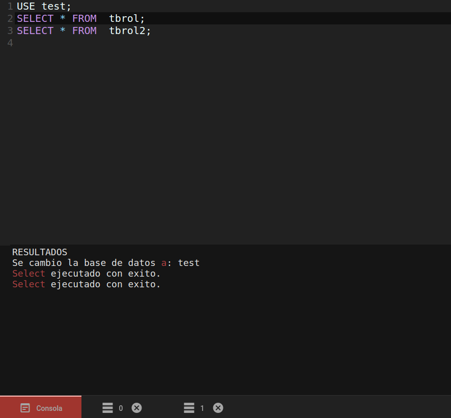
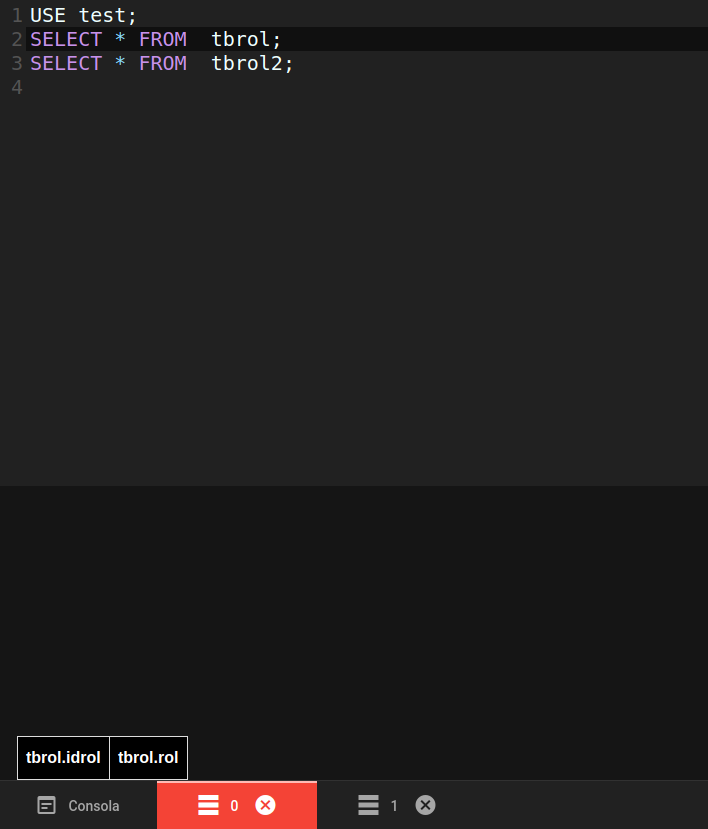
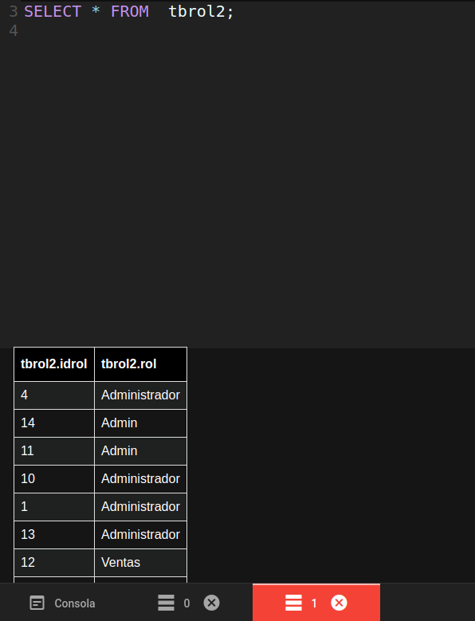

**Universidad de San Carlos de Guatemala**

**Facultad de Ingenieria**

**Escuela de Ciencias y Sistemas**

**Sistemas de Bases de Datos I**

**Ing. Luis Espino**

**Aux. Jonnathan Castillo**

**Grupo 10**

## Integrantes

| Carné     | Nombre                          |
| --------- | ------------------------------- |
| 201504220 | José Andres Rodas Arrecis       |
| 201708850 | Marco Antonio Reyes Garcia      |
| 201800984 | Alex Fernando Méndez López      |
| 201503961 | Fernando Augusto Armira Ramírez |

# Manual de Usuario

## Introducción

El siguiente manual tiene como fin introducir al usuario al manejo y conocimiento de TytusDB para su uso funcional.

## TytusDB

TytusDB es un administrador de bases de datos, el cual está compuesto por:

+ Un administrador de almacenamiento.

+ Un interpretador de instrucciones. 

+ Una interfaz gráfica para el manejo de las distintas instrucciones. 

## Limitaciones

+ TytusDB esta limitada a una cantidad de instrucciones que puede realizar y ejecutar

+ TytusDB sigue en desarrollo y pruebas por el cual puede presentar algunas errores durante la ejecución de algunas instrucciones. 

A continuación se lista instrucciones que TytusDB ejecuta

> ### Instrucciones de definición

+ Crear base de datos y tablas.

+ Modificar el nombre y cambiar propietario de una base de datos. 

+ Modificar la estructura de tablas así como el nombre.

+ Borrar bases de datos y tablas.

+ Seleccionar la base de datos en donde se crearan las tablas.

> ### Instrucciones de Manipulación

+ Insertar registros en tablas.

+ Eliminar registros de las tablas. 

+ Modificar registros de una tabla.

+ Seleccionar registros de una tabla.

+ Vaciar todos los registros de una tabla.

## Ejecutables:

Actualmente la aplicación funciona tanto en Linux como en Windows. 

* Para Linux se tiene un ejecutable, [Ejecutable](../release/Linux). 

* Para Windows se tiene un ejecutable y un instalador [Ejecutable/Instalador](../release/Windows).  

El manual de instalación lo puede encontrar en el siguiente apartado, [Manual de Instalación](./ManualdeInstalacion_G10.md).

<!-- Screen del dbms completo -->

## Interfaz Gráfica

Esta es la vista principal que se mostrara al iniciar TytusDB, esta divido en diferentes partes que a continuación serán descritas: 

<!-- Screen creando base de datos desde el menu -->

### Arbol TytusDB

Permite presentar al usuario una vista estructurada de las bases de datos almacenas en el sistema con sus respectivas tablas, al presionar en el botón de refrescar se actualiza el árbol.

### Barra de opciones

Barra de opciones cada  botón realizada una acción distinta, serán descritas de izquierda a derecha.

| Opción              | Descripción                                                                                                                |
| ------------------- | -------------------------------------------------------------------------------------------------------------------------- |
| Abrir               | Permite abrir un script guardado en nuestra máquina y lo muestra su contenido en una pestaña nueva  en el editor de texto. |
| Guardar             | Permite guardar de forma local el contenido de la pestaña actual.                                                          |
| Crear Base de datos | Permite crear una nueva base de datos.                                                                                     |
| Crear Tabla         | Permite crear una nueva tabla .                                                                                            |
| Nueva Pestaña       | Permite agregar una nueva pestaña con editor de código vació.                                                              |
| Ejecutar            | Ejecuta todo el contendido que se encuentra en la pestaña actual                                                           |

### Editor de código

 Esta Área cuenta con multipestañas para poder escribir y modificar el código para posteriormente ejecutar las distintas instrucciones  y así administración de las base de datos y tablas. 

<!-- Screen del area de texto -->

### Consola y área de resultados

 Área especifica para desplegar al usuario los resultados de las operaciones realizadas. 

