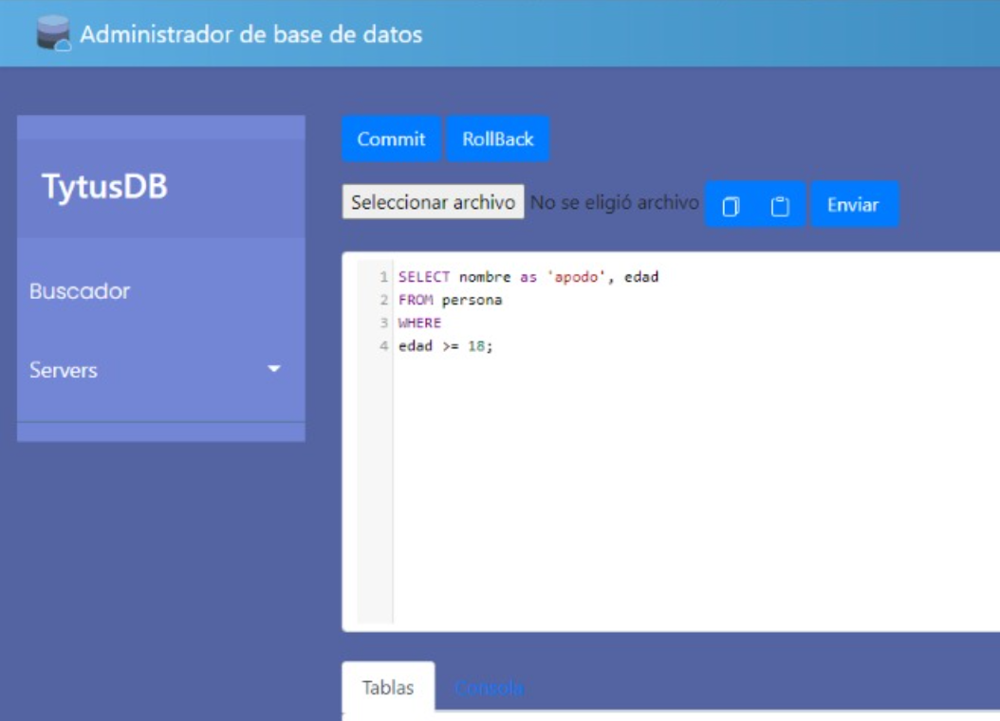
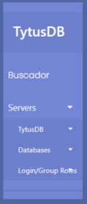
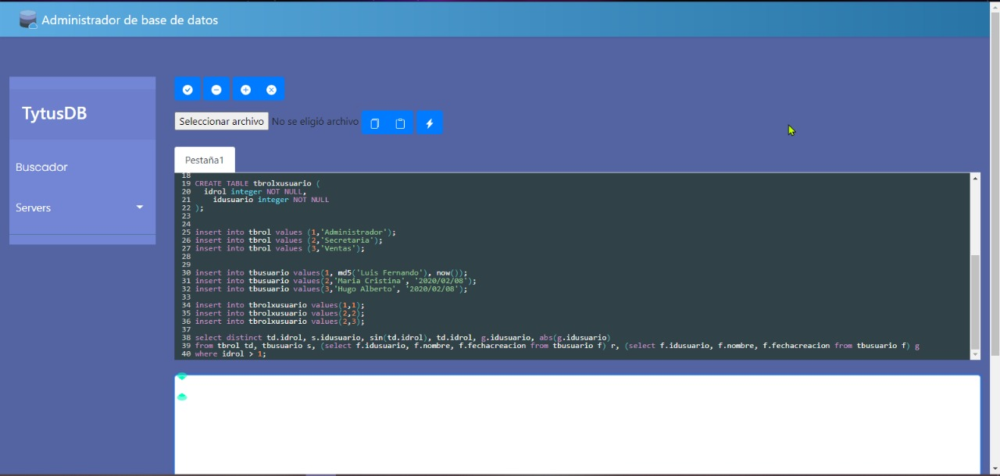
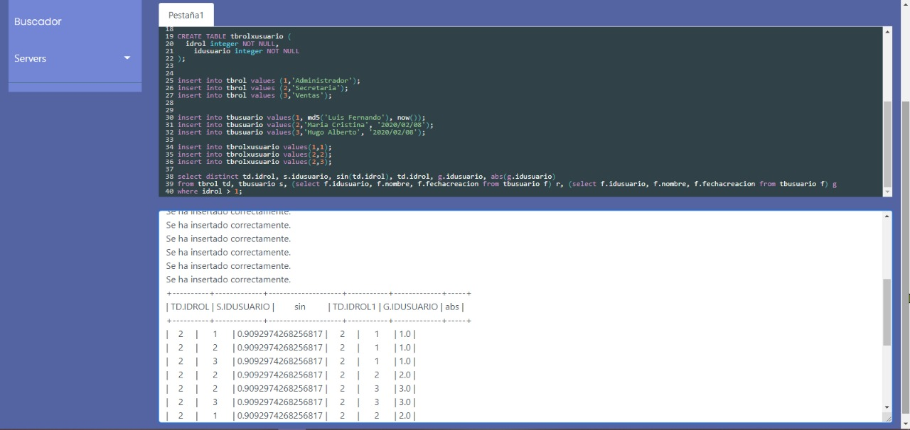

# BDD TytusDB Grupo01💻
TytusDB, Grupo01, Diciembre 2020

**Cliente Web**  
**Instalación en Windows de servidor como cliente**

> Integrantes
> - 201403793	KEVIN NICOLAS GARCÍA MARTÍNEZ,	2324015000101@ingenieria.usac.edu.gt
> - 201404218	OSMEL DAVID TÓRTOLA TISTOJ,	davidtortola_@hotmail.com

# Manual De Usuario👥📖

**TytusDB Cliente Web, Windows** \

TytusDB es un administrador de bases de datos Open Source y está disponible en formato web para sistemas operativos windows. Este cliente permite el manejo y administración de conexiones a múltiples bases de datos, así como también la edición y ejecución de querys escritos en SQL. A continuación se explicará más a detalle las opciones.

**Menú Barra Lateral**

En este menu se encuentran las siguientes opciones:

1. **Buscador:** Permite la búsqueda de algún objeto en el sistema.
2. **Servers:** Dentro de esta opción se encuentran las bases de datos que existen en el servidor, además de presentar un listado de los usuarios que tienen permiso en el sistema.

**Editor De Texto**

Este es el lugar donde se peuden escribir consultas en el lenguaje SQL para su posterior ejecución. Este área permite copiar y pegar código de otros lugares, además de cargar un archivo con extensión .sql. Este editor de texto está complementado por los botones en su parte superior, los cuales explicamos a continuación.

**Barra De Botones Del Editor De Texto**

Acá se encuentran los botones relacionados al editor de texto. Los **botones commit o rollback** se encargan de enviar dichas instrucciones al servidor para que la última transacción sea guardada o deshecha. El **botón seleccionar archivo** permite cargar el contenido de un documento .sql al editor de texto, mientras que los **botones copiar y pegar** permiten hacer una edición de texto más sencilla. Por último el **botón enviar** permite ejecutar las sentencias que se encuentran actualmente en el editor de texto.

**Consola**

Por último en la parte inferior de la pantalla, se encuentra la consola. Esta sirve para desplegar los mensajes de confirmación o error que pueda devolver el servidor, además de desplegar los resultados de las consultas y sentencias ejecutadas. 

**Código**

El lenguaje de Tytus utiliza sintaxis de SQL, permite ingresar consultas, crear tablas, crear bases de datos y obtener reportes, por medio de querys. Por ejemplo

`
CREATE TABLE tblUsuario (
  idUsuario integer not null,
  nombreUsuario varchar(25)
);
`

**Consola De Salida v2**

La consola de salida se encuentra en la parte inferior de la interfaz y en esta se muestran los resultados de los querys colocados en el editor de texto. Esta consola de salida permite visualizar a manera de tabla los reportes solicitados, asi como tambien listar la información y mostrar mensajes de resultados de la ejecución de las consultas.

# Manual Técnico📚🖉

**Librerías utilizadas**

**[Flask, web framework](https://flask.palletsprojects.com/en/1.1.x/).**

Flask es un micro web framework, progrmado en Python y está creado con el objetivo de ofrecer las herramientas necesarias para la creación de aplicaciones web usando Python, sin depender de herramientas o librerías extras. No cuenta con capa de abstracción de base de datos, ni validación de formularios y muchos componentes más que se encuentran a menudo en web frameworks. Esto permite que su uso sea simplificado, pero corrige estas faltas con la posibilidad de que se le agregue por medio de extensiones estas funciones que pueden llegar a hacer falta.

> Flask es utilizado en este proyecto debido a su fácil implementación, además de su amigable comunicación cliente-servidor debido a que se utiliza flask para ambas tareas. Además, es compatible y fácil de manejar junto con bootstrap.

**[CodeMirror](https://codemirror.net/).**

CodeMirror es un editor de texto muy versátil implementado en JavaScirpt para navegadores. Se enfoca especialmente en ediciones de código y tiene la opción de funcionar para múltiples lenguajes, además de permitir que se agregue muchos addons para complementar necesidades. También cuenta con una API de programación y temas en CSS que permiten su personalización.

> Se utiliza CodeMirror para el editor de texto principal, permitiendonos el manejo de sintaxis de SQL de una manera rápida y correcta.

**[py2exe](https://www.py2exe.org/).**

py2Exe es una extension de Python que se encarga de convertir código de Python a programas ejecutables de windows (.exe) y permite correrlos sin necesidad de instalar Python. Su desarrollo está en [GitHub](https://github.com/py2exe/py2exe).

> Con py2exe generamos los ejecutables para sistema operativo Windows del servidor y del cliente.

**[Bootstrap](https://getbootstrap.com/).**

Bootstrap es el frameworkk CSS más popular, utilizado para la creación de websites responsivos y enfocados a móviles. Contiene diseños y plantillas basadas en CSS y JavaScript para utilizar en formularios, botones, navegación y otros componentes.

> Bootstrap nos sirvió para la creación de la vistas, ya que nos facilita el crear menús laterales, encabezados y el footer.

**Diagrama De Despliegue**

El sistema esta compuesto por medio de un servidor y un cliente, los cuales se comunican entre ellos por medio de peticiones POST y GET, enviando archivos JSON que continenen la información. El servidor se encarga de consumir un servicio web, enviando el código SQL y recibiendo archivos JSON con tablas que son la respuesta de la ejecución de este código, esta parte de ejecución y consulta está diseñada por estudiantes de Compiladores 2 y Estrucutras De Datos.

---

# **Descripción Del Código**

- El cliente está basado en Flask, y el documento principal es [Controller.py](Controller.py), en el cual se encuentran las principales funciones, como son las rutas y los métodos de conexión al servidor. También se llama a renderizar la vista principal.

- La vista principal del cilente web es [MainLayout.html](Views/Templates/MainLayout.html), es la base de la vista, y llama a renderizar los diferentes objetos de la pantalla. Entre los elementos que componen la vista principal estan: 

  - [Boton.html](Views/Templates/Boton.html)
  - [Content.html](Views/Templates/Content.html)
  - [Footer.html](Views/Templates/Footer.html)
  - [Header.html](Views/Templates/Header.html)
  - [Home.html](Views/Templates/Home.html)
  - [SideBar.html](Views/Templates/SideBar.html)

- Por último está [servidor.py](../../server/team01/servidor.py), el cual es el servidor y es el encargado de recibir las peticiones post y get del cliente, y contactar el servicio web de compilación para solicitar una consulta o acción.

---

# **Parser**

- El parser utilizado para las consultas esta creado utilizando la herramienta PLY y fue creado por los miembros del grupo 26 del curso de compiladores 2 [G026](../../../parser/team26/G26/Reportes/ManualTecnico.md).

Este parser es el encargado de procesar las peticiones que se realizan por medio del editor de texto, realiza un analisis de la sintaxis y decide la accion que ejecutar. Posteriormente realiza los cambios necesarios o consultas sobre estructuras de datos previamente construidas por estudiantes del curso de estructuras de datos y devuelve los resultados por medio de un json hacia la consola web.

---

