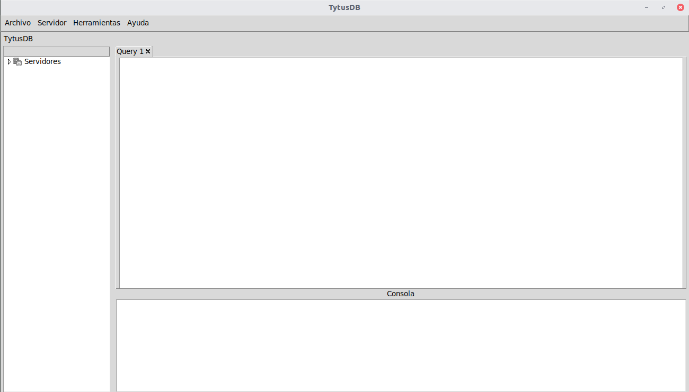

# TytusDB - Manual de Usuario

Universidad de San Carlos de Guatemala  
Facultad de Ingeniería  
Cursos: 772 Estructuras de Datos | 774 Sistemas de Bases de Datos 1 | 781 Organización de Lenguajes y Compiladores 2  
Diciembre 2020

## Índice
- [TytusDB](#tytusdb)
- [Administrador de almacenamiento](#administrador-de-almacenamiento)
- [Administrador de la base de datos](#administrador-de-la-base-de-datos)
- [Inicio de sesion](#inicio-de-sesion)
- [Barra de Herramientas](#barra-de-herramientas)
- [Conexiones](#conexiones)
- [Query Tool](#query-tool)
- [Consola] (#consola)

## TytusDB

Es un proyecto Open Source para desarrollar un administrador de bases de datos. Está compuesto por tres componentes interrelacionados: el administrador de almacenamiento de la base de datos,  el administrador de la base de datos, este administrador se compone a su vez de un servidor y de un cliente; y el SQL Parser.

## Administrador de almacenamiento

Este componente es el encargado de gestionar el almacenamiento de las bases de datos, proporcionando al servidor un conjunto de funciones para extraer la información.

## Administrador de la base de datos

El administrador de la base de datos se compone de dos componentes:

- Servidor: es un servidor http. Este servidor trabaja en el puerto 10000. En la carpeta de instalación de la base de datos se debe crea una carpeta llamada /data donde se almacenan las bases de datos. Por defecto existe un usuario admin y su contraseña la cual es 123. Además de crear n usuarios configurando el acceso a las bases de datos.

- Cliente: es un cliente tipo aplicación de escritorio en sistemas operativos windows. Este cliente se conectará al servidor y podrá hacer la mayoría de las operaciones que hace un adminisitrador de base de datos comunmente. Dentro del cliente, cuando se ejecute el cliente la aplicacion seguira el siguiente flujo de trabajo.

### Inicio de Sesion

Al ejecutar la aplicación nos mostrará una ventana donde podremos ingresar nuestro usuario y contraseña.

  

  

De ingresar un usuario y contraseña incorrecto nos preguntará si deseamos reintentar el inicio de sesión, si se acepta tendremos que ingresar otra vez las credenciales y si no se cierra la aplicación.

  

De lo contrario, si el usuario y contraseña son correctos podremos visualizar el siguiente mensaje. 

  

### Barra de Herramientas

En la barra de herramientas podremos encontrar los menu, 

  

#### Archivo

- Nuevo: Crea una nueva pestaña en el query tool, para un nuevo script.

- Abrir: Abre un script guardado previamente en nuestro computador.

- Guardar: Guarda un script escrito previamente en el query tool.

- Salir: Permite finalizar la ejecucion de la aplicacion.

#### Servidor

- Nueva conexion: Crea una nueva conexion a un servidor nuevo.

- Quitar conexion: Quita una conexion hecha previamente.

#### Herramientas

- Query tool: Nos muestra el multipestañas para escribir scripts de sql.

- Run: Ejecuta el script o texto seleccionado del script.

#### Documentacion

- Documentacion: Nos permite visualizar la documentacion del programa.

- Acerca de...: Brinda informacion acerca de la aplicacion.

### Conexiones

Nos permite visualizar informacion acerca de nuestras conexiones y bases de datos,
a su vez nos detalla cada una de las bases de datos que utilizamos y estas nos detallan los objetos y elementos de cada base de datos; cada servidor tambien nos detalla los grupos de roles y usuarios.

  

### Query Tool

Es la funcionalidad de tytusDB que nos permite realizar consultas y operaciones a la base de datos por medio de scripts, el cual es un multipestañas donde podes escribir nuestros scripts y ejecutar posteriormente.

  

### Consola

La consola muestra los resultados o mensajes de error de las consultas realizadas al servidor de bases de datos.

  

