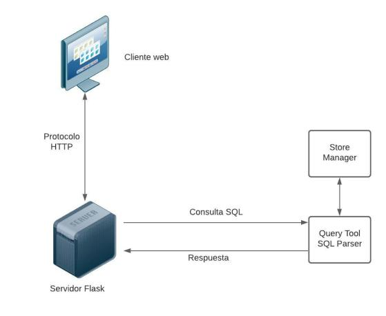
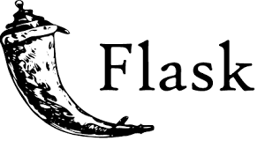
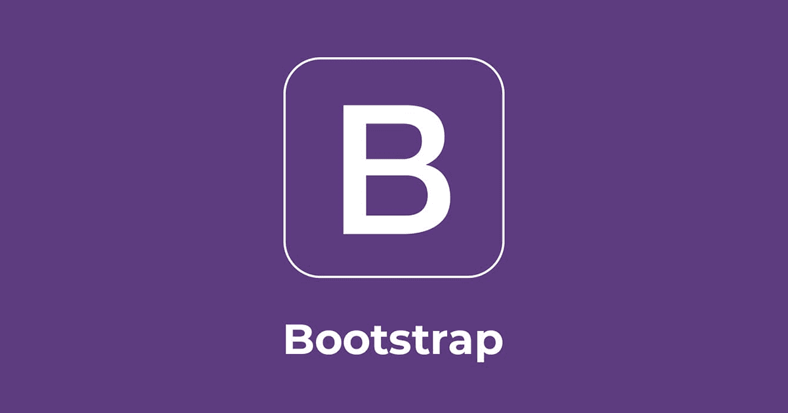
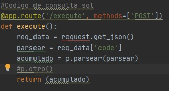
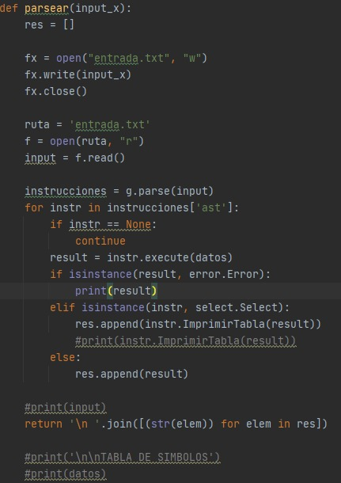

# Manual Técnico

***
### Explicacion de la aplicación
Es un dministrador de bases de datos Open Source que está compuesto por tres componentes interrelacionados: el administrador de almacenamiento de la base de datos, el administrador de la base de datos que a su vez se compone de un servidor y de un cliente; y el SQL Parser, que analiza el codigo SQL que el usuario realiza.

### Lenguajes
- Servidor
  - Python

- Aplicación Web
  - Python
  - Html
  - Css
  - JavaScript

### Arquitectura

La aplicación cuenta con un servidor web que se conecta por medio del protocolo http a un servidor de flask. El servidor consume los servicios del Query tool que se basa en un parser de SQL hecho en python retornando las respuestas que este genera, el parser maneja el store manager donde se encuentras todas las estructuras de datos. 

### Lenguajes utilizados

- Aplicacion Web:
     - HTML
     - CSS
     - JavaScript
     - Flask
        
 - Servidor:
   - Python
 
### Herramientas y librerias
|  |   |
|:-------------:|---|
| Flask 
 |  Flask es un framework minimalista escrito en Python que permite crear aplicaciones web rápidamente y con un mínimo número de líneas de código. Está basado en la especificación WSGI de Werkzeug y el motor de templates Jinja2 y tiene una licencia BSD |
| Code Mirror
 |  CodeMirror es un componente de JavaScript que proporciona un editor de código en el navegador, este editor es especializado para editar codigo y puede ser configurada en numerosos lenguajes y addons que permite que contenga una edicion avanzada. |
| Bootstrap
 | Bootstrap es una biblioteca multiplataforma o conjunto de herramientas de código abierto para diseño de sitios y aplicaciones web, contiene un sistema de cuadrícula receptivo, amplios componentes prediseñados y potentes complementos de JavaScript, entre otros.  |

### Descripcion Codigo
La apicación web es genarada con Flask que renderiza la [pagina principal](https://github.com/tytusdb/tytus/blob/main/client/fase2/team07/tytus-flask/templates/homepage.html) en la ruta principal del servidor web. Contiene rutas que utiliza para ejecutar los comandos SQL que se ingresan en el editor de texto, esta ruta se comunica con el servidor flask que consume el query tool.

La ruta utilizada por el servidor es un metodo que analiza la consulta enviada por el cliente retornando el resultado segun la sintaxis de tytus. El resultado depende solamente de la consulta y del query tool, el servidor se encarga solo de comunicar al cliente con el query tool.

