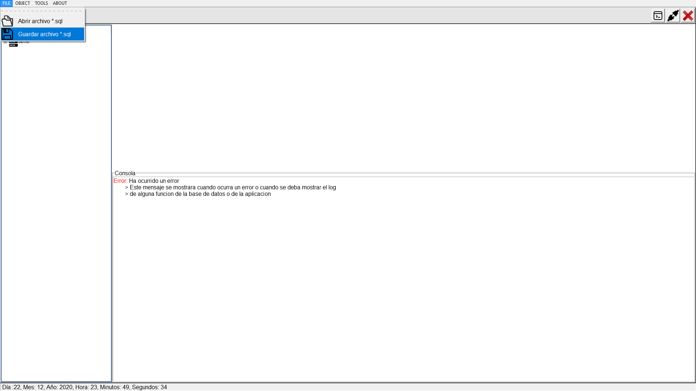
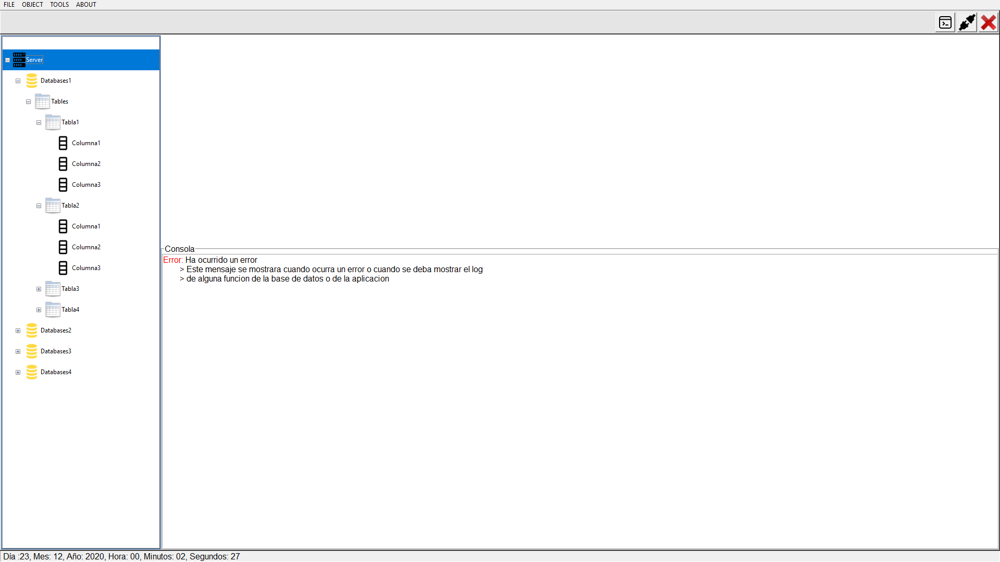
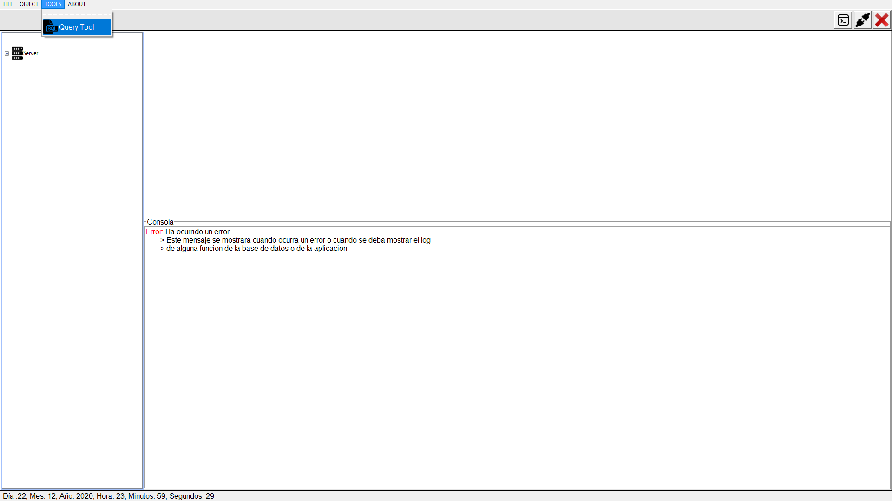
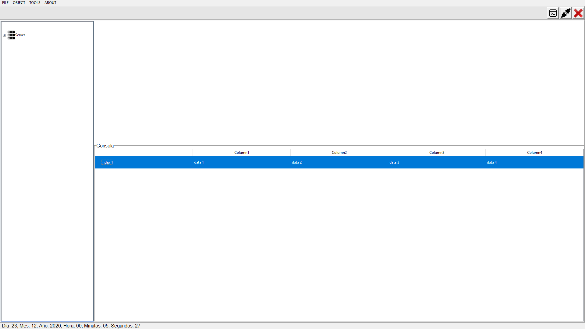

# Manual Tecnico (FASE II)

## Librerias

```python
import socket
import tkinter as tk
import json
import webbrowser
import platform

```
+ socket: Los sockets y el socket API se utilizan para enviar mensajes a través de una red. Proporcionan una forma de comunicación entre procesos (IPC).

+ tkinter: El paquete tkinter ("interfaz Tk") es la interfaz estándar de Python para el conjunto de herramientas de la interfaz gráfica Tk.

+ json: El paquete json permite leer el archivo json

## Conexion

```python
serv = socket.socket(socket.AF_INET, socket.SOCK_STREAM)
serv_add = ('localhost', 10000)
print('connection to port=>', serv_add)
serv.connect(serv_add)

```

+ Se crea una ocurrencia de la clase socket.socket(parametro1, parametro2), donde el parámetro 1 socket.AF_INET es el tipo de socket para la versión ipv4, y el parámetro 2 es el socket.SOCK_STREAM donde hace referencia al protocolo de conexión TCP. Al serve_add se le asigna el host y el puerto, para poder mandárselo al ser.connect y realizar la conexión.

## Metodos

```python
now = datetime.now()
format = now.strftime(
    'Día :%d, Mes: %m, Año: %Y, Hora: %H, Minutos: %M Segundos: %S')
print(format)

```
+ Método que regresa la fecha y hora del sistema. El método datetime.now() retorna la fecha y hora unida del sistema actual, con el metodo now.strftime() se le da un formato mas legible para la fecha y hora.


```python
def f_query_tool(self):
        self.QueryTool2.pack(side = TOP, fill = X)     
        self.QueryTool.pack_forget()

```


+ Método que habilita e inhabilita un Frame, el .pack() habilita el Frame, mientras que él .pack_forget() inhabilita un Frame


```python
  def send_scritp(self,texto):
        # Mandamos el script
        serv.sendall(texto.encode('utf-8'))
        recibido = 0
        esperado = len(texto)
        #Recibiendo JSON
        data = serv.recv(1500500)     
        data_json = json.loads(data.decode())
        recibido += len(data)
        #imprimiendo todo el json
        #print(data_json)
        #Leyendo los hijos del padre mensaje
        self.obj = data_json['obj']    
        self.databases = data_json['databases']

        # Imprimimos los Mensajes
        for msg in self.obj['messages']:
            self.f_set_console_message(msg)
        
        # Imprimimos los Errores
        for err in self.obj['postgres']:
            self.f_set_console_message(err)

        # Actualizamos el treeview
        self.f_charge_treeview()

        # Actualizamos la tabla de query
        self.f_set_console_tables()

        #print(data_json['databases'])


```

+ Método que permite mandar el script sql al server y recibe el json con la respuesta

```python
      def f_crear_db(self):
        dll_db = simpledialog.askstring("Create DB", "Ingresar nombre")
        query = "create database "+dll_db+";"
        #print(query)
        self.send_scritp(query)
        databases.load()
        self.f_charge_treeview()
```

+ Método que permite crear la base de datos

```python
 def f_elimnar_db(self):
        dll_db = simpledialog.askstring("Delete DB", "Ingresar nombre")
        query = "drop database "+dll_db+";"
        #print(query)
        self.send_scritp(query)
        databases.load()
        self.f_charge_treeview()
```

+ Método que permite eliminar la base de datos

```python
 def f_set_console_message(self, text):
        self.outputText.config(state='normal')
        self.outputText.insert(END, text+'\n')
        self.outputText.config(state='disabled')
```

+ Método que permite mostrar los errores

# Manual Usuario

## Objetivos

```
Dar a conocer cómo se utiliza la aplicación por medio de una explicación detallada.
Desarrollar una intergaz amigable al usuario.

```

## Ingreso al Sistema
+ Al iniciar la aplicacion se desplegará la siguiente ventana, en la cual deberá ingresar con usuario y contraseña.
<p align="center">

</p>

## File
+ Abrir Archivo *.sql
Abre el archivo seleccionado en la pestaña seleccionada.
<p align="center">

</p>

+ Guardar Archivo *.sql
Guarda el archivo de la pestaña actual.
<p align="center">

</p>

## Tree View
Se desplegará una vista en forma de árbol en la cual se podrá tener acceso a las bases de datos, así como sus tablas, etc.
<p align="center">

</p>

## Tools
+ Query Tool
Abrir un nuevo editor sql.
<p align="center">

</p>
Se mostrará de la siguiente manera.
<p align="center">

</p>


## Consola
Se desplegará la salida de las consultas realizadas en el editor.
<p align="center">

</p>

## About
+ Grupo 10
Se mostrarán los integrantes del grupo.
<p align="center">

</p>
+ TytusDB
Se abrirá el repositorio del proyecto.
