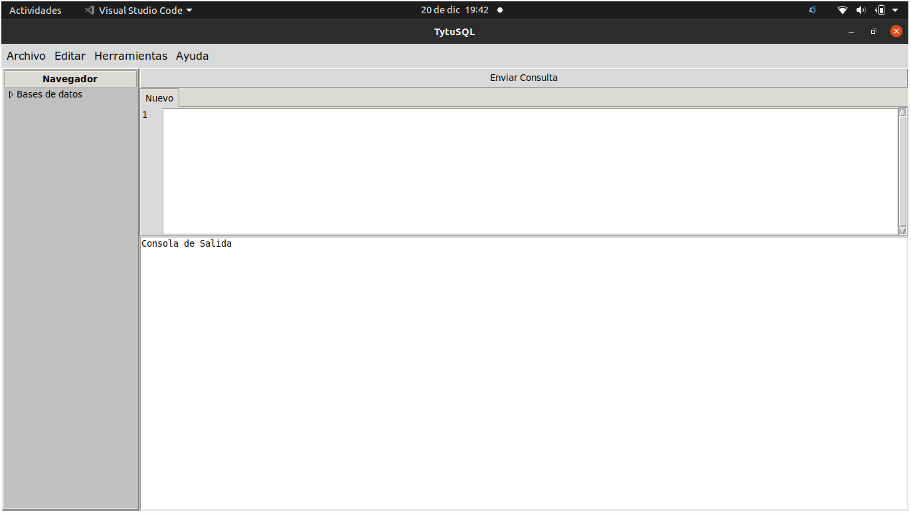

# Cliente Tytus DB (FASE I)

## Información General
- SO: Linux-Ubuntu 20.04
- Lenguaje: Python
- Grupo 4
- Diciembre 2020

**Librerias necesarias**

```python
import tkinter as tk
from tkinter import *
import http.client
import json
```

**Variables Globales**
Con ellas se controlan las pestañas

```python
control = 0
notebook = None
```

**Clase Arbol**

```python
class Arbol(Frame):
    ...
```

> La clase Arbol ultiliza el treeview de Tkinter para crear el panel izquierdo del cliente, hace referencia a las imagenes de la carpeta "resources" para mostrar los iconos en el arbol.

**Clase Campo**

```python
class Campo(Frame):
    ...
```

> Aqui se maneja el campo de texto, utiliza dos clases mas para poder mostrar el numero de lineas. TextLineNumbers crea un widget que genera las lineas dependiendo del area de Texto, CustomText crea el area de texto con la que se conectara el TextLineNumbers.

**ventana.py**

```python
def CrearMenu(masterRoot):
    ...
```
> En este método se crea la barra del menú de la aplicación, esta compuesta de 4 opciones principales: Archivo, Editar, Herramientas y ayuda. cada una tiene un submenú, en el de archivo, que es uno de los más relevantes, se encuentra la opción de guardar, guardar Como, cerrar archivo y abrir un documento. Para hacer esta parte de la interfaz se utilizó la clase "Menu" de tkinter,  y se utilizó uno de sus métodos que es "add_command".

```python
def abrir():
    ...
```
> Este método se creó para abrir documentos .sql, se importó la librería "os" para acceder a los métodos para el manejo de archivos, se utilizó global para poder usar variables declaradas afuera del ámbito, en la variable archivo se guarda el archivo que se desea abrir, y luego se pregunta si el archivo no está vació, si no lo está, se podrá acceder al nombre de este y se manda a llamar al método "añadir" para agregar la nueva pestaña y poder visualizar el archivo.

```python
def guardarComo():
    ...
```
> Este método se creó para poder guardar un archivo nuevo, es decir; se ha creado dentro de la aplicación, aquí se accede al índice actual, es decir; al indice que el usuario está usando, para poder guardar el archivo, luego de ello se abre el gestor de archivos para agregar el nombre.

```python
def guardarArchivo():
    ...
```
> Este método esi similar al de guardarComo, con excepción de que este se sobre escribe al archivo anteriormente abierto.

```python
def cerrarPestaña():
    ...
```
> Este método es pequeño, ya que solamente cierra la pestaña actual en la que está el usuario, para ellos se utiliza nuestra etiqueta donde hacemos referencia al objeto Notebook y usamos el select para obtener el indice, luego utilizamos el "index" para convertirlo a entero y finalmente aplicamos el método "forget" para cerrar esa pestaña.

```python
def CrearVentana():
    ...
```
> Conecta todo en un frame para crear el cliente.

```python
def añadir(titulo):
    ...
```
> En este método se crean las pestañas, para ello se creó un arreglo donde se guardará cada pestaña que se cree, se utilzó el método appened para añadir más páginas al notebook, y también sus cajas de texto.

# Conexion cliente-servidor

```python
myConnection = http.client.HTTPConnection('localhost', 8000, timeout=10)
```

> Se crea la conexion con el servidor.

```python
headers = {
    "Content-type": "application/json"
    }
```

> Se establecen los headers para cada tipo de peticion

```python
myConnection.request("GET", "/getUsers", "", headers)
response = myConnection.getresponse()
```

> Se envia una peticion y "responde" obtiene la respuesta del servidor.

## Manual de usuario
<p align="center">
  
</p>

## Iniciar la interfaz

Se utiliza:
```
python ventana.py
```

## Menu
Se crearon los menus Archivo, Editar, Herramientas y Ayuda. En la primera fase solo el menu ayuda y archivo tienen opciones utilizables.


## Campo de Texto
Un editor que tiene numero de linea, opcion para multiples pestañas y un scroll para su mejor manejo.

## Vista de Bases
El panel izquiero del cliente se utiliza para tener una mejor visualizacion de las bases de datos conectadas. Es un vista de arbol que se expande hasta llegar a las tablas.