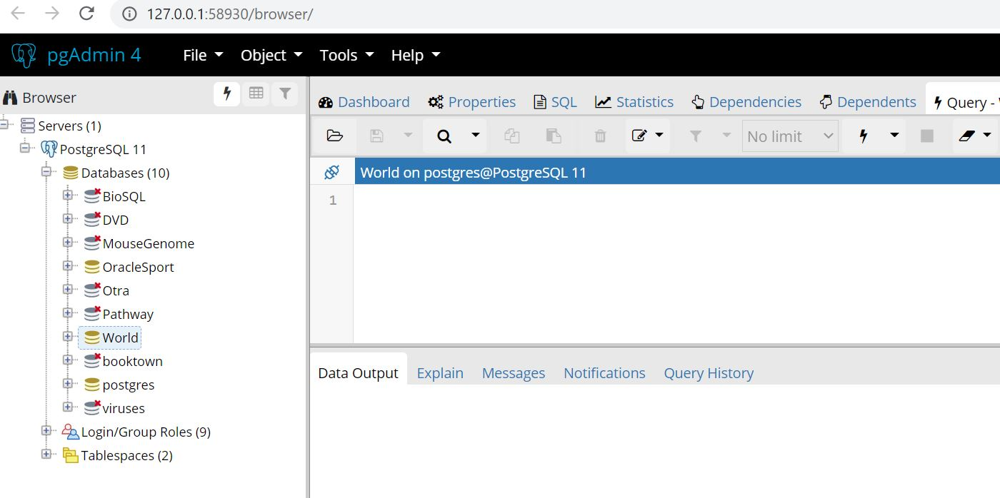

# Enunciado del Proyecto (FASE I)

Universidad de San Carlos de Guatemala  
Facultad de Ingeniería  
Cursos: 772 Estructuras de Datos | 774 Sistemas de Bases de Datos 1 | 781 Organización de Lenguajes y Compiladores 2  
Diciembre 2020

## Índice
- [Competencias del proyecto](#competencias-del-proyecto) 
- [Condiciones del proyecto](#condiciones-del-proyecto)
- [TytusDB](#tytusdb)
- [Administrador de almacenamiento](#administrador-de-almacenamiento)
- [Administrador de la base de datos](#administrador-de-la-base-de-datos)
- [SQL Parser](#sql-parser)
- [Reportes y entrega](#reportes-y-entrega)

## Competencias del proyecto

### Competencia general
- Poner en práctica los conocimientos teóricos adquiridos durante cada curso y aplicarlo a un proyecto real de código abierto fortaleciendo las competencias de administración de equipos de desarrollo.

### Competencias específicas
- El estudiante construye un intérprete para el subconjunto del lenguaje SQL mediante la traducción dirigida por la sintaxis.
- El estudiante utiliza la herramienta PLY o SLY de Python para la traducción.
- El estudiante proporciona una solución de estructuras de datos para gestionar la información de un sistema de bases de datos.
- El estudiante construye un servidor http y un cliente para que se conecten y accedan a las funciones definidas para el administrador de la base de datos.

## Términos del proyecto

### Equipos de desarrollo

- Se formarán equipos de 4 estudiantes con carné continuos por curso. 
- El catedrático compartirá con cada curso una hoja de cálculo con los integrantes de cada equipo y asignarles el tema de implementación. 
- Además deben decidir quién será el coordinador de cada equipo a más tardar el lunes antes de las 11:59 para agregar al coordinador como colaborador del repositorio para aceptar los commits. 
- También cada estudiante debe agregar su Username de GitHub a la hoja de cálculo y modificar su Name para que aparezca su nombre completo para lograr identificar a cada estudiante.

### Lenguaje de programación

El lenguaje seleccionado es Python, y no deben utilizarse bibliotecas adicionales si no hacen falta, por ejemplo, para compiladores 2 si deben utilizar PLY. Cualquier otra biblioteca debe ser autorizada por el catedrático.

### Licencias y convenio

El proyecto está diseñado por el catedrático bajo una licencia Open Source, específicamente MIT. Por convenio, los estudiantes aparecerán como contribuidores junto con el copyright. Además, cualquier biblioteca autorizada también se debe colocar la licencia y el copyright en el archivo LICENSE.md en su carpeta respectiva.

### Manejo de versiones

Cada integrante de los equipos debe hacer sus propuestas de cambio mediante pull request directamente al master de este repositorio (no hacer pull request de la rama de cada uno para evitar conflictos), queda a discreción de cada equipo utilizar de manera independiente una rama u otro repositorio para pruebas.

## TytusDB

Es un proyecto Open Source para desarrollar un administrador de bases de datos. Está compuesto por tres componentes interrelacionados: el administrador de almacenamiento de la base de datos, que estará a cargo del curso de Estructuras de Datos; el administrador de la base de datos, que estará a cargo del curso de Sistemas de Bases de Datos 1, este administrador se compone a su vez de un servidor y de un cliente; y el SQL Parser, que estará a cargo del curso de Organización de Lenguajes y Compiladores 2.

<p align="center">
  
</p>

## Administrador de almacenamiento

Este componente es el encargado de gestionar el almacenamiento de las bases de datos, proporcionando al servidor un conjunto de funciones para extraer la información.

#### Modo de almacenamiento 

TytusDB tendrá cinco modos de almacenamiento, cada uno corresponde a un motor de la base de datos y cada estructura almacena una tabla. Cada modo será asignado a un equipo diferente para que lo desarrolle. Los modos de almacenamiento son los siguientes: 
1. Mediante un árbol AVL
2. Mediante un árbol B
3. Mediante un árbol B+
4. Mediante ISAM
5. Mediante tablas Hash.
6. Mediante archivos JSON

#### Registros de almacenamiento

Cada registro que corresponde a una tupla de una tabla será almacenado en cada nodo o cada elemento de una página de las estructuras anteriores, según el modo de almacenamiento.
Cada atributo será débilmente tipado, a efectos de no verificar tipo en este punto, ya que lo hará el parser de SQL.

#### Bases de datos

- Una base de datos es un conjunto de tablas, para este diseño, es un conjunto de estructuras arbóreas. 

- El servidor de la base de datos podrá contener n bases de datos. 

- Se deja a discreción de los estudiantes cómo manejar el conjunto de tablas de una base de datos y el conjunto de bases de datos. 

- Se sugiere manejar los archivos de manera binaria para no exponer la información. 

#### Funciones

A continuación, se muestran las funciones que deben estar disponibles para que el componente SQL Parser pueda hacer uso de estas. 

- Queda a discreción del equipo manejar o hacer conversiones de tipos de datos. 
- El nombre de las bases de datos y de las tablas deben cumplir el formato de un identificador.

##### Respecto de las funciones CRUD de las bases de datos están: 

```
def createDatabase(database: str) -> int:
```
Crea una base de datos.  (CREATE)  
Parámetro database: es el nombre de la base de datos, debe cumplir con las reglas de identificadores de SQL.  
Valor de retorno: 0 operación exitosa, 1 error en la operación, 2 base de datos existente  

```
def showDatabases() -> list:
```
Devuelve una lista de los nombres de las bases de datos. (READ)  
Valor de retorno: lista de strings con los nombres de las bases de datos, si ocurrió un error o no hay bases de datos devuelve una lista vacía [].  

```
def alterDatabase(databaseOld, databaseNew) -> int:
```
Renombra la base de datos databaseOld por databaseNew.  (UPDATE)  
Parámetro databaseOld: es el nombre actual de la base de datos, debe cumplir con las reglas de identificadores de SQL.  
Parámetro databaseNew: es el nuevo nombre que tendrá de la base de datos databaseOld, debe cumplir con las reglas de identificadores de SQL.  
Valor de retorno: 0 operación exitosa, 1 error en la operación, 2 databaseOld no existente, 3 databaseNew existente.  

```
def dropDatabase(database: str) -> int: 
```
Elimina por completo la base de datos indicada en database.  (DELETE)  
Parámetro database: es el nombre de la base de datos que se desea eliminar, debe cumplir con las reglas de identificadores de SQL.  
Valor de retorno: 0 operación exitosa, 1 error en la operación, 2 base de datos no existente.  


##### Respecto de las funciones CRUD de las tablas están:

```
def createTable(database: str, table: str, numberColumns: int) -> int:
```
Crea una tabla en una base de datos especificada recibiendo una lista de índices referentes a la llave primaria y llave foránea.  (CREATE)  
Parámetro database: es el nombre de la base de datos a utilizar.  
Parámetro table: es el nombre de la tabla que se desea crear.  
Parámetro numberColumns: es el número de columnas que tendrá cada registro de la tabla.  
Valor de retorno: 0 operación exitosa, 1 error en la operación, 2 base de datos inexistente, 3 tabla existente.  

```
def showTables(database: str) -> list:
```
Devuelve una lista de los nombres de las tablas de una base de datos.  (READ)  
Parámetro database: es el nombre de la base de datos a utilizar.  
Valor de retorno: si existen la base de datos y las tablas devuelve una lista de nombres de tablas; si existe la base de datos, pero no existen tablas devuelve una lista vacía; y si no existe la base de datos devuelve None.  

```
def extractTable(database: str, table: str) -> list:
```
Extrae y devuelve una lista con elementos que corresponden a cada registro de la tabla.  (READ)  
Parámetro database: es el nombre de la base de datos a utilizar.  
Parámetro table: es el nombre de la tabla a utilizar.  
Valor de retorno: si existe la base de datos, la tabla y los registros devuelve una lista con los registros, si existen las base de datos, la tablas pero no registros devuelve una lista vacía, y si ocurre un error o si no existe la base de datos o la tabla devuelve None.  

```
def extractRangeTable(database: str, table: str, columnNumber: int, lower: any, upper: any) -> list:
```
Extrae y devuelve una lista con los elementos que corresponden a un rango de registros de la tabla.  (READ)  
Parámetro database: es el nombre de la base de datos a utilizar.  
Parámetro table: es el nombre de la tabla a utilizar.  
Parámetro columnNumber: es el número de índice de columna a restringir o verificar con los valores upper y lower.
Parámetro lower: es el límite inferior (inclusive) del rango a extraer de la columna indicada de la tabla.  
Parámetro upper: es el límite superior (inclusive) del rango a extraer de la columna indicada de la tabla.  
Valor de retorno: si existe la base de datos, la tabla y los registros devuelve una lista con los registros(lista), si existen las base de datos, la tablas pero no registros devuelve una lista vacía, y si no existe la base de datos o la tabla o cualquier error devuelve None.  
Consideraciones:
- Para la comparación de lower y upper se puede hacer cast a str cuando las llaves sean compuestas o en general para reducir complejidad.
- Ver el submódulo Any del paquete typing.  

```
def alterAddPK(database: str, table: str, columns: list) -> int:
```
Asocia a la tabla una llave primaria simple o compuesta mediante la lista de número de columnas, esto para anticipar el índice de la estructura de la tabla cuando se inserten registros. (UPDATE)  
Parámetro database: es el nombre de la base de datos a utilizar.  
Parámetro table: es el nombre de la tabla a utilizar.  
Parámetro columns: es el listado de números de columnas que formarán parte de la llave primaria. 
Valor de retorno: 0 operación exitosa, 1 error en la operación, 2 database no existente, 3 table no existente, 4 llave primaria existente, 5 columnas fuera de límites.  

Considerar:
- Si no se define al menos una llave primaria, cuando ocurre el primer insert se debe utilizar una llave primaria escondida (numérica).  
- Si ya existían datos sin llave primaria explícita se recalcula el índice de la estructura de índices con la actual llave primaria.  
- Si la llave primaria es compuesta, se sugiere concatenar en cualquier estilo las columnas, para mantenerlas intactas (sería como llave primaria escondida).
- El error 42P16 de PostgreSQL invalid_table_definition, entre algunas causas no permite definir múltiples llaves primarias (nótese de la diferencia de una llave primaria compuesta). Si ya existe una llave primaria y se desea agregar otro campo, entonces se debe eliminar la llave actual recalculado el índice cuando sea modificado, si no hay modificación se queda con la llave anterior.
- El error 23505 de PostgreSQL unique_violation, cuando se ejecuta esta función se debe recalcular el índice, si hay un valor duplicado en una parte de la llave primaria debe dar error y dejar el índice como estaba.

```
def alterDropPK(database: str, table: str) -> int:
```
Elimina la llave primaria actual en la información de la tabla, manteniendo el índice actual de la estructura del árbol hasta que se invoque de nuevo el alterAddPK().  (UPDATE)  
Parámetro database: es el nombre de la base de datos a utilizar.  
Parámetro table: es el nombre de la tabla a utilizar.  
Valor de retorno: 0 operación exitosa, 1 error en la operación, 2 database no existente, 3 table no existente, 4 pk no existente.  

```
def alterAddFK(database: str, table: str, references: dict) -> int:
```
Asocia la integridad referencial entre llaves foráneas y llaves primarias, para efectos de la fase 1 se ignora esta petición. Debido a que será parte de la fase 2 en la construcción de índices secundarios.  (UPDATE PENDIENTE)  

```
def alterAddIndex(database: str, table: str, references: dict) -> int:
```
Asocia un índice, para efectos de la fase 1 se ignora esta petición. Debido a que será parte de la fase 2 en la construcción de índices secundarios.  (UPDATE PENDIENTE)  

```
def alterTable(database: str, tableOld: str, tableNew: str) -> int:
```
Renombra el nombre de la tabla de una base de datos especificada.  (UPDATE)  
Parámetro database: es el nombre de la base de datos a utilizar.  
Parámetro tableOld: es el nombre de la tabla a renombrar.  
Parámetro tableNew: es el nuevo nombre con que renombrará la tableOld.  
Valor de retorno: 0 operación exitosa, 1 error en la operación, 2 database no existente, 3 tableOld no existente, 4 tableNew existente.  

```
def alterAddColumn(database: str, table: str, default: any) -> int:
```
Agrega una columna al final de cada registro de la tabla y base de datos especificada.  (UPDATE) 
Parámetro database: es el nombre de la base de datos a utilizar.  
Parámetro table: es el nombre de la tabla a modificar.  
Parámetro default: es el valor que se establecerá en a la nueva columna para los registros existentes.  
Valor de retorno: 0 operación exitosa, 1 error en la operación, 2 database no existente, 3 table no existente.  

```
def alterDropColumn(database: str, table: str, columnNumber: int) -> int:
```
Eliminar una n-ésima columna de cada registro de la tabla excepto si son llaves primarias.  (DELETE)  
Parámetro database: es el nombre de la base de datos a utilizar.  
Parámetro table: es el nombre de la tabla a modificar.  
Valor de retorno: 0 operación exitosa, 1 error en la operación, 2 database no existente, 3 table no existente, 4 llave no puede eliminarse o tabla quedarse sin columnas, 5 columna fuera de límites.  

```
def dropTable(database: str, table: str) -> int: 
```
Elimina por completo una tabla de una base de datos especificada.  (DELETE)  
Parámetro database: es el nombre de la base de datos a utilizar.  
Parámetro table: es el nombre de la tabla a eliminar.  
Valor de retorno: 0 operación exitosa, 1 error en la operación, 2 database no existente, 3 table no existente.  


##### Respecto de las funciones CRUD de las tuplas están:

```
def insert(database: str, table: str, register: list) -> int:
```
Inserta un registro en la estructura de datos asociada a la tabla y la base de datos.  (CREATE)  
Parámetro database: es el nombre de la base de datos a utilizar.  
Parámetro table: es el nombre de la tabla a utilizar.  
Parámetro register: es una lista de elementos que representan un registro.  
Valor de retorno: 0 operación exitosa, 1 error en la operación, 2 database no existente, 3 table no existente, 4 llave primaria duplicada, 5 columnas fuera de límites.  

```
def loadCSV(file: str, database: str, table: str) -> list:
```
Carga un archivo CSV de una ruta especificada indicando la base de datos y tabla donde será almacenado. La base de datos y la tabla deben existir, y coincidir con el número de columnas. Si hay llaves primarias duplicadas se ignoran. No se utilizan títulos de columnas y la separación es por comas.  (CREATE)  
Parámetro database: es el nombre de la base de datos a utilizar.  
Parámetro table: es el nombre de la tabla a utilizar.  
Valor de retorno: lista con los valores enteros que devuelve el insert por cada fila del CSV, si ocurrió un error o el archivo CSV no tiene filas devuelve una lista vacía [].  

```
def extractRow(database: str, table: str, columns: list) -> list:
```
Extrae y devuelve un registro especificado por su llave primaria.  (READ)  
Parámetro database: es el nombre de la base de datos a utilizar.  
Parámetro table: es el nombre de la tabla a utilizar.  
Parámeto columns: es la llave primaria, si es simple [llave], si es compuesta [llaveatr1, llaveatr2...].  (si no hay pk se debe enviar la hiddenPK)  
Valor de retorno: lista con los valores del registro, si ocurrió un error o no hay registro que mostrar devuelve una lista vacía [].  

```
def update(database: str, table: str, register: dict, columns: list) -> int:
``` 
Inserta un registro en la estructura de datos asociada a la tabla y la base de datos.  (UPDATE)  
Parámetro database: es el nombre de la base de datos a utilizar.  
Parámetro table: es el nombre de la tabla a utilizar.  
Parámetro register: es una lista de elementos llave:valor que representa los elementos a actualizar del registro. La llave el número de coluna y el valor el contenido del campo.  
Parámetro columns: es la llave primaria, si es simple [llave], si es compuesta [llaveatr1, llaveatr2...].  (si no hay pk se debe enviar la hiddenPK)
Valor de retorno: 0 operación exitosa, 1 error en la operación, 2 database no existente, 3 table no existente, 4 llave primaria no existe.

```
def delete(database: str, table: str, columns: list) -> int:
```
Elimina un registro de una tabla y base de datos especificados por la llave primaria.  (DELETE)  
Parámetro database: es el nombre de la base de datos a utilizar.  
Parámetro table: es el nombre de la tabla a utilizar.  
Parámetro columns: es la llave primaria, si es simple [llave], si es compuesta [llaveatr1, llaveatr2...].  (si no hay pk se debe enviar la hiddenPK)  
Valor de retorno: 0 operación exitosa, 1 error en la operación, 2 database no existente, 3 table no existente, 4 llave primaria no existe.  

```
def truncate(database: str, table: str) -> int:
```
Elimina todos los registros de una tabla y base de datos.  (DELETE)  
Parámetro database: es el nombre de la base de datos a utilizar.  
Parámetro table: es el nombre de la tabla a utilizar.  
Valor de retorno: 0 operación exitosa, 1 error en la operación, 2 database no existente, 3 table no existente.  

## Administrador de la base de datos

El administrador de la base de datos se compone de dos partes:

- Servidor: es un servidor http. Se debe seleccionar un puerto adecuado que no tenga conflictos con otros servidores. En la carpeta de instalación de la base de datos se debe crear una carpeta llamada /data donde se almacenarán las bases de datos. Se debe crear un usuario admin y su contraseña. Además de crear n usuarios configurando el acceso a las bases de datos.

- Cliente: es un cliente que para algunos equipos será web y para otros será una aplicación de escritorio. Este cliente se conectará al servidor y podrá hacer la mayoría de las operaciones que hace pgadmin de PostgreSQL. Dentro del cliente, cuando se navegue dentro de las diferentes bases de datos que existen se puede invocar un editor de queries, el cual invocará la función parser() del SQL Parser para desplegar el resultado. Este editor debe tener la característica de resaltado de sintaxis.

Debe crearse el mecanismo para instalar tanto el servidor como el cliente en los sistemas operativos de Windows y Linux, dependiendo de la asignación del equipo.

Un ejemplo del cliente puede ser basado en el pgadmin de PostgreSQL:
<p align="center">
  
</p>

Además, si alguna opción no es cubierta por las funciones del administrador de almacenamiento el administrador puede invocar consultas mediante el SQL Parser para obtener funciones adicionales y cubrir opciones extras del administrador de bases de datos. Considerar la documentación del parser para cumplir con requisitos de tipos de datos y sintaxis en general.

## SQL Parser

### Descripción

Este componente proporciona al servidor una función encargada de interpretar sentencias del subconjunto del lenguaje SQL especificado en la siguiente [documentación](https://github.com/tytusdb/tytus/tree/main/docs/sql_syntax). 

### Componentes

Está compuesto por tres sub componentes:
- SQL Parser: es el intérprete de sentencias de SQL, que proporcionará una función para invocar al parser, al recibir una consulta el parser luego del proceso interno y de la planificación de la consulta debe invocar las diferentes funciones proporcionadas por el componente de administrador de almacenamiento.

- Type Checker: es un sub componente que ayudará al parser a la comprobación de tipos. Al crear un objeto cualquiera se debe crear una estructura que almacenará los tipos de datos y cualquier información necesaria para este fin.

- Query Tool: es un sub componente que consiste en una ventana gráfica similar al Query Tool de pgadmin de PostgreSQL, para ingresar consultas y mostrar los resultados, incluyendo el resalto de la sintaxis. La ejecución se realizará de todo el contenido del área de texto. 

### Consideraciones

En general, el intérprete debe ser capaz de:

- Invocar las [Funciones](#funciones) proporcionadas por el administrador de almacenamiento, para realizar operaciones sobre la base de datos. Para hacer pruebas se puede utilizar el paquete storageManager que está en la carpeta storage de este repositorio. Para ver el uso indicado ver el archivo [test.py](https://github.com/tytusdb/tytus/blob/main/storage/test.py). Por el momento, solamente está implementado el mode JSON. En la calificación se podrá utilizar cualquier modo.

- Manipular el resultado de las funciones anteriores para restringir y mostrar los resultados indicados por la(s) consulta(s).

- Proporcionar la función parser(database, queries): esta función ejecuta y devuelve el resultado de la(s) consulta(s) sobre una base de datos, debe retornar una lista de listas con el resultado de la consulta. Si hay más de una consulta considerar la ejecución de consultas en PostgreSQL.

- Devolver a detalle información de la consulta al servidor, por ejemplo, si la consulta fue ejecutada correctamente o no, si hubo un error de tipos, o cualquier error que normalmente devuelve cualquier parser de SQL.

### Análisis de gramáticas

Cada equipo debe escribir dos gramáticas: una para un analizador ascendente; y otra, para un analizador descendente. Sin llegar a la definición dirigida por la sintaxis. Debe hacerse un análisis para saber qué gramática es más eficiente (tiempo de respuesta y otros factores) en cuanto a la lectura de los querys (sin interpretar nada). Luego concluir y seleccionar la gramática más adecuada para continuar con la definición dirigida por la sintaxis.

### Códigos de error

Cuando se utilice el paquete del parser de SQL y para mantener una sola manera de retornar errores cuando estos ocurran, se determinó utilizar los [Códigos de error de PostgreSQL](https://www.postgresql.org/docs/13/errcodes-appendix.html).

## Reportes y entrega

### Reportes para estructuras de datos
Los reportes de las estructuras utilizadas se deben mostrar mediante una aplicación de interfaz gráfica utilizando cualquier herramienta gráfica (que cumpla compatibilidades de licencia). 

La aplicación debe mostrar de manera gráfica y navegable las siguientes estructuras:
- bases de datos
- conjunto de tablas 
- tabla
- tupla

### Reportes para compiladores 2
Los reportes por entregar son los siguientes (mostrar el resultado en una ventana cuando sea ejecutada la funciones que invoquen a los reportes):
- Reportes de errores léxico, sintácticos y semánticos. Debe mostrar como mínimo el tipo, la descripción y el número de línea.
- Reporte de tabla de símbolos. Debe mostrar las variables, funciones y procedimientos con mínimo los siguientes datos: identificador, tipo, dimensión, declarada en, y referencias.
- Reporte de AST. Cuando se requiera, debe mostrar el árbol de sintaxis abstracta utilizando Graphviz en una nueva ventana que muestre solo la imagen o documento.
- Reporte gramatical. Se debe crear en la carpeta del equipo un archivo con Markdown que muestre las dos gramáticas con sintaxis BNF. En otro documento se debe mostrar la definición dirigida por la sintaxis con la gramática seleccionada, indicando que expresiones se utilizaron, precedencia, símbolos terminales y no terminales, y las reglas semánticas. Tomar en cuenta que no es el código escrito, sino es un reporte de explicación generado automáticamente, diferente del producto entregable del proyecto que es más enfocado a la construcción del intérprete. Este reporte está enfocado más a la ejecución específica.

### Reportes para bases de datos
Respecto del componente de este curso no se tendrán reportes, ya que mediante el cliente se podrán ejecutar las funciones solicitadas e incluso el resultado de consultas de SQL.

### Manual técnico y de usuario
En la carpeta del equipo se debe crear con Markdown un archivo de manual técnico y otro de manual de usuario. Se puede utilizar cualquier referencia bibliográfica para elaborar los manuales, se sugiere ver este [enlace](https://web.mit.edu/course/21/21.guide/docution.htm) del MIT.

### Consideraciones
- La entrega se realizará mediante commits a este repositorio, para cada equipo se le indicará su carpeta específica.
- La calificación se realizará de manera virtual (ya sea en meet o zoom) con las cámaras activadas, cada calificación será almacenada.
- No se recibe ningún proyecto después de finalizada la entrega.
- Copias de proyectos obtendrán una nota 0, por lo que pierde automáticamente el laboratorio, se utilizará la herramienta JPlag https://jplag.ipd.kit.edu/
- Durante la calificación se verificará la autoría mediante preguntas, si no la responde se procederá a anular su nota del proyecto.
- Cualquier aclaración o modificación del proyecto se realizará mediante este documento, nadie excepto el catedrático puede modificar este archivo, si alguien lo modificará se tomarán acciones de anulación de proyecto.
- Los estudiantes al hacer un commit aceptan las condiciones, licencias y convenios relacionados con el fin del proyecto.
- Media vez los componentes sean funcionales, estos deben poder interactuar con cualquier otro componente de la arquitectura antes planteada. 
- En cuanto al almacenamiento y extracción de datos, se debe considerar únicamente la codificación UTF8.

### Calificación
- Un porcentaje será evaluado mediante una hoja de calificación (nota grupal).
- Un porcentaje será evaluado mediante Stack Ranking de equipos con características similares (el mejor obtiene la mejor nota). El proyecto del equipo ganador será utilizado como base de TytusDB y también para la segunda fase (nota grupal). 
- Un porcentaje será evaluado mediante el total de commits aceptados y la calidad de estos mediante Stack Ranking por equipo (nota individual).
- Un porcentaje será por calificación interna del equipo también por Stack Ranking por equipo (nota individual).
- Un porcentaje será evaluado mediante una pregunta o en su defecto modificación de código (nota individual).

### Fecha de entrega
La fecha de entrega es el domingo 20 de diciembre hasta las 11:59pm, se tomará hasta el último commit aceptado.
