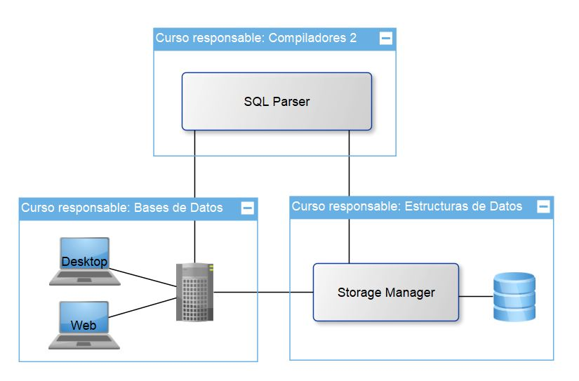

# Enunciado del Proyecto (FASE I)

Universidad de San Carlos de Guatemala  
Facultad de Ingeniería  
Cursos: 772 Estructuras de Datos | 774 Sistemas de Bases de Datos 1 | 781 Organización de Lenguajes y Compiladores 2  
Diciembre 2020

## Índice
- [Competencias del proyecto](#competencias-del-proyecto) 
- [Condiciones del proyecto](#condiciones-del-proyecto)
- [TytusDB](#tytusdb)
- [Administrador de almacenamiento](#administrador-de-almacenamiento)
- [Administrador de la base de datos](#administrador-de-la-base-de-datos)
- [SQL Parser](#sql-parser)
- [Reportes y entrega](#reportes-y-entrega)

## Competencias del proyecto

### Competencia general
- Poner en práctica los conocimientos teóricos adquiridos durante cada curso y aplicarlo a un proyecto real de código abierto fortaleciendo las competencias de administración de equipos de desarrollo.

### Competencias específicas
- El estudiante construye un intérprete para el subconjunto del lenguaje SQL mediante la traducción dirigida por la sintaxis.
- El estudiante utiliza la herramienta PLY o SLY de Python para la traducción.
- El estudiante proporciona una solución de estructuras de datos para gestionar la información de un sistema de bases de datos.
- El estudiante construye un servidor http y un cliente para que se conecten y accedan a las funciones definidas para el administrador de la base de datos.

## Condiciones del proyecto

### Equipos de desarrollo
Se formarán equipos de estudiantes con carné continuos por curso.

Cada curso tendrá una hoja de cálculo, en la carpeta compartida correspondiente, para informar acerca de los integrantes de cada equipo y así asignarles el tema de implementación. Además deben decidir quién será el coordinador de cada equipo.

### Lenguaje de programación

El lenguaje seleccionado es Python, y no deben utilizarse biliotecas adicionales si no hacen falta, por ejemplo, para compiladores 2 si deben utilizar PLY. Cualquier otra biblioteca debe ser autorizada por el catedrático.

### Licencias

El proyecto está diseñado por el catedrático bajo una licencia Open Source, específicamente MIT. Los estudiantes aparecerán como contribuidores junto con el copyright. Además cualquier biblioteca autorizada también se debe colocar la licencia y el copyright en el archivo LICENSE.md en su carpeta respectiva.

## TytusDB

Es un proyecto Open Source para desarrollar un administrador de bases de datos. Está compuesto por tres componentes interrelacionados: el administrador de almacenamiento de la base de datos, que estará a cargo del curso de Estructuras de Datos; el administrador de la base de datos, que estará a cargo del curso de Sistemas de Bases de Datos 1, este administrador se compone a su vez de un servidor y de un cliente; y el SQL Parser, que estará a cargo del curso de Organización de Lenguajes y Compiladores 2.

  

## Administrador de almacenamiento

Este componente es el encargado de gestionar el almacenamiento de las bases de datos, proporcionando al servidor un conjunto de funciones para extraer la información.

#### Modo de almacenamiento 

TytusDB tendrá cinco modos de almacenamiento, cada uno corresponde a un motor de la base de datos y cada estructura almacena una tabla. Cada modo será asignado a un equipo diferente para que lo desarrolle. Los modos de almacenamiento son los siguientes: 
1. Mediante un árbol AVL
2. Mediante un árbol B
3. Mediante un árbol B+
4. Mediante ISAM
5. Mediante tablas Hash.

#### Registros de almacenamiento

Cada registro que corresponde a una tupla de una tabla será almacenado en cada nodo o cada elemento de una página de las estructuras anteriores, según el modo de almacenamiento.

#### Bases de datos

Una base de datos es un conjunto de tablas, para este diseño, es un conjunto de estructuras arbóreas. El servidor de la base de datos podrá contener n bases de datos. Se deja a discreción de los estudiantes cómo manejar el conjunto de tablas de una base de datos y el conjunto de bases de datos. Se sugiere manejar los archivos de manera binaria para no exponer la información. 

#### Funciones

A continuación se muestran las funciones que deben estar disponibles para que los diferentes componentes del administrador puedan hacer uso de estas, respecto a las funciones de las bases de datos están: 

- createDatabase(mode, database): crea una base de datos con cierto modo de almacenamiento.
- showDatabases(): devuelve una lista de los nombres de las bases de datos, el nombre es único.
- alterDatabase(databaseOld, databaseNew): cambia el nombre de una base de datos.
- dropDatabase(database): elimina por completo la base de datos indicada.

Respecto de las funciones de las tablas están:
- createTable(database, tableName, numberColumns): crea una tabla según el modo de almacenamiento, la base de datos debe de existir, y solo se define el número de columnas.
- showTables(database): devuelve una lista de los nombre de las tablas de una base de datos, los nombre de tablas son únicos.
- alterTable(database, tableOld, tableNew): cambia el nombre de una tabla de una base de datos.
- dropTable(database, tableName): elimina por completo la tabla indicada.
- alterAdd(database, tableName, columnName): agrega una columna a cada registro de la tabla.
- alterDrop(database, tableName, columnNumber): elimina una n-esima columna de cada registro de la tabla.

Respecto de las funciones de las tuplas están:
- insert(database, table, columns): inserta un registro en la estructura de datos persistente, database es el nombre de la base de datos, table es el nombre de la tabla y columns es una lista de campos a insertar. Devuelve un True si no hubo problema, y un False si no se logró insertar.
- update(database, table, id, columnNumber, value): actualiza el valor de una columna x en un registro id de una tabla de una base de datos. Devuelve True si se actualizó correctamente y False si no se logró actualizar.
- deleteTable(database, tableName, id): elimina un nodo o elemento de página indicado de una tabla y base de datos especificada.
- truncate(database, tableName): vacía la tabla de todos los registros.

Respecto de la función de carga desde un archivo CSV:
- loadCSV(filecsv, database, table, [modo]): carga un archivo csv de un ruta especificada indicando la ruta de la base de datos y en qué tabla será guardada. Si la tabla existe verifica la cantidad de columnas, si no corresponde da error. Si la tabla no existe, la crea. Si la base de datos no existe, la crea con el modo especificado.

## Administrador de la base de datos

El administrador de la base de datos se compone de dos componentes:

- Servidor: es un servidor http. Se debe seleccionar un puerto adecuado que no tenga conflictos con otros servidores. En la carpeta de instalación de la base de datos se debe crear una carpeta llamada /data donde se almacenarán las bases de datos. Se debe crear un usuario admin y su contraseña. Además de crear n usuarios configurando el acceso a las bases de datos.

- Cliente: es un cliente que para algunos equipos será web y para otros será una aplicación de escritorio. Este cliente se conectará al servidor y podrá hacer la mayoría de operaciones que hace pgadmin de PostgreSQL, considerando las [Funciones](#funciones) básicas mencionadas anteriormente. Dentro del cliente, cuando se navegue dentro de las diferentes bases de datos que existen se puede invocar un editor de queries, el cual invocará la función parser() del SQL Parser para desplegar el resultado. Este editor debe tener la característica de resaltado de sintaxis.

Debe crearse el mecanismo para instalar tanto el servidor como el cliente en los sitemas operativos de Windows y Linux, dependiendo de la asignación del equipo.

Un ejemplo del cliente puede ser basado en el pgadmin de PostgreSQL:

  

Además, si alguna opción no es cubierta por las funciones del administrador de almacenamiento el administrador puede invocar consultas mediantes el SQL Parser para obtener funciones adicionales y cubrir opciones extras del administrador de bases de datos. Considerar la documentación del parser para cumplir con requisitos de tipos de datos y sintaxis en general.

## SQL Parser

Este componente proporciona al servidor una función encargada de interpretar sentencias del subconjunto del lenguaje SQL especificado en la siguiente [documentación](https://github.com/tytusdb/tytus/tree/main/docs/sql_syntax). 

El intérprete debe ser capaz de:

- Invocar las [Funciones](#funciones) proporcionadas por el almacenamiento, para realizar operaciones sobre la base de datos.

- Manipular el resultado de las funciones anteriores para restringir y mostrar los resultados indicados por la(s) consulta(s).

- Proporcionar la función parser(database, queries): esta función ejecuta y devuelve el resultado de la(s) consulta(s) sobre una base de datos, debe retornar una lista de listas con el resultado de la consulta. Si hay más de una consulta considerar la ejecución de consultas en PostgreSQL.

## Reportes y entrega

### Reportes para estructuras de datos
Los reportes a entregar son mediante GraphViz o cualquier herramienta gráfica de las estructuras de datos. Se puede limitar en segmentos para que sea visible la estructura, conforme un número de nodos y se ejecutarán mediante una función que el equipo determinará, al ejecutar dicha función debe abrirse una ventana para mostrar el resultado. Se sugiere que se muestre la estructura de las bases de datos, luego al hacer clic en alguna base de datos que muestre la estructura de las tablas, luego al hacer clic en una tabla que muestre la estructura de las tuplas y finalmente al hacer clic en un nodo que muestre la información de dicho nodo.

### Reportes para compiladores 2
Los reportes a entregar son los siguientes (mostrar el resultado en una ventana cuando sea ejecutada la funciones que invoquen a los reportes):
- Reportes de errores léxico, sintácticos y semánticos. Debe mostrar como mínimo el tipo, la descripción y el número de línea.
- Reporte de tabla de símbolos. Debe mostrar las variables, funciones y procedimientos con mínimo los siguientes datos: identificador, tipo, dimensión, declarada en, y referencias.
- Reporte de AST. Cuando se requiera, debe mostrar el árbol de sintaxis abstracta utilizando Graphviz en una nueva ventana que muestre solo la imagen o documento.
- Reporte gramatical. Se debe crear en la carpeta del equipo un archivo con Markdown que muestre la gramática con sintaxis BNF. En otro documento se debe mostrar la definición dirigida por la sintaxis, indicando que expresiones se utilizaron, precedencia, símbolos terminales y no terminales, y las reglas semánticas. Tomar en cuenta que no es el código escrito, sino es un reporte de explicación generado automáticamente, diferente del producto entregable del proyecto que es más enfocado a la construcción del intérprete. Este reporte está enfocado más a la ejecución específica.

### Reportes para bases de datos
Respecto del componente de este curso no se tendrán reportes, ya que mediante el cliente se podrán ejecutar las funciones solicitadas e incluso el resultado de consultas de SQL.

### Manual ténico y de usuario
En la carpeta del equipo se debe crear con Markdown un archivo de manual técnico y otro de manual de usuario. Se puede utilizar cualquier referencia bibliográfica para elaborar los manuales, se sugiere ver este [enlace](https://web.mit.edu/course/21/21.guide/docution.htm) del MIT.

### Consideraciones
- La entrega se realizará mediante commits a este repositorio, para cada equipo se le indicará su carpeta específica.
- La calificación se realizará de manera virtual (ya sea en meet o zoom) con las camaras activadas, cada calificación será almacenada.
- No se recibe ningún proyecto después de finalizada la entrega.
- Copias de proyectos obtendrán una nota 0, por lo que pierde automáticamente el laboratorio, se utilizará la herramienta JPlag https://jplag.ipd.kit.edu/
- Durante la calificación se verificará la autoría mediante preguntas, si no las responde se considera copia.
- Cualquier aclaración o modificación del proyecto se realizará mediante este documento, nadie excepto el catedrático puede modificar este archivo, si alguien lo modificará se tomarán acciones de anulación de proyecto.
- Los estudiantes al hacer un commit aceptan las condiciones, licencias y convenios relacionados con el fin del proyecto.

### Calificación
- El 30% del total de esta fase será evaluado mediante una hoja de calificación, la nota será grupal.
- El 30% del total de esta fase será evaluado mediante Stack Ranking de equipos con características similares, la nota será grupal. El proyecto del equipo ganador será utilizado como base de TytusDB y también para la segunda fase. 
- El 30% del total de esta fase será evaluado mediante el contenido y el total de commits aceptados mediante Stack Ranking por equipo, la nota será individual.
- El 10% del total de esta fase será evaluado mediante 1 pregunta y una modificación en el código, la nota será individual.

### Fecha de entrega
La fecha de entrega es el día sábado 19 de diciembre hasta las 11:59pm, se tomará el último commit válido.
