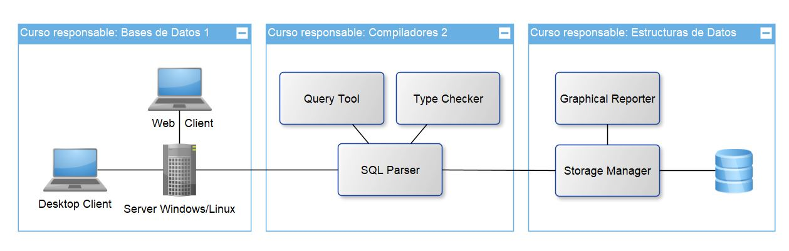

# Enunciado del Proyecto (FASE II)
*Versión de descripción general*

Universidad de San Carlos de Guatemala  
Facultad de Ingeniería  
Cursos: 772 Estructuras de Datos | 774 Sistemas de Bases de Datos 1 | 781 Organización de Lenguajes y Compiladores 2  
Diciembre 2020

## Índice
- [Competencias del proyecto](#competencias-del-proyecto) 
- [Condiciones del proyecto](#condiciones-del-proyecto)
- [TytusDB](#tytusdb)
- [Administrador de almacenamiento](#administrador-de-almacenamiento)
- [Administrador de la base de datos](#administrador-de-la-base-de-datos)
- [SQL Parser](#sql-parser)
- [Reportes y entrega](#reportes-y-entrega)

## Competencias del proyecto

### Competencia general
- Poner en práctica los conocimientos teóricos adquiridos durante cada curso y aplicarlo a un proyecto real de código abierto fortaleciendo las competencias de administración de equipos de desarrollo.

### Competencias específicas
- El estudiante construye un intérprete para el subconjunto del lenguaje SQL mediante la traducción dirigida por la sintaxis.
- El estudiante utiliza la herramienta PLY o SLY de Python para la traducción.
- El estudiante proporciona una solución de estructuras de datos para gestionar la información de un sistema de bases de datos.
- El estudiante construye un servidor http y un cliente para que se conecten y accedan a las funciones definidas para el administrador de la base de datos.

## Términos del proyecto

### Equipos de desarrollo

- Seguirán los mismos grupos de la fase 1 por curso, excepto aquellos que se desintegraron. 
- Además deben confirmar quién será el coordinador de cada equipo para agregar o modificar al coordinador como colaborador del repositorio para aceptar los commits. 

### Lenguaje de programación

El lenguaje seleccionado es Python, y no deben utilizarse bibliotecas adicionales si no hacen falta, por ejemplo, para compiladores 2 si deben utilizar PLY. Cualquier otra biblioteca debe ser autorizada por el catedrático.

### Licencias y convenio

El proyecto está diseñado por el catedrático bajo una licencia Open Source, específicamente MIT. Por convenio, los estudiantes aparecerán como contribuidores junto con el copyright. Además, cualquier biblioteca autorizada también se debe colocar la licencia y el copyright en el archivo LICENSE.md en su carpeta respectiva.

### Manejo de versiones

Cada integrante de los equipos debe hacer sus propuestas de cambio mediante pull request directamente al master de este repositorio (no hacer pull request de la rama de cada uno para evitar conflictos), queda a discreción de cada equipo utilizar de manera independiente una rama u otro repositorio para pruebas.

## TytusDB

Es un proyecto Open Source para desarrollar un administrador de bases de datos. Está compuesto por tres componentes interrelacionados: el administrador de almacenamiento de la base de datos, que estará a cargo del curso de Estructuras de Datos; el administrador de la base de datos, que estará a cargo del curso de Sistemas de Bases de Datos 1, este administrador se compone a su vez de un servidor y de un cliente; y el SQL Parser, que estará a cargo del curso de Organización de Lenguajes y Compiladores 2.

  

## Administrador de almacenamiento

La fase 2 de Estructuras de Datos consiste en desarrollar los siguientes requerimientos:

### 1. Unificación de modos de almacenamiento

En cuanto se haya calificado la fase 1, algunos grupos serán seleccionados para formar parte de los modos de almacenamiento o motores de las bases de datos TytusDB. Cada equipo en su carpeta asignada debe unificar los modos de los proyectos seleccionados para formar un solo storageManager que maneje los diferentes modos de almacenamiento (sin agregar de manera redundante los paquetes).

### 2. Administrador del modo de almacenamiento

El storageManager debe permitir cambiar el modo de almacenamiento de una base de datos en cualquier momento. Al suceder, si no hay ningun error, se debe construir la estructura de datos asociada al modo y eliminar la anterior.

### 3. Administración de índices

Mediante funciones se debe administrar los diferentes índices de una base de datos, entre los cuales figuran:
- creación, modificación y eliminación de llaves foráneas
- creación, modificación y eliminación de índices únicos
- creación, modificación y eliminación de índices

### 4. Administración de la codificación

Mediante funciones se debe seleccionar cualquiera de las siguientes codificaciones para una base de datos y poder modificarse:
- ASCII
- ISO 8859-1
- UTF8

### 5. Generación del Checksum

Mediante una función se debe calcular el Checksum de la base de datos, conforme lo hace SQL. Los dos algoritmos a utilizar son:
- MD5
- SHA256

### 6. Compresión de datos

Mediante funciones se debe ejecutar las operaciones de comprimir y descomprimir bajo las siguientes condiciones:
- compress y decompress en sentencias SQL
- compress y decompress BACKUP
- Administrar una COLUMNA de una tabla base de datos para ser comprimida (ejemplo varchar, text).

### 7. Seguridad

Los conceptos de seguridad se aplicarán en dos sub componentes:
- Criptografía: el storageManager debe proveer la manera de cifrar y descifrar ya sea una base de datos completa o también cifrar o descifrar una backup de una base de datos.
- BlockChain: el storageManager debe proveer un mecanismo para trabajar en modo seguro una tabla. Es decir, al activar el modo seguro de una tabla, cuando se realicen operaciones de inserción se debe ir creando bloques con sus respectivos valores Hash (esto almacenado en un archivo JSON), cuando algún bloque sea modificado o eliminado la cadena quedará incosistente y debe mostrarse de manera gráfica.

### 8. Grafos

El storageManager debe tener un paquete de generación de diagramas de estructuras de datos basado en GraphViz. Para esto se deben crear los siguientes grafos de dependencias:

- diagrama de estructura de datos: para mayor detalle ver este [enlace](http://citeseerx.ist.psu.edu/viewdoc/download?doi=10.1.1.172.3370&rep=rep1&type=pdf).
- diagrama de dependencias: este grafo muestra las dependencias funcionales que existen en una tabla específica.

## Administrador de la base de datos

Conforme a la arquitectura, el administrador de la base de datos debe ser capaz de interactuar con los conponentes indicados en la figura antes vista.

Se sugiere iniciar con el Query Tool, que para el inicio de esta fase se estará completando en el curso correspondiente.

## SQL Parser

La segunda fase del proyecto, en cuanto al parser de SQL, consiste en agregar los siguientes componentes:

- Índices: agregar al parser la administración de índices, la especificación está en el capítulo 11 de la documentación de PostgreSQL [Indexes](https://www.postgresql.org/docs/13/indexes.html)

- PL/pgSQL: agregar al parser el lenguaje procedural, la especificación está en el capítulo 42 de la documentación de PostgreSQL [PL/pgSQL — SQL Procedural Language](https://www.postgresql.org/docs/13/plpgsql.html)

- Traducción, optimización y ejecución de código: la ejecución del lenguaje PL/pgSQL se realizará mediante la traducción hacia un lenguaje intermedio basado en Python y que cumpla con las características del código de tres direcciones. El código generado debe ejecutarse desde Python para mostrar los resultados al administrador de bases de datos.

## Reportes y entrega

### Reportes para estructuras de datos
Los reportes de las estructuras utilizadas se deben mostrar mediante una aplicación de interfaz gráfica utilizando cualquier herramienta gráfica (que cumpla compatibilidades de licencia). 

De la fase 1, la aplicación debe mostrar de manera gráfica y navegable las siguientes estructuras:
- bases de datos
- conjunto de tablas 
- tabla
- tupla

Para la fase 2, se debe mostrar los dos grafos de dependencias y el blockchain.

### Reportes para compiladores 2
Los reportes por entregar son los siguientes (mostrar el resultado en una ventana cuando sea ejecutada la funciones que invoquen a los reportes):
- Reportes de errores léxico, sintácticos y semánticos. Debe mostrar como mínimo el tipo, la descripción y el número de línea.
- Reporte de tabla de símbolos. Debe mostrar las variables, funciones y procedimientos con mínimo los siguientes datos: identificador, tipo, dimensión, declarada en, y referencias.
- Reporte de AST. Cuando se requiera, debe mostrar el árbol de sintaxis abstracta utilizando Graphviz en una nueva ventana que muestre solo la imagen o documento.
- Reporte gramatical. Se debe crear en la carpeta del equipo un archivo con Markdown que muestre las dos gramáticas con sintaxis BNF. En otro documento se debe mostrar la definición dirigida por la sintaxis con la gramática seleccionada, indicando que expresiones se utilizaron, precedencia, símbolos terminales y no terminales, y las reglas semánticas. Tomar en cuenta que no es el código escrito, sino es un reporte de explicación generado automáticamente, diferente del producto entregable del proyecto que es más enfocado a la construcción del intérprete. Este reporte está enfocado más a la ejecución específica.
- Reporte de optimizaciones. Se debe mostrar en qué parte del código aplicó alguna optimización y qué tipo. Basarse en las optimizaciones indicadas en el libro de texto, tanto de bloques como de mirilla.

### Reportes para bases de datos
Respecto del componente de este curso no se tendrán reportes, ya que mediante el cliente se podrán ejecutar las funciones solicitadas e incluso el resultado de consultas de SQL.

### Manual técnico y de usuario
En la carpeta del equipo se debe crear con Markdown un archivo de manual técnico y otro de manual de usuario. Se puede utilizar cualquier referencia bibliográfica para elaborar los manuales, se sugiere ver este [enlace](https://web.mit.edu/course/21/21.guide/docution.htm) del MIT.

### Consideraciones
- La entrega se realizará mediante commits a este repositorio, para cada equipo se le indicará su carpeta específica.
- La calificación se realizará de manera virtual (ya sea en meet o zoom) con las cámaras activadas, cada calificación será almacenada.
- No se recibe ningún proyecto después de finalizada la entrega.
- Copias de proyectos obtendrán una nota 0, por lo que pierde automáticamente el laboratorio, se utilizará la herramienta JPlag https://jplag.ipd.kit.edu/
- Durante la calificación se verificará la autoría mediante preguntas, si no la responde se procederá a anular su nota del proyecto.
- Cualquier aclaración o modificación del proyecto se realizará mediante este documento, nadie excepto el catedrático puede modificar este archivo, si alguien lo modificará se tomarán acciones de anulación de proyecto.
- Los estudiantes al hacer un commit aceptan las condiciones, licencias y convenios relacionados con el fin del proyecto.
- Media vez los componentes sean funcionales, estos deben poder interactuar con cualquier otro componente de la arquitectura antes planteada. 
- En cuanto al almacenamiento y extracción de datos, se debe considerar únicamente la codificación UTF8.

### Calificación
- Un porcentaje será evaluado mediante una hoja de calificación (nota grupal).
- Un porcentaje será evaluado mediante Stack Ranking de equipos con características similares (el mejor obtiene la mejor nota). El proyecto del equipo ganador será utilizado como base de TytusDB y también para la segunda fase (nota grupal). 
- Un porcentaje será evaluado mediante el total de commits aceptados y la calidad de estos mediante Stack Ranking por equipo (nota individual).
- Un porcentaje será por calificación interna del equipo también por Stack Ranking por equipo (nota individual).
- Un porcentaje será evaluado mediante una pregunta o en su defecto modificación de código (nota individual).

### Fecha de entrega
La fecha de entrega es el miércoles 6 de enero hasta las 11:59pm, se tomará hasta el último commit aceptado.

