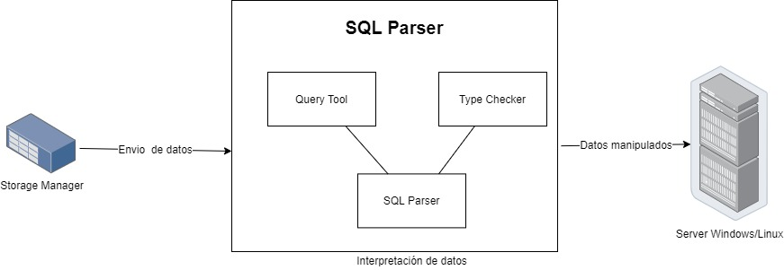

# MANUAL TECNICO
## Indice
- [Presentación](#Presentación)
- [Objetivos](#Objetivos)
    - [Objetivo General](#Objetivo-general)
    - [Objetivos Especificos](#Objetivos-especificos)
- [Requerimientos para el desarrollo](#Requerimientos-para-el-desarrollo)
- [Requerimientos del entorno](#Requerimientos-del-entorno)
- [Flujo del proyecto](#Flujo-del-proyecto)
    - [Componentes](#Componentes)
    - [Diagrama](#Diagrama)
- [Proyecto](#Proyecto)
--- 

## :computer: Presentación
Tytus DB un proyecto Open Source para desarrollar un administrador de bases de datos. Está compuesto por tres componentes interrelacionados: 
* Administrador de almacenamiento de la base de datos
* administrador de la base de datos: este administrador se compone a su vez de un servidor y de un cliente
* SQL Parser

Este proyecto se centra específicamente en el deasarrollo del componente SQL Parser.

## :mag_right: Objetivos 

### Objetivo general
* Desarrollo del componente SQL Parser.

## Objetivos específicos
* Generar un programa que cumpla la fase de análisis de un compilador.
* Creación de un compilador utilizando [PLY (Python Lex-Yacc)](https://www.dabeaz.com/ply/) 

* Análisis léxico, sintáctico y semántico de una variación de SQL

* Consumir librerías propias del proyecto

* Generación de reportes de la fase de análisis de un compilador

## :computer: Requerimientos para el desarrollo

El sistema donde se desea desarrollar debe de contar como mímino con: 

* [PLY (Python Lex-Yacc)](https://www.dabeaz.com/ply/) Incluido en este proyecto
* [Python 3](https://www.python.org/downloads/) Debe de instalarlo en su máquina.
* [Graphviz](https://graphviz.org/) Debe ser instalado en su máquina

## :computer: Requerimientos del entorno

Adicionalmente a los requerimiento para el desarrollo se debe tener acceso a las siguientes librerias
 - [jsonMode.py](https://github.com/tytusdb/tytus/blob/main/storage/storageManager/jsonMode.py)
- [numpy](https://pypi.org/project/numpy/)
- [tabulate](https://pypi.org/project/tabulate/)

Numpy y tabulate pueden ser instalados con los siguientes comandos respectivamente:
```python 
  pip install numpy && pip install tabulate
```

 

## :computer: Flujo del proyecto

El diagrama general del proyecto es [este](https://github.com/tytusdb/tytus/blob/main/docs/img/tytusdb_architecture_v2.jpg). 

### Componentes

El SQL Parser cuenta con 3 subcomponentes definidos: 
|Componente | Descripcion                               |
|-----------|-------------------------------------------|
|SQL Parser | Es el intérprete de sentencias de SQL, que proporcionará una función para invocar al parser, al recibir una consulta el parser luego del proceso interno y de la planificación de la consulta debe invocar las diferentes funciones proporcionadas por el componente de administrador de almacenamiento. Para más detalle podemos revisar la [documentación](https://github.com/tytusdb/tytus/tree/main/docs/sql_syntax) de la sitaxis.|
|Type Checker| Es un sub componente que ayudará al parser a la comprobación de tipos. Al crear un objeto cualquiera se debe crear una estructura que almacenará los tipos de datos y cualquier información necesaria para este fin.|
|Query Tool |Es un sub componente que consiste en una ventana gráfica similar al Query Tool de pgadmin de PostgreSQL, para ingresar consultas y mostrar los resultados, incluyendo el resalto de la sintaxis. La ejecución se realizará de todo el contenido del área de texto.|


### Diagrama

Los componentes anteriormente descritos interactuan de la siguiente manera:


## :computer: Proyecto
De manera general diremos que se ha implementado un patron de programación denominado [*Patron Intérprete*](https://reactiveprogramming.io/blog/es/patrones-de-diseno/interpreter).


De una forma muy general podemos destacar las siguientes carpetas y clases. 

* :page_facing_up: [ast_node.py](https://github.com/tytusdb/tytus/blob/main/parser/fase2/team03/parse/ast_node.py): Es la clase abstracta base para nuestro patrón intérprete. 

    Representa los nodos para nuestro árbol de sintaxis abstracta [AST](https://en.wikipedia.org/wiki/Abstract_syntax_tree).

    Para ello nos auxiliamos de el [módulo ABC](https://docs.python.org/3/library/abc.html) de Python. Este módulo proporciona la infraestructura para definir clases base abstractas(ABC) en Python.

    Esta clase cuenta con lo siguiente:
    * Atributos:
        * line : guarda el número de línea
        * column: guarda el número de columna
        * additioal_args: en caso de ser necesario acarrear algún argumento.
    * Método *execute*: Este método se implementa/ejecuta en cada instrucción y contiene las instrucciones
      para la ejecución del nodo de la gramática que representa.
    * Método *generate*: Este método se implementa/ejecuta en cada instrucción y contiene las instrucciones
      para la generación de código de 3 direcciones para la gramática que representa.

    
* :page_facing_up: [errors.py](https://github.com/tytusdb/tytus/blob/main/parser/fase2/team03/parse/errors.py) : Clase que permite instanciar errores de tipo lexico, sintáctico, semántico y en tiempo de ejecución.

* :page_facing_up: [symbol_table.py](https://github.com/tytusdb/tytus/blob/main/parser/fase2/team03/parse/symbol_table.py): Clase basada en una lista que permite la administración de los símbolos cargados por el sistema. Su unico atributo es *symbol*

    Los tipos de **symbol** que permite son: 
    * Database
    * Table
    * Field
    * Type
    * Index

    Esta clase provee de varios métodos para poder ingresar, eliminar o modificar los símbolos en tiempo de ejecución de la tabla símbolos.

* :page_facing_up: [treeGraph.py](https://github.com/tytusdb/tytus/blob/main/parser/fase2/team03/treeGraph.py):Clase que permite la generación de la gráfica del AST y del reporte gramatical que muestra la *definición dirigida por la sintaxis-DDS* en formato BNF.

    Hace uso de [Graphviz](https://graphviz.org/), el caul ya debe de estar instalado en la máquina para poder generar los reportes antes mencionados.


* :page_facing_up: [query_tool.py](https://github.com/tytusdb/tytus/blob/main/parser/fase2/team03/query_tool.py) : 
    Genera la intefaz para el usuario. Auxiliada por el módulo [tkinter](https://docs.python.org/3/library/tkinter.html) de Python, es la interfaz estándar de Python para el kit de herramientas Tk GUI.

* :page_facing_up: [grammarReview.py](https://github.com/tytusdb/tytus/blob/main/parser/fase2/team03/grammarReview.py): Analizador léxico y sintáctico basado en [PLY](https://www.dabeaz.com/ply/)
* :file_folder: [Carpeta parse](https://github.com/tytusdb/tytus/tree/main/parser/fase2/team03/parse): Proporciona las clases necesarias para el análisis sintáctico
    * :file_folder: [expressions](https://github.com/tytusdb/tytus/tree/main/parser/fase2/team03/parse/expressions): Conjunto de clases abastractas que herada de [ast_node.py](https://github.com/tytusdb/tytus/blob/main/parser/fase2/team03/parse/ast_node.py) para la ejecución de las expresiones enums, basicas de la gramática, funciones matemáticas y funciones trigonométricas

    * :file_folder: [functions](https://github.com/tytusdb/tytus/tree/main/parser/fase2/team03/parse/functions): Conjunto de clases abastractas que heredan de [ast_node.py](https://github.com/tytusdb/tytus/blob/main/parser/fase2/team03/parse/ast_node.py) para la ejecución de funciones agregadas, funciones de control y funciones para strings

    * :file_folder: [sql_common](https://github.com/tytusdb/tytus/blob/main/parser/fase2/team03/parse/sql_common/sql_general.py): Conjunto de clases abstractas que heredan de [ast_node.py](https://github.com/tytusdb/tytus/blob/main/parser/fase2/team03/parse/ast_node.py) para la ejecución de consultas básicas para SQL.
    
    * :file_folder: [sql_ddl](https://github.com/tytusdb/tytus/tree/main/parser/fase2/team03/parse/sql_ddl) : Conjunto de clases abstractas que heredan de [ast_node.py](https://github.com/tytusdb/tytus/blob/main/parser/fase2/team03/parse/ast_node.py) para la ejecución de sentencias DDL de SQL

    * :file_folder: [sql_dml](https://github.com/tytusdb/tytus/tree/main/parser/fase2/team03/parse/sql_dml):  Conjunto de clases abstractas que heredan de [ast_node.py](https://github.com/tytusdb/tytus/blob/main/parser/fase2/team03/parse/ast_node.py) para la ejecución de sentencias DML de SQL
    
    * :file_folder: [plpgsql](https://github.com/tytusdb/tytus/tree/main/parser/fase2/team03/parse/sql_dml):  Conjunto de clases abstractas que heredan de [ast_node.py](https://github.com/tytusdb/tytus/blob/main/parser/fase2/team03/parse/ast_node.py) para la ejecución de PL/pgSQL

* :file_folder: [Carpeta TAC](https://github.com/tytusdb/tytus/tree/main/parser/fase2/team03/TAC): Contiene el código necesario para optimización y escritura de código de 3 direcciones
    
    * :page_facing_up: [quadruple.py](https://github.com/tytusdb/tytus/tree/main/parser/fase2/team03/TAC/quadruple.py):  
      Conjunto de métodos que manejan código generado a modo de Cuadruple, además de reglas de optimización ejecutadas 
    
* :page_facing_up: [c3d_output.py](https://github.com/tytusdb/tytus/tree/main/parser/fase2/team03/c3d_output.py):  
Archivo generado con el código de 3 direcciones resultante
* :page_facing_up: [wrapper.py](https://github.com/tytusdb/tytus/tree/main/parser/fase2/team03/wrapper.py):  
Archivo que empaqueta la funcionalidad del parser para ejecución de 3 direcciones, de modo que el archivo c3d_output.py
  debe estar en este mismo directorio para funcionar correctamente.
        