# MANUAL DE USUARIO - SQL Parser

## Indice
- [Presentación](#:computer:-Presentación)
- [Requerimientos del sistema](#:computer:-Requerimientos-del-sistema)
- [SQL Parser](#:computer:-SQL-Parser)
- [Ejecución](#:arrow_forward:-Ejecución)
- [Interfaz](#:mag_right:-Interfaz)
    - [File](#File)
    - [Run](#Run)
    - [Reports](#Reports)
    - [Help](#Help)
- [Reportería](#:bookmark_tabs:-Reportería)
    - [Tabla de símbolos](#Tabla-de-símbolos)
    - [Reporte de errores](#Reporte-de-errores)
    - [Reporte AST](#Reporte-AST)
    - [Reporte gramatical](#Reporte-gramatical)

---

## :computer: Presentación
Tytus DB un proyecto Open Source para desarrollar un administrador de bases de datos. Está compuesto por tres componentes interrelacionados: 
* Administrador de almacenamiento de la base de datos
* administrador de la base de datos: este administrador se compone a su vez de un servidor y de un cliente
* SQL Parser

Este proyecto se centra específicamente en el deasarrollo del componente SQL Parser.

Para poder hacer uso del SQL Parser te presentamos los requerimientos mínimos del sistema donde se correrá el programa y una guía para navegar en la aplicación.

## :computer: Requerimientos del sistema
 ### Software
 Su máquina debe de contar con la instalación física de: 
* [Python 3](https://www.python.org/downloads/) 
* [Graphviz](https://graphviz.org/) 

* Sistema Operativo: Independiente

### Hardware

RAM: Minimo 4GB

Procesador: Minimo 2 núcleos de 

## :computer: SQL Parser

Este es un un componente de [TytusDB](https://github.com/tytusdb) que se encarga del interpretar sentencias SQL que se le ingresan en el Query Tool y genera salidas con datos/archivos manipulados por las sentencias.

A continuación te detallamos el uso del Query Tool del SQL Parser.

## :arrow_forward: Ejecución
 Descarga el pruyecto del prepositorio de [TytusDB](https://github.com/tytusdb). Posicionate en la ruta de la carpeta *~\tytus\parser\team03*

 Puede ejecutarse de dos maneras. 
 1. Directamente en consola del sistema. Busca el archivo [query_tool.py](https://github.com/tytusdb/tytus/blob/main/parser/team03/query_tool.py) y dale click derecho, luego selecciona la opción *Abrir con* y selecciona *Python*.
    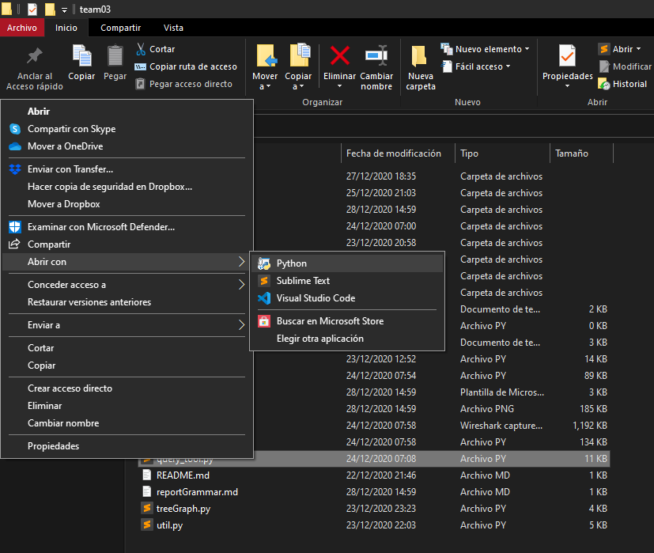

 2. Utilizando un IDE (Para este ejemplo usaremos el editor [Visual Studio Code](https://code.visualstudio.com/)). Te situas en la ruta antes mencionada y ejecutas el comando *python query_tool.py*
    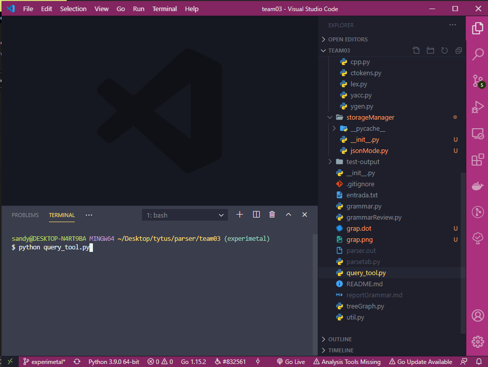

## :mag_right: Interfaz 
Al inicio se te mostrará una ventana como esta: 
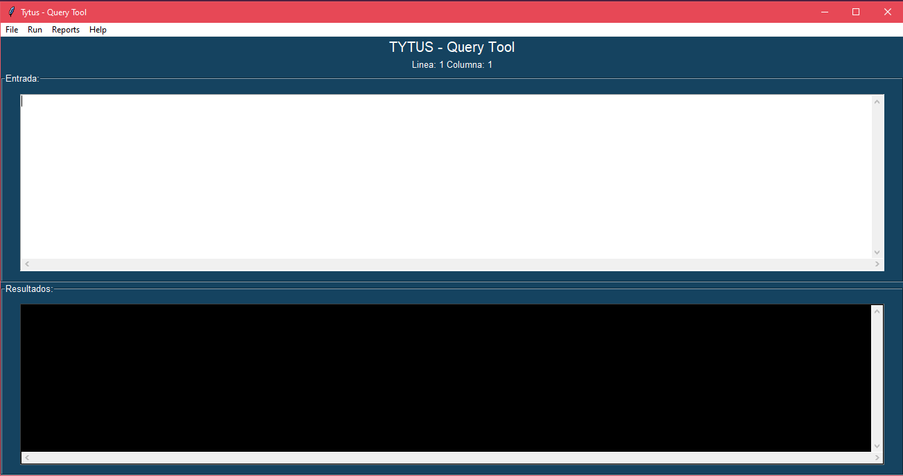

### Áreas

La interfaz cuenta con 3 áreas principales:
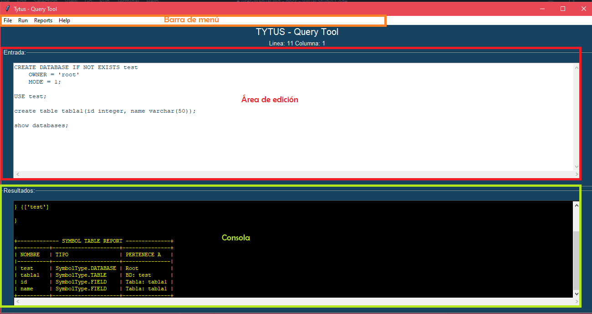

* **Barra de menú:** Cuenta con los menú plegables que se detallan más adelante como: File, Run, Reports y Help

* **Área de edición:** En esta área es donde se ingresan las consultas SQL a interpretar. Cuenta con un lector de cursor en la parte superior que nos dice donde está el cursor.

* **Consola:** Área donde se muestran los resultados de las consultas ingresadas y ejecutadas  del área de edición.

### File
Menú que permite el control gráfico para el manejo de archivos a analizar.

Entre sus opciones esta:
- **New:** Limpia el área de edicion y consola.
- **Open file:** Permite abrir un file chooser para seleccionar un archivo te texto y poner su contenido en el área de edición.
- **Save:** Permite guardar en el archivo abierto los cambios realizados en el área de texto 
- **Save As...:** Permite seleccionar una nueva ubicación para guardar un archivo con el contenido del área de texto, que puede que sea un archivo nuevo o uno que se abrió previamente.
- **Exit:** Cierra el programa.

    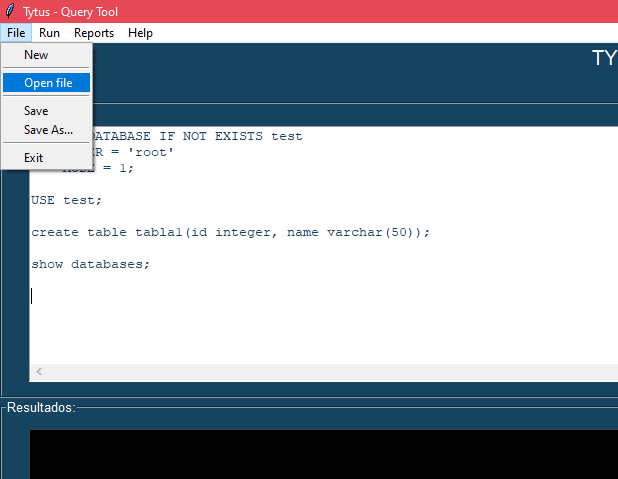

### Run
Este menú cuenta con solo una opción: 
- **Run:** Ejecuta la interpretacioón de las sentencias SQL que se encuentran en el área de texto. Al terminar el análisis genera salidas en el área de consola.
- **Generate:** Genera el código de 3 direcciones para la entrada que se encuentra en el área de texto.
- **Clear Execution:** Elimina datos almacenados de corridas anteriores para la generación de código.
    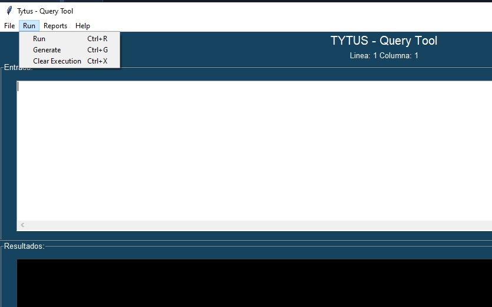
  
### Reports 
Permite tener acceso a diversos reportes, como se detalla en el apartado de [Reportería](#:bookmark_tabs:-Reportería). Las opciones que proporciona son: 
- Symbol Table
- Errors
- AST
- DDS
- Asc Grammar
- Desc Grammar
- Grammar Análisis
- Optimización código 3D

    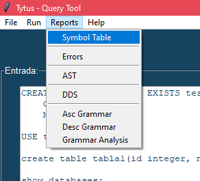

### Help
Da acceso a 2 rubros:

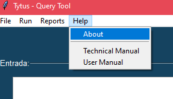
1.  **About:** Muesta una ventana con los datos generales del proyecto y sus coautores.
        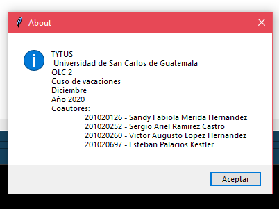

2. **Manuales:** Son accesos directos a el Manual técnico y Manual de Usuario

## :bookmark_tabs: Reportería
Para el SQL Parser se dan los siguientes tipos de reportes:

- ### Tabla de símbolos
En consola muestra un reporte de los símbolos cargados duran te la ejecución. Muestra atributos como Nombre, Tipo y a quien pertenece un simbolo.

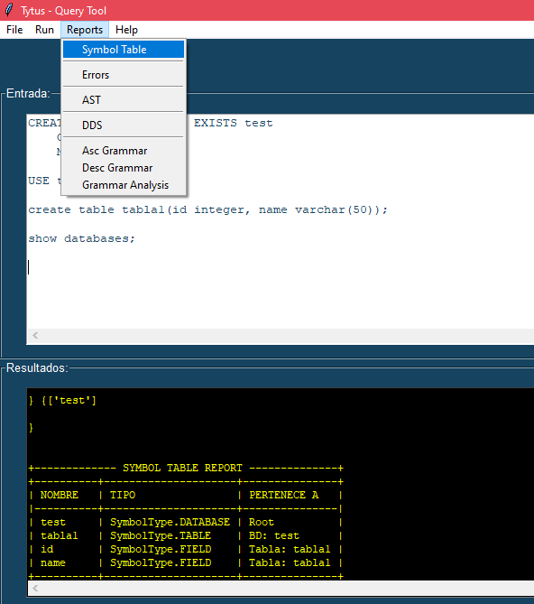

- ### Reporte de errores
En el área de consola se mienstra un listo de errores léxicos, sintácticos y semánticos. También se muestran los errores en tiempo de ejecución. Muestra atributos como línea, columna, tipo de error y una pequeña descripción.

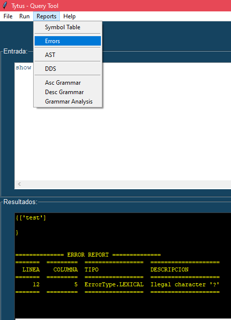

- ### Reporte AST
Muestra la imagen de el árbol de sintaxis abstracta - ast en un visor de imágenes.

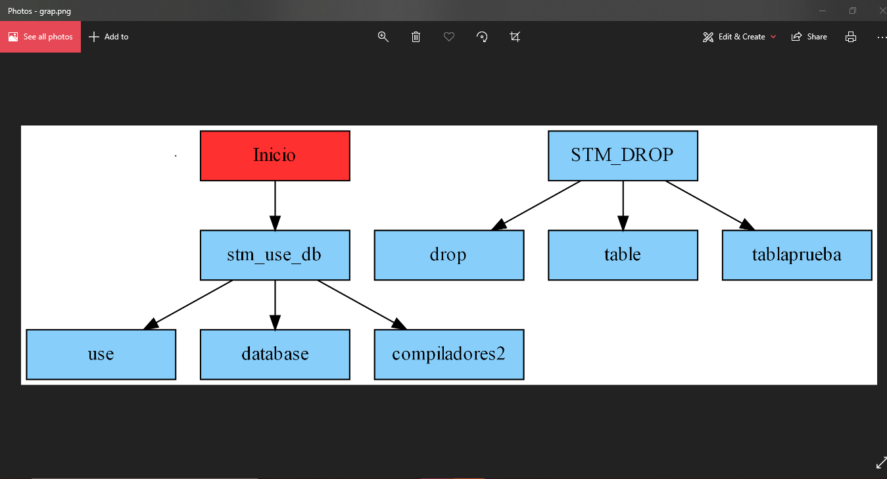

- ### Reporte gramatical
Acá tenemos 4 tipos de reportes en archivos Markdown al que se tiene acceso directo:
1. **DDS:** Reporte de la Definición Dirigida por la Sintaxis en [BNF](https://es.wikipedia.org/wiki/Notaci%C3%B3n_de_Backus-Naur) generado durante la ejecución del intérprete. Se genera cada vez que se ejecuta la opción Run.
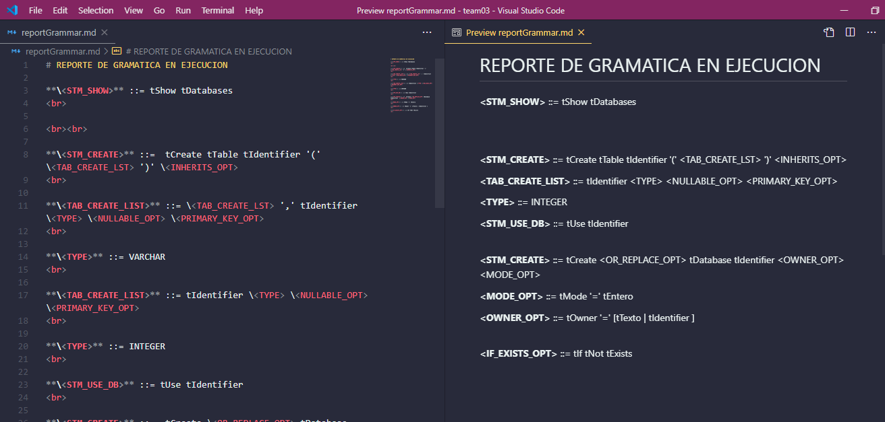
2. **Asc Grammar:** Muestra la gramática ascendente en BNF.

3. **Desc Grammar:** Muestra la gramática descendente en BNF.

4. **Grammar Análisis:** Justificaciones de la elección de la gramática ascenente.

- ### Reporte Optimizaciones código 3D
Muestra en el área de consola las optimizaciones realizadas al código de 3 direcciones.