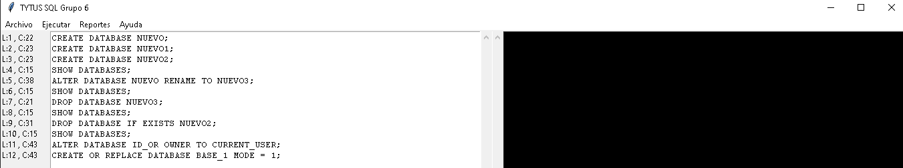
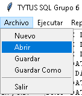
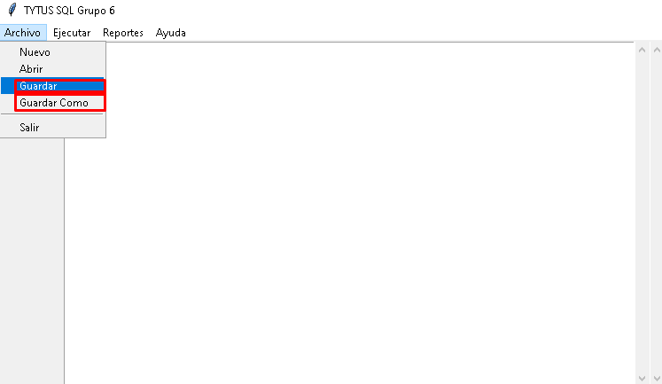
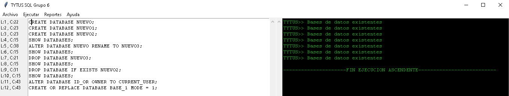
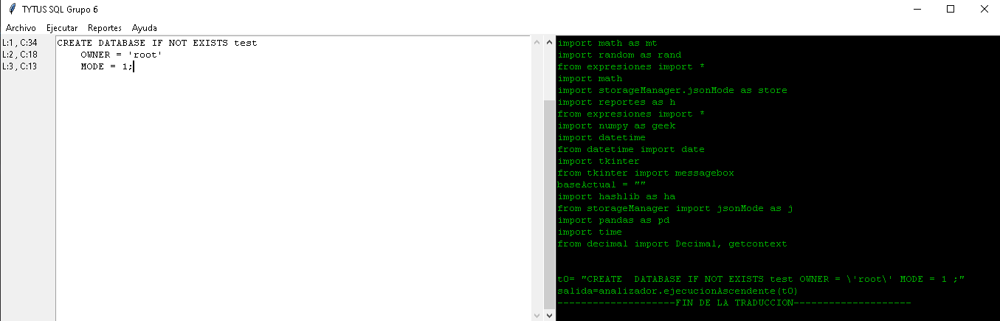
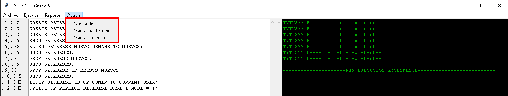
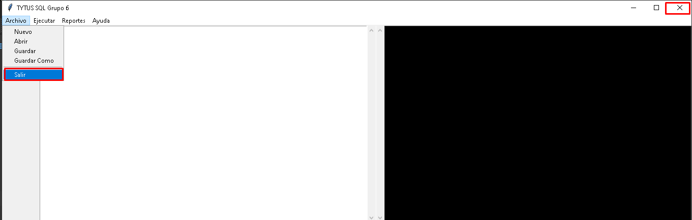



# Manual de Usuario - Parser (TytusDB-Fase2)
### Grupo 6
<b>Juan Pablo García Monzon - 2012-22615<br>
Jossie Bismarck Castrillo Fajardo 2013-13692<br>
Byron David Cermeno Juarez 2013-13734<br>
Hayrton Omar Ixpata Coloch 2013-13875<br></b>

## Este proyecto necesita estos requerimientos para funcionar

* Navegador (Chrome, Edge, etc)

* Windows 10, Linux, Mac

* 1GB de RAM

* Python

## Estas librerias de Python son necesarias para correr el proyecto:<br>
```python
1. os
2. sys
3. webbrowser
4. tkinter
5. Enum
6. platform
7. re
```

## Flujo del proyecto
* Primero tener el conocimiento que este parser es para analizar un lenguaje de tipo SQL.

* Para esta primera fase no se ha implementado lo que es un ejecutable del proyecto por lo que todavía se ejecuta el archivo "ventana.py" para empezar.
<br>


* Se pone una cadena de texto para analizar en el área de texto de fondo blanco, se puede copiar y pegar una cadena o utilizar el botón de "Abrir" que se ubica en el menú "Archivo".
<br>
<br>

* Se puede utilizar la opción "Guardar" o "Guardar Como"que se ubica en el menú "Archivo" para guardar una cadena que no se ha abierto de un archivo creado previamente.
<br>


* Al analizar la cadena de texto saldrá una respuesta en la consola, área de texto con fondo negro.
<br>
<br>

* Al analizar la cadena de texto saldrá una respuesta en la consola, área de texto con fondo negro.
<br>
<br>

* Ahora también se puede traducir a código 3D y ejecutar también el código correspondente de esa traducción
<br>
<br>


* Se pueden ver todos los reportes generados como "Reporte Gramatical, Reporte de Errores, Reporte de Tabla de Simbolos, Reporte de AST".
<br>


* Si necesita un flujo mas visual se puede ver el manual de usuario en el menú "Manuales" donde se puede visualizar "Manual de Usuario y Manual Técnico".
<br>

* Para poder salir del programa se puede usar la opción "Salir" ubicada en el menú "Archivo" o dar click en el botón "X".
<br>
