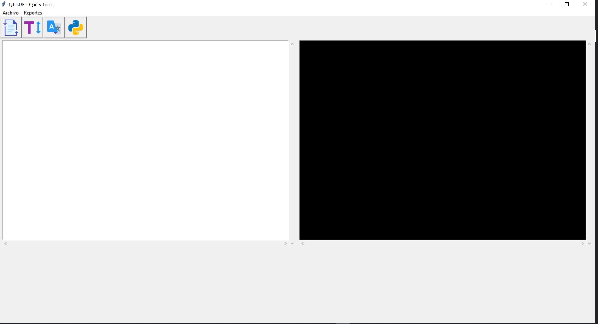
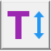
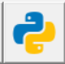
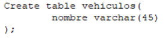

# Manual De Usuario

### Introduccion

En el siguiente documento se redacta el funcionamiento correcto de un nuevo administrador de base de datos llamado "Tytus" el cual cumple con una amplia variedad de funciones y poder extraer la información de una base de datos o ingresar nueva información.

### Interfaz De Usuario

La interfaz de usuario cuenta con las siguientes funcionalidades:

###### Barra de tareas

- **Analizar Entrada:** Permite analizar todo el texto de entrada ingresado en el area de edicion y analiza cada instruccion y la ejecuta.

- **Ejecutar Instrucion:** Permite unicamente analizar el texto seleccionado y ejecuta la instrucción.

- **Traducir:** Traduce el texto de entrada a codigo tres direcciones permitiendo ver el resultado de la traduccion en la consola del lado derecho de la interfaz.

- **Ejecutar:** Ejecuta el codigo tres direcciones una vez que ha sido transformado, realizando todas las funciones que ofrece la base da datos.

###### Archivo

- **Analizar:** Permite analizar todo el texto que se ha ingresado en el area de edicion y analiza cada instrucción y la ejecuta. 

- **Analizar Query:** Permite unicamente analizar el texto seleccionado y ejecuta la instrucción.

- **Exit:** Cierra la aplicación.

###### Reportes
- **Tabla de Simbolos:** Muestra las definiciones de las tablas ingresadas en la base de datos, mostrando la fila y columna en la que se encuentra y el ambito en el que se encuentra.

- **Tabla de Tipos:** Muestra las deficiones de cada columna de una tabla haciendo referencia a todos sus atributos, como el tipo de variable, tamaño, y a que tabla pertenece.

- **AST:** es una representación grafica del recorrido de estructura sintactica, cada nodo del arbol muestra una producción del lenguaje utilizado.

- **Errores:** muestra los errores encontrados en el texto de entrada identificando el tipo de error y en que linea y columna ocurren.

#### Funcionalidad

La interfaz cuenta con un area de texto, en ella se podran colocar sentencias del lenguaje SQL, de forma que cada una cumplira una función en especifico, por ejemplo:

- Crear una nueva base de datos
- Consultar datos de una tabla
- Eliminar una Tabla
- Modificar datos de una Tabla
- Etc.

Al ingresar a la siguiente instrucción el administrador de base de datos creara una nueva tabla en la base de datos.

La salida al escribir esta instruccion de forma correcta, mostrara el siguiente mensaje:

Para mayor información de la sintaxis correcta del lenguaje visite el siguiente enlace.

- https://github.com/tytusdb/tytus 