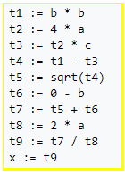
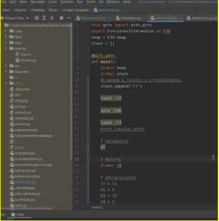
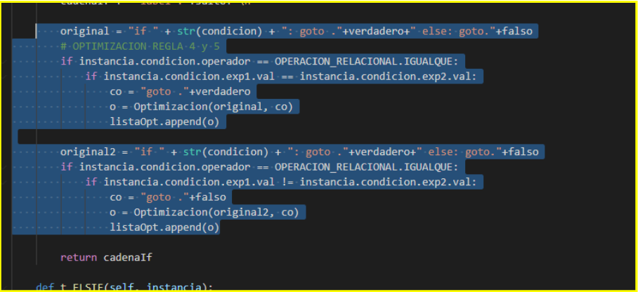
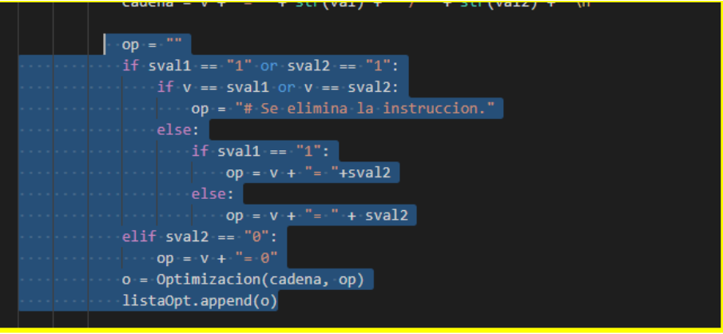
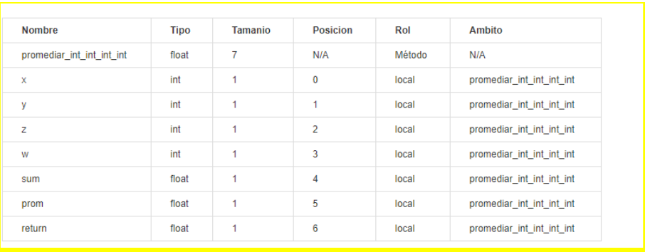
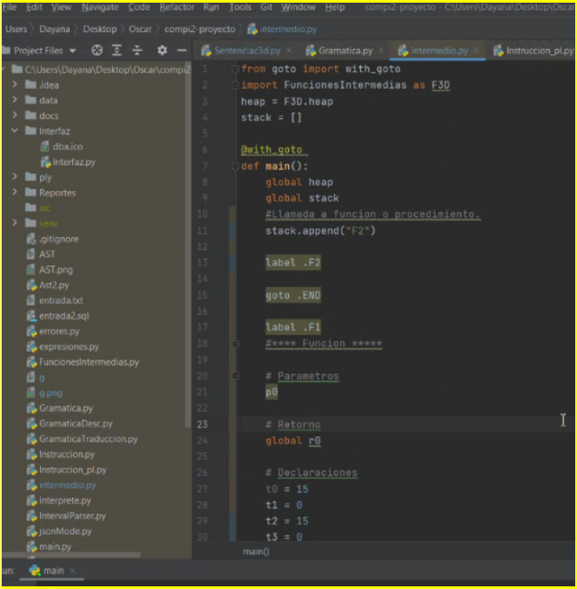

# Manual Tecnico

## Introduccion
Como estudiantes de la facultad de ingenieria de ciencias y sistemas y aplicando nuestros conocimientos, con las diferentes herramientas tales como Python, diferentes bibliotecas, PLY, entre otras se creara el proyecto llamado Tytus el cual es un proyecto Open Source para desarrollar un administrador de bases de datos. Está compuesto por tres componentes interrelacionados: el administrador de almacenamiento de la base de datos, que estará a cargo del curso de Estructuras de Datos; el administrador de la base de datos, que estará a cargo del curso de Sistemas de Bases de Datos 1, este administrador se compone a su vez de un servidor y de un cliente; y el SQL Parser, que estará a cargo del curso de Organización de Lenguajes y Compiladores 2.

## Tecnologias
Sistema Operativo: Windows 10
LTS Lenguaje de Programación: Python Versión de Python: 3.5.4 
IDE: Visual Studio Code 
Gráficas: graphviz PyPI 

## Construccion del Analizador
Aplicando nuestros conocimientos y empleando diferentes herramientas se implemento lo que es la construcción del analizador por medio de:
PLY:  es una herramienta de análisis escrita exclusivamente en Python . Es, en esencia, una reimplementación de Lex y Yacc originalmente en lenguaje C . Fue escrito por David M. Beazley . PLY utiliza la misma técnica de análisis sintáctico LALR que Lex y Yacc, la estructur de la misma es
- PLY.LEX (analizador lexico)
- PLY.YACC (analizador sintactico)

## Definicion del Analizador Lexico
Es la primera fase de un compilador, consistente en un programa que recibe como entrada el código fuente de otro programa (secuencia de caracteres) y produce una salida compuesta de tokens (componentes léxicos) o símbolos. Estos tokens sirven para una posterior etapa del proceso de traducción, siendo la entrada para el analizador sintáctico (en inglés parser).

## Tokens
La especificación de un lenguaje de programación a menudo incluye un conjunto de reglas que definen el léxico. Estas reglas consisten comúnmente en expresiones regulares que indican el conjunto de posibles secuencias de caracteres que definen un token o lexema. A continuación se presentara la captura de algunos tokens declarados.

  

## Palabras Reservadas
En los lenguajes informáticos, una palabra reservada es una palabra que tiene un significado gramatical especial para ese lenguaje y no puede ser utilizada como un identificador de objetos en códigos del mismo, como pueden ser las variables.

Por ejemplo, en SQL, un usuario no puede ser llamado "group", porque la palabra group es usada para indicar que un identificador se refiere a un grupo, no a un usuario. Al tratarse de una palabra clave su uso queda restringido.

  

## Manejo de Errores Lexicos
Los errores léxicos se detectan cuando el analizador léxico intenta reconocer componentes léxicos y la cadena de caracteres de la entrada no encaja con ningún patrón. Son situaciones en las que usa un carácter inválido (@, $,",>,...), que no pertenece al vocabulario del lenguaje de programación

  

## Construccion Analizador Lexico
Empleando las herramientas adecuadas se procede a crear el analizador léxico como se muestra a continuación.

  

## Deficion Analizador Sintactico
Un analizador sintáctico (parser) o simplemente analizador, es un programa informático que analiza una cadena de símbolos de acuerdo a las reglas de una gramática formal. El término proviene del latín pars, que significa parte (del discurso). Usualmente hace uso de un compilador, en cuyo caso, transforma una entrada en un árbol sintáctico de derivación.

## Patron Interprete
El intérprete es un patrón de diseño que, dado un lenguaje, define una representación para su gramática junto con un intérprete del lenguaje.
Se usa para definir un lenguaje para representar expresiones regulares que representen cadenas a buscar dentro de otras cadenas. Además, en general, para definir un lenguaje que permita representar las distintas instancias de una familia de problemas.

## Clases

### Instruccion
Se implementó una clase llamada instrucción la cual nos permite ejecutar en una segunda pasada todo el contenido o bien la entrada que se le da a nuestro programa, ejecutando así cada uno de los comandos.

### AST2
Se implementó esta clase para la acción de recorrer el árbol AST con la finalidad de graficar cada uno de los nodos así mismo recorriendo para su interpretación.

### Interprete
Se implementó con la finalidad de ir recorriendo cada una de las instrucciones y efectuar su ejecución asi mismo llamando a la clase instrucción la cual es complemento de esta.

### Expresion
Se implementó para el manejo de objetos la cual cada comando cuenta con un objeto diferente

## Definicion de la Gramatica
A continuación se demuestra la definición de un segmento de gramática Ascendente la cual se implemento para el análisis con la gramática de las diferentes instrucciones que nuestro compilador interpreta.

  

## Construccion del AST
s una representación de árbol de la estructura sintáctica simplificada del código fuente escrito en cierto lenguaje de programación. Cada nodo del árbol denota una construcción que ocurre en el código fuente. La sintaxis es abstracta en el sentido que no representa cada detalle que aparezca en la sintaxis verdadera.
Por lo cual el mismo árbol se compone de todas las instrucciones la cual se van a ejecutar.

## Asignacion de Reglas Semanticas
Las reglas son las diferentes formas que tiene Síntesis de detectar un patrón lingüístico, un tema/atributo o el sentimiento. Son una representación del lenguaje para simplificarlo y quedarnos con lo relevante y que además permiten procesar millones de comentarios en tiempo real.
Aplicando las mismas observamos un segmento de nuestra gramática aplicando las mismas.

  

## Recuperacion de Errores
Es indispensable la recuperación de errores en dado caso se intervenga o se obtenga uno el programa o compilador será capaz de seguir ejecutándose sin ningún problema.

## Analizar
Por lo tanto es necesario llamar a nuestro parse con una cadena de entrada la cual se enviará a analizar a continuación detallamos el proceso de llamar a nuestro pase.

  

## Codigo de 3 Direcciones

En ciencias de la computación, el código de tres direcciones es un lenguaje intermedio usado por compiladores optimizadores para ayudar en las transformaciones de mejora de código. Cada instrucción TAC tiene a lo sumo tres operandos y es típicamente una combinación de asignación y operador binario. Por ejemplo, t1 := t2 + t3. El nombre proviene del uso de tres operandos en estas declaraciones aunque instrucciones con menos operandos pueden existir.

Dando como un ejemplo nuestro código 3 direcciones al igual la generacion del codigo 3 direcciones de una función o expresión

x = (-b + sqrt(b^2 - 4*a*c)) / (2*a)

  

  

### Optimizacion

La aplicación cuenta con una optimizacion de codigo 3 direcciones, la cual se bazo en la optimización de mirilla

Optimización de mirilla:
El método de mirilla consiste en utilizar una ventana que se mueve a través del código de 3 direcciones, la cual se le conoce como mirilla, en donde se toman las instrucciones dentro de la mirilla y se sustituyen en una secuencia equivalente que sea de menor longitud y lo más rápido posible que el bloque original. El proceso de mirilla permite que por cada optimización realizada con este método se puedan obtener mejores beneficios. El método de mirilla consiste en utilizar una ventana que se mueve a través del código de 3 direcciones, la cual se le conoce como mirilla, en donde se toman las instrucciones dentro de la mirilla y se sustituyen en una secuencia equivalente que sea de menor longitud y lo más rápido posible que el bloque original. El proceso de mirilla permite que por cada optimización realizada con este método se puedan obtener mejores beneficios. 

Los tipos de transformación para realizar la optimización por mirilla serán los siguientes: 
- Eliminación de instrucciones redundantes de carga y almacenamiento. 
- Eliminación de código inalcanzable.  
- Optimizaciones de Flujo de control. 
- Simplificación algebraica y reducción por fuerza.

A continuación se detallaran a grandes rasgos cada una de las reglas empleadas.

| Reglas. | Descripcion  |
| :------------- | :----------: | 
| REGLA 1 | Si existe una asignación de valor de la forma a = b y posteriormente existe una asignación de forma b = a, se eliminará la segunda asignación siempre que a no haya cambiado su valor. Se deberá tener la seguridad de que no exista el cambio de valor y no existan etiquetas entre las 2 asignaciones   | 
| REGLA 2  | Si existe un salto condicional de la forma Lx y exista una etiqueta Lx:, todo código contenido entre el goto Lx y la etiqueta Lx, podrá ser eliminado siempre y cuando no exista una etiqueta en dicho código. | 
| REGLA 3  | Si existe un alto condicional de la forma if goto Lv; goto Lf; inmediatamente después de sus etiquetas Lv: Lf: se podrá reducir el número de saltos negando la condición, cambiando el salto condicional hacia la etiqueta falsa Lf: y eliminando el salto condicional innecesario a goto Lf y quitando la etiqueta Lv. |
| REGLA 4  | Si se utilizan valores constantes dentro de las condiciones de la forma if goto Lv; goto Lf; y el resultado de la condición es una constante verdadera, se podrá transformar en un salto incondicional y eliminarse el salto hacia la etiqueta falsa Lf |
| REGLA 5  | Si se utilizan valores constantes dentro de las condiciones de la forma if goto Lv; goto Lf; y el resultado de la condición es una constante falsa, se podrá transformar en un salto incondicional y eliminarse el salto hacia la etiqueta verdadera Lv. |
| REGLA 6  | Si existe un salto incondicional de la forma goto Lx donde existe la etiqueta Lx: y la primera instrucción, luego de la etiqueta, es otro salto, de la forma goto Ly; se podrá realizar la modificación al primer salto para que sea dirigido hacia la etiqueta Ly: , para omitir el salto condicional hacia Lx. |
| REGLA 7  | Si existe un salto incondicional de la forma if goto Lx; y existe la etiqueta Lx: y la primera instrucciones luego de la etiqueta es otro salto, de la forma goto Ly; se podrá realizar la modificación al primer salto para que sea dirigido hacia la etiqueta Ly: , para omitir el salto condicional hacia Lx. |
| REGLA 8  | Eliminación de etiquetas innecesarias tal como:  x = x + 0;  |
| REGLA 9  | Eliminación de etiquetas innecesarias tal com:  x = x - 0;   |
| REGLA 10 | Eliminación de etiquetas innecesarias tal com:  x = x * 1;   |
| REGLA 11 | Eliminación de etiquetas innecesarias tal com:  x = x / 1;   |
| REGLA 12 | Reducción de etiquetas tales como: x = y + 0; x = y;         |
| REGLA 13 | Reducción de etiquetas tales como: x = y - 0; x = y;         |
| REGLA 14 | Reducción de etiquetas tales como: x = y * 1; x = y;         |
| REGLA 15 | Reducción de etiquetas tales como: x = y / 1; x = y;         |
| REGLA 16 | Reducción de etiquetas tales como: x = y * 2; x = y + y;     |
| REGLA 17 | Reducción de etiquetas tales como: x = y * 0; x = 0;         |
| REGLA 18 | Reducción de etiquetas tales como: x = 0 / y; x = 0;         |

A Continuación unas capturas de la parte de codificación de optimización en las cuales como podremos ver se genera un objeto de tipo optimización para la generación de un reporte el cual adjuntamos una imagen del mismo en el manual de usuario.

  

  

### Tabla de Simbolo Codigo 3D

La aplicación cuenta con una tabla de símbolos dedicada a la traducción de 3 direcciones la cual nos almacena información importante para poder traducir y llevar el control de todas las etiquetas y saltos que se manejan al momento de la traducción.

  

### Traduccion 3D

La aplicación cuenta con la traducción de código PLSQL a código 3 direcciones, la cual se genera en un archivo .PY el cual contiene todas las instrucciones traducidas y listas para ejecutarse.

  

### Ejecucion 3D

La aplicación cuenta con la opción de ejecución de la traducción obtenida, la cual se detallo con anterioridad.

### Sentencias Y Lenguaje PL/SQL

Este lenguaje está basado en ADA, por lo que incluye todas las características de los lenguajes de tercera generación. Esto nos permite manejar las variables, tener una estructura modular (procedimientos y funciones) y controlar las excepciones. Además incorpora un completo soporte para la programación orientada a objetos (POO).
Los programas creados con PL/SQL los podemos almacenar en nuestra base de datos como cualquier otro objeto quedando disponibles para los usuarios. El uso del lenguaje PL/SQL es imprescindible para construir disparadores de bases de datos (triggers).
PL/SQL esta incluido en el servidor y en algunas herramientas de cliente. Soporta todos los comandos de consulta y manipulación de datos, aportando al lenguaje SQL las estructuras de control y otros elementos propios de los lenguajes de programación de 3º generación. La unidad de trabajo en PL/SQL es el bloque, constituido por un conjunto de declaraciones, instrucciones y mecanismos de gestión de errores y excepciones.

En necesario destacar que nuestra aplicación será capaz de traducir este lenguaje a 3 direcciones algunas funciones generadas son:
1. Sentencia If
2. Sentencia Case
3. Procedimientos, métodos y funciones
4. Declaraciones
5. Asignaciones
6. Expresiones
7. Condicionales 

