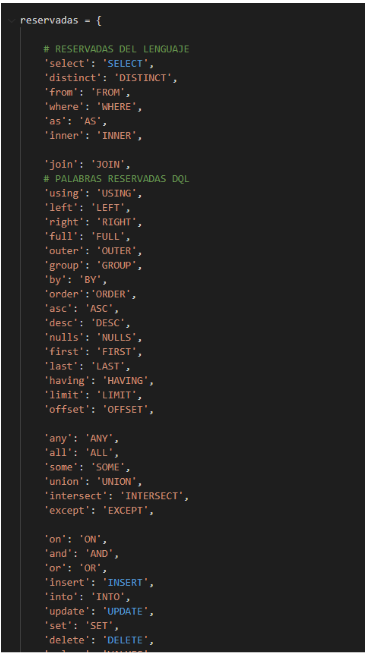

# Manual Tecnico

## Introduccion
Como estudiantes de la facultad de ingenieria de ciencias y sistemas y aplicando nuestros conocimientos, con las diferentes herramientas tales como Python, diferentes bibliotecas, PLY, entre otras se creara el proyecto llamado Tytus el cual es un proyecto Open Source para desarrollar un administrador de bases de datos. Está compuesto por tres componentes interrelacionados: el administrador de almacenamiento de la base de datos, que estará a cargo del curso de Estructuras de Datos; el administrador de la base de datos, que estará a cargo del curso de Sistemas de Bases de Datos 1, este administrador se compone a su vez de un servidor y de un cliente; y el SQL Parser, que estará a cargo del curso de Organización de Lenguajes y Compiladores 2.

## Tecnologias
Sistema Operativo: Windows 10
LTS Lenguaje de Programación: Python Versión de Python: 3.5.4 
IDE: Visual Studio Code 
Gráficas: graphviz PyPI 

## Construccion del Analizador
Aplicando nuestros conocimientos y empleando diferentes herramientas se implemento lo que es la construcción del analizador por medio de:
PLY:  es una herramienta de análisis escrita exclusivamente en Python . Es, en esencia, una reimplementación de Lex y Yacc originalmente en lenguaje C . Fue escrito por David M. Beazley . PLY utiliza la misma técnica de análisis sintáctico LALR que Lex y Yacc, la estructur de la misma es
- PLY.LEX (analizador lexico)
- PLY.YACC (analizador sintactico)

## Definicion del Analizador Lexico
Es la primera fase de un compilador, consistente en un programa que recibe como entrada el código fuente de otro programa (secuencia de caracteres) y produce una salida compuesta de tokens (componentes léxicos) o símbolos. Estos tokens sirven para una posterior etapa del proceso de traducción, siendo la entrada para el analizador sintáctico (en inglés parser).

## Tokens
La especificación de un lenguaje de programación a menudo incluye un conjunto de reglas que definen el léxico. Estas reglas consisten comúnmente en expresiones regulares que indican el conjunto de posibles secuencias de caracteres que definen un token o lexema. A continuación se presentara la captura de algunos tokens declarados.

  

## Palabras Reservadas
En los lenguajes informáticos, una palabra reservada es una palabra que tiene un significado gramatical especial para ese lenguaje y no puede ser utilizada como un identificador de objetos en códigos del mismo, como pueden ser las variables.

Por ejemplo, en SQL, un usuario no puede ser llamado "group", porque la palabra group es usada para indicar que un identificador se refiere a un grupo, no a un usuario. Al tratarse de una palabra clave su uso queda restringido.

  

## Manejo de Errores Lexicos
Los errores léxicos se detectan cuando el analizador léxico intenta reconocer componentes léxicos y la cadena de caracteres de la entrada no encaja con ningún patrón. Son situaciones en las que usa un carácter inválido (@, $,",>,...), que no pertenece al vocabulario del lenguaje de programación

  

## Construccion Analizador Lexico
Empleando las herramientas adecuadas se procede a crear el analizador léxico como se muestra a continuación.

  

## Deficion Analizador Sintactico
Un analizador sintáctico (parser) o simplemente analizador, es un programa informático que analiza una cadena de símbolos de acuerdo a las reglas de una gramática formal. El término proviene del latín pars, que significa parte (del discurso). Usualmente hace uso de un compilador, en cuyo caso, transforma una entrada en un árbol sintáctico de derivación.

## Patron Interprete
El intérprete es un patrón de diseño que, dado un lenguaje, define una representación para su gramática junto con un intérprete del lenguaje.
Se usa para definir un lenguaje para representar expresiones regulares que representen cadenas a buscar dentro de otras cadenas. Además, en general, para definir un lenguaje que permita representar las distintas instancias de una familia de problemas.

## Clases

### Instruccion
Se implementó una clase llamada instrucción la cual nos permite ejecutar en una segunda pasada todo el contenido o bien la entrada que se le da a nuestro programa, ejecutando así cada uno de los comandos.

### AST2
Se implementó esta clase para la acción de recorrer el árbol AST con la finalidad de graficar cada uno de los nodos así mismo recorriendo para su interpretación.

### Interprete
Se implementó con la finalidad de ir recorriendo cada una de las instrucciones y efectuar su ejecución asi mismo llamando a la clase instrucción la cual es complemento de esta.

### Expresion
Se implementó para el manejo de objetos la cual cada comando cuenta con un objeto diferente

## Definicion de la Gramatica
A continuación se demuestra la definición de un segmento de gramática Ascendente la cual se implemento para el análisis con la gramática de las diferentes instrucciones que nuestro compilador interpreta.

  

## Construccion del AST
s una representación de árbol de la estructura sintáctica simplificada del código fuente escrito en cierto lenguaje de programación. Cada nodo del árbol denota una construcción que ocurre en el código fuente. La sintaxis es abstracta en el sentido que no representa cada detalle que aparezca en la sintaxis verdadera.
Por lo cual el mismo árbol se compone de todas las instrucciones la cual se van a ejecutar.

## Asignacion de Reglas Semanticas
Las reglas son las diferentes formas que tiene Síntesis de detectar un patrón lingüístico, un tema/atributo o el sentimiento. Son una representación del lenguaje para simplificarlo y quedarnos con lo relevante y que además permiten procesar millones de comentarios en tiempo real.
Aplicando las mismas observamos un segmento de nuestra gramática aplicando las mismas.

  

## Recuperacion de Errores
Es indispensable la recuperación de errores en dado caso se intervenga o se obtenga uno el programa o compilador será capaz de seguir ejecutándose sin ningún problema.

## Analizar
Por lo tanto es necesario llamar a nuestro parse con una cadena de entrada la cual se enviará a analizar a continuación detallamos el proceso de llamar a nuestro pase.

  

