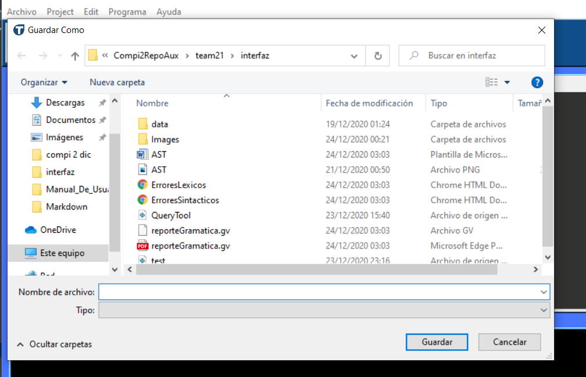
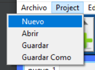
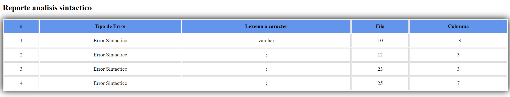
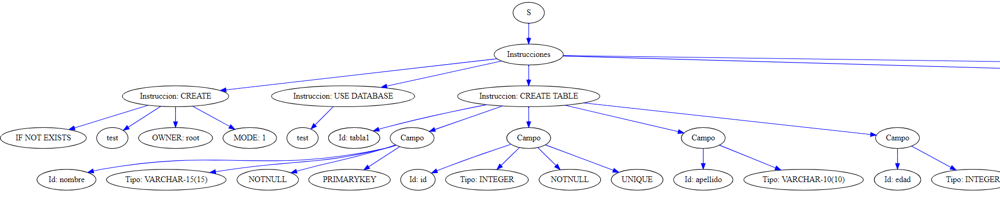
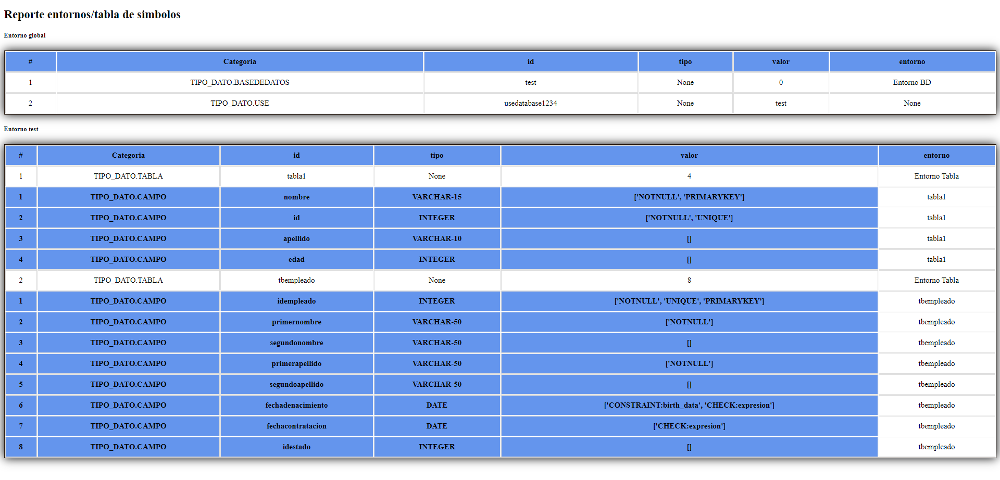
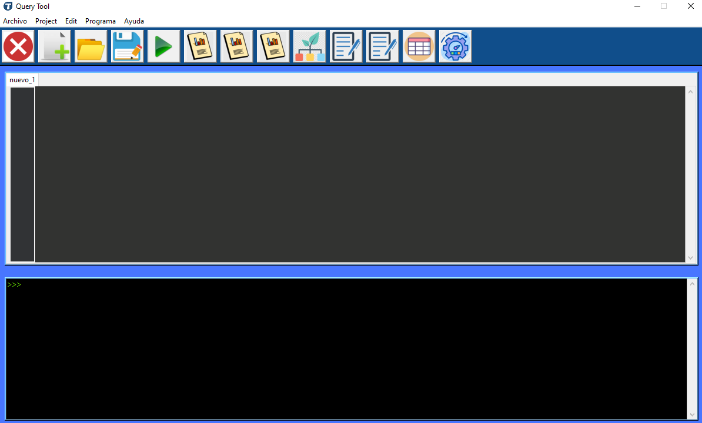
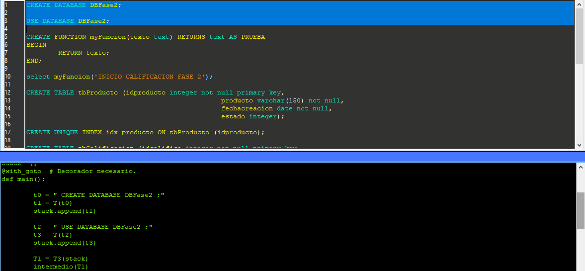
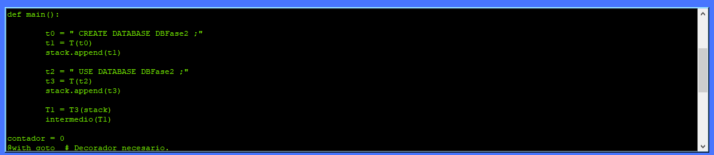
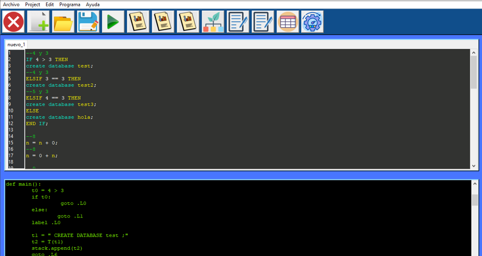
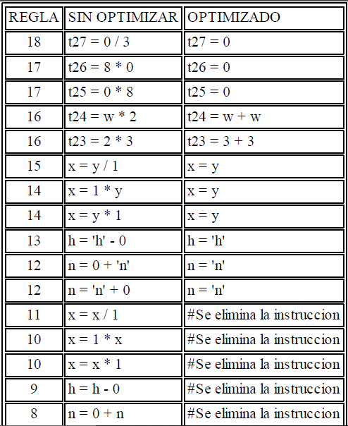

# **MANUAL DE USUARIO**

## TytusDB 

Es un administrador de bases de datos, que acepta un subconjunto del lenguaje SQL.

El editor de texto cuenta con resaltado de sintáxis, funcionalidades básicas como abrir y guardar archivo, copiar, cortar, pegar, crear nueva pestaña, numeración de filas y cerrar.

Desde aquí también es posible abrir los reportes:

* Errores léxicos
* Errores sintácticos
* Errores semánticos
* AST
* Gramatical
* Tabla de símbolos

 El resaltado de sintáxis ayuda a diferenciar las palabras reservadas, id y cadenas.

 Al ser un subconjunto de lenguaje SQL aplican las mismas reglas, acepta palabras reservadas tanto en minúscula, mayúscula o una mezcla de ellas. Se recomienda usar las palabras reservadas en mayúsculas

  

---
* #### Abrir archivo

Es posible desde el icono

O desde la barra

En cualquiera de los casos se abrirá una ventana como la siguiente, donde se deberá escoger el archivo que se desea abrir.

* #### Cerrar

Para cerrar una pestaña es posible desde el icono

o desde la barra

Si no se han guardado los cambio aparecerá lo siguiente 

Al seleccionar la opción si, cerrará la pestaña y se perderán los cambios, al seleccionar no, nos llevará a la siguiente ventana

Será necesario escribir el nombre y tipo del archivo, ademas de seleccionar la ubicación.

Al aceptar aparecerá el siguiente mensaje.

* #### Guardar 

Este icono llevará a la ventana descrita con aterioridad

De igual manera se puede acceder desde la barra

* #### Pestaña nueva

Para crear una nueva pestaña solo hace falta presionar el icono

O desde la barra

* #### Ejecutar

Para realizar la ejecución de una entrada solo hace falta colocarla en el área del texto, ya sea abriendo un archivo o pegandola directamente.

Luego presionar el icono de ejecución

O desde la barra

Luego se verán los resultados en consola

* #### Copiar, cortar y pegar

* #### Reportes

Para acceder a ellos deberá presionar en el icono correspondiente

---

Cuenta con una consola, para muestra de errores, confirmación de acciones, resultado de consultas realizadas.

De esa manera se verán las consultas realizadas.

---

#### Los reportes se verán de la siguiente manera:

* Errores léxicos

* Errores sintácticos

* AST

* Gramatical

* Tabla de símbolos

## FASE 2

Se agrego un nuevo botón y nuevas funcionalidades.

* #### Nueva Funcionalidades

  Se agregó la funcion de poder seleccionar la parte del codigo que se quiera ejecutar como se muestra en la imagen, en este caso solo  se ejecuto el CREATE DATABASE DBFase2; y USE DATABASE DBFase2; 

  

* #### Nueva salida

  

  La consola ahora muestra la traduccion del codigo en tres direcciones de cada instrucción que se deseo ejecutar con anterioridad.

* #### Reporte de Optimización

  

Este icono genera el reporte de Optimizacion.

Al presionar el botón este generara el siguiente reporte.

Este contendra la regla que se utilizo el parte sin optimizar como la que ya esta optimizada.

