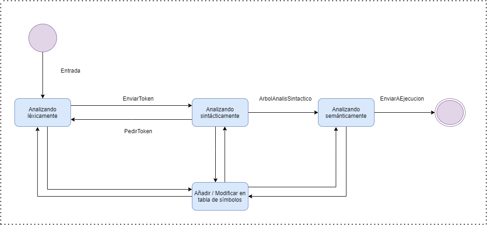

# **MANUAL TÉCNICO**

## Introducción

TytusDB es un administrador de bases de datos, se divide en tres componentes para su funcionalidad, al curso de compiladores 2 le corresponde el análisis léxico, sintáctico y semántico de la entrada.

Para ello se realizó la construcción de un intérprete que acepta las instrucciones de un subconjunto del lenguaje SQL, definido previamente, utilizando la herramienta PLY para la construcción del parser.

A su vez se tienen tres componentes, siendo estos: SQL parser, en donde pasa por todo un proceso de validaciones hasta llegar a la ejecución de las instrucciones, en la cual se programó verificando y validando las reglas semánticas, se hizo uso del Storage Manager para almacenar la información de las bases de datos creadas y de sus tablas correspondientes; Type Checker, donde se validan los tipos de datos que fueron aceptados en el parser; Query Tool, se cuenta con un editor de texto, capaz de resaltar palabras reservadas y tipos de datos, en dicha área se ingresan las consultas, contiene una consola, donde se muestran los resultados de las consultas, mensajes de éxito o advertencias.

___

## Marco Téorico

* **Interprete** es un patrón de diseño que, dado un lenguaje, define una representación para su gramática junto con un intérprete del lenguaje. Se usa para definir un lenguaje para construir expresiones regulares que representen cadenas a buscar dentro de otras cadenas.

* **Patrón de diseño** son unas técnicas para resolver problemas comunes en el desarrollo de software y otros ámbitos referentes al diseño de interacción o interfaces.

* **Clase abstracta** Es una clase en la que se pueden definir tanto métodos como propiedades, pero que no pueden ser instancias directamente. Solamente se pueden usar para construir subclases. 

* **Parser** programa que analiza una porción de texto para determinar su estructura lógica.

* **PLY** es una herramienta de análisis escrita exclusivamente en Python. Tiene casi todas las características proporcionadas por Lex y Yacc. Incluye soporte para producciones vacías, reglas de precedencia, recuperación de errores y gramáticas ambiguas . Es compatible con Python 3

* **Análisis léxico** agrupa los carácteres que va leyendo uno a uno del programa fuente y formar los tokens. Aumenta la portabilidad del compilador, pudiendo tenerse
versiones diferentes para distintos formatos del texto de
código fuente (ASCII, EBCDIC, etc.). Se simplifica el diseño, puesto que hay una herramienta
especializada en el tratamiento del fichero que contiene el
código fuente.

* **Análisis semántico** utiliza el árbol sintáctico y la información en la tabla de símbolos para comprobar la consistencia semántica del programa fuente con la definición del lenguaje.

* **Árbol de sintáxis abstracta** es una representación de árbol de la estructura sintáctica abstracta del código fuente escrito en un lenguaje de programación . Cada nodo del árbol denota una construcción que ocurre en el código fuente. Árbol de sintaxis abstracta.

* **Tabla de símbolos** es una estructura de datos que usa el proceso de traducción de un lenguaje de programación, por un compilador o un intérprete, donde cada símbolo en el código fuente de un programa está asociado con información tal como la ubicación, el tipo de datos y el ámbito de cada variable.
___

## Objetivos

* General

    *  Crear un intérprete para un subconjunto del lenguaje SQL.

* Especificos

    * Diseñar una interfaz amigable para el usuario.
    * Construir el árbol de sintaxis abstracta para verificar el funcionamiento del parser.
    * Realizar validaciones semánticas de manera adecuada.
    * Almacenar de manera correcta los datos proporcionados para obtener las consultas que se realicen.
    * Implementar código tres direcciones.

---

## Arquitectura




## Patrón de diseño

Se utilizó el patrón interprete, usando dos clases abstractas principales, las cuales son Instruccion y Exp.

Para cada instrucción relevante se creó una clase que contenga lo necesario para su análisis semántico.

Las clases de mayor importancia son: 


```python
class CreateReplace(Instruccion):
    '''#1 create
       #2 create or replace'''
    def __init__(self, caso, exists, id, complemento,fila,columna):
        self.caso = caso
        self.exists = exists
        self.id = id
        self.complemento = complemento
        self.fila = fila
        self.columna = columna
```

Utilizada para almacenar los datos referentes a la creación de una base de datos.


```python
class CreateTable(Instruccion):
    def __init__(self, id, campos, idInherits,fila,columna):
        self.id = id
        self.campos = campos
        self.idInherits = idInherits
        self.fila = fila
        self.columna = columna

```
Para la creación de las tablas dentro de la base de datos, esta clase llega a contener otra de gran importancia, ya que da los parámetros que le corresponden a cada campo de la tabla.

De la funcionalidad de estas dos primeras dependerá el resto. A continuación el constructor de las instrucciones DML.

```python
class InsertInto(Instruccion):
    def __init__(self,caso, id, listaId, values,fila,columna):
        self.caso=caso
        self.id = id
        self.listaId = listaId
        self.values = values
        self.fila = fila
        self.columna = columna
```

```python
class Delete(Instruccion):
    def __init__(self,caso, id, where,fila,columna):
        self.caso = caso
        self.id = id
        self.where = where
        self.fila = fila
        self.columna = columna
```

```python
class Update(Instruccion):
    def __init__(self, id, asignaciones, where,fila,columna):
        self.id = id
        self.asignaciones = asignaciones
        self.where = where
        self.fila = fila
        self.columna = columna
```

```python
class Select(Instruccion):
    '''#1 time
       #2 p_instselect
       #3 p_instselect2
       #4 p_instselect3
       #5 p_instselect4
       #6 p_instselect7'''

    def __init__(self, caso, distinct, time, columnas, subquery, inner, orderby, limit, complementS,fila,columna):
        self.caso = caso
        self.distinct = distinct
        self.time = time
        self.columnas = columnas 
        self.subquery = subquery
        self.inner = inner 
        self.orderby = orderby
        self.limit = limit
        self.complementS = complementS
        self.fila = fila
        self.columna = columna
```
La clase de mayor relevancia que hereda de Exp es Expresión, en ella se contendrán las operaciones aritméticas, relacionales, booleanas.

```python
class Expresion(Exp):
    def __init__(self, iz, dr, operador,fila,columna):
        self.iz = iz
        self.dr = dr
        self.operador = operador
        self.fila = fila
        self.columna = columna
```


## Gramática utilizada

>Se optó por utilizar la [gramática ascendente](https://github.com/MarcosAlberto21/tytus/blob/main/parser/fase2/team21/Analisis_Ascendente/ascendente.py)

___

El uso de clases para cada tipo de instrucción facilitó el envió a ejecución así como la realización del árbol de sintáxis abstracta.

```python
    def TiposInstruccion(self, inst, padre):
        if inst != None:
            for i in inst:
                if isinstance(i, CreateTable):
                    self.CreateTable(i, padre)
                elif isinstance(i, InsertInto):
                    self.InsertInto(i, padre)
                elif isinstance(i, CreateReplace):
                    self.CreateReplace(i, padre)
                elif isinstance(i, Show):
                    self.Show(padre)
                elif isinstance(i, AlterDatabase):
                    self.AlterDatabase(i, padre)
                elif isinstance(i, AlterTable):
                    self.AlterTable(i, padre)
                elif isinstance(i, Update):
                    self.Update(i, padre)
                elif isinstance(i, Delete):
                    self.Delete(i, padre)
                elif isinstance(i, Select):
                    self.Select(i, padre)
                elif isinstance(i, Union):
                    self.Union(i, padre)
                elif isinstance(i, Use):
                    self.Use(i, padre)
                elif isinstance(i, Drop):
                    self.Drop(i, padre)
                elif isinstance(i, CreateType):
                    self.CreateType(i, padre)
```

De manera similar se envió cada instrucción a ejecución, dentro de cada clase se encuentra el método ejecutar o resolver según sea el caso.

---
## Fase 2

Se agrego en la gramática ascendente el manejo de índices como el lenguaje procedural (PL/pgSQL). De igual manera como en la fase 1 se manejó el mismo patrón, de crear cada clase para cada tipo de instrucción.

```python
class Index(Instruccion):
    def __init__(self, caso, id1, id2, listaId, concatena,fila, columna):
        self.caso = caso
        self.id1 = id1
        self.id2 = id2
        self.listaId = listaId
        self.concatena = concatena
        self.fila = fila
        self.columna = columna
    
```

```python
def p_createIndex1(t):
    'instruccion : CREATE INDEX ID ON ID PARIZQ listaID PARDR PTCOMA'
    global columna
    global concatena_index
    t[0] = Index(1, t[3], t[5], t[7],concatena_index ,lexer.lineno, columna)
    concatena_index.append(f"CREATE UNIQUE INDEX {t[3]} ON {t[5]}  (")
    print("salida index")
    print(t[8])
    i = 1
    for data in t[7]:
        if i == len(t[7]):
            concatena_index.append(data.id)
        else:
            concatena_index.append(f"{data.id},")
        i = i + 1
    concatena_index.append(f")")

    varGramatical.append('instruccion ::= CREATE INDEX ID ON ID PARIZQ listaID PARDR PTCOMA')
    varSemantico.append('instruccion = Index(1, ID, ID, listaID)')
```

```python
class Function(Instruccion):
    def __init__(self, caso, replace, id, parametros, tipo, E, declareInst, beginInst, linea, columna):
        self.caso = caso
        self.replace = replace
        self.id = id
        self.parametros = parametros
        self.tipo = tipo
        self.E = E
        self.declareInst = declareInst
        self.beginInst = beginInst
        self.linea = linea
        self.columna = columna
```

```python
def p_createfunction1(t):
    '''instruccion : CREATE orreplace FUNCTION ID PARIZQ parametros PARDR RETURNS tipo AS E \
    DECLARE \
        instrucciones \
    BEGIN \
        instrucciones \
    END PTCOMA'''
    global columna
    t[0] = Function(1, t[2], t[4], t[6], t[9], t[11], t[13], t[15], lexer.lineno, columna)
    varGramatical.append('instruccion ::= CREATE orreplace FUNCTION ID PARIZQ parametros PARDR RETURNS tipo AS E DECLARE instrucciones BEGIN instrucciones END PTCOMA')
    varSemantico.append('asignacionvariable = Function(1, orreplace, ID, parametros, tipo, E, instrucciones, instrucciones)')
    concatena_funciones_procedimientos.append(Function(1, t[2], t[4], t[6], t[9], t[11], t[13], t[15], lexer.lineno, columna))
```

```python
class Procedure(Instruccion):
    def __init__(self, caso, replace, id, parametros, languageE, asE, inst, id2, declareInst, beginInst, linea, columna):
        self.caso = caso
        self.replace = replace
        self.id = id
        self.parametros = parametros
        self.languageE = languageE
        self.asE = asE
        self.inst = inst
        self.id2 = id2
        self.declareInst = declareInst
        self.beginInst = beginInst
        self.linea = linea
        self.columna = columna
```

```python
def p_createProcedure1(t):
    ''' instruccion : CREATE orreplace PROCEDURE ID PARIZQ parametros PARDR \
    LANGUAGE E \
    AS E \
        instrucciones \
    ID PTCOMA
    '''
    global columna
    t[0] = Procedure(1, t[2], t[4], t[6], t[9], t[11], t[12], t[13], None, None, lexer.lineno, columna)
    concatena_funciones_procedimientos.append(t[0])
    varGramatical.append('instruccion ::= CREATE orreplace PROCEDURE ID PARIZQ parametros PARDR LANGUAGE E AS E instrucciones ID PTCOMA')
    varSemantico.append('instruccion = Procedure(1, orreplace, ID, parametros, E, E, instrucciones, ID, None, None)')
```

```python
def p_callProcedure1(t):
    '''instruccion : CALL ID PARIZQ listaExpresiones PARDR PTCOMA'''
    global columna
    t[0] = Call(1, t[2], t[4], lexer.lineno, columna)
    varGramatical.append('instruccion ::= CALL ID PARIZQ listaExpresiones PARDR PTCOMA')
    varSemantico.append('instruccion = Call(1, ID, listaExpresiones)')
```

```python
def p_LoopSimple(t):
    '''instruccion : LOOP \
    instrucciones \
    END LOOP PTCOMA '''
    global columna
    t[0] = Loop(t[2], lexer.lineno, columna)

def p_whileLoop(t):
    '''instruccion : WHILE opcionNot E LOOP \
    instrucciones \
    END LOOP PTCOMA'''
    global columna
    t[0] = While(t[2], t[3], t[5], lexer.lineno, columna)
```

## Código tres direcciones

Esta solo puede referenciar a solo tres direcciones de memoria al mismo tiempo, tiene como función en este proyecto el desanidar funciones a un nivel diferente de abstracción.  La manera en la que se implemento, fue que en las clases de cada instrucción existiera la función traducir la cual iba desanidando la instrucción de tal manera que el resultado fuera en tres direcciones.


```python
class Procedure(Instruccion):
    '''en replace sube True o False
    parametros puede ser None'''
    def __init__(self, caso, replace, id, parametros, languageE, asE, inst, id2, declareInst, beginInst, linea, columna):
        self.caso = caso
        self.replace = replace
        self.id = id
        self.parametros = parametros
        self.languageE = languageE
        self.asE = asE
        self.inst = inst
        self.id2 = id2
        self.declareInst = declareInst
        self.beginInst = beginInst
        self.linea = linea
        self.columna = columna

    def traducir(proc, ts, consola, exceptions, tv, concatena):
        consola.append("\n@with_goto  # Decorador necesario.\n")
        consola.append(f"def {proc.id}(")
        params = ""
        if proc.parametros != None and len(proc.parametros) != 0:
            if len(proc.parametros) == 1:
                if proc.parametros[0] != None:
                    for param in proc.parametros:
                        params += param.id
            else:
                print(proc.parametros)
                i = 0
                for param in proc.parametros:
                    params += param.id
                    if i + 1 != len(proc.parametros):
                        params += ', '
                    i = i + 1

        consola.append(f"{params}):\n")
        if proc.inst != None:
            tr.traduccion(proc.inst, ts, consola, consola, exceptions, concatena, tv)

        if proc.declareInst != None:
            consola.append("\tlabel .declare\n")
            tr.traduccion(proc.declareInst, ts, consola, consola, exceptions, concatena, tv)
        if proc.beginInst != None:
            consola.append("\tlabel .begin\n")
            tr.traduccion(proc.beginInst, ts, consola, consola, exceptions, concatena, tv)
```

## Optimización

Su finalidad es producir un código objeto lo mas eficiente posible optimizando el tiempo de ejecución como también el espacio de memoria utilizado.

La optimización que se utilizo fue la de mirilla esta trata de estructurar de manera mas eficiente el flujo del programa, sobre todo en instrucciones de bifurcación como son las decisiones, ciclos y saltos de rutinas. 

Este se implemento en el mismo método traducir.

```python
class CaseF2(Instruccion):
    def __init__(self, E, listaWhen, elseCase, fila, columna):
        self.E = E
        self.listaWhen = listaWhen
        self.elseCase = elseCase
        self.fila = fila
        self.columna = columna


    def traducir(cs, ts, consola, metodos_funciones, exception, tv, concatena, regla, antes, optimizado):
        if cs.elseCase == None:
            condicion = Expresion.traducir(cs.E, ts, consola, exception, tv, regla, antes, optimizado, None)
            salida = tv.Et()
            i = 0
            if cs.listaWhen != None and len(cs.listaWhen) != 0:
                for c in cs.listaWhen:
                    cond2 = Expresion.traducir(c.E, ts, consola, exception, tv, regla, antes, optimizado, None)
                    tempCond = tv.Temp()
                    consola.append(f'\t{tempCond} = {condicion} == {cond2}\n')
                    siguiente = salida
                    if len(cs.listaWhen) != i + 1:
                        siguiente = tv.Et()
                    consola.append(f'\tif not {tempCond}:\n\t\tgoto .{siguiente}\n')
                    if c.instrucciones != None:
                        tr.traduccion(c.instrucciones, ts, consola, metodos_funciones, exception, concatena, tv)
                    #consola.append(f'\tgoto .{salida}\n') equivalente a break no es necesario
                    consola.append(f'\tlabel .{siguiente}\n')

                    i = i + 1

                    regla.append('3')
                    et = siguiente[1:]
                    print(et)
                    et = int(et)
                    antes.append(f'if {tempCond}:<br> &nbsp goto .{siguiente}<br>else:<br> &nbsp goto .L{et + 1}<br>label .{siguiente}<br>#instrucciones<br>label .L{et + 1}')
                    optimizado.append(f'if not {tempCond}:<br> &nbsp goto .{siguiente}<br>#instrucciones<br>label .{siguiente}')

        else:
            condicion = Expresion.traducir(cs.E, ts, consola, exception, tv, regla, antes, optimizado, None)
            salida = tv.Et()
            if cs.listaWhen != None and len(cs.listaWhen) != 0:
                for c in cs.listaWhen:
                    cond2 = Expresion.traducir(c.E, ts, consola, exception, tv, regla, antes, optimizado, None)
                    tempCond = tv.Temp()
                    consola.append(f'\t{tempCond} = {condicion} == {cond2}\n')
                    siguiente = tv.Et()
                    consola.append(f'\tif not {tempCond}:\n\t\tgoto .{siguiente}\n')
                    if c.instrucciones != None:
                        tr.traduccion(c.instrucciones, ts, consola, metodos_funciones, exception, concatena, tv)
                    consola.append(f'\tgoto .{salida}\n') #equivalente a break, por el else lo dejare
                    consola.append(f'\tlabel .{siguiente}\n')

                    # reporte optimizacion
                    regla.append('3')
                    et = siguiente[1:]
                    print(et)
                    et = int(et)
                    antes.append(f'if {tempCond}:<br> &nbsp goto .{siguiente}<br>else:<br> &nbsp goto .L{et + 1}<br>label .{siguiente}<br>#instrucciones<br>label .L{et + 1}')
                    optimizado.append(f'if not {tempCond}:<br> &nbsp goto .{siguiente}<br>#instrucciones<br>label .{siguiente}')


            tr.traduccion(cs.elseCase, ts, consola, metodos_funciones, exception, concatena, tv)
            consola.append(f'\tlabel .{salida}\n')
```

## Bibliografía

* [Instalación PLY](https://pypi.org/project/ply/)

* [Descargable PLY](https://www.dabeaz.com/ply/)

* [Documentación PLY](https://www.dabeaz.com/ply/ply.html)

* [Documentación Graphviz](https://graphviz.org/documentation/)

* [Graphs with dot](https://graphviz.org/pdf/dotguide.pdf)

* [Documentación HTML](https://devdocs.io/html/)

* [Documentación PDF](https://www.adobe.com/content/dam/acom/en/devnet/pdf/pdfs/pdf_reference_archives/PDFReference.pdf)

* [PrettyTable](https://pypi.org/project/prettytable/)

* [Documentación pip install](https://pip.pypa.io/en/stable/reference/pip_install/)

* [Documentación python](https://docs.python.org/es/3/)

---
## Licencias

Se está utilizando la licencia MIT, que se originó en el Instituto Tecnológico de Massachusetts, es una licencia de software libre permisiva, da muy pocas limitaciones, permitiendo reutilizar software dentro del software propietario. La licencia no posee copyrigth esto permite su modificación. Es usada muy a menudo en el software libre.

Licencia de PLY: 

Copyright (C) 2001-2011,
David M. Beazley (Dabeaz LLC)
All rights reserved.