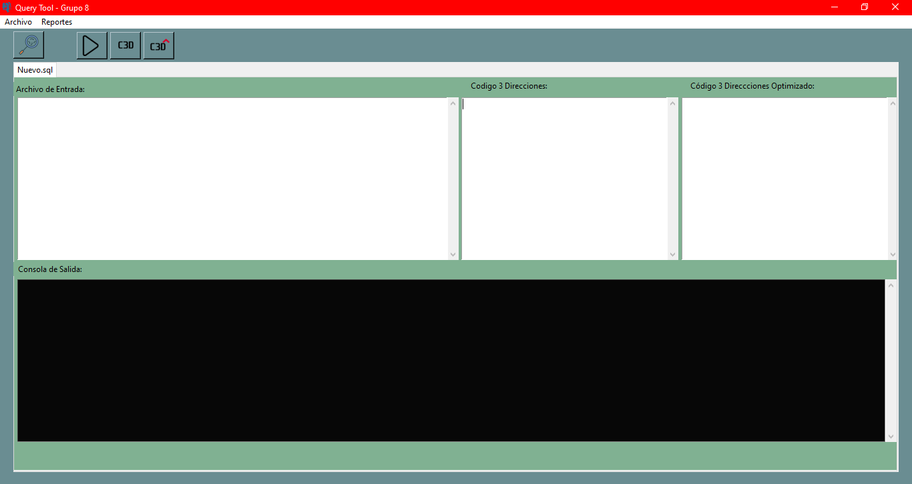
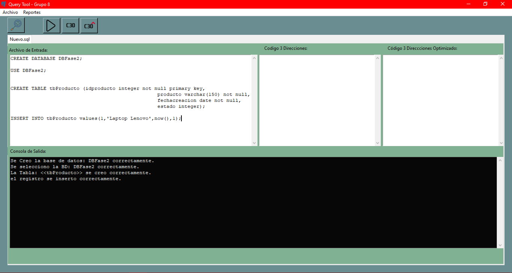
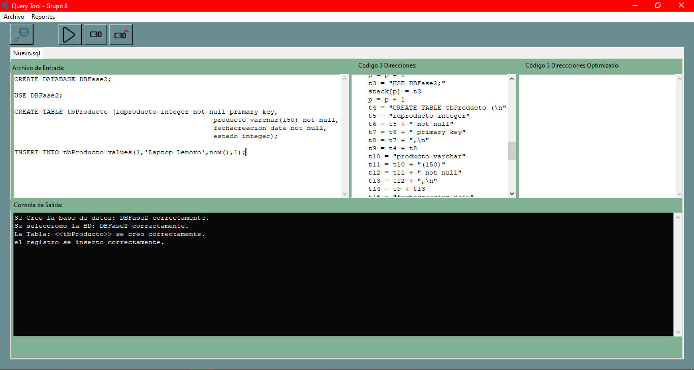
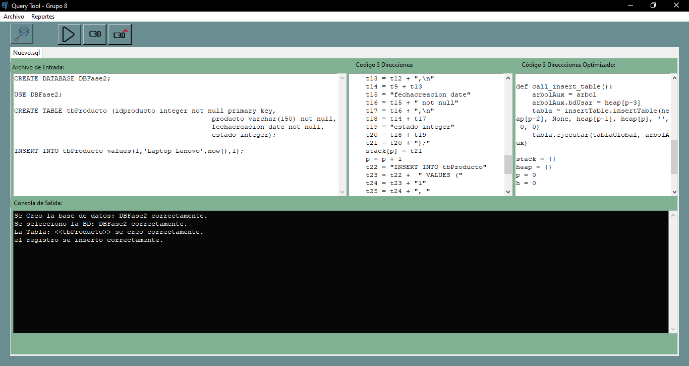
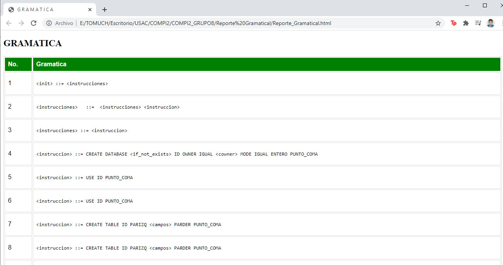
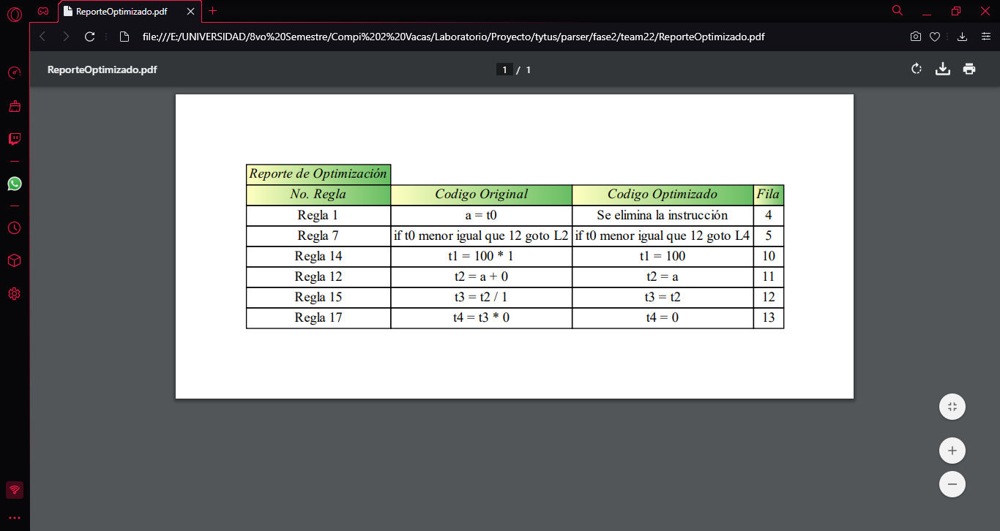

#### Universidad de San Carlos de Guatemala
#### Facultad de Ingeniería
#### Escuela de Ciencias y Sistemas
#### Área de Ciencias de la Computación
#### Organización de Lenguajes y Compiladores 2 - Sección A
#### Ing. Luis Fernando Espino Barrios
#### Aux. Juan Carlos Maeda    
 

<table class="default">
  <tr>
    <th>Nombre</th>
    <th>Carnet</th>
  </tr>
  <tr>
    <td>Kimberly Mireya Elias Diaz</td>
    <td>201700507</td>
  </tr>
  <tr>
    <td>Juan Pablo Alvarado Velasquez</td>
    <td>201700511</td>
  </tr>
  <tr>
    <td>Cristofher Antonio Saquilmer Rodas</td>
    <td>201700686</td>
  </tr>
  <tr>
    <td>Daniel Arturo Alfaro Gaitan</td>
    <td>201700857</td>
  </tr>
</table>

 

## Índice
- [SQL PARSER Grupo 8 - TytusDB](#SQL_PARSER_Grupo_8-TytusDB) 
- [Barra de Menú](#Barra_de_Menú)
- [Consola de Salida](#Consola_Salida)
- [Salida de Código 3 Direcciones](#Salida_3_Direcciones)
- [Salida de Código 3 Direcciones Optimizado](#Salida_3_Direcciones_Optimizado)
- [Tabla de Errores](#Tabla_Errores)
- [Tabla de Simbolos](#Tabla_Simbolos)
- [Reporte_Gramatical](#Reporte_Gramatical)
- [Reporte_Optimización](#Reporte_Optimizacion_C3D)

 

# SQL_PARSER_Grupo_8-TytusDB

Cuando se inicia la aplicacion, se podrá ver toda la interfaz QueryTool con todos sus módulos que la componen e igualmente las operaciones encargadas del funcionamiento del proyecto, tales como las opciones siguientes: guardar, guardar como, ver árbol, Analizar, entre otros que se detallaran mas adelante.  
 
 

  

 

## Barra_de_Menú 

  
  

* ### Abrir: 
Esta opción permite abrir cualquier archivo que contenga texto plano, y crea una nueva pestaña con el contenido del archivo.
* ### Guardar
Esta opción es para que guarde un archivo donde el contenido de la misma es lo que está en la pestaña seleccionada actualmente.
* ### Guardar Como...
Esta opción nos permite elegir la ubicación donde se guardara el contenido de la pestaña activa.
* ### Tabla de Errores
En Esta tabla se puede abrir el Reporte de Errores Léxicos, Sintácticos y Semanticos que contenga el Archivo de Entrada.
* ### Tabla de Simbolos
Esta opción muestra las variables, funciones y procedimientos con mínimo los siguientes datos: identificador, tipo, dimensión, declarada en, y referencias.
* ### AST
Esta opción muestra el árbol de sintaxis abstracta utilizando Graphviz en una nueva ventana.
* ### Reporte Gramatical
Esta opción genera un reporte de la gramática con Sintaxis BNF
* ### Botón Analizar
Realiza el Análisis Léxico, Sintáctico y Semántico del Archivo de entrada, asi como la ejecucion de las instrucciones.
* ### Botón Mostrar 3D
Muestra el código 3 direcciones generado a través del análisis.
* ### Botón Mostrar 3D Optimizado
Muestra el código 3 direcciones ya optimizado que puede ser igual o menos extenso que el código 3 direcciones.
 

## Consola_Salida 

Esta es otra parte de la Interfaz principal se observa una pestaña con un archivo cargado previamente mostrando todo su contenido. Adional se puede apreciar el Log en la Consola de Salida.
 
 

  

 

## Salida_3_Direcciones

En esta parte de la interfaz, se mostrará el código 3 Direcciones generado a través del análisis del texto a la izquierda.
 
 

  

 

## Salida_3_Direcciones_Optimizado

En esta otra parte de la interfaz, se mostrará el resultado de la optimización del código 3 Direcciones, que puede ser o no más pequeño que el código 3 Direcciones sin optimizar, dependiendo que instrucciones hayan mandado a este.
 
 

  

 

## Tabla_Errores 

Así es como se verá un reporte en una página de los errores léxicos y sintácticos que se encontraron en el archivo que se analizó. Se muestra el número de errores encontrados, así como también el tipo, descripción y el carácter que provoco el error en sí.
 
 

  

 

## Tabla_Simbolos 

En este Reporte se puede apreciar las variables, funciones y procedimientos creatos en el ámbito Global.
 
 

  

 

## Reporte_Gramatical 

En este Reporte se puede apreciar la gramatica en formato BNF.
 
 

  

 

## Reporte_Optimizacion_C3D

En este Reporte se puede apreciar cuales fueron las partes optimizadas en el código 3D generado.
 
 

  

 

