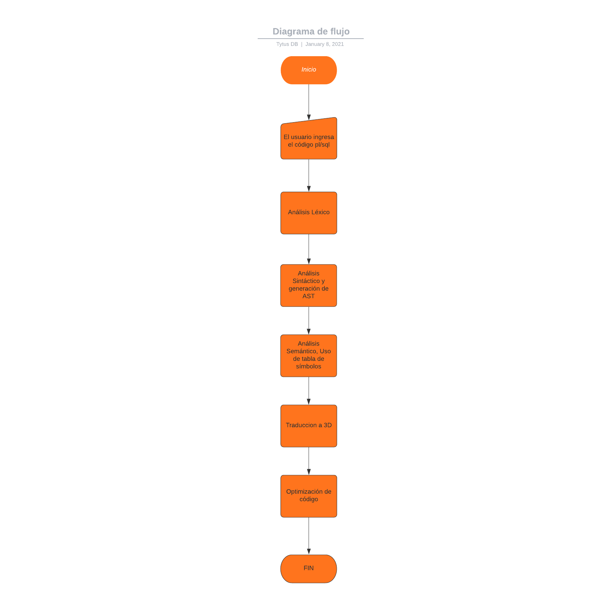
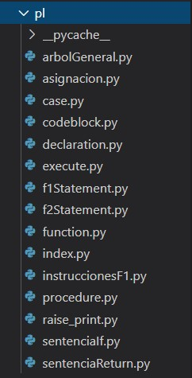
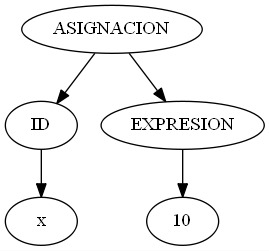

# MANUAL DE USUARIO
## Flujo general del sistema

## Parser
Se utilizó la herramienta PLY para realizar el análisis léxico y sintáctico, con acciones semánticas se realizó el AST y las respectivas validaciones semánticas para la traducción a C3D.

    # Instrucciones de los procedimentos
    def p_codeBlock(t):
        """
        codeBlock : R_DECLARE declarationList R_BEGIN plInstructions R_END
        | R_DECLARE declarationList list_declaraciones_declere R_BEGIN plInstructions R_END
        | R_BEGIN plInstructions R_END
        """
        if len(t) == 6:
            t[0] = CodeBlock(lista_instrucciones=t[4] , lista_declaraciones=t[2] , row=t.slice[1].lineno , column=t.slice[1].lexpos)
        elif len(t) == 7:
            for item in t[3]:
                t[2].append(item)
            # t[2].append(t[3])
            t[0] = CodeBlock(lista_instrucciones=t[5],lista_declaraciones=t[2], row=t.slice[1].lineno , column=t.slice[1].lexpos)
        else:
            t[0] = CodeBlock(lista_instrucciones=t[2] , row=t.slice[1].lineno , column=t.slice[1].lexpos)
        repGrammar.append(t.slice)

## Análisis Semántico
Para cada acción semántica, se creó un objeto de una clase. Existe una clase para cada sentencia de pl. Todas las clases se adjuntaron en un módulo llamado pl.

Cada clase cuenta con lo siguiente:

1. Método generar C3D:

Este método genera el codigo 3 direcciones equivalente a la sentencia. Por ejemplo:

        #Método de traducción codigo 3 direcciones para raise.
        def generate3d(self, environment, instanciaAux):
            valor = self.string2.generate3d(environment,instanciaAux)
            instanciaAux.addToCode(f"\tprint('{self.string1}' , {valor})")
        #Esta cadena en C3D se concatena con la traducción resultante.

2. Método dot

Este método genera un subarbol n-ario perteneciente a la sentencia actua. Por ejemplo:

        #Método de generacíon de subarbol n-ario para la asignación.
        def dot(self):
            nuevo_nodo = Nodo("ASIGNACION")
            identificador = Nodo("ID")
            expresion = Nodo("EXPRESION")
            id = Nodo(self.identificador)
            identificador.addNode(id)
            expresion.addNode(self.expresion.dot())
            nuevo_nodo.addNode(identificador)
            nuevo_nodo.addNode(expresion)
            return nuevo_nodo   

## Expresiones

Para el manejo y comprobación de tipos en las expresiones, se utilizó el mismo módulo que la fase 1.

## Tabla de símbolos

El uso de la tabla de símbolos para toda la traducción de las sentencias pl, se creó una tabla de símbolos diferente a la de la fase 1 con los siguientes métodos:

    #CREATE A DICTIONARY TO STORE THE SYMBOLS
    symbolTable=dict()
    #CREATE A NEW SYMBOL AND STORE IT INTO THE SYMBOL TABLE
    def add_symbol(name_,type_,value_,row_,column_,ambit_):
        symbolTable[name_]=[type_,value_,row_,column_,ambit_]

    #SEARCH A SYMBOL WITH name_ IF IS FOUND, THE RETURN name_, type_ AND value_
    def search_symbol(name_):
        if name_ in symbolTable:
            return name_,symbolTable[name_][0],symbolTable[name_][1]
        else:
            return 0
    #MODIFY THE VALUE OF A SYMBOL, THE type_ VERIFICATION MUST BE DONE BEFORE EXECUTE THIS
    def modify_symbol(name_,value_):
        if name_ in symbolTable:
            symbolTable[name_][1]=value_ 