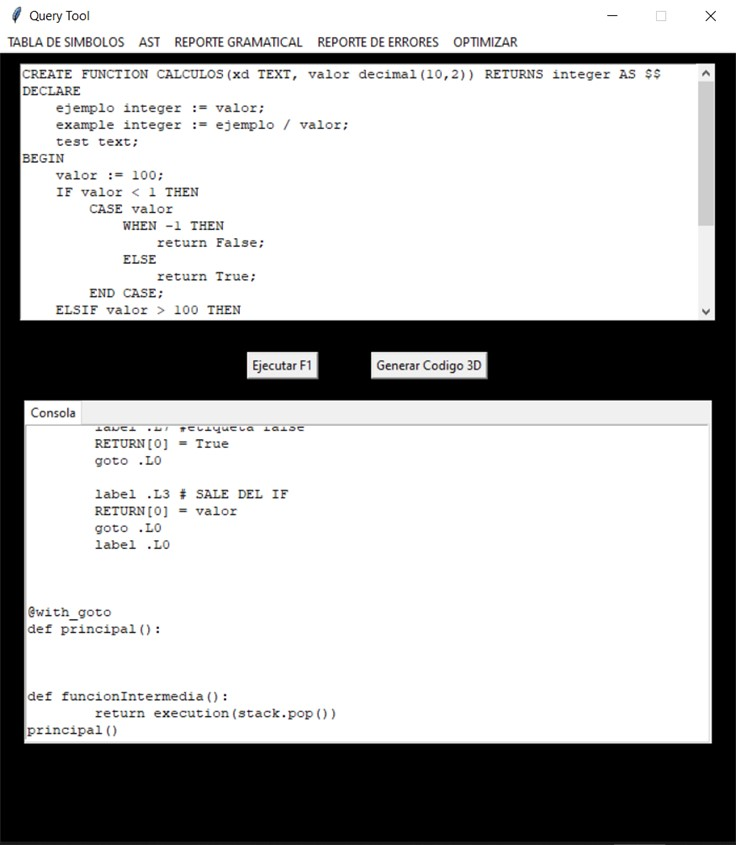
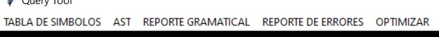
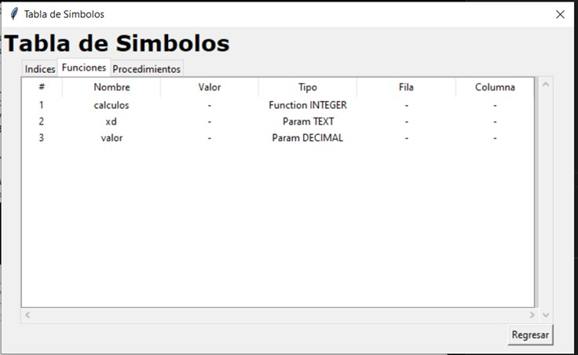
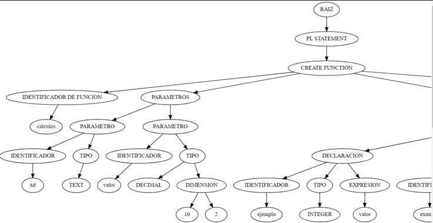
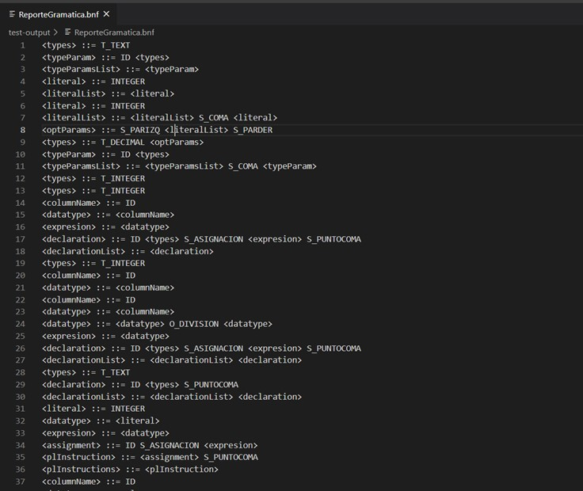
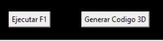
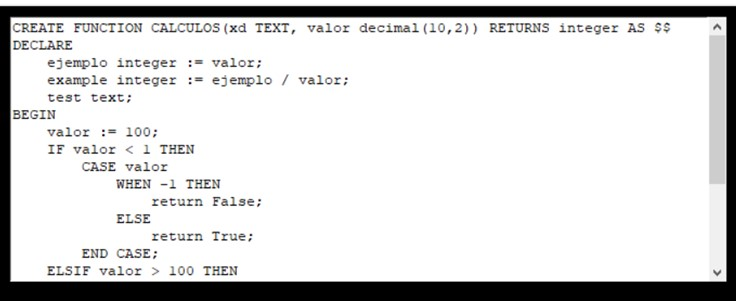

# MANUAL DE USUARIO
## Interfaz gráfica

## Menú
La interfaz posee un menú en donde se puede encontar botones para realizar diferentes acciones con el código ya traducido.

## Tabla de simbolos

Al presionar este botón, se despliega una nueva ventana con todos los datos almacenados en la tabla de simbolos.

## AST

Al presionar este botón, se abrirá automáticamente un SVG con el programa predeterminado para esta extensión de archivo en el sistema, con el AST de la entrada proporcionada.

## Reporte gramatical

Al presionar este botón, se abrirá automáticamente un BNF con el programa predeterminado para esta extensión de archivo en el sistema, con el recorrido gramatical de la entrada proporcionada.

## Reporte de errores

Al presionar este botón, se despliega una nueva ventana con todos los datos almacenados en las listas de errores por tipos: lexicos, sintácticos y semánticos.

## Optimizar

Al presionar este botón, se optimiza el código 3 direcciones genearado anteriormente.

## Menú Secundario

En este menú se encuentran dos botones.

## Ejecutar F1

Este botón ejecuta aquellas sentencdias pertenecientes a la fase 1

## Generar Codigo 3D

Este botón traduce la entrada a 3D.

## Salida

Esta es una caja de texto en donde se encuentra el C3D producto de la traducción.
