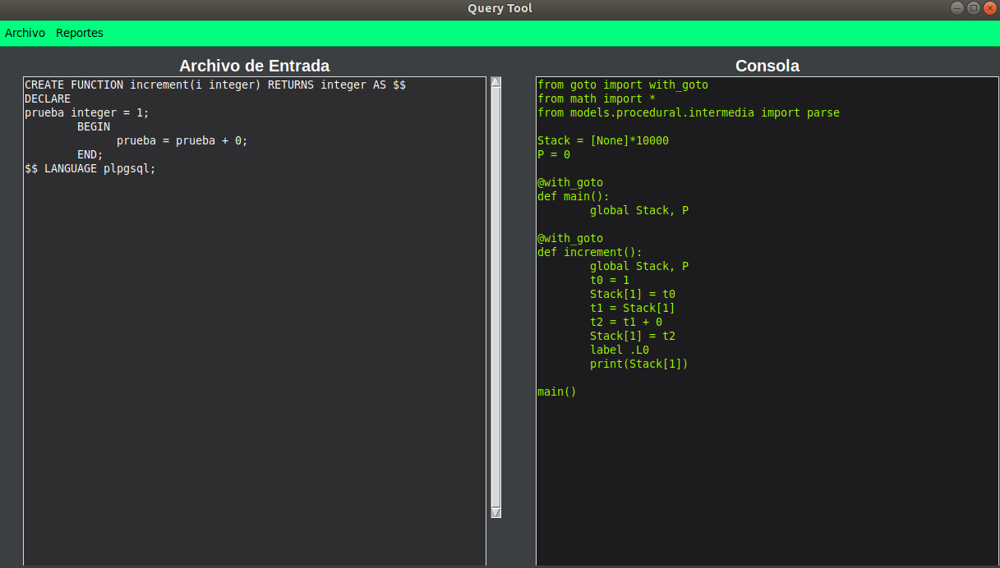
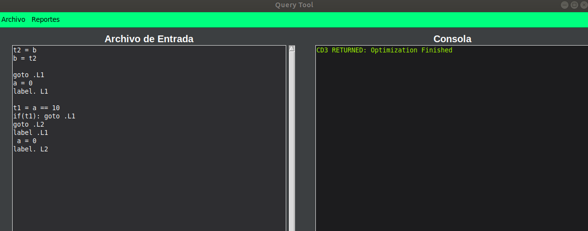
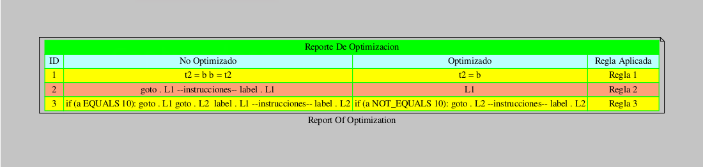
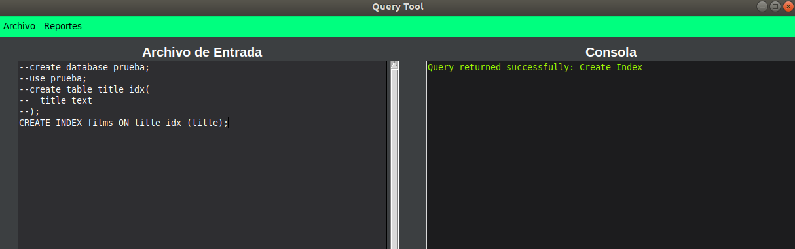
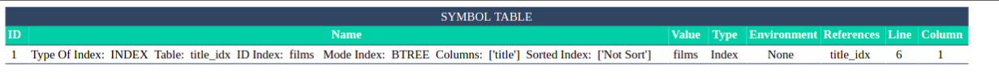
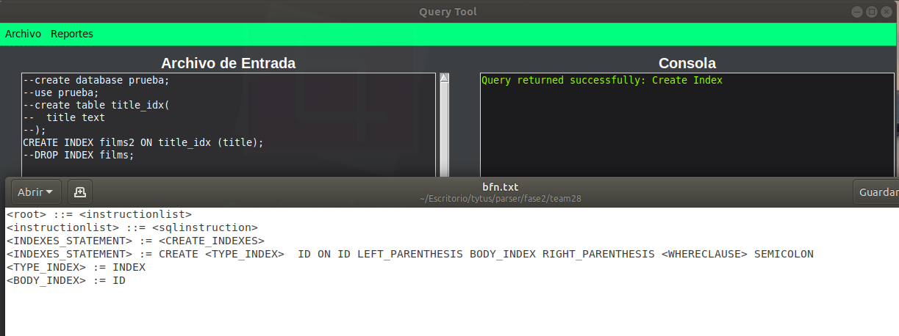

# Manual de Usuario

Es un proyecto Open Source para desarrollar un administrador de bases de datos. Está compuesto por tres componentes interrelacionados: 

  - administrador de almacenamiento de la base de datos
  - administrador de la base de datos
  - SQL Parser

En este manual se describira como funciona el SQL parser es stand-alone 

## Propósito
El presente manual tiene como finalidad ser una guía basica de operación del sistema, permitiendo al lector de este manual adquirir las destrezas y conocimientos indispensables para una operación adecuada del sistema, y ser una herramienta de consulta de primera mano a la cual puede recurrir el usuario en cualquier momento.

## Interfaz de Usuario

    

        Figura 1. Acciones semánticas en la gramática ascendente.
    

    

### Partes de la Interfaz
    - Barra de Herramientas
    - Editor de Texto
    - Consola de Salida
    
#### Barra de Herramientas
En la barra de herramientas se encuentran todas las acciones que puede realizar el programa.

##### Archivo
Opciones disponibles:
| Opcion | Accion |
| ------ | ------ |
| Nuevo | Limpia el editor de texto |
| Abrir | Abre un archivo de texto y lo pega en el editor de texto |
| Guardar | Guarda los cambios realizados en el editor de texto |
| Guardar como | Crea un archivo con el texto del editor |
| Ejecutar | Ejecuta las instrucciones SQL del editor |
| Salir | Cierra el programa |

    

        Figura 1. Acciones semánticas en la gramática ascendente.
    

    

##### Reportes
Opciones disponibles:
| Opcion | Accion |
| ------ | ------ |
| AST | Crea un arbol grafico del AST generado con la entrada en el editor |
| Type Checker | Muestra los datos almacenados en una estructura JSON de la base de datos |
| Tabla de Simbolos | Muestra los simbolos creados durante la ejecucion|
| Reporte de Errores | Errores encontrados durante la ejecucion |
| Reporte Gramatica BNF | Ejecuta las instrucciones SQL del editor |

    

        Figura 1. Acciones semánticas en la gramática ascendente.
    

    

##  FASE 2, OVERVIEW
***
Se implementa el lenguaje procedural en la nueva fase 2 incluyendo los procedimientos almacenados, las funciones y los índices.
Dentro de las funciones y procedimientos se hacen uso de las instrucciones de programación básicas como lo es la declaración y asignación de variables, la realización de operaciones operar, así como los condicionales y los tipo case que forman parte de elementos condicionales.

La nueva versión del Query Tool presenta en la parte izquierda un editor de texto y en la parte derecha una consola con los resultados obtenidos.
Se ha implementado la función de generación de código 3 direcciones, un código a más bajo nivel que simula las instrucciones en alto nivel con una estructura similar a la de ensamblador.

    

        Consola y editor del Query Tool
    

    

Se implementó la optimización del código 3 direcciones haciendo uso de las reglas de mirilla, donde se toma como entrada el código 3 direcciones obtenido de la traducción de la entrada procedural y se aplica las reglas necesarias generando un reporte que muestra las reglas aplicadas al código.

    

        Consola y editor del Query Tool
    

    

Teniendo la entrada en código 3 direcciones se puede optimizar, de ser así se puede ver en el reporte de optimización las reglas que han sido aplicadas mostrando el código antiguo y el nuevo código.

    

        Reporte de optimización
    

    

Los procedimientos almacenados funcionan de la misma forma que las funciones con la salvedad de que no tienen aceptan un retorno de datos.

Se agregó el apartado de índices donde se puede agregar un índice, editar y borrar a una tabla con una respectiva columna, en la fase de integración se usaría para la optimización de recursos en tiempos de búsqueda.

    

        Reporte de optimización
    

    

Si se desea ver la existencia de los índices se puede hacer uso de la tabla de símbolos.

    

        Indice en tabla de símbolos
    

    

    

        Reporte gramatical actualizado
    

    

### Tech

Tecnologias y librerias utilizadas para el desarrollo del SQL Parser

* [Python] - https://www.python.org/
* [Pandas] - https://pandas.pydata.org/pandas-docs/stable/getting_started/index.html
* [markdown-it] - Markdown.

### Development

Desea contribuir o saber mas acerca del proyecto?
Repositorio: https://github.com/tytusdb/tytus