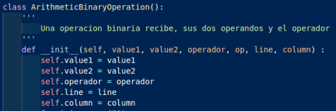
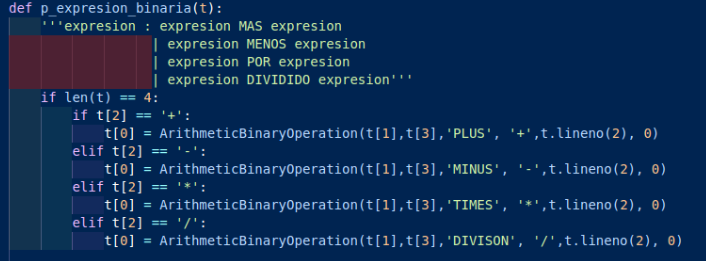
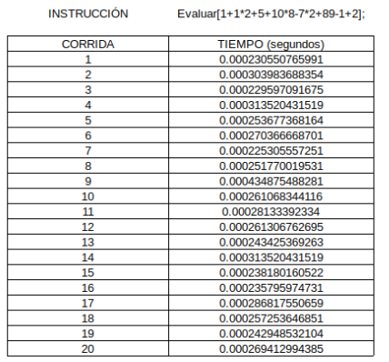
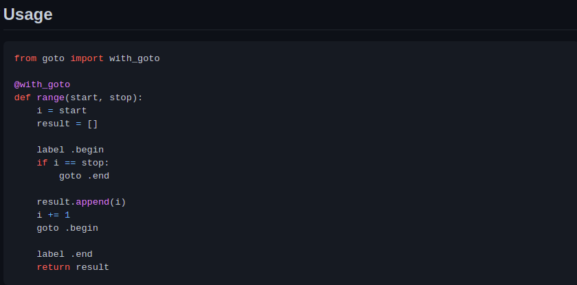
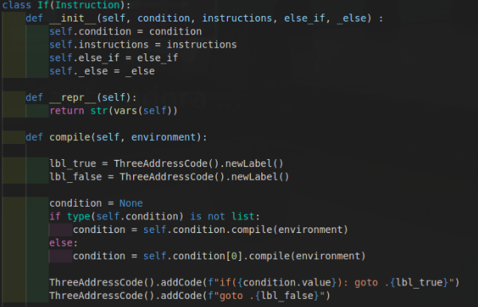
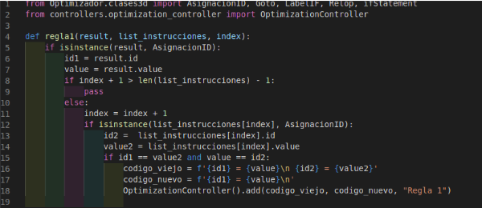
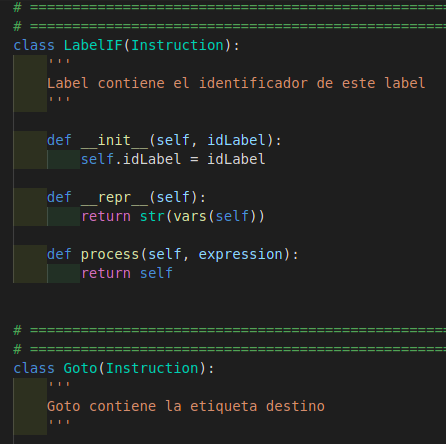

# Manual Técnico

## INTEGRANTES
|                     201801266 DIDIER ALFREDO DOMINGUEZ URÍAS                    |                      201801345 JUAN MARCOS IBARRA LÓPEZ                      |                   201801364 JUAN DANIEL ENRIQUE ROMAN BARRIENTOS                   |                        201801370 JAVIER ANTONIO CHIN FLORES                        |
|:-------------------------------------------------------------------------------:|:----------------------------------------------------------------------------:|:----------------------------------------------------------------------------------:|:----------------------------------------------------------------------------------:|
|     |    |    |    |
| <a href="https://github.com/dadu0699" target="_blank">`github.com/dadu0699`</a> | <a href="https://github.com/Chramox" target="_blank">`github.com/Chramox`</a> | <a href="https://github.com/dani3l8200" target="_blank">`github.com/dani3l8200`</a> | <a href="https://github.com/ChinJavier" target="_blank">`github.com/ChinJavier`</a> |

***
## INTRODUCCIÓN
El presente documento tiene como finalidad de proveer información sobre la estructura de la aplicación implementada. Conocer sus partes, la manera de cómo fue construida, etc.

***
## HERRAMIENTAS UTILIZADAS PARA EL DESARROLLO
Para la realización del proyecto se utilizó el lenguaje de programación Python en su versión 3 y la herramienta [PLY (Python Lex-Yacc)](https://www.dabeaz.com/ply/) para realizar el análisis léxico-sintáctico. Se utilizaron librerías externas para la manipulación grafica de la información como lo es [Graphviz](https://graphviz.org/) y [prettytable](https://github.com/jazzband/prettytable)

***
##  ESTRUCTURA
* Controllers
* Docs
    * [Gramática ascendente](Gramatica_Ascendente.md)
    * [Gramática descendente](Gramatica_Descendente.md)
* Models
* Utils
* Views

***
##  ELECCIÓN DE GRAMÁTICA
Ply es un analizador que hace uso de lex y yacc, realiza un análisis sintáctico LR lo cual lo hace apto para su uso en la implementación de gramáticas libres de contexto que pueden ser grandes y de tipo ascendente. Al hacer uso de un análisis sintáctico LR genera su tabla de análisis sintáctico haciendo uso de LALR (1).

Al hacer uso de Ply se puede aplicar una definición dirigida por la sintaxis para la ejecución de código, es decir, la introducción de acciones semánticas asociadas a una producción. Al realizar estas acciones se tiene de forma directa una serie de acciones, en este caso es la ejecución de código, donde se puede aprovechar el recorrido del analizador para manipular los atributos sintetizados de cada una de las producciones. 

Si se utiliza una gramática ascendente, está debe ser apropiada para aprovechar el recorrido del analizador y trabajar con los atributos que se vayan sintetizando a lo largo del recorrido. Se hizo uso de una gramática ascendente en ply para la implementación de una calculadora donde se tiene un esquema de traducción postfijo y la ejecución aprovecha el recorrido del árbol para realizar las acciones, se tomó una muestra de corridas donde se tomó el tiempo de ejecución del programa obteniendo los siguientes resultados.

    

        Figura 1. Acciones semánticas en la gramática ascendente.
    

    

    

        Figura 2 Resultados obtenidos de 20 corridas de la ejecución del programa.
    

    

    

        Figura 3 Datos estadísticos obtenidos de las corridas.
    

    

El tiempo de ejecución al realizar un esquema de traducción con las acciones semánticas directamente al final de las producciones presenta una media de (0.00020884275436 +- 0.000026490382976) seg, se puede observar que el tiempo que le toma realizar la ejecución es muy pequeño y es bastante eficiente.

Si se comienzan a manejar clases en las producciones para ir construyendo un árbol el tiempo de ejecución del programa aumenta en una pequeña cantidad, debido al tiempo que le toma hacer la instancia de la clase y sus respectivas asignaciones de los atributos. A continuación se muestra el uso de clases para ir construyendo un árbol de análisis sintáctico, en este caso se creó una clase para la operación binaria.

    

        Figura 4 Creación de clase aritmética binaria
    

    

    

        Figura 5 Creación de nodos en la gramática
    

    

    

        Figura 6 Resultados obtenidos de 20 corridas de la ejecución del programa
    

    

    

        Figura 7 Datos estadísticos obtenidos de las corridas
    

    

El tiempo de ejecución al realizar la construcción de un árbol por medio de los diferentes datos que se encuentren en el análisis presenta una media de (0.00027023553848 +- 0.00004716195417) seg, a comparación de las corridas anteriores el tiempo de ejecución aumenta.

El motivo por el cual no se ha utilizado una gramática descendente para su implementación con Ply, es porque Ply es un analizador adecuado para gramáticas ascendentes, si se desea hacer uso de atributos heredados entonces una gramática ascendente no es la más adecuada porque se requiere el traspaso de atributos de nodos de izquierda a derecha, si aún así se desea hacer uso de Ply para ello es necesario hacer uso de la pila con valores negativos pero ello conlleva una gran desventaja, el tiempo de análisis de la pila del analizador para evitar conflictos y acceder a la posición correcta.

Existen diversas alternativas para manejar una traducción y acciones en un análisis, entre ellas se encuentran

    
    

        Fuente: (Espino,L. 2020)
    

Si se desea hacer uso de la alternativa de construcción de un árbol sintáctico para realizar su recorrido y así lograr el traspaso de atributos entre los nodos entonces esto conlleva más tiempo como se ve reflejado en la figura 7, dependiendo de la complejidad de la gramática y el tamaño, el tiempo de ejecución puede crecer.

##  FASE 2
***
Para el desarrollo de la fase 2 del proyecto se hizo uso de la librería de python llamada goto lo cual permite el uso de etiquetas (Labels) y saltos (goto) que permite realizar la ejecución del código en 3 direcciones moviéndose a través de saltos por medio del archivo. 
[Libreria Goto](https://github.com/snoack/python-goto/blob/master/test_goto.py)

    

        Ejemplo libreria Goto
    

    

Se hizo uso de clases abstractas y se definió un método abstracto llamado compile, el cual es el encargado de la traducción a código 3 direcciones según cada instrucción, es prudente hacer énfasis en los objetos que son instancia de asignación, expresión y de los condicionales, debido a que la parte del lenguaje procedural de postgresql fue la traducida a código 3d. Se hace uso de una clase de ámbito para manejar el alcance que tienen las variables dentro de un bloque.

Se muestra un ejemplo de una instrucción vital para la traducción a código 3d, la cual es la instrucción if, esta tiene como atributos una condición, las instrucciones pertenecientes y posibles cuerpos de un else if o un else. 

A grandes rasgos la instrucción if en su método compile genera los labels necesarios para permitir hacer saltos según la condición, siempre tendrá un label true y un label false. Al momento de darle a su condición la ejecución del método compile este devolverá la condición en un formato válido para código 3d, y se va dando una estructura válida para el formato en código 3d y que sea aceptado por la libreria goto.

    

        Instrucción If y metodo compile.
    

    

En el caso de la optimización se hizo un parser aparte que analice la salida del primer parse, es decir, analizará el código 3d generado por el primer parser, al ir reconociendo la estructura del archivo del código 3d se pueden hacer uso de las reglas de optimización de mirilla.

    

        Método regla 1 optimización.
    

    

Se realizó un método de optimización por cada una de las reglas, si en dado caso es posible optimizarla entonces se agrega a un reporte donde muestra el código no optimizado con el código ya optimizado.

    

        Clase Label C3D.
    

    

En este caso se hace uso de instrucciones fundamentales, el número de instrucciones se reduce considerablemente debido a que el formato en código 3d acepta instrucciones elementales. Gracias al manejo de clases se puede hacer validaciones para las reglas de optimización al saber si un objeto es o no instancia de cierta clase.