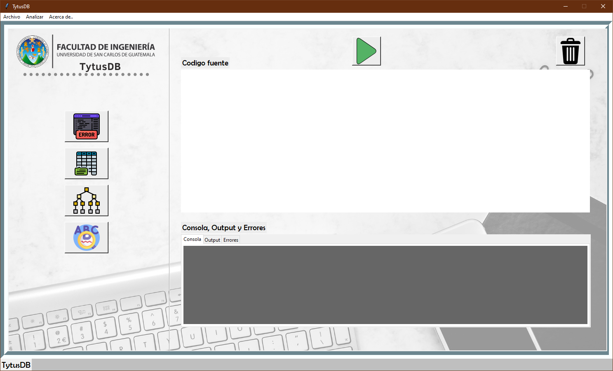
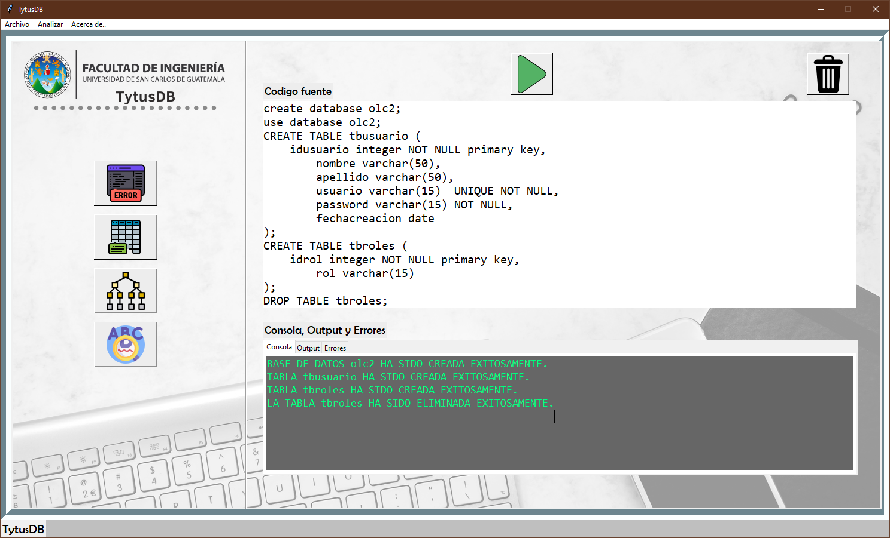
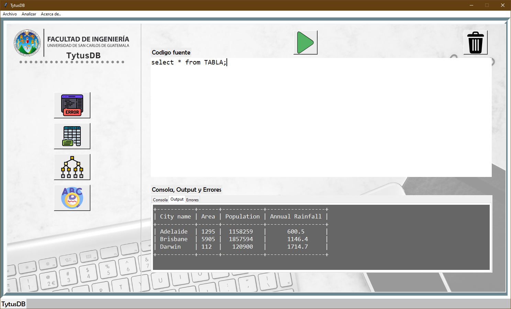
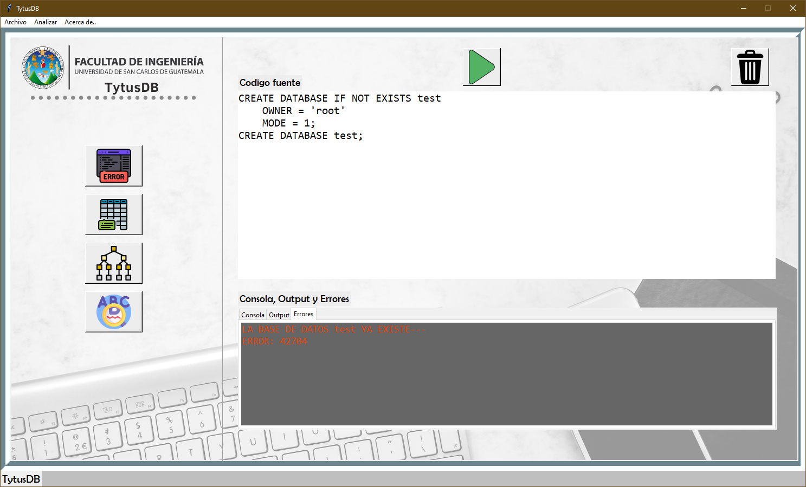
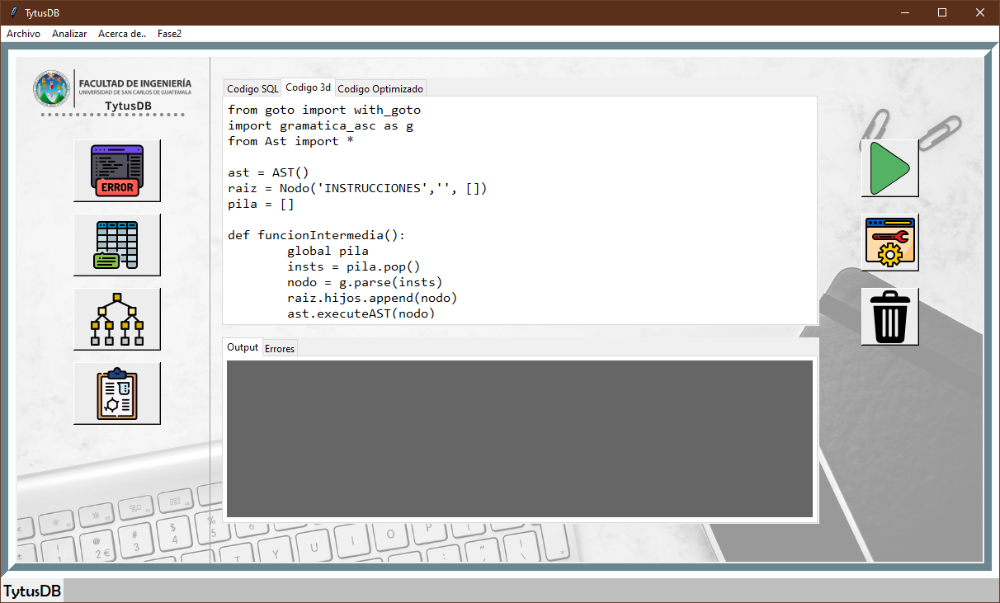
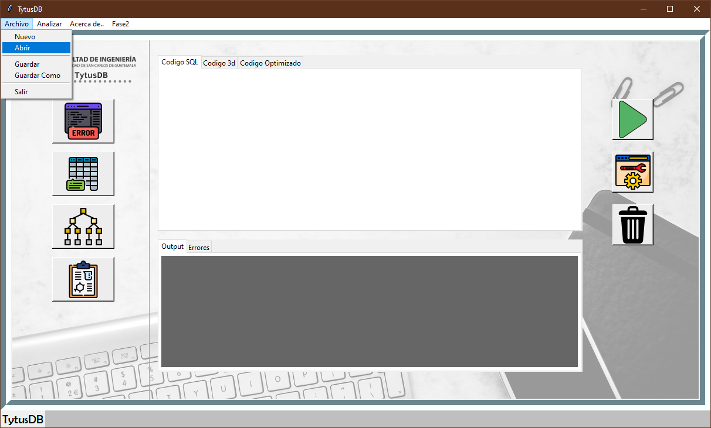
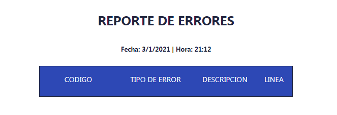
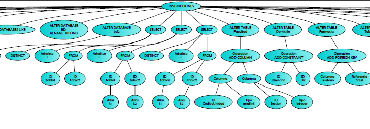
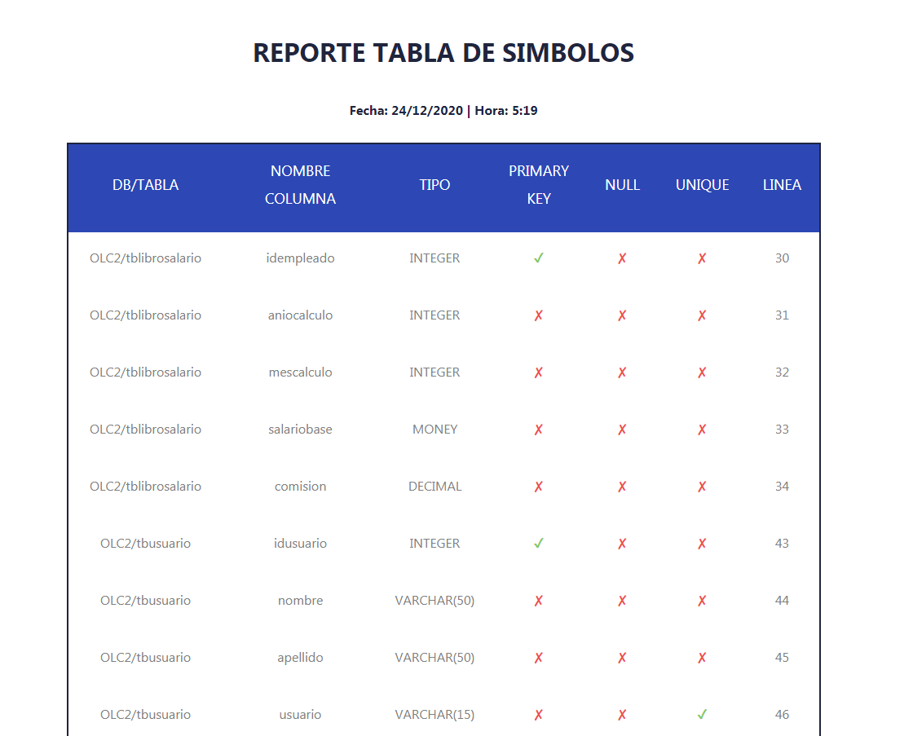

# Manual de Usuario Proyecto, Fase 2 : *TytusDB*

  

        Universidad de San Carlos de Guatemala
        Facultad de ingeniería
        Escuela de Ciencias y Sistemas 
        781 Organización de lenguajes y compiladores 2
        Manual de usuario proyecto, Fase 2

                                                   Perteneciente a: Grupo 11
                                                
                                                   

***
## Índice
- [Competencias del proyecto](#competencias-del-proyecto)
- [Descripcion de TytusDB](#descripcion-de-tytusdb)
- [Flujo del programa](#flujo-del-programa)
- [Python](#python)
- [Plataforma de Desarrollo](#plataforma-de-desarrollo)
- [¿Como funciona el programa?](#como-funciona-el-programa)
***
## Competencias del proyecto:
### *General:*
- Poner en práctica los conocimientos teóricos adquiridos durante cada curso y aplicarlo a un proyecto real de código abierto fortaleciendo las competencias de administración de equipos de desarrollo.
### *Específico:*
- El estudiante construye un intérprete para el subconjunto del lenguaje SQL mediante la traducción dirigida por la sintaxis.
- El estudiante utiliza la herramienta PLY o SLY de Python para la traducción.

 
***
## Descripcion de TytusDB:
Es un proyecto Open Source para desarrollar un administrador de bases de datos. Está compuesto por tres componentes interrelacionados: el administrador de almacenamiento de la base de datos, que estará a cargo del curso de Estructuras de Datos; el administrador de la base de datos, que estará a cargo del curso de Sistemas de Bases de Datos 1, este administrador se compone a su vez de un servidor y de un cliente; y el SQL Parser, que estará a cargo del curso de Organización de Lenguajes y Compiladores 2.

---

## Flujo del programa:

  

TytusDB ha sido creado para los desarroladores tanto como principiantes como avanzados en el lenguaje SQL (especificamente POSTGRES SQL) Dado que puede recibir toda las instrucciones SQL, este programa puede brindar al usuario una serie de reportes en los cuales se pueden analizar todas las instrucciones ingresadas asi como su salida de resultados con sus respectivos errores tanto léxicos, sintácticos y semánticos. Reporte AST mostrando las instrucciones ingresadas de una forma ascendente. 
Este programa ha sido desarrollado en Python, bajo licencia MIT.

---
## Python

Python es un lenguaje de programación interpretado cuya filosofía hace hincapié en la legibilidad de su código. Se trata de un lenguaje de programación multiparadigma, ya que soporta orientación a objetos, programación imperativa y, en menor medida, programación funcional. Es un lenguaje interpretado, dinámico y multiplataforma.

Es administrado por la Python Software Foundation. Posee una licencia de código abierto, denominada Python Software Foundation License.

### *Características*
Python es un lenguaje de programación multiparadigma. Esto significa que más que forzar a los programadores a adoptar un estilo particular de programación, permite varios estilos: programación orientada a objetos, programación imperativa y programación funcional. Otros paradigmas están soportados mediante el uso de extensiones.

Python usa tipado dinámico y conteo de referencias para la administración de memoria.

Una característica importante de Python es la resolución dinámica de nombres; es decir, lo que enlaza un método y un nombre de variable durante la ejecución del programa (también llamado enlace dinámico de métodos).

Otro objetivo del diseño del lenguaje es la facilidad de extensión. Se pueden escribir nuevos módulos fácilmente en C o C++. Python puede incluirse en aplicaciones que necesitan una interfaz programable.

Aunque la programación en Python podría considerarse en algunas situaciones hostil a la programación funcional tradicional del Lisp, existen bastantes analogías entre Python y los lenguajes minimalistas de la familia Lisp como puede ser Scheme.

  

---

## Plataforma de Desarrollo
El programa se ha desarrollado en el IDE Visual Studio Code:
* Versión: 1.52.1 (user setup)
* Confirmación: ea3859d4ba2f3e577a159bc91e3074c5d85c0523
* Fecha: 2020-12-16T16:34:46.910Z
* Electron: 9.3.5
* Chrome: 83.0.4103.122
* Node.js: 12.14.1
* V8: 8.3.110.13-electron.0
* Sistema Operativo: Windows_NT x64 10.0.19041
---

## ¿Como funciona el programa?
#### Paso 1: *Inicia la aplicación TytusDB*

  

#### Paso 2: *Ingresa en el area de texto tus instrucciones SQL.*

  

    Ejecuta tus instrucciones SQL oprimiendo el botón RUN o la opción analizar.

#### Paso 3: *En consola se mostrarán las instrucciones que fueron ejecutadas de manera correcta.*

  

#### Paso 4: *En output se mostrarán los resultados de las instrucciones que fueron ejecutadas de manera correcta.*

  

#### Paso 5: *En errores se mostrarán los errores que se generaron al ejecutar las instrucciones.*

  

#### Paso 6: *En la pestaña de Codigo 3d podras visualizar el código que fue creado a partir de las sentencias SQL.*

  

#### *Podrás abrir, guardar y guardar como las instrucciones SQL que ejecutaras en el programa TytusDB*

  

#### *El reporte de errores completo podrá ser visualizado en un html*

  

#### *El reporte AST se generará a través del botón asignado, por medio graphviz*

  

#### *El reporte Tabla de simbolos completo podrá ser visualizado en un html*

  

