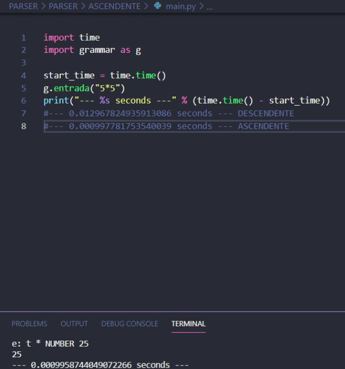

# Reporte de Gramaticas utilizadas

Para el lenguaje Tytus se implementó la gramática ascendente recursiva por la izquieda y generada por la herramienta PLY de Python.  
  
A continuación se encuentra la gramática usada en formato BNF:


```
<init> ::= <instrucciones>

<instrucciones> ::= <instrucciones> <instruccion>
                    | <instruccion>

<instruccion> ::= <alterDB_insrt>
                | <alterTable_insrt>
                | <drop_insrt>
                | USE ID DATABASE PTCOMA
                | <TIPO_ENUM_INSRT>
                | <dropDB>
                | <create_Table_insrt>
                | <select_insrt> PTCOMA
                | <select_uniones>
                | <insert_insrt> 
                | <delete_insrt>
                | <update_insrt>
                | <createDB_insrt>
                | <useDB_insrt>

<useDB_insrt> ::= USE ID PTCOMA

<dropDB> ::= DROP DATABASE ID PTCOMA
           | DROP DATABASE IF EXISTS ID PTCOMA

<createDB_insrt> ::= CREATE DATABASE ID PTCOMA  
                   | CREATE OR REPLACE DATABASE ID PTCOMA
                   | CREATE DATABASE IF NOT EXISTS ID PTCOMA
                   | CREATE OR REPLACE DATABASE IF NOT EXISTS ID PTCOMA
                   | CREATE DATABASE ID <createDB_unParam> PTCOMA
                   | CREATE OR REPLACE DATABASE ID <createDB_unParam> PTCOMA 
                   | CREATE DATABASE IF NOT EXISTS ID <createDB_unParam> PTCOMA 
                   | CREATE OR REPLACE DATABASE IF NOT EXISTS ID                 | <createDB_unParam> PTCOMA    

<createDB_unParam> ::= OWNER ID
                     | MODE ENTERO
                     | OWNER IGUAL ID
                     | MODE IGUAL ENTERO
                    
<createDB_insrt> ::= CREATE DATABASE ID <createDB_dosParam> PTCOMA
                   | CREATE OR REPLACE DATABASE ID <createDB_dosParam> PTCOMA
                   | CREATE DATABASE IF NOT EXISTS ID <createDB_dosParam> PTCOMA
                   | CREATE OR REPLACE DATABASE IF NOT EXISTS ID                 | <createDB_dosParam> PTCOMA

<createDB_dosParam> ::= OWNER string_type MODE ENTERO
                      | OWNER string_type MODE IGUAL ENTERO
                      | MODE ENTERO OWNER string_type
                      | MODE ENTERO OWNER IGUAL string_type
                      | OWNER IGUAL string_type MODE ENTERO
                      | OWNER IGUAL string_type MODE IGUAL ENTERO
                      | MODE IGUAL ENTERO OWNER string_type
                      | MODE IGUAL ENTERO OWNER IGUAL string_type
                      
                      
                      

<TIPO_ENUM_INSRT> ::= CREATE TYPE ID AS ENUM PAR_A <lista_datos> PAR_C PTCOMA

<drop_insrt> ::= DROP TABLE <lista_drop_id> PTCOMA

<lista_drop_id> ::= <lista_drop_id> COMA ID
                  | ID

<alterDB_insrt> ::= ALTER DATABASE ID RENAME TO ID PTCOMA
                  | ALTER DATABASE ID OWNER TO <usuariosDB> PTCOMA

<usuariosDB> ::= ID
              | CURRENT_USER
              | SESSION_USER
              | CADENA

<alterTable_insrt> ::= ALTER TABLE ID <alterTable_type> PTCOMA

<alterTable_type> ::= ADD <alterTable_add>
                    | <alterTable_alter>
                    | DROP CONSTRAINT <campos_c>
                    | RENAME COLUMN ID TO ID
                    | DROP COLUMN <campos_c>

<alterTable_add> ::= COLUMN <campos_add_Column>
                   | CHECK PAR_A <expresion_logica> PAR_C
                   | CONSTRAINT ID <constraint_esp>
                   | FOREIGN KEY PAR_A <campos_c> PAR_C REFERENCES <campos_c>
                    

<campos_add_Column> ::= <campos_add_Column> COMA ID TIPO_DATO
                      | ID TIPO_DATO

<constraint_esp> ::= CHECK PAR_A <expresion_logica> PAR_C
                    | UNIQUE PAR_A <campos_c> PAR_C
                    | FOREIGN KEY PAR_A <campos_c> PAR_C REFERENCES <campos_c>

<alterTable_alter> ::= <alterTable_alter> COMA <Table_alter>
                    | <Table_alter>
                    
<Table_alter> ::= ALTER COLUMN <campos_c> <alter_type>

<alter_type> ::= TYPE TIPO_DATO
                | SET NOT NULL

<campos_c> ::= <campos_c> COMA ID
            | ID

<create_Table_isnrt> ::= CREATE TABLE ID PAR_A <cuerpo_createTable_lista> PAR_C <opcion_herencia>
                        
<opcion_herencia> ::= INHERITS PAR_A ID PAR_C PTCOMA
                    | PTCOMA

<cuerpo_createTable_lista> ::= <cuerpo_createTable_lista> COMA <cuerpo_createTable>
                                | <cuerpo_createTable>

<cuerpo_createTable> ::= ID <TIPO_DATO>
                        | ID <TIPO_DATO> <createTable_options>
                        | PRIMARY KEY PAR_A <campos_c> PAR_C
                        | FOREING KEY PAR_A <campos_c> PAR_C REFERENCES ID PAR_A <campos_c> PAR_C
                        | UNIQUE PAR_A <campos_c> PAR_C
                        | CONSTRAINT ID <constraint_esp>
                        
<createTable_options> ::= <createTable_options> <cT_options>
                        | <cT_options>

<cT_options> ::=  <defecto>
                | <N_null>
                | <C_unique>
                | <C_check>
                | <llave>                        
                        
<defecto> ::= DEFAULT <expresion_dato>

<N_null> ::= NULL
           | NOT NULL

<C_unique> ::= UNIQUE
             | CONSTRAINT <string_type> UNIQUE
             
<C_check> ::= CHECK PAR_A <expresion_logica> PAR_C
            | CONSTRAINT <string_type> CHECK PAR_A <expresion_logica> PAR_C

<llave> : PRIMARY KEY 
        | FOREIGN KEY                    

<TIPO_DATO> ::= TEXT
            | FLOAT
            | INTEGER
            | SMALLINT
            | MONEY
            | DECIMAL PAR_A ENTERO COMA ENTERO PAR_C 
            | NUMERIC PAR_A ENTERO COMA ENTERO PAR_C
            | NUMERIC PAR_A ENTERO PAR_C
            | NUMERIC
            | BIGINT
            | REAL
            | DOUBLE PRECISION
            | INTERVAL <extract_time> TO <extract_time>
            | INTERVAL
            | TIME
            | TIMESTAMP
            | DATE 
            | CHARACTER VARYING PAR_A ENTERO PAR_C
            | VARCHAR PAR_A ENTERO PAR_C
            | CHAR PAR_A ENTERO PAR_C
            | CHARACTER PAR_A ENTERO PAR_C
            | CHAR PAR_A PAR_C
            | CHARACTER PAR_A PAR_C

<update_insrt> ::= UPDATE ID SET <lista_update> WHERE ID IGUAL <expresion> PTCOMA
                
                
<lista_update> ::= <lista_update> COMA <parametro_update>
                | <parametro_update>

<parametro_update> ::= ID IGUAL <expresion_update>
                    
<expresion_update> ::= <expresion>
                    | <exclusivas_update>


<exclusivas_update> ::=  ACOSD PAR_A <expresion> PAR_C
                    | ASIN PAR_A <expresion> PAR_C
                    | SUBSTRING PAR_A <string_type> COMA <expresion> COMA <expresion> PAR_C
                    | MD5 PAR_A <string_type> PAR_C 
                    | TRIM PAR_A <string_type> D_DOSPTS BYTEA FROM <string_type> D_DOSPTS BYTEA PAR_C
                    | SUBSTR PAR_A <string_type> COMA ENTERO COMA ENTERO PAR_C

<delete_insrt> ::= DELETE FROM ONLY ID PTCOMA
                | DELETE FROM ONLY ID RETURNING <returning_exp> PTCOMA
                | DELETE FROM ID WHERE EXISTS <expresion_logica> PTCOMA
                | DELETE FROM ID WHERE EXISTS <expresion_logica> RETURNING <returning_exp> PTCOMA
                | DELETE FROM ID WHERE <expresion_logica> PTCOMA
                | DELETE FROM ID WHERE <expresion_logica RETURNING <returning_exp> PTCOMA
                | DELETE FROM ID RETURNING <returning_exp PTCOMA
                | DELETE FROM ID USING ID WHERE EXISTS <expresion_logica> PTCOMA
                | DELETE FROM ID USING ID WHERE EXISTS <expresion_logica> RETURNING <returning_exp> PTCOMA
                | DELETE FROM ID USING ID WHERE <expresion_logica> PTCOMA
                | DELETE FROM ID USING ID WHERE <expresion_logica> RETURNING <returning_exp> PTCOMA

<returning_exp> ::= ASTERISCO
                | <campos_c>

<as_ID> ::= ID
        | CADENA    

<select_insrt> ::= SELECT <opcion_select_tm>
                
<select_uniones> ::= <select_uniones> <tipo_union> <select_insrt> PTCOMA
                   | <select_insrt> 

<tipo_union> ::= UNION
               | INTERSECT 
               | EXCEPT

<from_s> ::= ID
           | PAR_A  

<otro_from> ::= <from_s> 
              | <from_s> <opcion_from> 

<opcion_sobrenombre> ::= ID <seguir_sobrenombre>
                       | ID

<seguir_sobrenombre> ::= AS <as_ID>
                       | ID 
                       | PUNTO ID            

<opcion_select_tm> ::=  <greatest_insrt> 
                | <funciones_select> AS <as_ID>
                | <opcion_select_lista>  FROM <opciones_sobrenombres>
                | <opcion_select_lista> <seguir_sobrenombre> FROM <otros_froms>
                | <opcion_select_lista>  FROM <from_s> <opcion_from>
                | EXTRACT PAR_A <extract_time> FROM TIMESTAMP CADENA  PAR_C PTCOMA
                | DATE_PART PAR_A CADENA COMA INTERVAL CADENA PAR_C PTCOMA
                | NOW PAR_A PAR_C PTCOMA
                | CURRENT_DATE PTCOMA
                | TIMESTAMP CADENA PTCOMA

<opciones_sobrenombres> ::= <opciones_sobrenombres> COMA <opcion_sobrenombre>
                        | <opcion_sobrenombre>

<otros_froms> ::= <otros_froms> COMA <otro_from>
              | <otro_from>

<opcion_select_lista> ::= DISTINCT <campos_c>
                       | <opciones_select_lista>    

<opciones_select_lista> ::= <opciones_select_lista> COMA <opcion_select>
                         | <opcion_select>   

<opcion_from> ::= <cond_where> <cond_gb> <cond_having> <cond_ob> <orden> <cond_limit> <cond_offset>
                | <cond_gb> <cond_having> <cond_ob> <orden <cond_limit> <cond_offset>
                | <cond_where> <cond_having> <cond_ob> <orden <cond_limit> <cond_offset>
                | <cond_having> <cond_ob> <orden <cond_limit> <cond_offset>
                | <cond_where> <cond_gb> <cond_ob> <orden <cond_limit> <cond_offset>
                | <cond_gb> <cond_ob> <orden <cond_limit> <cond_offset>
                | <cond_where> <cond_ob> <orden <cond_limit> <cond_offset>
                | <cond_ob> <orden <cond_limit> <cond_offset>
                | <cond_where> <cond_gb> <cond_having> <cond_ob> <cond_limit> <cond_offset>
                | <cond_gb> <cond_having> <cond_ob> <cond_limit> <cond_offset>
                | <cond_where> <cond_having> <cond_ob> <cond_limit> <cond_offset>
                | <cond_having> <cond_ob> <cond_limit> <cond_offset>
                | <cond_where> <cond_gb>  <cond_ob> <cond_limit> <cond_offset>
                | <cond_gb> <cond_ob> <cond_limit> <cond_offset>
                | <cond_where> <cond_ob> <cond_limit> <cond_offset>
                | <cond_ob> <cond_limit> <cond_offset>
                | <cond_where> <cond_gb> <cond_having> <cond_limit> <cond_offset>
                | <cond_gb> <cond_having> <cond_limit> <cond_offset>
                | <cond_where> <cond_having> <cond_limit> <cond_offset>
                | <cond_having> <cond_limit> <cond_offset>
                | <cond_where> <cond_gb> <cond_limit> <cond_offset>
                | <cond_gb> <cond_limit> <cond_offset>
                | <cond_where> <cond_limit> <cond_offset>
                | <cond_limit> <cond_offset>
                | <cond_where> <cond_gb> <cond_having> <cond_ob> <orden <cond_limit>
                | <cond_gb> <cond_having> <cond_ob> <orden <cond_limit>
                | <cond_where> <cond_having> <cond_ob> <orden <cond_limit>
                | <cond_having> <cond_ob> <orden <cond_limit>
                | <cond_where> <cond_gb> <cond_ob> <orden <cond_limit>
                | <cond_gb> <cond_ob> <orden <cond_limit>
                | <cond_where> <cond_ob> <orden <cond_limit>
                | <cond_ob> <orden <cond_limit>
                | <cond_where> <cond_gb> <cond_having> <cond_ob> <cond_limit> 
                | <cond_gb> <cond_having> <cond_ob> <cond_limit>
                | <cond_where> <cond_having> <cond_ob> <cond_limit>
                | <cond_having> <cond_ob> <cond_limit>
                | <cond_where> <cond_gb> <cond_ob> <cond_limit>
                | <cond_gb> <cond_ob> <cond_limit>
                | <cond_where> <cond_ob> <cond_limit>
                | <cond_ob> <cond_limit>
                | <cond_where> <cond_gb> <cond_having> <cond_limit>
                | <cond_gb> <cond_having> <cond_limit>
                | <cond_where> <cond_having> <cond_limit>
                | <cond_having> <cond_limit>
                | <cond_where> <cond_gb> <cond_limit>
                | <cond_gb>  <cond_limit>
                | <cond_where> <cond_limit>
                | <cond_limit>
                | <cond_where> <cond_gb> <cond_having> <cond_ob> <orden
                | <cond_gb> <cond_having> <cond_ob> <orden
                | <cond_where> <cond_having> <cond_ob> <orden
                | <cond_having> <cond_ob> <orden
                | <cond_where> <cond_gb> <cond_ob> <orden
                | <cond_gb>  <cond_ob> <orden
                | <cond_where> <cond_ob> <orden
                | <cond_ob>
                | <cond_where> <cond_gb> <cond_having> <cond_ob>
                | <cond_gb> <cond_having> <cond_ob>
                | <cond_where> <cond_having> <cond_ob>
                | <cond_having> <cond_ob>
                | <cond_where> <cond_gb> <cond_ob>
                | <cond_gb> <cond_ob>
                | <cond_where> <cond_ob>
                | <cond_where> <cond_gb> <cond_having>
                | <cond_gb> <cond_having>
                | <cond_where> <cond_having>
                | <cond_having>
                | <cond_where> <cond_gb> 
                | <cond_gb> 
                | <cond_where>
                | <select_insrt> PAR_C ID 
                | <select_insrt> PAR_C

<cond_where> ::= WHERE <expresion_where>

<cond_gb> ::= GROUP BY <campos_c>

<cond_having> ::= HAVING <expresion_logica>

<cond_ob> ::= ORDER BY <campos_c>

<cond_limit> ::= LIMIT <opc_lim>

<cond_offset> ::= OFFSET ENTERO

<extract_time> ::=    YEAR
                    | DAY
                    | MONTH
                    | HOUR
                    | MINUTE
                    | SECOND

<opc_lim> ::= ENTERO
            | ASTERISCO

<orden> ::= DESC
          | ASC

<case_insrt> ::= CASE <estructura_when_lista> ELSE <expresion> END

<estructura_when_lista> ::= <estructura_when_lista> <estructura_when>

<estructura_when_lista> ::= <estructura_when>

<estructura_when> ::= WHEN <expresion_logica> THEN <expresion>
<sum_insrt> ::= SUM <agrupacion_expresion>

<count_insrt> ::= COUNT <agrupacion_expresion>

<insert_insrt> ::= INSERT INTO ID PAR_A <lista_parametros_lista> PAR_C VALUES PAR_A <lista_datos> PAR_C PTCOMA
                | INSERT INTO ID PAR_A  PAR_C  VALUES PAR_A <lista_datos> PAR_C PTCOMA

<lista_parametros_lista> ::= <lista_parametros_lista> COMA <lista_parametros>
                          | <lista_parametros>

<lista_parametros> ::= ID
                     
<lista_datos> ::= <lista_datos> COMA <exclusiva_insert>
                | <exclusiva_insert> 

<exclusiva_insert> ::= <expresion_relacional>
                    | SUBSTRING PAR_A <string_type> COMA <expresion> COMA <expresion> PAR_C
                    | MD5 PAR_A <string_type> PAR_C
                    | TRIM PAR_A <string_type> D_DOSPTS BYTEA FROM <string_type> D_DOSPTS BYTEA PAR_C
                    | SUBSTR PAR_A <string_type> COMA ENTERO COMA ENTERO PAR_C
                    | NOW PAR_A PAR_C

<agrupacion_expresion> ::= PAR_A <expresion> PAR_C

<expresion_dato> ::= <string_type>
                  | RESTA ENTERO
                  | ID PUNTO ID
                  | <expresion_numero>

<expresion_numero> ::=  ENTERO
                    | FLOTANTE

<expresion> ::=  <expresion_dato>
                | <select_insrt>
                | NOW PAR_A PAR_C
                | PAR_A <expresion_logica> PAR_C
                | <expresion> SUMA <expresion>
                | <expresion> RESTA <expresion>
                | <expresion> ASTERISCO <expresion>
                | <expresion> DIVISION <expresion>
                | <expresion> MODULO <expresion>
                | <expresion> MAYMAY <expresion>
                | <expresion> MENMEN <expresion>
                | CEJILLA <expresion>
                | <expresion> HASHTAG <expresion>
                | S_OR <expresion>
                | D_OR <expresion>
                | <expresion> Y <expresion>                
                | AVG PAR_A <expresion> PAR_C 
                | MAX PAR_A <expresion> PAR_C
                | MIN PAR_A <expresion> PAR_C                 
                | ALL PAR_A <select_insrt> PAR_C
                | SOME PAR_A <select_insrt> PAR_C
                | <sum_insrt> 
                | <count_insrt>
                | TRUE
                | FALSE
                | SOME
                | ANY

<string_type> ::= CADENA
                | ID

<expresion_relacional> ::= <expresion> MAYQUE <expresion>
                        | <expresion> MENQUE <expresion>
                        | <expresion> MAYIGQUE <expresion>
                        | <expresion> MENIGQUE <expresion>
                        | <expresion> DOBLEIG <expresion>
                        | <expresion> IGUAL <expresion>
                        | <expresion> NOIG <expresion>
                        | <expresion> NOIGUAL <expresion>

<expresion_relacional> ::= <expresion>

<expresion_logica> ::= <expresion_relacional> AND <expresion_logica>
                    | <expresion_relacional> OR <expresion_logica>
                    | NOT expresion_logica>
                    | <expresion_relacional>

<opcion_select> ::= <case_insrt>
                  | PAR_A <select_insrt> PAR_C
                  | <expresion>
                  | <funciones_select>
                  | ASTERISCO
                  | ID PUNTO ASTERISCO

<greatest_insrt> ::= GREATEST PAR_A <greatest_val> PAR_C
                   | LEAST PAR_A <greatest_val> PAR_C

<greatest_val> ::= <greatest_val> COMA <expresion_dato>
                 | <expresion_dato>

<funciones_select> ::= ABS PAR_A <expresion> PAR_C
                     | CBRT PAR_A <expresion> PAR_C
                     | CEIL PAR_A <expresion> PAR_C 
                     | CEILING PAR_A <expresion> PAR_C 
                     | DEGREES PAR_A <expresion> PAR_C 
                     | DIV PAR_A <expresion> COMA <expresion> PAR_C 
                     | EXP PAR_A <expresion> PAR_C 
                     | FACTORIAL PAR_A <expresion> PAR_C 
                     | FLOOR PAR_A <expresion> PAR_C 
                     | GCD PAR_A <expresion> COMA <expresion> PAR_C
                     | LN PAR_A <expresion> PAR_C 
                     | LOG PAR_A <expresion> PAR_C 
                     | MOD PAR_A <expresion> COMA <expresion> PAR_C 
                     | PI PAR_A PAR_C 
                     | POWER PAR_A <expresion> COMA <expresion> PAR_C 
                     | RADIANS PAR_A <expresion> PAR_C 
                     | ROUND PAR_A <expresion> PAR_C 
                     | SIGN PAR_A <expresion> PAR_C 
                     | SQRT PAR_A <expresion> PAR_C
                     | WIDTH_BUCKET PAR_A <expresion> COMA <expresion> COMA expresion COMA expresion PAR_C 
                     | TRUNC PAR_A <expresion> COMA ENTERO PAR_C
                     | TRUNC PAR_A <expresion> PAR_C 
                     | RANDOM PAR_A PAR_C 
                     | ACOS PAR_A <expresion> PAR_C
                     | ASIND PAR_A <expresion> PAR_C
                     | ATAN PAR_A <expresion> COMA <expresion> PAR_C
                     | ATAND PAR_A <expresion> COMA <expresion> PAR_C
                     | ATAN2 PAR_A <expresion> PAR_C
                     | ATAN2D PAR_A <expresion> PAR_C
                     | COS PAR_A <expresion> PAR_C
                     | COT PAR_A <expresion> PAR_C 
                     | COTD PAR_A <expresion> PAR_C 
                     | SIN PAR_A <expresion> PAR_C 
                     | SIND PAR_A <expresion> PAR_C 
                     | TAN PAR_A <expresion> PAR_C 
                     | TAND PAR_A <expresion> PAR_C 
                     | SINH PAR_A <expresion> PAR_C 
                     | COSH PAR_A <expresion> PAR_C
                     | TANH PAR_A <expresion> PAR_C 
                     | ASINH PAR_A <expresion> PAR_C
                     | ATANH PAR_A <expresion> PAR_C
                     | COSD PAR_A <expresion> PAR_C
                     | ACOSH PAR_A <expresion> PAR_C  
                     | ASIN PAR_A <expresion> PAR_C
                     | ACOSD PAR_A <expresion> PAR_C
                     | LENGTH PAR_A <string_type> PAR_C
                     | SUBSTRING PAR_A <string_type> COMA <expresion> COMA <expresion> PAR_C
                     | TRIM PAR_A <string_type> D_DOSPTS BYTEA FROM <string_type> D_DOSPTS BYTEA PAR_C
                     | SUBSTR PAR_A <string_type> COMA ENTERO COMA ENTERO PAR_C
                     | GET_BYTE PAR_A <string_type> D_DOSPTS BYTEA COMA ENTERO PAR_C
                     | SET_BYTE PAR_A <string_type> D_DOSPTS BYTEA COMA ENTERO COMA ENTERO PAR_C
                     | SHA256 PAR_A <string_type> PAR_C
                     | ENCODE PAR_A <string_type> D_DOSPTS BYTEA COMA <formato_texto> PAR_C
                     | DECODE PAR_A <string_type> D_DOSPTS BYTEA COMA <formato_texto> PAR_C
                     | CONVERT PAR_A <string_type> AS TIPO_DATO PAR_C

<formato_texto> ::= ESCAPE
                 | BASE64
                 | HEX

<expresion_where> ::= <expresion_logica_w>
                   | <expresion_dato> IS DISTINCT FROM <expresion_dato>
                   | <expresion_dato> IS NOT DISTINCT FROM <expresion_dato> 
                   | <expresion_dato> LIKE CADENA
                   | <expresion_dato> NOT LIKE CADENA
                   | <expresion_dato> IS NOT DISTINCT FROM <expresion_dato> AND <expresion_dato>
                   | <expresion_dato> BETWEEN <expresion_dato> AND <expresion_dato>
                   | <expresion_dato> NOT BETWEEN <expresion_dato> AND <expresion_dato>
                   | <expresion_dato> BETWEEN SYMMETRIC <expresion_dato> AND <expresion_dato>
                   | <expresion_dato> NOT BETWEEN SYMMETRIC <expresion_dato> AND <expresion_dato>
                   | <expresion_whereb> IS NULL
                   | <expresion_whereb> IS NOT NULL
                   | <expresion_whereb> ISNULL
                   | <expresion_whereb> NOTNULL
                   | <expresion_whereb> IS TRUE
                   | <expresion_whereb> IS FALSE
                   | <expresion_whereb> IS NOT TRUE
                   | <expresion_whereb> IS NOT FALSE
                   | <expresion_whereb> IS UNKNOWN
                   | <expresion_whereb> IS NOT UNKNOWN 
                  
                                 
<expresion_wherea> ::=  ABS PAR_A <expresion> PAR_C
                    | LENGTH PAR_A <string_type> PAR_C
                    | CBRT PAR_A <expresion> PAR_C
                    | CEIL PAR_A <expresion> PAR_C 
                    | CEILING PAR_A <expresion> PAR_C 
                    | SUBSTRING PAR_A <string_type> COMA expresion COMA expresion PAR_C
                    | TRIM PAR_A <string_type> D_DOSPTS BYTEA FROM string_type D_DOSPTS BYTEA PAR_C
                    | SUBSTR PAR_A <string_type COMA ENTERO COMA ENTERO PAR_C
                    | <sin_some_any> PAR_A <select_insrt> PAR_C
                    | EXTRACT PAR_A <extract_time> FROM <string_type> PAR_C
                    | <expresion>                

<expresion_whereb> ::= <expresion_wherea> MAYQUE <expresion_wherea>
                    | <expresion_wherea> MENQUE <expresion_wherea>
                    | <expresion_wherea> MAYIGQUE <expresion_wherea>
                    | <expresion_wherea> MENIGQUE <expresion_wherea>
                    | <expresion_wherea> DOBLEIG <expresion_wherea>
                    | <expresion_wherea> IGUAL <expresion_wherea>
                    | <expresion_wherea> NOIG <expresion_wherea>
                    | <expresion_wherea> NOIGUAL <expresion_wherea>
                    | <expresion_wherea>

<expresion_logica_w> ::= <expresion_whereb> AND <expresion_logica_w>
                      | <expresion_whereb> OR <expresion_logica_w>
                      | NOT <expresion_logica_w>
                      | <expresion_whereb>
```


Para demostrar la diferencia entre una gramatica recursiva por la izquierda como la usada en el proyecto con la gramatica recursiva por la derecha se tomará como ejemplo de la producción para crear tablas: 


```
<createTable_options> ::= <createTable_options> <cT_options>
                        | <cT_options>

<cT_options> ::=  <defecto>
                | <N_null>
                | <C_unique>
                | <C_check>
                | <llave>                        
                        
<defecto> ::= DEFAULT <expresion_dato>

<N_null> ::= NULL
           | NOT NULL

<C_unique> ::= UNIQUE
             | CONSTRAINT <string_type> UNIQUE
             
<C_check> ::= CHECK PAR_A <expresion_logica> PAR_C
            | CONSTRAINT <string_type> CHECK PAR_A <expresion_logica> PAR_C

<llave> ::= PRIMARY KEY 
        | FOREIGN KEY    
```
        
La cual se vuelve recursiva a la derecha usando la regla:

```
A-> Aa                 A  -> bA' 
A -> b                 A' -> aA'
                       A' -> epsilon
```
Por lo tanto la gramática antes expuesta al aplicar la regla quedaría:

##### Gramática Recursiva por la Derecha

```
<createTable_options> ::=  <cT_options> <createTable_options'>
                        
<createTable_options'> ::= <cT_options> <createTable_options'>
                         | epsilon 
<cT_options> ::=  <defecto>
                | <N_null>
                | <C_unique>
                | <C_check>
                | <llave>                        
                        
<defecto> ::= DEFAULT <expresion_dato>

<N_null> ::= NULL
           | NOT NULL

<C_unique> ::= UNIQUE
             | CONSTRAINT <string_type> UNIQUE
             
<C_check> ::= CHECK PAR_A <expresion_logica> PAR_C
            | CONSTRAINT <string_type> CHECK PAR_A <expresion_logica> PAR_C

<llave> ::= PRIMARY KEY 
        | FOREIGN KEY    
```


# Comparación de velocidad entre un analisador recursivo por la izquierda y un analizador recursivo por la derecha.

Se decidió implementar la gramática recursiva por la izquierda debido a su rapidez.

Un analizador descendente realizará 2 lecturas para poder sintentizar y heredar gramática. En una de las pasadas forma las producciones hacia abajo, de izquierda a derecha y las termina de analizar al reducir todas las producciones. Mientras que las gramaticas recursivas por la izquierda solo realizan una sola lectura. 

## Pruebas realizadas 

Ya que la libreria de analisis léxico y sintáctico PLY posee la capacidad de poder manipular la pila para realizar un análisis de acorde a las necesidades, se realizaron pruebas y se tomó el tiempo con ayuda de la librería de Python "timer" tomando una cadena simple y analizandola.   

Para esta prueba se tomó la expresión:

```
e ::= expresion
expresion ::= expreion * t
t ::= numero
```

#### Análisis Sintáctico Ascendente

El siguiente código fue el ejecutado para evaluar la entrada analizada por medio de gramática  ascendente: 
```
import time
import grammar as g

start_time = time.time()
g.entrada("5*5")
print("--- %s seconds ---" % (time.time() - start_time))
```

El cual dió como resultado que: 



#### Análisis Sintáctico Descendente 
Usando la misma gramática expuesta anteriormente, se realizó el análisis con análisis sintáctico descendente teniendo como resultado : 


Por lo tanto es notable que la gramática ascendente es mucho más rápida que la descendente