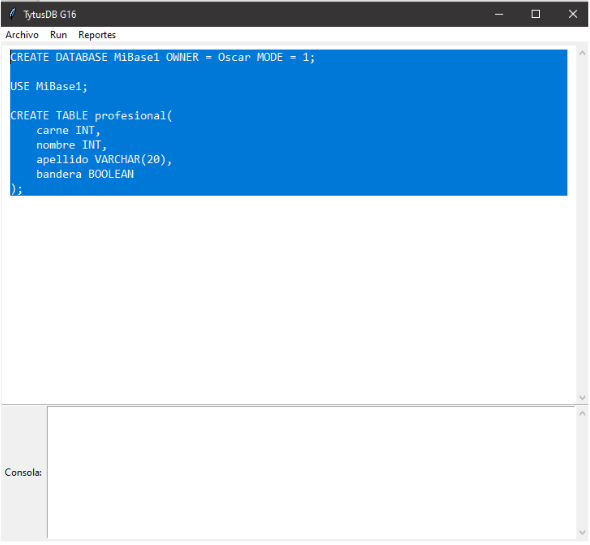
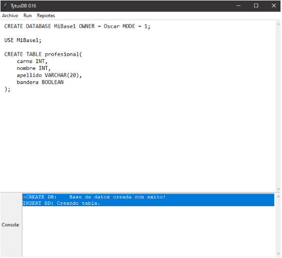
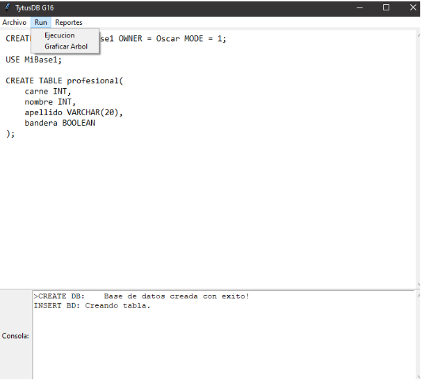
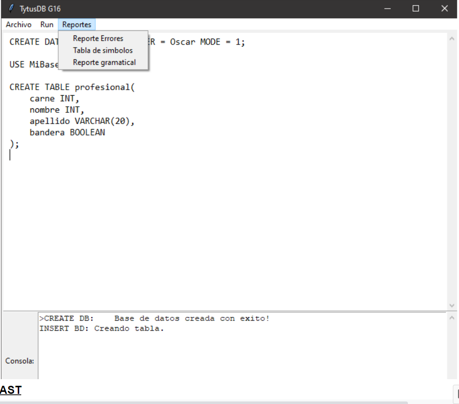
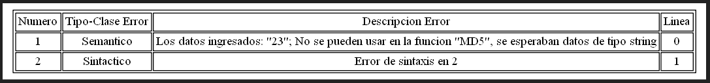

# Manual de Usuario

## Descripcion
Como estudiantes de la facultad de ingenieria de ciencias y sistemas y aplicando nuestros conocimientos, con las diferentes herramientas tales como Python, diferentes bibliotecas, PLY, entre otras se crea el proyecto llamado Tytus el cual es un proyecto Open Source para desarrollar un administrador de bases de datos. Está compuesto por tres componentes interrelacionados: el administrador de almacenamiento de la base de datos, que estará a cargo del curso de Estructuras de Datos; El proyecto cuenta con una interfaz agradable al usuario y fácil de comprender al igual en este manual se detallara el uso del mismo

## Vista Principal
El programa cuenta con una vista inicial agradable al usuario el cual nos invita a manipular y crear una base de datos donde podemos implementar cualquier tipo de comando que en una base de datos se podría implementar.

  

## Editor
A continuación se presenta el editor de texto donde podemos ingresar cualquier tipo de instrucción adecuada a nuestra gramática y bien se ve reflejada la respuesta en nuestra consola cabe destacar que podemos seleccionar solo la parte que podemos ejecutar o bien ejecutar todo de una sola vez.

  

## Consola

Nuestro proyecto cuenta con una consola inteligente la cual nos muestra todos los resultados de nuestra ejecución, al igual los errores y los print de notificación exitosa en cualquiera de los casos o instrucciones ingresadas.

  

## Menu y Caracteristicas

Contamos con diferentes características y modalidades en nuestro menu tales como
- Nuevo: Nos permite abrir un nuevo editor en blanco
- Abrir:   Nos permite abrir cualquier tipo de archivo de entrada
- Guardar: Nos permite guardar lo que contiene el editor en ese momento

  

- Ejecucion: Nos permite ejecutar lo que contiene el editor en ese momento o bien lo seleccionado por el usuario. 
- Graficar Arbol: Nos permite ejecutar y visualizar la grafica del AST

  

## Reportes
Contamos con una sección de reportería la cual nos ayuda a generar los diferentes tipos de reportes que a continuación se detallan.

  

### AST
En lenguajes formales y lingüística computacional, un árbol de sintaxis abstracta (AST), o simplemente un árbol de sintaxis, es una representación de árbol de la estructura sintáctica simplificada del código fuente escrito en cierto lenguaje de programación. Cada nodo del árbol denota una construcción que ocurre en el código fuente. La sintaxis es abstracta en el sentido que no representa cada detalle que aparezca en la sintaxis verdadera.

  

### Tabla de Simbolos

La tabla de símbolos es una estructura de datos que se crea en tiempo de traducción del programa fuente. Es como un diccionario variable, debe darle apoyo a la inserción, búsqueda y cancelación de nombres (identificadores) con sus atributos asociados, representando las vinculaciones con las declaraciones. Debe aclararse que no necesariamente deberá estar representada en una tabla como su nombre indica ya que también se emplean árboles, pilas , etc.

  

### Reporte de Errores
Los errores léxicos, sintácticos y semánticos se detectan cuando el analizador léxico intenta reconocer componentes léxicos y la cadena de caracteres de la entrada no encaja con ningún patrón. Son situaciones en las que usa un carácter inválido (@, $,",>,...), que no pertenece al vocabulario del lenguaje de programación

  

### Reporte Gramatical

  

