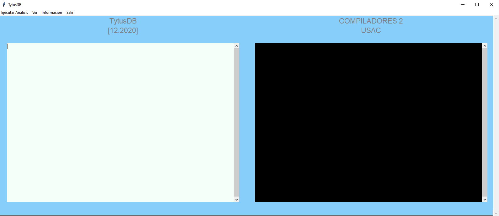
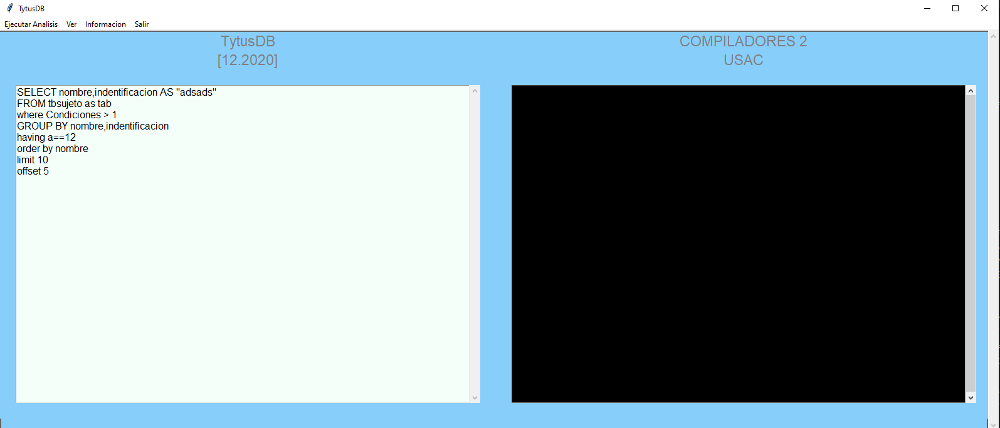
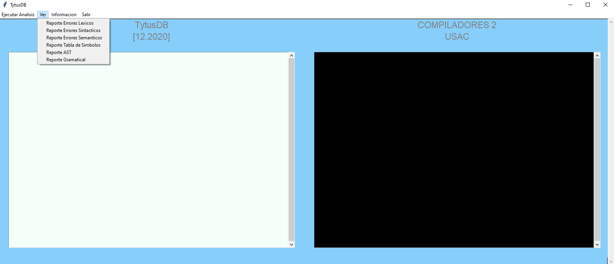
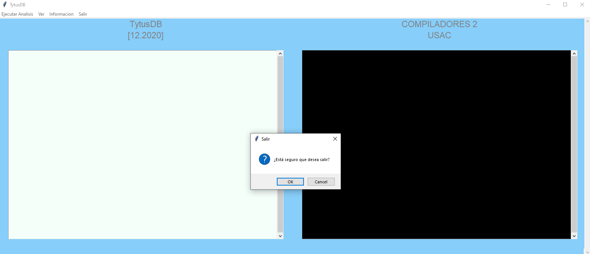

# Manual de Usuario: *TytusDB*
    Universidad de San Carlos de Guatemala
    Facultad de ingeniería
    Escuela de Ciencias y Sistemas 
    781 Organización de lenguajes y compiladores 2
    Manual de usuario proyecto 1
                 
***
## Competencias del proyecto:
### *General:*
- Poner en práctica los conocimientos teóricos adquiridos durante cada curso y aplicarlo a un proyecto real de código abierto fortaleciendo las competencias de administración de equipos de desarrollo.
### *Específico:*
- El estudiante construye un intérprete para el subconjunto del lenguaje SQL mediante la traducción dirigida por la sintaxis.
- El estudiante utiliza la herramienta PLY o SLY de Python para la traducción.

 
***
## Descripcion de TytusDB:
Es un proyecto Open Source para desarrollar un administrador de bases de datos. Está compuesto por tres componentes interrelacionados: el administrador de almacenamiento de la base de datos, que estará a cargo del curso de Estructuras de Datos; el administrador de la base de datos, que estará a cargo del curso de Sistemas de Bases de Datos 1, este administrador se compone a su vez de un servidor y de un cliente; y el SQL Parser, que estará a cargo del curso de Organización de Lenguajes y Compiladores 2.

---
## Lenguaje Python

Python es un lenguaje de scripting independiente de plataforma y orientado a objetos, preparado para realizar cualquier tipo de programa, desde aplicaciones Windows a servidores de red o incluso, páginas web. Es un lenguaje interpretado, lo que significa que no se necesita compilar el código fuente para poder ejecutarlo, lo que ofrece ventajas como la rapidez de desarrollo e inconvenientes como una menor velocidad.

En los últimos años el lenguaje se ha hecho muy popular, gracias a varias razones como:
- La cantidad de librerías que contiene, tipos de datos y funciones incorporadas en el propio lenguaje, que ayudan a realizar muchas tareas habituales sin necesidad de tener que programarlas desde cero.
- La sencillez y velocidad con la que se crean los programas. Un programa en Python puede tener de 3 a 5 líneas de código menos que su equivalente en Java o C.
- La cantidad de plataformas en las que podemos desarrollar, como Unix, Windows, OS/2, Mac, Amiga y otros.
- Además, Python es gratuito, incluso para propósitos empresariales.

### Características del lenguaje
#### Propósito general
Se pueden crear todo tipo de programas. No es un lenguaje creado específicamente para la web, aunque entre sus posibilidades sí se encuentra el desarrollo de páginas.

#### Multiplataforma
Hay versiones disponibles de Python en muchos sistemas informáticos distintos. Originalmente se desarrolló para Unix, aunque cualquier sistema es compatible con el lenguaje siempre y cuando exista un intérprete programado para él.

#### Interpretado
Quiere decir que no se debe compilar el código antes de su ejecución. En realidad sí que se realiza una compilación, pero esta se realiza de manera transparente para el programador. En ciertos casos, cuando se ejecuta por primera vez un código, se producen unos bytecodes que se guardan en el sistema y que sirven para acelerar la compilación implícita que realiza el intérprete cada vez que se ejecuta el mismo código.

#### Interactivo
Python dispone de un intérprete por línea de comandos en el que se pueden introducir sentencias. Cada sentencia se ejecuta y produce un resultado visible, que puede ayudarnos a entender mejor el lenguaje y probar los resultados de la ejecución de porciones de código rápidamente.

#### Orientado a Objetos
La programación orientada a objetos está soportada en Python y ofrece en muchos casos una manera sencilla de crear programas con componentes reutilizables.

#### Funciones y librerías
Dispone de muchas funciones incorporadas en el propio lenguaje, para el tratamiento de strings, números, archivos, etc. Además, existen muchas librerías que podemos importar en los programas para tratar temas específicos como la programación de ventanas o sistemas en red o cosas tan interesantes como crear archivos comprimidos en .zip.

#### Sintaxis clara
Por último, destacar que Python tiene una sintaxis muy visual, gracias a una notación identada (con márgenes) de obligado cumplimiento. En muchos lenguajes, para separar porciones de código, se utilizan elementos como las llaves o las palabras clave begin y end. Para separar las porciones de código en Python se debe tabular hacia dentro, colocando un margen al código que iría dentro de una función o un bucle. Esto ayuda a que todos los programadores adopten unas mismas notaciones y que los programas de cualquier persona tengan un aspecto muy similar.

---

## Plataforma de Desarrollo (VC)

Version: 1.52.0 (user setup)
Commit: 940b5f4bb5fa47866a54529ed759d95d09ee80be
Date: 2020-12-10T22:45:11.850Z
Electron: 9.3.5
Chrome: 83.0.4103.122
Node.js: 12.14.1
V8: 8.3.110.13-electron.0
OS: Windows_NT x64 10.0.18363

---

## ¿Como funciona el programa?
#### Paso 1: Inicia tu aplicación TytusDB

  

#### Paso 2: Ingresa en el area de texto tus instrucciones SQL.

  

    Ejecuta tus instrucciones SQL oprimiendo la opción 'EJECUTAR ANALISIS'.

#### Paso 3: El programa tiene funciones como:

   Reporte de Errores Léxicos,
   Reporte de Errores Sintácticos,
   Reporte de Errores Semánticos,
   Reporte de Tabla de Símbolos,
   Entre otros...

  

  Información de los contribuidores

  

  Opción de salida 

  

