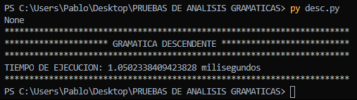
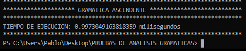

# ¿ QUE GRAMATICA USAR DESCENDENTE O ASCENDENTE?

---

la sintaxis le da a un programador, el formato de lo se desea describir ya sea por:

- esquemas sintacticos
- diargramas sintacticos

pero en este caso nos enfocamos en la gramatica , pues segun la gramatica definiremos que analisis sintactico utilizar.

### ¿Que es una Gramatica?

es aquella que describe las reglas para verficar el orden estructural del lenguaje.

la cual esta compuesta por:

- simbolos terminales
- simbolos NO terminales
- reglas de produccion
- Simbolo distinguio o axioma inicial

### ¿Que es un analizadorr sintactico?

basicamente es una parte del compilador que transforma una entrada a un arbol de derivacion, donde la sintaxis se define por medio de gramaticas libres de contexto , estas a su vez se dividen en dos tipos las LR (ascendentes) y las LL(descendentes).

para el presente proyecto se exponen los puntos positivos y negativos de las 2 posibles gramaticas a utizar con el unico fin de determinar la mejor gramatica libre de contexto para un lenguaje como sql a su vez considerando que la herramienta a utilizar es PLY (libreria perteneciente al lenguaje de programacion python).

## <center>ANALISIS TEORICO</center>

**DESCENDENTE (TOP - DOWN)** :
Es un analizador sintactico que se construye de la raiz hacia las hojas , lo malo de esto es que utiliza más reglas.
es facil de implementar de manera manual , es decir sin herramientas como se menciono anteriormente con mas reglas , el trabajo es mas extenso, ademas que para simular atributos heredados se tendria que recorrer su arbol sintactico dos veces , por lo tanto se utilizarian usando recursos de mas , Este analizador posee mas reglas ya que utiliza un retroceso para resolver su incertidumbre , en realcion con la herramienta de PLY utiliza a la pila lo cual no es un punto no favorable porque PLY fue hecho nativamente para utilizarse con gramaticas ascendentes por esa razon no seria muy favorable utilizar este tipo de gramatica en el presente proyecto.

**ASCENDENTE (BOTTOM-UP)** :
En el analizador sintactico ascendente el arbol se construyo de las hojas hacia la raiz ademas en este tipo de analizador el numero de reglas es menor por tanto se puede implementar con menos trabajo , generalmente las herramientas ( como en el caso de PLY ) utilizan este tipo de analizador porque soportan una mayor gama de gramaticas es decir, que su alcance es mucho mayor al de los analizadores LL.

---

## <center> ANALISIS PRACTICO </center>

> GRAMATICA DESCENDENTE EJEMPLO

\<init> ::= \<instruccion> \<intrucionP>

\<intrucionP> ::= \<instruccion> \<intrucionP>| epsilon

\<instruccion> ::= UPDATE ID SET UPDATE listaAsignaciones ;

```
def p_init(p):
   'init : instruccion instruccionesP'

def p_instrucciones(p):
   '''instruccionesP : instruccion instruccionesP '''

def p_instrucciones_epsilon(p):
   'instruccionesP :' # EPSILON
   pass

def p_instruccion(p):
   '''instruccion :   UPDATE ID SET  ID IGUAL ID listaAsignaciones PTCOMA'''

def p_listaAsignaciones(p):
   'listaAsignaciones : COMA ID IGUAL ID  listaAsignaciones'

def p_lista_ids_epsilon(p):
   'listaAsignaciones :'# EPSILON
   pass

def p_error(p):
   print(p)
   print("Error sintáctico en '%s'" % p.value)


```

> GRAMATICA ASCENDENTE EJEMPLO

```
def p_init(p):
    'init : instrucciones'

def p_instrucciones_list(p):
    '''instrucciones    : instrucciones instruccion '''

def p_instrucciones_instruccion(p):
    'instrucciones  :   instruccion'

def p_instruccion(p):
    '''instruccion :  sentenciaUpdate PTCOMA
                    | sentenciaDelete PTCOMA
                    | sentenciaInsert PTCOMA'''

def p_update(p):
    '''sentenciaUpdate : UPDATE ID SET lista_asignaciones  '''

def p_lista_asignaciones(p):
    '''lista_asignaciones : lista_asignaciones COMA asignacion
                          | asignacion'''
def p_asignacion(p):
    ''' asignacion : ID IGUAL ID'''

def p_error(p):
    print(p)
    print("Error sintáctico en '%s'" % p.value)

```

```
# entrada a probar tanto descendete como para ascendente
print(analizarEntrada('''
update tabla set campo = id  ;
update tabla set c1 = id2 ;
update tabla set c1 = id3 ;
update tabla set c1 = id4 ;
update tabla set c1 = id5 ;
update tabla set c1 = id6 ;
update tabla set c1 = id7 ;
update tabla set c1 = id8 ;
update tabla set c1 = id9 ;
update tabla set c1 = id10 ;
'''))

```

### RESULTADO DEL TIEMPO DE EJECUCION CON LA GRAMATICA DESCENDENTE



### RESULTADO DEL TIEMPO DE EJECUCION CON LA GRAMATICA ASCENDENTE



## **CONCLUSION**:

utilizar una gramatica ascendente es lo que mas conviene en este caso por sus multiples virtudes mencionadas anteriormente , ademas de el ahorro de recursos, siendo esta la mas eficientepara dar  el mejor rendimiento en el proyecto.
