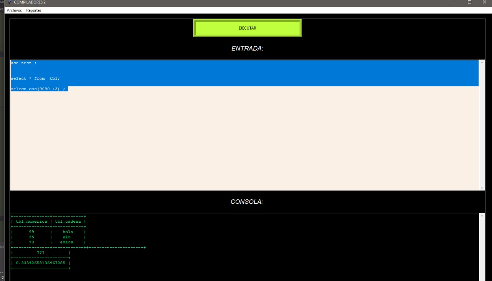
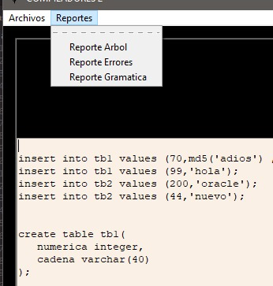
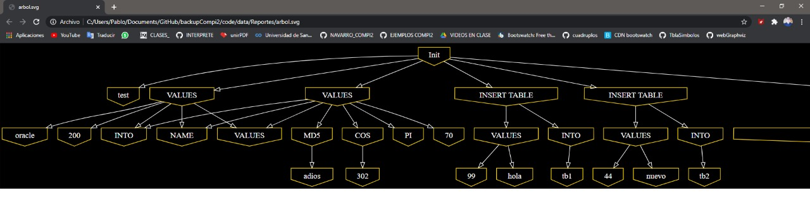

# MANUAL DE USUARIO
## Interfaz gráfica

### Entrada
La interfaz posee un textarea en donde se puede insertar codigo sql
### BOTON EJECUTAR
El boton verde situado en la parte superior de la interfaz, ejecuta el codigo sql seleccionado por el puntero.
### Menú botones
 
1. Reporte Arbol: Genera un svg con el AST generado.
    
2. Reporte Errores: Genera un html con los errores de la entrada.
3. Reporte gramatica: Genera el recorrido de la gramática al leer la entrada.
