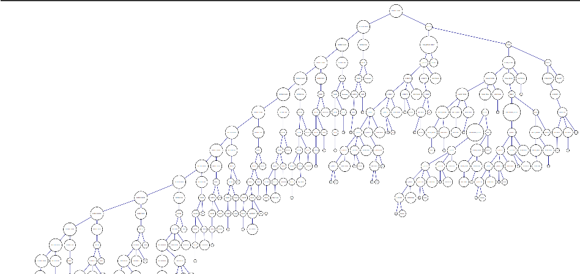

# MANUAL TECNICO
[](https://pypi.org/project/prettytable/)
---
### Desarrolladores
* 201800580 CHRISTIAN ESTUARDO MAZARIEGOS RIZO
* 201800587 MIGUEL ESTEBAN ALVARADO MONROY
* 201800600 LENIN LUIS ERNESTO CALDERÓN MÉNDEZ
* 201800624 CARLOS AGUSTÍN CHÉ MIJANGOS
---
## Introduccion
Como parte de nuestro aprendisaje en compiladores en la escuela de ciencias y sistemas se formulo la creacion de una aplicacion que sirviera como un DBMS para unir el conocimiento de almacenamiento en estructuras de datos de nuestros compañeros de EDD y el conocimiento sobre SQL de nuestros compañeros de BD1.
De esta manera la aplicacion Tytus recibira consultas, validando su analisis lexico, sintactico y semantico tomando como guia la gramatica que posee PostgreSQL
---
## Tecnologias
- PLY: Generador de analizadores léxicos y sintácticos.
- Graphviz : Generador de imagenes a base de codigo.
- Windows 10 : SO  .
- Python : Es un lenguaje de programación interpretado de alto nivel.
- Visual Studio Code: Es un editor de código ligero pero poderoso. Existen complementos para trabajar con este lenguaje.
- tkinter : Paquete utilizado para la cracion de la interfaz
- prettytable : Libreria utilizada para tabular los datos de una forma mas entendible
---
## Analizadores
El analizador utilizado es PLY, que es una herramienta que se utiliza en python, que esta basado en Lex y Yacc que son de el lenguajes C.
 
---

## Tokens
Es el conjunto de lexemas que se utilizaran en nuestro lenguaje, estos son declarados de la siguiente manera:
    ``` 
    
    tokens = [
    'PLECA',
    'AMPERSON',
    'NUMERAL',
    'VIRGULILLA'
    ]
    t_PLECA         = r'\|'
    t_AMPERSON      = r'&'
    t_VIRGULILLA    = r'~'
    t_NUMERAL       = r'\#'
    
    ```
---

## Palabras Reservadas
Son todas aquellas palabras que tiene que venir obligatoriamente en nuestro lenguaje, su declaracion es de la sigueinte manera:

```
reservadas = {
    'smallint' : 'SMALLINT',
    'integer' : 'INTEGER',
    'bigint' : 'BIGINT',
    'decimal' : 'DECIMAL',
    'numeric' : 'NUMERIC'
    }
```

---

## Manejo de Errores Lexicos
Los errores Lexicos son manejados por una funcion dentro de nuestro analizador sintactico, la cual es :

```
def t_error(t):
    description = "Error lexico con -> " + t.value
    mistake = error("Lexico", description, str(t.lineno))
    errores.append(mistake)
    t.lexer.skip(1)
```
Para finalizar la creacion del analizador lexico se declara de la siguiente manera:

```
import Librerias.ply.lex as lex
lexer = lex.lex()
```

---
## Analizador Sintactico
El analizador sintactico o mas conocido como parser, se encarga de validar el orden de cada una de las palabras reservadas y tokens, junto con nuestras expreciones regulares, este nos devolvera una arbol sintactico el cual nos servira para interpretar semanticamente.

---
## Manejo de Errores Sintacticos
Los errores Lexicos son manejados por una funcion dentro de nuestro analizador sintactico, la cual es :

```
def p_error(t):
    description = "Error sintactico con: " + t.value
    mistake = error("Sintactico", description, str(t.lineno))
    errores.append(mistake)
```
Para finalizar la creacion del analizador sintactico se declara de la siguiente manera:

```
import Librerias.ply.yacc as yacc
parser = yacc.yacc()

def parse(input) :
    return parser.parse(input)
```
---
## Clases Abstractas
---
### Instruccion
La creacion de la clase instruccion que va a ser la clase que hereda a las demas clases con un metodo execute que va a ser utilizada al momento de realizar el interprete del codigo recibido, asi mismo se hara ejecucion de eso.

```
class Instruccion:
    'Clase abstracta de instruccion'
    def __init__(self, type, line, column):
        self.type = type
        self.line = line
        self.column = column

    def execute(self):
        return self.val

    def __repr__(self):
        return str(self.__dict__)
```
---
### Expresion
Asi como las instrucciones, expresion es una clase abstracta que hereda a cadauna de las funciones que se pueden utilizar al momento de hacer expresiones de los tipos:

- Aritmeticas
- Condicionales
- Identificadores
- Logicas
- Primitivas
- De tipos

---
### AST
Recorriendo el arbol sintactico nodo por nodo podemos interpretar cada una de las instrucciones que reconocemos, esto se maneja en el analizador sintactico.


---
