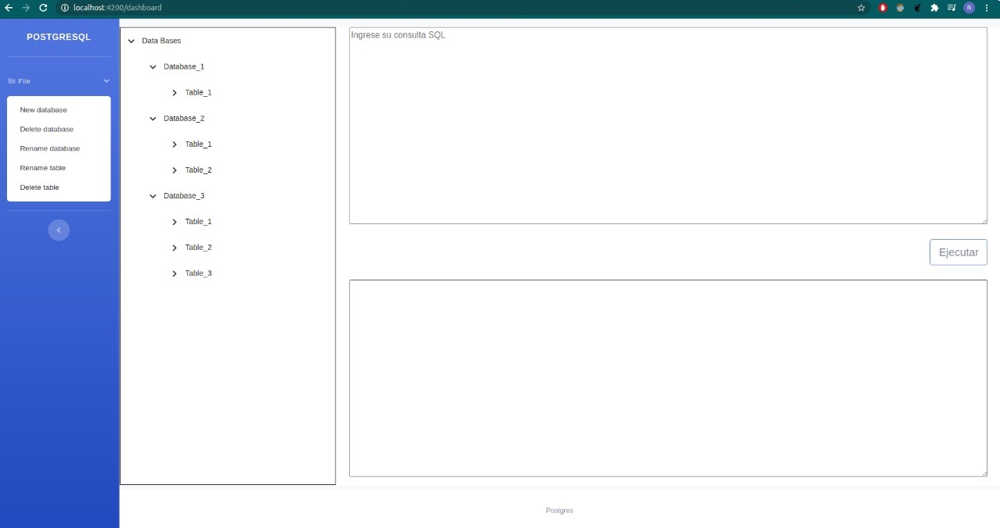
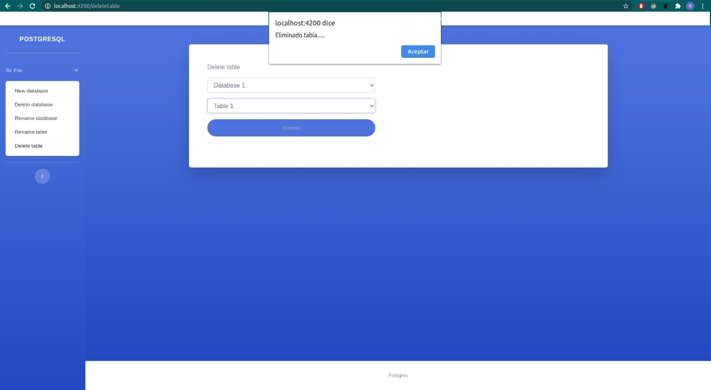

# Manual de Usuario Grupo 3

Universidad de San Carlos de Guatemala  
Facultad de Ingeniería  
Cursos: 774 Sistemas de Bases de Datos 1 
Diciembre 2020

## Integrantes
Carné | Nombre Completo
-- | --
201503922 | Julio Roberto Garcia Escalante
201504444 | Christian Enrique Ramos Alvarez
201513747 | Ricardo Humberto Fuentes Garcia
201520498 | Edgar Rolando Herrera Rivas


# Fase II
## Vistas del Proyecto
A continuacion se detalla las vistas principales que cuenta el proyecto de Tytus en su primera fase, asi como una pequeña serie de pasos que puede realizar para poder entender y utilizar de mejor manera la aplicacion

### Pantalla Principal de Tytus
Esta pantalla es la pantalla principal que el usuario podra observar al ingresar a la aplicacion.
Donde se podran encontrar diversas opciones como:
* Menu File
* Tree control
* Consola de Query
* Consola de resultado de Query

En estas opciones el usuario podra navegar libremente y podra interactuar con el sistema de base de datos con el que cuenta actualmente



### Creacion de Base de Datos
* **Paso 1:** Se dirige al apartado para agregar una nueva base de datos
* **Paso 2:** Escribe el nombre de la nueva base de datos a crear
* **Paso 3:** Despliega el menu de File del lado derecho de la pantalla
* **Paso 4:** Selecciona en la opcion de **New database**
* **Paso 5:** Aparecera un mensaje en la pantalla principal avisando la nueva creacion
* **Paso 6:** La base de datos sera creada correctamente


### Ejemplo de Entrada Creacion de Base de Datos 

```sql 
CREATE DATABASE IF NOT EXISTS test
    OWNER = 'root'
    MODE = 1;
```

*foto de las respuestas*

### Eliminacion de Base de Datos
* **Paso 1:** Se dirige al apartado para eliminar una base de datos
* **Paso 2:** Escribe el nombre de la base de datos a eliminar
* **Paso 3:** Despliega el menu de File del lado derecho de la pantalla
* **Paso 4:** Selecciona en la opcion de **Delete database**
* **Paso 5:** Aparecera un mensaje en la pantalla principal avisando la eliminacion
* **Paso 6:** La base de datos sera eliminada de su sistema


### Ejemplo de Eliminacion de una Base de Datos 


```sql 
DROP DATABASE  IF EXISTS  califica2;
```
*foto de las respuestas*


### Modificacion de Base de datos
* **Paso 1:** Se dirige al apartado para Cambiar de nombre una base de datos
* **Paso 2:** Selecciona la base de datos que se desea cambiar el nombre
* **Paso 3:** Escribe el nombre de la base de datos a renombrar
* **Paso 4:** Despliega el menu de File del lado derecho de la pantalla
* **Paso 5:** Selecciona en la opcion de **Rename database**
* **Paso 6:** Aparecera un mensaje en la pantalla principal avisando el renombramiento
* **Paso 7:** La base de datos obtendra el nuevo nombre escrito en el paso 3


### Ejemplo de modificacion del nombre de la base de datos 


```sql 
ALTER TABLE tbusuario
```
*foto de las respuestas*


### Modificacion Tablas
* **Paso 1:** Se dirige al apartado para renombrar una tabla
* **Paso 2:** Selecciona la base de datos donde se encuentre dicha tabla
* **Paso 3:** Selecciona la tabla que desea cambiar el nombre
* **Paso 4:** Escribe el nombre de la nueva tabla
* **Paso 5:** Despliega el menu de File del lado derecho de la pantalla
* **Paso 6:** Selecciona en la opcion de **Rename table** 
* **Paso 7:** Aparecera un mensaje en la pantalla principal avisando la modificacion
* **Paso 8:** La tabla seleccionada en el paso 3 tendra el nuevo nombre del paso 4


### Ejemplo de Eliminacion de una Base de Datos 


```sql 
ALTER DATABASE olddbname RENAME TO newdbname;
```

*foto de las respuestas*


### Eliminacion Tablas
* **Paso 1:** Se dirige al apartado para eliminar una tabla
* **Paso 2:** Selecciona la base de datos donde se encuentra la tabla a eliminar
* **Paso 3:** Selecciona la tabla que se desea eliminar
* **Paso 4:** Despliega el menu de File del lado derecho de la pantalla
* **Paso 5:** Selecciona en la opcion de **Delete table**
* **Paso 6:** Aparecera un mensaje en la pantalla principal avisando la eliminacion
* **Paso 7:** La tabla sera eliminada de su sistema




### Ejemplo de Eliminar una Tabla 

```sql 
drop table tbempleadoidentificacion;
```
*foto de las respuestas*

