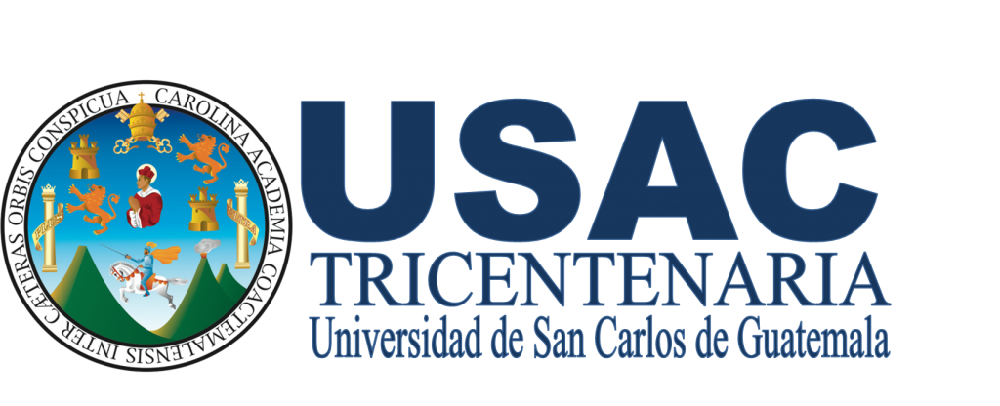

# MANUAL TÉCNICO 

UNIVERSIDAD DE SAN CARLOS DE GUATEMALA  
FACULTAD DE INGENIERÍA  
ESCUELA DE CIENCIAS Y SISTEMAS  
CURSO: ESTRUCTURA DE DATOS
___

  

## GRUPO 01 
* 9213640		Edwin Mauricio Mazariegos 
* 200915715		Edgar Enrique Patzan Yoc 
* 201213010		Gabriel Orlando Ajsivinac Xicay 
* 201213212		Walter Manolo Martinez Mateo 
___

- Enuncido del proyecto [enunciado]( https://github.com/tytusdb/tytus/blob/main/docs/README.md)
___

## Introducción

El presente documento detalla los elementos técnicos utilizados para la funcionalidad de este proyecto. 
También expone las tecnologías que fueron utilizadas durante la realización del proyecto.

Busca ser un complemente para proveer funciones necesarias para ser usada como un DBMS, esto será utilizado para otros estudiantes, para construir un lenguajebasado en SQL, que consumira las funciones de esta librería.

La biblioteca utilizada pretende contar con las fucioens de un DBMS como MySQL, entre ellas funciones de cirptogrfía, enconding y compresipon de datos.

___

## Objetivos
### General
En esta actualización se busca proporcionar una herramienta eficaz y completa que permita la gestión y control de datos a un nivel eficiente y funcional. 
Se espera que las nuevas funciones implementadas puedan mejorar el rendimiento, soporte y alojamiento a la funcion que se desea guardar en la base de datos.
### Específico
-	Brindar un servicio funcional.
-	Permitir que los recursos consumidos para administrar este gestor sean bajos.
-	Permitir la selección de diferentes modos de almacenamiento.
-	Proporcionar segurid de la informacion que se almacena.

___

## Desarrollo del entorno
- Software utilizado: Visual Studio Code
- Lenguaje utilizado: Python
	- Visual studio Code:  es un editor de código fuente desarrollado por Microsoft para Windows, Linux y macOS. Incluye soporte para la depuración, control integrado de Git, resaltado de sintaxis, finalización inteligente de código, fragmentos y refactorización de código. También es personalizable, por lo que los usuarios pueden cambiar el tema del editor, los atajos de teclado y las preferencias. Es gratuito y de código abierto, aunque la descarga oficial está bajo software privativo e incluye características personalizadas por Microsoft.
	- Python: es un lenguaje de programación interpretado cuya filosofía hace hincapié en la legibilidad de su código. Se trata de un lenguaje de programación multiparadigma, ya que soporta orientación a objetos, programación imperativa y, en menor medida, programación funcional. Es un lenguaje interpretado, dinámico y multiplataforma.

## Requerimientos funcionales
-	Para crear una base de datos debe enviar un nombre, el cual no debe existir ya almacenado.
-	Los datos ingresados deben cumplir con la codificación de la base de datos.
-	Para crear una tabla debe enviar el nombre de la base de datos, nombre de la tabla y numero de columna.
-	Los nombre de las bases de datos y nombre de las tablas deben respetar las reglas de nombrado.

## Atributos del sistema
-	Las funciones implementadas retornan valores numéricos para informar el estado de la operación.
-	Los valores de retorno podran ser consultadas en el docstring de TytusStorage.
-	Todas las estructuras proveerán un alojamiento seguro y eficiente.
-	Las estructuras serán capáz de evitar el duplicado de los datos.
-	Proporcionará métodos de detección de cambios, para mantener la información segura.

## Funciones agregadas
-	def alterDatabaseMode(database: str, mode: str) -> int: cambia el modo de almacenamieto de una base de datos.
-	def alterTableMode(database: str, table: str, mode: str) -> int: cambia el modo de almacenamiento de una tabla.
-	def alterTableAddFK(database: str, table: str, indexName: str, columns: list,  tableRef: str, columnsRef: list) -> int: agrega indices de llave foranea.
-	def alterTableDropFK(database: str, table: str, indexName: str) -> int: destruye el indice de la tabla. 
-	def alterTableAddUnique(database: str, table: str, indexName: str, columns: list) -> int: agrega un indice unico.
-	def alterDatabaseEncoding(database: str, encoding: str) -> int: codifica una base de datos.
-	def checksumDatabase(database: str, mode: str) -> str: genera diggest a partir del contenido de la base de datos.
-	def checksumTable(database: str, table:str, mode: str) -> str: genera un digggest a partir del contenido de la tabla.
-	def encrypt(backup: str, password: str) -> str: cifra el texto backup con la llave password y devuelve el criptograma.
-	def decrypt(cipherBackup: str, password: str) -> str: desifra el texto cipherBackup con la llave password y devuelve el texto plano.