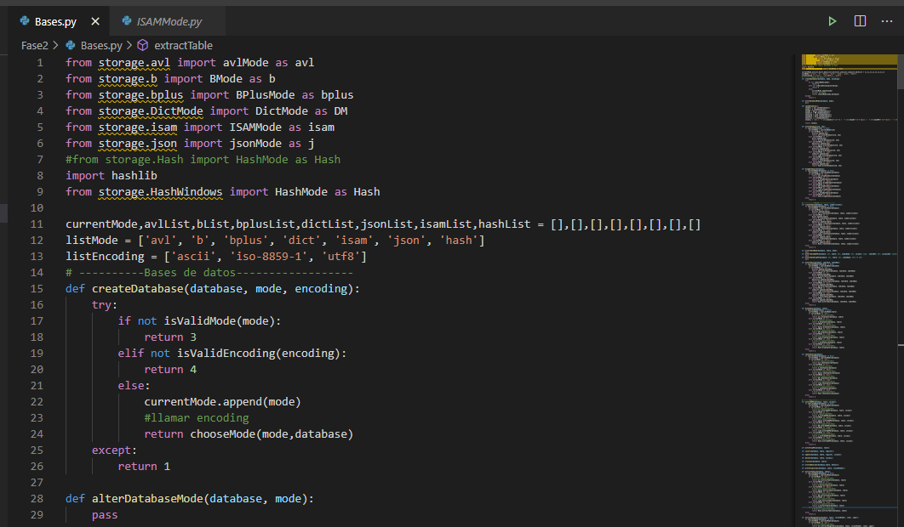
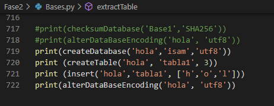

#      MANUAL TECNICO

* Universidad de San Carlos de Guatemala
* Facultad de ingeniería 
* Estructuras de Datos 
* Grupo 2 

  

## Indice 
- [Integrantes](#integrantes).
- [Introducción](#introducción).
- [Requerimientos](#requerimientos)
- [Unificación](#unificación).
- [Visualización](#visualización).

## Integrantes 

* 201318564 BRIAN STEVE MORALES SAMAYOA 
* 201403770 EDGAR OVIDIO PÉREZ JIMÉNEZ 
* 201404334 JORGE LUIS ARGUETA RIVERA 
* 201503431 GLEIMY ROSMERY POLANCO IXQUIAC 
* 201503445 DIEGO ALEJANDRO FLORES AVILA

## Introducción 

Las estructuras de Datos del programa TYTUS DB están realizadas a través de la unifiación de los 7 modos de BD indicados, las cuales cumplen con la función destinada para cada sección, 
siendo estas la creación de una base de datos, eliminar la misma, agregar, crear tablas y columnas, establecer llave primaria, Extraer información.
Agregando Grafos, Blockchain, codificación y encriptación. 

## REQUERIMIENTOS 

*	Python 3.6 o versiones superiores  
*	Graphviz 
*	Importaciones de librerías Python 
*	Visual Studio Code 
* La instalación de Phyton 3.6 o sus versiones siguientes se pueden realizar , siguiendo este enlace: https://www.python.org/downloads/ 
* Documentación de Graphviz para Python: https://pypi.org/project/graphviz/
* Instalación de Visual Studio Code (es recomendable pero no obligatorio del uso de este): https://code.visualstudio.com/download  

## Unificación 

  

En una clase llamada "Bases.py" , se importaron los modos que se realizarón en la fase I , en esta también se realizarón todos los metodos indicados para que funcione 
con todos los modos cuando el usuario lo desee. 

## Pruebas

  

Para realizar pruebas de los modos y las validaciones, hasta el final del código se pueden llamar los métodos y poder verificar cada uno de ellos. 
