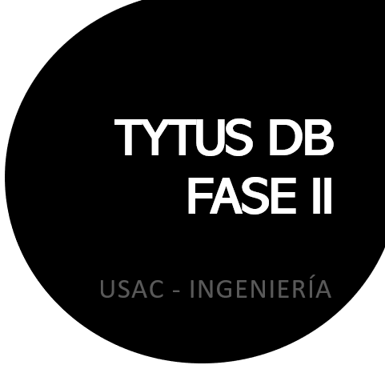
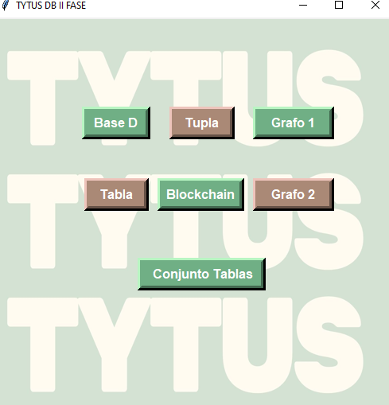

#      MANUAL USUARIO

* Universidad de San Carlos de Guatemala
* Facultad de ingeniería 
* Estructuras de Datos 
* Grupo 2 

  

## Indice 
- [Integrantes](#integrantes).
- [Requerimientos](#requerimientos)
- [Funciones](#funciones).
- [Visualización](#visualización).

## Integrantes 

* 201318564 BRIAN STEVE MORALES SAMAYOA 
* 201403770 EDGAR OVIDIO PÉREZ JIMÉNEZ 
* 201404334 JORGE LUIS ARGUETA RIVERA 
* 201503431 GLEIMY ROSMERY POLANCO IXQUIAC 
* 201503445 DIEGO ALEJANDRO FLORES AVILA

## REQUERIMIENTOS 
*	Python 3.6 o versiones superiores  
*	Graphviz 
*	Importaciones de librerías Python 
*	Visual Studio Code 
* La instalación de Phyton 3.6 o sus versiones siguientes se pueden realizar , siguiendo este enlace: https://www.python.org/downloads/ 
* Documentación de Graphviz para Python: https://pypi.org/project/graphviz/
* Instalación de Visual Studio Code (es recomendable pero no obligatorio del uso de este): https://code.visualstudio.com/download  

## Funciones

En la segunda Fase del programa  "TYTUS-DB", se generan las siguientes implementaciones: 

#### Primero 
El Usuario puede seleccionar cual es el tipo de base de datos que quiere realizar, siendo 7 modos en los que puede elegir. 

#### Segundo 
Se pueden crear Bases de Datos de la misma manera que en la Fase 1 , con la indicación que ahora se puede seleccionar el modo. 

#### Tercero 
El storageManager permite cambiar el modo de almacenamiento de una base de datos o de una tabla en cualquier momento.

## Visualización

  

En la ventana se puede elegir cual es el tipo de acción que queremos realizar, al momento de seleccionar el botón que deseamos,  esta mostrará lo que se solicita. 
