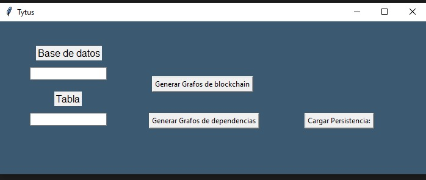
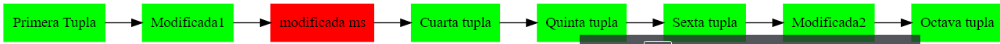

###### UNIVERSIDAD DE SAN CARLOS DE GUATEMALA
###### FACULTAD DE INGENIERÍA
###### INGENIERÍA EN CIENCIAS Y SISTEMAS
###### ESTRUCTURAS DE DATOS
###### SECCIÓN A
___
###### EQUIPO: 10
___
***

# **MANUAL DE USUARIO**

## INDICE
- Introducción 
- Guía Rápida
- Reportes y Pantallas
- Glosario
- Información de Contacto
___
## **Introducción**
### DESCRIPCIÓN DE LA SOLUCIÓN
TytusDB es un sistema de administrador de bases de datos que permite al usuario elegir el modo de almacenamiento a utilizar para guardar su información, además de contar con varios sistemas de seguridad, de compresión, utilizados para verificar la integridad de la información. Además cuenta con un sistema de reportes gráficos que permiten visualizar las dependencias de las tabla, la estructura utilizada para el almacenamiento de la información, entre otras funciones. Además posee una interfaz gráfica para la rápida generación y visualización de reporte gráficos.

## **GUÍA RÁPIDA**
- La administración de las funciones de TytusDB por el momento solo son accesibles acerca de una archivo .py.
- La interfaz gráfica es unicamente para la visualización de los reportes graficos con los que cuenta Tytus.
- CARGA MASIVA, la carga masiva a la aplicación se realiza mediante un archivo CSV, mediante el cual se carga la información mediante la fución *loadCSV*
- PERSISTENCIA DE DATOS, la persistencia de datos se realizá automaticamente después de la ejecución de un método, dicha información será guardada en un archivo binario.

## **REPORTES Y PANTALLAS**
### Interfaz gráfica
Esta interfaz permite la generación y visualización de reportes graficos.

### BlockChain
Al romperse la cadena en el sistema de seguridad de Block Chain se genera un grafo el cual indica con color rojo los nodos donde se rompio la cadena.

### Reporte gráfico de una base de datos
Genera un reporte gráfico acerca de la base de datos seleccionada.

### Rerporte gráfico de las dependencias funcionales de una tabla
Genera un reporte gráfico acerca de las dependencias funcionales de una tabla especificada en una base de datos seleccionada.

### Reporte de grafos 

## **Glosario**
| Palabra | Definición |
| ------- | ---------- |
| BlockChain| Registro único consensuado y distribuido en varios nodos en una red. |
| Encriptar | Consiste en bloquear datos mediante un código secreto que oculta su verdadero significado. |
| Checksum | También llamado suma de verificación, es una función de redundancia que tiene como propósito principal detectar cambios accidentales en una secuencia de datos para proteger la integridad de estos, verificando que no haya discrepancias entre los valores obtenidos al hacer una comprobación inicial y otra final tras la transmisión. |
| Paquete | Datos enviados por una conexión entre dispositivos electrónicos. |
| Codificación | Es el método que permite representar la información utilizando un conjunto de símbolos que se combinan siguiendo determinadas reglas. |
| Compresión de datos | Es la reducción del volumen de datos tratables para representar una determinada información empleando una menor cantidad de espacio. |
| ASCII | Sistema de codificación de caracteres alfanuméricos que asigna un número del 0 al 127 a cada letra, numero o carácter especial recogidos. |
| UTF8 | Es un formato de codificación de caracteres unicode e iso 10646 que utiliza símbolos de longitud variable. |
| ISO 8859-1 | Es una norma de la ISO que define la codificación del alfabeto latino, incluyendo los diacríticos y letras especiales. |
| MD5 | Es un algoritmo de reducción criptográfico de 128 bits ampliamente usado. Uno de sus usos es el de comprobar que algún archivo no haya sido modificado. |

## **Información de Contacto**

- [Cristian Caceres](3741681720501@ingenieria.usac.edu.gt)
- [Jimmy Larios](2993047280101@ingenieria.usac.edu.gt)
- [Sergio Castro](3016834760101@ingenieria.usac.edu.gt)
- [Daniel Velásquez](3006875750101@ingenieria.usac.edu.gt)
