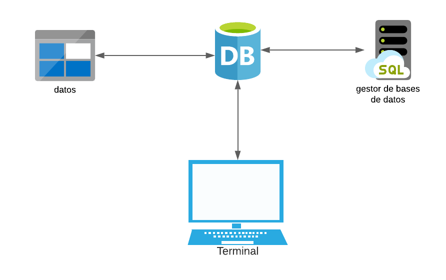

# Proyecto (FASE II)
**Descripción de solución**

**Almacenamiento**

Para el almacenamiento se utilizó una estructura arbórea compuesta por arboles avl como almacenamiento de los datos mas pequeños y para las tuplas que son normalmente donde más bifurcaciones se generan se utilizó un árbol b.

En el almacenamiento de árbol se tomo como la primera posición en ingresar seria la llave primaria de este nodo para así poder ordenarlo, el resto de las posiciones que se ingresen serán los datos, en caso del árbol b utilizamos uno de grado 3 para mayor facilidad del usuario para lectura de datos.

**Serialización**

Para el almacenamiento de los datos en la parte de memoria estática se utilizó la serialización en el nodo de bases de datos ya que este almacena toda la demás información, además con esta implementación de serialización surgió la oportunidad de decidir si hacer un commit o no en los archivos para tener mayor versatilidad a la hora de fallas, para la búsqueda de este archivo se convoca un método el cual convertirá su serie en nuestros datos anteriores en la estructura arbórea.

Requerimientos funcionales

| **Ref#** | **Función** | **Categoría** |
| --- | --- | --- |
| R1.1 | createDatabase | Evidente |
| R1.2 | alterDatabaseMode | Evidente |
| R1.3 | alterTableMode | Evidente |
| R1.4 | alterTableAddFK | Evidente |
| R1.5 | alterTableDropFK | Evidente |
| R1.6 | alterTableAddUnique | Evidente |
| R1.7 | alterTableDropUnique | Evidente |
| R1.8 | alterTableAddIndex | Evidente |
| R1.9 | alterTableDropIndex | Evidente |
| R1.10 | alterDatabaseEncoding | Evidente |
| R1.11 | checksumDatabase | Evidente |
| R1.12 | checksumTable | Evidente |
| R1.13 | alterDatabaseCompress | Evidente |
| R1.14 | alterDatabaseDecompress | Evidente |
| R1.15 | alterTableCompress | Evidente |
| R1.16 | alterTableDecompress | Evidente |
| R1.17 | encrypt | Evidente |
| R1.18 | decrypt | Evidente |
| R1.19 | safeModeOn | Evidente |
| R1.20 | safeModeOff | Evidente |
| R1.21 | graphDSD | Evidente |
| R1.22 | graphDF | Evidente |

Atributos del sistema

| REF# | Atributo |
| --- | --- |
| 1 | Interfaz amigable con el usuario |
| 2 | Software modular |
| 3 | Eficiente y versátil |
| 4 | Interoperable |
| 5 | Multiplataforma |

Glosario

1. **Interoperable:** capacidad que tiene un producto o un sistema, cuyas interfaces son totalmente conocidas, para funcionar con otros productos o sistemas existentes o futuros.
2. **Software:** es el equipamiento lógico del ordenador.
3. **Árbol b:** es un árbol que se subdivide en hojas y nodos.
4. **Árbol avl:** es un árbol que solo se subdivide por nodos.
5. **Diagrama de Flujo:** muestra la estructura general de un algoritmo.
6. **Commit:** guardado de un archivo en el cual hayamos realizado un cambio

Diccionario de funciones principales

| **createDatabase** | Crea una base de datos |

Funciones del administrador del modo de almacenamiento

| **Función** | **Definición** |
| --- | --- |
| **alterDatabaseMode** | Cambia el modo de almacenamiento de una base de datos |
| **alterTableMode** | Cambia el modo de almacenamiento de una tabla de una base de datos especificada |

Administración de índices

| **Función** | **Definición** |
| --- | --- |
| **alterTableAddFK** | Agrega un índice de llave foránea, creando una estructura adicional con el modo indicado para la base de datos |
| **alterTableDropFK** | Destruye el índice tanto como metadato de la tabla como la estructura adicional creada |
| **alterTableAddUnique** | Agrega un índice único, creando una estructura adicional con el modo indicado para la base de datos |
| **alterTableDropUnique** | Destruye el índice tanto como metadato de la tabla como la estructura adicional creada |
| **alterTableAddIndex** | Agrega un índice, creando una estructura adicional con el modo indicado para la base de datos |
| **alterTableDropIndex** | Destruye el índice tanto como metadato de la tabla como la estructura adicional creada |

Administración de la codificación

| **Función** | **Definción** |
| --- | --- |
| **alterDatabaseEncoding** | Asociada una codificación a una base de datos por completo |

Generación del Checksum

| **Función** | **Definción** |
| --- | --- |
| **checksumDatabase** | Genera un diggest a partir del contenido de la base de datos incluyendo sus tablas |
| **checksumTable** | Genera un diggest a partir del contenido de la tabla de una base de datos |

Compresión de datos

| **Función** | **Definción** |
| --- | --- |
| **alterDatabaseCompress** | Agregue compresión utilizando la biblioteca zlib de python y las funciones compress y decompress. Se debe agregar a columna tipo varchar o text de cada tabla de la base de datos. De igual manera, al extraer la información se debe descomprimir |
| **alterDatabaseDecompress** | Quita la compresión de una base de datos especificada |
| **alterTableCompress** | Agregue compresión utilizando la biblioteca zlib de python y las funciones compress y decompress. Se debe agregar a columna tipo varchar o text de cada tabla de la base de datos. De igual manera, al extraer la información se debe descomprimir. De igual manera, al extraer la información se debe descomprimir |

Seguridad

| **Función** | **Definción** |
| --- | --- |
| **encrypt** | Crifra el texto backup con la llave password y devuelve el criptograma. Se puede utilizar cualquier método y biblioteca |
| **decrypt** | Descrifra el texto cipherBackup con la llave password y devuelve el texto plano. Se puede utilizar cualquier método y biblioteca |
| **safeModeOn** | Activa el modo seguro para una tabla de una base de datos |
| **safeModeOff** | Desactiva el modo seguro en la tabla especificada de la base de datos |

Grafos

| **Función** | **Definción** |
| --- | --- |
| **graphDSD** | Genera un gráfico mediante Graphviz acerca de la base de datos especificada |
| **graphDF** | Genera un gráfico mediante Graphviz acerca de las dependencias funcionales de una tabla especificada de una base de datos |

Diagrama de Estructura 

  

Diagrama de Clases 

  

