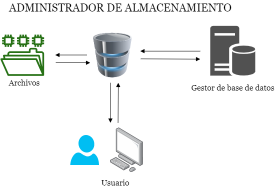

# MANUAL TÉCNICO

## Índice:

- [Definición](#defincion)
- [Requerimientos](#requerimientos)
- [Propósito](#proposito)
- [Alcances](#alcances)
- [Requisitos Funcionales](#requisitos-funcionales)
- [Requisitos No Funcionales](#requisitos-no-funcionales)
- [Diagrama de clases](#diagrama-clases)
___

## Definición

TytusDB es un proyecto Open Source para desarrollar un administrador de bases de datos. En la fase 1 se buscó implementar las formas de almacenamiento de datos así como la manipulación con las distintas funciones que se definieron en su momento. <br>
Para esta fase 2, además de definir nuevas funciones de administración de índices se busca principalmente la seguridad de la información.
<p align="center">
  
</p>

___

## Requerimientos

- Entorno de Python en el ordenador en su version 3.8.1 o superior
- Librería cryptography para funciones que requieren seguridad de información.

### Importaciones requeridas:

```
import os
import pickle
import shutil
import zlib
import hashlib
from cryptography.fernet import Fernet
```

| Librería      | Descripción |
| :---------    | :-----|
| os            | Permite acceder a funcionalidades dependientes del Sistema Operativo |
| pickle        |   Permite almacenar casi cualquier objeto Python directamente en un archivo o cadena sin necesidad de realizar ninguna conversión |
| shutil      |    Copia el contenido completo (sin metadatos) de un archivo origen a un archivo destino, pudiendo estar, uno y otro, en directorios diferentes. Si el archivo destino no existe será creado y si existe será reemplazado. |
| zlib      |  Es una biblioteca de software utilizada para la compresión de datos, es una abstracción del algoritmo DEFLATE de compresión utilizado en el programa de compresión de archivos gzip . |
| hashlib      | Permite realizar cifrados directamente desde Python con los algoritmos BLAKE, SHAKE, SHA1, SHA224, SHA256, SHA384, SHA512 y MD5.      |
| cryptography      |  Una librería que nos permitirá realizar el encriptado de información.      |
___

## Propósito

El desarrollo de un sistema de almacenamiento que sea capaz de gestionar bases de datos, dicho sistema tendrá la tarea de interactuar con los datos almacenados, para luego proporcionar de manera gráfica toda la información de bajo nivel almacenados en la base de datos, los programas de aplicación y las consultas enviadas al sistema. Podrá gestionar la reserva de espacio de almacenamiento y las estructuras de datos usadas para representar la información almacenada.
___

## Alcances

La unificación de modos es una de las características más sobresalientes en esta fase, el usuario tendrá a su disposición el modo de almacenamiento en el cual desea guardar su información, los modos disponibles son:

- Avl
- B
- Bplus
- Dict
- Isam
- Json
- Isam

El sistema tiene a su disposición de funciones con características asociadas al ámbito de la seguridad como lo son:

- Codificación
- Checksum
- Compresión de datos
- Criptografía

El usuario podrá crear o eliminar una base de datos, tendrá la libertad de renombrarla, podrá crear, renombrar o eliminar tablas dentro de la base de datos, visualizar una lista de los nombres de las tablas que se encuentren en la base datos, extraer y devolver una lista con elementos que corresponden a cada registro de la tabla, una lista con los elementos que corresponden a un rango de registros de la tabla. <br>

Respecto a la administración de índices, el usuario puede asociar difentes tablas que pertenecen a una misma base de datos, agregar índices únicos o simplemente índices.
___

## Requisitos Funcionales
Para la fase 2 se implementaron nuevas funciones al gestor de bases de datos, las cuales se describen a continuación:

#### 1. Funciones relativas al modo

- createDatabase

#### 2. Administrador del modo de almacenamiento

- alterDatabaseMode
- alterTableMode

#### 3. Administración de índices

- alterTableAddFK
- alterTableDropFK
- alterTableAddUnique
- alterTableDropUnique
- alterTableAddIndex
- alterTableDropIndex

#### 4. Administración de la codificación

- alterDatabaseEncoding

#### 5. Generación del Checksum

- checksumDatabase
- checksumTable

#### 6. Compresión de datos

- alterDatabaseCompress
- alterDatabaseDecompress
- alterTableCompress
- alterTableDecompress

#### 7. Seguridad

- encrypt
- decrypt
- BlockChain

#### 8. Grafos

- graphDSD
- graphDF
___

## Requisitos No Funcionales

- Rendimiento De La Aplicacion
- Durabilidad De La Informacion
- Flexibilidad Del Manejo De Datos
- Validacion De Llaves Primarias
___

## Diagrama de clases 

<p align="center">
  
</p>

___
