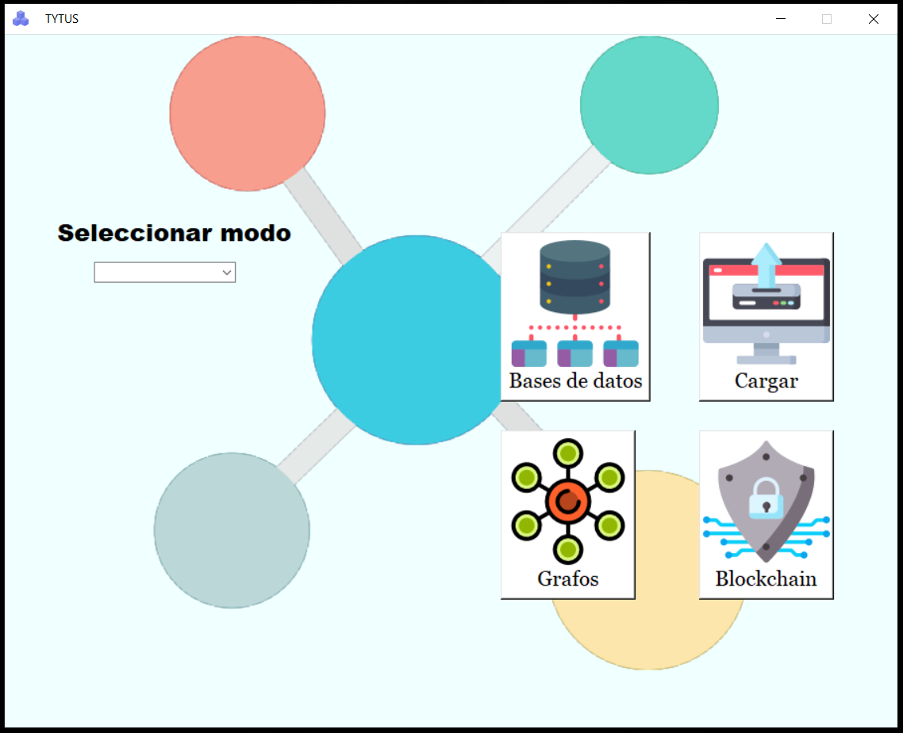
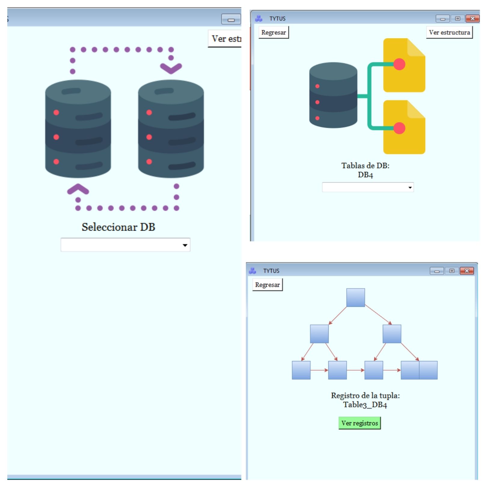
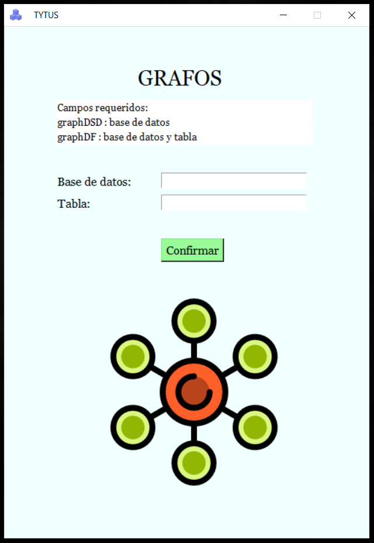
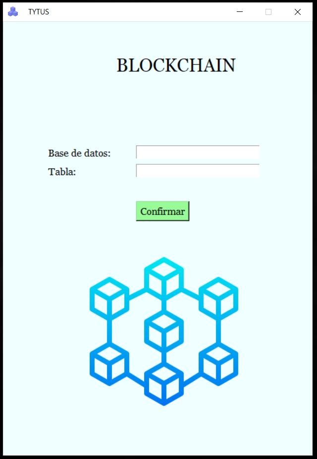

# MANUAL DE USUARIO

## Requerimientos:

- Versión de python 3.8.1 o mayor.
- Librería Tkinter (la integra python por defecto).

## Índice:

- [Página principal](#página-principal) 
- [Bases de datos](#bases-de-datos)
- [Grafos](#grafos) 
- [Blockchain](#blockchain) 

___

## Página principal

La página de inicio cuenta con las siguientes opciones:

- **Seleccionar modo:** Se despliega una lista con los distintos modos a trabajar para esta fase: avl, b, bplus, dict, isam, json, hash.
- **Bases de datos:** Muestra la navegabilidad entre bases dedatos, tablas y registros, además de mostrar la imagen que representa la estructura según el modo que se ha elegido.
- **Grafos:** Muestra los 2 diferentes reportes solicitados: 
    - Diagrama de estructura de datos.
    - Diagrama de dependencias.
- **Blockchain:** Ventana que se ocupa de mostrar la imagen generada en el reporte de blockchain.
- **Cargar:** Solicita la url del archivo CSV que se desea cargar.

  

___

## Bases de datos
Permite una navegabilidad entre bases de datos, tablas y registros según el modo seleccionado en la página principal.   
Cada ventana cuenta con un botón "Ver estructura" que al presionarlo automáticamente abre una nueva ventana con la imagen solicitada. Además de tener una lista desplegable que muestra las opciones con las que cuenta cada base de datos o tabla, al elegir una opción en la lista se procederá a mostrar la ventana siguiente si es posible, sino mostrará un mensaje de error y regreserá a la ventana inicial.

  

___
## Grafos
Esta ventana se utiliza para solicitar el nombre de la base de datos si el reporte es el diagrama de estructuras. En cambio, si el reporte es el diagrama de dependencias se solicitan los 2 campos (Base de datos y tabla).  
Al momento de presionar "Confirmar" si los datos son correctos, se abrirá una nueva ventana mostrando una imagen del reporte solicitado.

  

___
## Blockchain
Para la parte de blockchain es similar a grafos, a diferencia que los 2 campos que se solicitan son obligatorios, de igual forma al presionar "Confirmar" se abrirá una nueva ventana mostrando la imagen de los bloques que fueron afectados.

  

