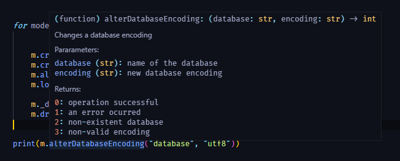
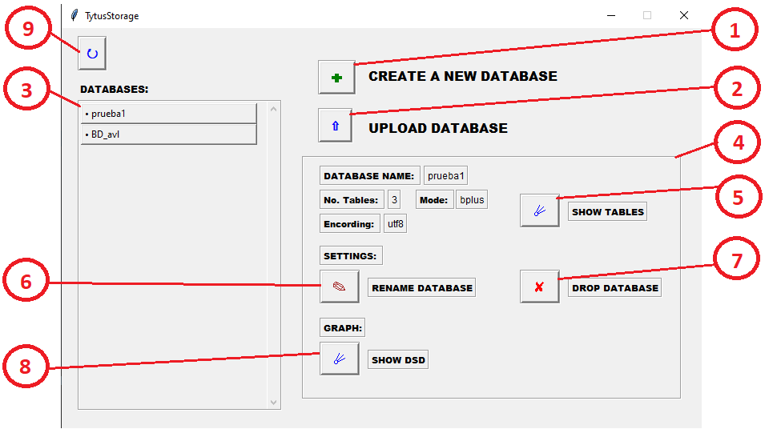
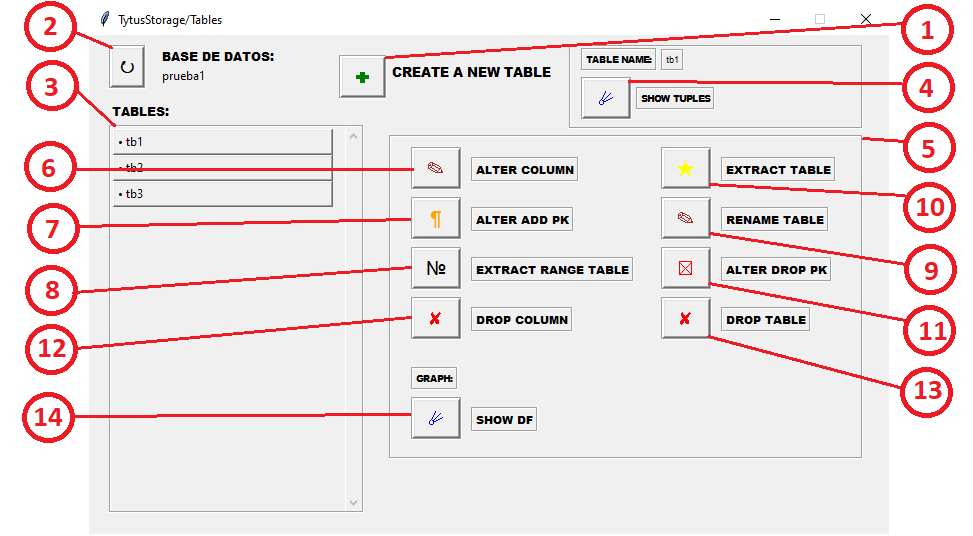
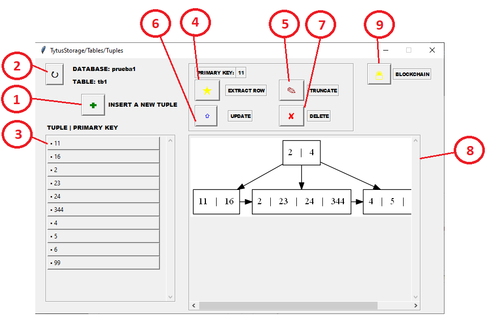
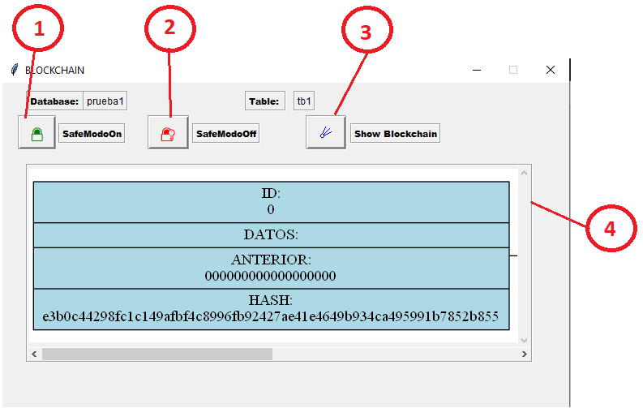

# Manual de Usuario

TytusStorage es una librería escrita en Python 3 que provee un gestor de almacenamiento para un administrador de bases de datos (DBMS).
TytusStorage almacena datos localmente utilizando hasta 7 modos de almacenamiento:

- Árbol AVL
- Árbol B
- Árbol B+
- Tabla Hash (de dispersión)
- ISAM
- Diccionarios
- JSON

TytusStorage está dotado de funciones de enlazamiento de datos, seguridad, graficación, entre otras, para otorgar una gran flexibilidad y comodidad de uso.

## Índice

- [Introduccion](#introduccion)
- [Glosario](#glosario)
- [Uso de la librería](#uso-de-la-librería)
- [Uso del almacenamiento](#uso-del-almacenamiento)
- [Uso del administrador del modo de almacenamiento](#uso-del-administrador-del-modo-de-almacenamiento)
- [Uso del administrador de índices](#uso-del-administrador-de-índices)
- [Uso del administrador de codificación](#uso-del-administrador-de-codificación)
- [Uso del generador de checksum](#uso-del-generador-de-checksum)
- [Uso del administrador de compresión de datos](#uso-del-administrador-de-compresión-de-datos)
- [Uso del administrador de seguridad](#uso-del-administrador-de-seguridad)
- [Uso del generador de diagramas de dependencias](#uso-del-generador-de-diagramas-de-dependencias)
- [Uso del reportador gráfico](#uso-del-reportador-gráfico)

## Introduccion 
TytusStorage es una libreria que busca proveera las funciones necesarias para ser un DBMS consistente, eficaz y con un excelente rendimiento.
Provee a los ususarios la forma de crear bases de datos con distintos modos de almacenamiento, dichos modos consisten cada uno en una estructura consistente diferente, el cual debe ser usado cada uno por su debidas carateristicas unicas, cada modo tiene ventajas y desventajas, las cuales el usuario puede explorar para saber explotarlas y usarlas a su favor, para una base pequeña con llaves primarias bien definidas y no consecutivas se puede usar un modo hash, el cual tiene un acceso rapido a sus datos y provee una optima consistencia, sin embargo para llaves continuas las tablas se vuleven cada vez mas grandes teniendo poco espacio utilizado, creando almacenamiento basura que no se puede eliminar. Es asi como cada modo nos provee de caracteristicas unicas y distintas, y esta libreria provee de 7 modos distintos.
Sin embargo la libreria no esta destinada solamente al almacenamiento, tambien provee de otras funciones que esperan ser explotadas por el ususario, si se piensa enviar una base de datos es posible comprobar su integridad por medio del checksum, provee funciones de encriptacion para cualquier cadena de texto, modo seguro para las tablas y opciones de compresion de datos.

## Glosario

| TERMINO   | DESCRIPCCION   |
| ----- | ----- |
| Archivo CSV | Los archivos CSV son un tipo de documento en formato abierto sencillo para representar datos en forma de tabla, en las que las columnas se separan por comas y las filas por saltos de línea. |
| Base de datos | Una base de datos es un conjunto de datos pertenecientes a un mismo contexto y almacenados sistemáticamente para su posterior uso. Es capaz de almacenar gran cantidad de datos, relacionados y estructurados, que pueden ser consultados rápidamente de acuerdo con las características selectivas que se deseen. |
| Checksum | Un checksum, o suma de comprobación, es el resultado de la ejecución de un algoritmo dentro de un archivo único, función denominada Cryptographic hash function. Comparar el checksum que generas desde tu versión del archivo, junto al provisto por la fuente del mismo, representa una ayuda para asegurarte una copia genuina y libre de errores. |
| Eficiencia | Proporcionar un desempeño apropiado, en relación con la cantidad de recurso utilizado, bajo condiciones establecidas en determinado momento del tiempo. |
| Interfaz | La interfaz es el medio donde el usuario puede comunicarse con una maquina, equipo o dispositivo, y comprender los puntos de contacto entre el usuario y el equipo.  |
| Llave Foranea | Una llave foránea o llave ajena es una limitación referencial entre dos tablas e identifica una columna o grupo de columnas en una tabla que se refiere a una columna o grupo de columnas en otra tabla. |
| Llave Primaria | Una llave primaria es un campo o una combinacion de campos que identifica de forma unica a cada fila de una tabla |
| Llave unica | La clave única o UNIQUE hace que en la columna que la posee no pueda tener dos datos iguales. Es decir en cada registro, el campo marcado con UNIQUE debe tener un dato diferente. Esto lo convierte en un identificador del registro, ya que no puede haber dos registros que contengan el mismo dato en esa columna. |
| Parametro | Un parámetro, generalmente, es cualquier característica que pueda ayudar a definir o clasificar un sistema particular. |
| Python | Python es un lenguaje de programación interpretado cuya filosofía hace hincapié en la legibilidad de su código. Se trata de un lenguaje de programación multiparadigma, ya que soporta orientación a objetos, programación imperativa y, en menor medida, programación funcional. |
| Registro | Un registro representa un objeto único de datos implícitamente estructurados en una tabla. |
| Tabla Hash | Una tabla hash es una estructura asosiada a llaves o claves con valores. La operación principal que soporta de manera eficiente es la búsqueda: permite el acceso a los elementos almacenados a partir de una clave generada. |
| Tupla | Una tupla es una lista ordenada finata de elementos (componentes).|


## Uso de la librería

Para ejecutar la librería es necesario tener instalado Python 3 para [Windows](https://www.python.org/downloads/windows/) o para [Linux](https://www.python.org/downloads/source/).

TytusStorage se puede incorporar en un proyecto con la siguiente línea de código:

```sh
from storage import TytusStorage
```

Se puede acceder al repertorio de funciones posteriormente descritas de la siguiente manera:

```sh
TytusStorage.createDatabase("new_database", "hash", "ascii")
TytusStorage.showDatabases()
TytusStorage.checksumDatabase("new_database", "MD5")
...
```

Conviene consultar el DOCSTRING de la función de interes, así como imprimir su resultado:



```sh
from storage import TytusStorage as t

creation = t.createDatabase("database", "hash", "utf8")
encoding = t.alterDatabaseEncoding("database", "utf8")
print(creation, ',', encoding)
```

> 0 , 3

TytusStorage almacena todo dentro de la carpeta *data* del proyecto, de manera recurrente y eficaz.


## Uso del almacenamiento

Los metodos correspondientes al administrador del almacenamiento fueron explicados en la fase 1.

Puede consultarlos [aqui](https://github.com/tytusdb/tytus/blob/main/storage/team15/docs/Manual%20de%20usuario.md "Documentacion fase 1").


## Uso del administrador del modo de almacenamiento

Al crear una base de datos se debe especificar el modo en que se almacenarán los datos en las tablas. Al crear una tabla el modo de esta será el de la base de datos en que se cree. Sin embargo, es posible cambiar este modo de almacenamiento tanto para una tabla concreta, como para una base de datos completa, sin pérdida de datos.

### alterDatabaseMode(database, mode)
Cambia el modo de almacenamiento de una base de datos, reestructurando los datos de sus tablas.
Parametros:
- database: Es la base de datos cuyo modo que se desea cambiar
- mode: Es el nuevo modo de almacenamiento

| Valor de retorno | Definición |
| ------ | ------ |
| 0 | Operación exitosa |
| 1 | Error en la operación |
| 2 | Base de datos inexistente |
| 3 | Modo no válido |

### alterTableMode(database, mode)
Cambia el modo de almacenamiento de una tabla, reestructurando sus registros.
Parametros:
- database: Es la base de datos que contiene la tabla
- database: Es la tabla cuyo modo se desea cambiar
- mode: Es el nuevo modo de almacenamiento

| Valor de retorno | Definición |
| ------ | ------ |
| 0 | Operación exitosa |
| 1 | Error en la operación |
| 2 | Base de datos inexistente |
| 3 | Tabla inexistente |
| 4 | Modo no válido |

## Uso del administrador de índices

Se pueden agregar 3 tipos de índices a una base de datos, por ello hay 3 funciones para agregarlos, así como 3 funciones para eliminarios.

### alterTableAddFK(database, table, indexName, columns, tableRef, columnsRef)
Agrega una llave foránea a una o más columnas de una tabla, que hace referencia a la misma cantidad de columnas de otra tabla.

Parametros:
- database: base de datos que contiene la tabla
- table: tabla donde se desea agregar la llave foránea
- indexName: nombre de la llave foránea
- columns: columnas de la tabla donde se desa agregar la llave foránea
- tableRef: tabla a la que la llave foránea hace referencia
- columnsRef: columnas de la tabla a la que la llave foránea hace referencia

| Valor de retorno | Definición |
| ------ | ------ |
| 0 | Operación exitosa |
| 1 | Error en la operación |
| 2 | Base de datos inexistente |
| 3 | Tabla o tabla de referencia inexistente |
| 4 | El número de columnas no coincide |
| 5 | No se cumple la integridad referencial |

### alterTableDropFK(database, table, indexName)
Elimina una llave foránea previamente creada.

Parametros:
- database: base de datos que contiene la tabla
- table: tabla que contiene la llave foránea
- indexName: nombre de la llave foránea

| Valor de retorno | Definición |
| ------ | ------ |
| 0 | Operación exitosa |
| 1 | Error en la operación |
| 2 | Base de datos inexistente |
| 3 | Tabla inexistente |
| 4 | Llave foránea inexistente |

### alterTableAddUnique(database, table, indexName, columns)
Agrega un índice único a una o más columnas de una tabla, para facilitar la búsqueda de registros en esta. No se deben duplicar valores de las columnas especificadas.

Parametros:
- database: base de datos que contiene la tabla
- table: tabla donde se desea agregar el índice único
- indexName: nombre del índice único
- columns: columnas de la tabla donde se desa agregar el índice único

| Valor de retorno | Definición |
| ------ | ------ |
| 0 | Operación exitosa |
| 1 | Error en la operación |
| 2 | Base de datos inexistente |
| 3 | Tabla o tabla de referencia inexistente |
| 4 | Valor duplicado |

### alterTableDropUnique(database, table, indexName)
Elimina un índice único previamente creado.

Parametros:
- database: base de datos que contiene la tabla
- table: tabla que contiene el índice único
- indexName: nombre del índice único

| Valor de retorno | Definición |
| ------ | ------ |
| 0 | Operación exitosa |
| 1 | Error en la operación |
| 2 | Base de datos inexistente |
| 3 | Tabla inexistente |
| 4 | Índice único inexistente |

### alterTableAddIndex(database, table, indexName, columns)
Agrega un índice único a una o más columnas de una tabla, para facilitar la búsqueda de registros en esta.

Parametros:
- database: base de datos que contiene la tabla
- table: tabla donde se desea agregar el índice
- indexName: nombre del índice
- columns: columnas de la tabla donde se desa agregar el índice

| Valor de retorno | Definición |
| ------ | ------ |
| 0 | Operación exitosa |
| 1 | Error en la operación |
| 2 | Base de datos inexistente |
| 3 | Tabla o tabla de referencia inexistente |

### alterTableDropIndex(database, table, indexName)
Elimina un índice previamente creado.

Parametros:
- database: base de datos que contiene la tabla
- table: tabla que contiene el índice
- indexName: nombre del índice

| Valor de retorno | Definición |
| ------ | ------ |
| 0 | Operación exitosa |
| 1 | Error en la operación |
| 2 | Base de datos inexistente |
| 3 | Tabla inexistente |
| 4 | Índice inexistente |

## Uso del administrador de codificación

Las siguiente función se enfoca en codificar una base de datos al encoding indicado por el usuario, siendo los posibles *ASCII*, *ISO-8859-1* o *UTF8*. Se puede codificar una base de datos que antes fue codificada a otro tipo.

### alterDatabaseEncoding(database, encoding) 
Con el encoding solicitado verifica cada una de las tuplas de la base de datos especifica, si es cadena de texto este procede a verificar la codificación. 

- database: Nombre de la base de datos a la cual se le codificarán las tuplas de sus tablas.
- encoding: Tipo de encoding a aplicar.

| Valor de retorno | Definición |
| ------ | ------ |
| 0 | Operación exitosa |
| 1 | Error en la operación |
| 2 | Base de datos inexistente |
| 3 | Encoding no válido |

## Uso del generador de checksum

Las siguientes funciones se enfocan en obtener valores hash de diferentes bases de datos o tablas especificas mediante los algoritmos de:
- MD5
- SHA256

### checksumDatabase(database, mode)
Obtiene el valor hash de toda la base de datos seleccionada.
- database: Nombre de la base de datos a la cual se le calculara su valor hash.
- mode: el nombre del algoritmo al cual se le calculara el valor hash.

| Valor de retorno | Definición |
| ------ | ------ |
| Hash | Valor hash calculado |
| None | Error en la operación |

### checksumTable(database, table, mode)
Obtiene el valor hash de una sola tabla almacenada en una base de datos.
- database: Nombre de la base de datos donde se encuentra la tabla.
- table: Nombre de la tabla a la cual se le calculara su valor hash
- mode: el nombre del algoritmo al cual se le calculara el valor hash.

| Valor de retorno | Definición |
| ------ | ------ |
| Hash | Valor hash calculado |
| None | Error en la operación |


## Uso del administrador de compresión de datos

Las siguientes funciones se enfocan en comprimir o descomprimir una base de datos completa o una única tabla espcificada. Para esto se hace uso de la librería zlib.

```sh
import zlib
```

### def alterDatabaseCompress(database, level)

El método se encarga de comprimir cada una de las tablas que contenga la base de datos especificada. Los niveles permitidos son números del 1 al 9.

- database: Nombre de la base de datos que se comprimirá.
- level: Nivel de compresión.

| Valor de retorno | Definición |
| ------ | ------ |
| 0 | Operación exitosa |
| 1 | Error en la operación |
| 2 | Base de datos inexistente |
| 3 | Nivel de compresión no válido |

### def alterDatabaseDecompress(database)
El método se encarga de descomprimir cada una de las tablas que contenga la base de datos especificada solo si ha sido comprimida con anterioridad.

- database: Nombre de la base de datos que se descomprimirá.

| Valor de retorno | Definición |
| ------ | ------ |
| 0 | Operación exitosa |
| 1 | Error en la operación |
| 2 | Base de datos inexistente |
| 3 | No existe compresión |

### def alterTableCompress(database, table, level)
El método se encarga de comprimir una tabla especifica de la base de datos especificada. Los niveles permitidos son números del 1 al 9.estos por medio de los valores de retorno.

- database: Nombre de la base de datos a la cual pertenece la tabla.
- table: Nombre de la tabla que se comprimirá.
- level: Nivel de compresión.

| Valor de retorno | Definición |
| ------ | ------ |
| 0 | Operación exitosa |
| 1 | Error en la operación |
| 2 | Base de datos inexistente |
| 3 | No existe la tabla |
| 4 | Nivel de compresión no válido |

### def alterTableDecompress(database, table)

El método se encarga de descomprimir una tabla especifica de la base de datos especificad solo si ha sido comprimida con anterioridad.

- database: Nombre de la base de datos que se descomprimirá.
- table: Nombre de la tabla que se descomprimirá.

| Valor de retorno | Definición |
| ------ | ------ |
| 0 | Operación exitosa |
| 1 | Error en la operación |
| 2 | Base de datos inexistente |
| 3 | Tabla inexistente |
| 4 | No existe compresión |


## Uso del administrador de seguridad
El administrador de seguridad hace uso de la libreria cryptography para su funcionamiento, para instalar la libreria es necesario ejecutar el siguiente comando:
```sh
pip install cryptography
```
Si desea obtener mas informacion sobre esta libreria, puede consultar su documentacion [aqui](https://pypi.org/project/cryptography/ "Documentacion Cryptography").

Las siguientes funciones se enfocan en efectos de seguridad bajo conceptos de criptografia y blockchain, se trata de dos secciones, con los nombres de los conceptos antes mencionados, cada una de las secciones cuenta cada una con dos funciones, las cuales se detallaran a continucaion, sin embargo se puede mencionar como sun funcion principal la encriptacion y desncriptacion de cadenas de texto, y el manejo de tablas seguras, las cuales proveen al usuario una forma de almacenar sus datos y verificar que estos sigan intactos.

Las funciones de criptografía son:

### encrypt(backup, password) 
La funcion encrypt es la encargada de encriptar un texto, con la contraseña que se le pasa como parametro, dicha funcion devuelve el texto encriptado como una cadena de texto (string).

Parametros:
- backup: Es el string que se desea encriptar
- password: Cadena que se usara para la encriptacion del texto, es importante si luego se desea desencriptar el texto, pues para lograrlo sera necesaria la misma contraseña

| Valor de retorno | Definición |
| ------ | ------ |
| Cadena | Cadena encriptada |
| None | Error en la operación |

### decrypt(cipherbackup, password) 
La funcion decrypt es la encargada de desencriptar la cadena que se le haya pasado, con la contraseña que se le pasa como parametro, dicha funcion devuelve el texto desencriptado como una cadena de texto (string).

Parametros:
- cipherbackup: Es el string que se desea desencriptar
- password: Cadena que se usara para la desencriptacion del texto, si no es la correcta el metodo fallara

| Valor de retorno | Definición |
| ------ | ------ |
| Cadena | Cadena desencriptada |
| None | Error en la operación |

Las funciones de blockchain son:

### SafeModeOn(database, table) 
Activa el modo seguro para una tabla en especifico, a partir de la activacion del modo seguro cualquier insert a la tabla sera guardado utilizando la tecnica BlockChain, y cualquier update de los datos insertados dañara la consistencia de los datos.

Parametros:
- database: Nombre de la base de datos a la que pertenece la tabla que estara en modo seguro
- table: Nombre de la tabla a la cual sera activado el modo seguro 

| Valor de retorno | Definición |
| ------ | ------ |
| 0 | Operacion exitosa |
| 1 | Error en la operación |
| 2 | Base de datos inexistente |
| 3 | Tabla inexistente |
| 4 | Modo seguro existente |

### SafeModeOff(database, table) 
Desactiva el modo seguro para una tabla en especifico, los inserts y updates volveran a actuar con normalidad, y el blockchain anterior sera eliminado.

Parametros:
- database: Nombre de la base de datos a la que pertenece la tabla 
- table: Nombre de la tabla a la cual se le desactivara el modo seguro 

| Valor de retorno | Definición |
| ------ | ------ |
| 0 | Operacion exitosa |
| 1 | Error en la operación |
| 2 | Base de datos inexistente |
| 3 | Tabla inexistente |
| 4 | Modo seguro inexistente |

### GraphSafeTable(database, table) 
Grafica el los bloques de BlockChain de una tabla en modo seguro.

Parametros:
- database: Nombre de la base de datos a la que pertenece la tabla 
- table: Nombre de la tabla a la cual se desea graficar

| Valor de retorno | Definición |
| ------ | ------ |
| str | Directorio del grafo |
| None | Error en la operación |


## Uso del generador de diagramas de dependencias

Las siguientes funciones se enfocan en la creacion de diagramas de dependencia mediante el uso de GraphViz para mostrar las diferentes relaciones entre llaves primarias, foraneas y unicas.

### graphDSD(database)
Genera un diagrama que muestra las relaciones de tablas mediante llaves foraneas.
- database: Nombre de la base de datos.

| Valor de retorno | Definición |
| ------ | ------ |
| ruta | directorio donde se guardo la imagen generada |
| None | Error en la operación |

### graphDF(database, table)
Genera un diagrama que muestra las relaciones de los atributos que tienen una tabla mediante llaves primarias o unicas.
- database: Nombre de la base de datos.
- table: Nombre de la tabla donde almacena las llaves primarias o unicas.

| Valor de retorno | Definición |
| ------ | ------ |
| ruta | directorio donde se guardo la imagen generada |
| None | Error en la operación |


## Uso del reportador gráfico

Para acceder al reporte grafico desde un main, se importa de la siguiente manera.
```sh
import storage.interfaz as m
m.Mostrar()
```
Las siguientes son las funciones del reportador gráfico, que es capaz de manipular bases de datos, tablas y registros mediante una interfaz.

#### Ventana Base de Datos
Ventana donde se podran visualizar todas las gestiones sobre bases de datos.

1. Create a New Database: Se mostrara una ventana emergente que solicitara:
-- Nombre de la base de datos.
-- Estructura donde se almacenaran los registros de la base de datos.
-- Codificacion que utlizara la base de datos.
El sistema no permitira dejar el campo en blanco o escribir el nombre de una base de datos ya exsiten.
2. Upload databases: Se mostrara una ventana emergente que solicitara la direccion url de un archivo (csv).
3. Lista de Bases de Datos: Seccion donde se mostraran todas las bases de datos registradas o cargadas.
4. Gestiones de la base de datos: Al seleccioanr una base de datos desplegada en la lista se desplegara una caja de detalles y opciones sobre la propia base de datos.
5. Show Tables: Redirije a una nueva ventana donde se gestionaran todas la tablas que puede poseer la base de datos.
6. Rename Database: Permite cambiarle el nombre a una base de datos ya existenete. Se verificara que el nuevo nombre no sea un nombre ya existente.
7. Drop Database: Permite eliminar la base de datos seleccionada.
8. Grafico de DSD: Genera una ventana donde se visualiza un diagrama de dependencia entre las tablas mediante llaves foraneas.
9. Update: Boton que actualiza la pagina.



#### Ventana Tablas
Ventana donde se podran visualizar todas las gestiones sobre tablas.

1. Create a new table: Se mostrara una ventana emergente donde se solicitara el nombre y las columnas que llevara la tabla. Se solicitara que el nombre de la tabla ingresado no sea de una ya existente.
2. Update: Boton que actualiza la pagina.
3. Lista de tablas: Seccion donde se mostraran todas las tablas registradas o cargadas que almacena la base de datos.
4. Show tuples: Redirije a una nueva ventana donde se gestionaran todos los registros que puede poseer la tabla.
5. Gestiones de la tabla: Al seleccioanr una tabla desplegada en la lista se desplegara una caja de detalles y opciones sobre la propia tabla.
6. Alter column: Agrega una columna a la tabla.
7. Alter add PK: Define las llaves primarias que llevara la tabla solicitndo las columnas donde desee definirlas.
8. Extract range table: Solicita dos datos a ingresar (lower and upper) y luego la columna donde se desea posicionar los datos.
9. Rename table: Permite renombrar la tabla solicitando un nombre que no sea de una ya existente.
10. Extract table: Despliga una ventana emergente con todos los datos que posee la tabla.
11. Alter drop PK: Elimina la llave primaria de la tabla seleccionada
12. Drop column: Solicita el numero de columna para ser eliminada.
13. Drop table: Elimina la tabla seleccionada.
14. Grafico de DF: Genera una ventana donde se visualiza un diagrama de dependencia entre los atributos de una tabla mediante llaves primarias o unicas.



#### Ventana Registros
Ventana donde se podran visualizar todas las gestiones sobre los registros de las tablas.

1. Insert a new tuple: Se mostrara una ventana emergente donde se solicitara ingresar los datos separados por comas para identificar que el numero de datos corresponda al numero de columnas que posee la tabla.
```sh
Ejemplo: dato1, dato2, dato3, dato4
```
2. Update: Boton que actualiza la pagina.
3. Lista de tuplas: Seccion donde se mostraran todas las tuplas registradas en la tabla mostrando la llave primaria de referencia.
4. Extract row: Despliega una ventana emergente donde se muestran los datos de la tupla seleccionada
5. Truncate: Elimina todos los registros de la tabla.
6. Update row: Solicitara los datos primeramente del nuemero de columna seguido del dato a cambio y estos separados por una coma y para ingresar mas de un dato seprar estos por un ponto y coma.
```sh
Ejemplo: 0 , dato1 ; 1 , dato2 ; 2 , dato3 ; 3 , dato 4
```
7. Delete: Elimina la tupla seleccioanda.
8. Grafico de tuplas: Scion donde se muestra una imagen de la estructura donde se almacenan todos los registros de la tabla.
9. Blockchain: Redirige a una ventana donde se mostraran todas las gestiones que tiene la seguridad de datos.



#### Ventana Blockchain
1. SafeModeOn: Activa el modo seguro de los registros.
2. SafeMOodeOff: Desactiva el modo seguro de los registros.
3. Show Blockchain: Genera un diagrama del blockchain.
4. Grafica de Blockchain: Seccion donde se muestra el driagrama de blockchain.


