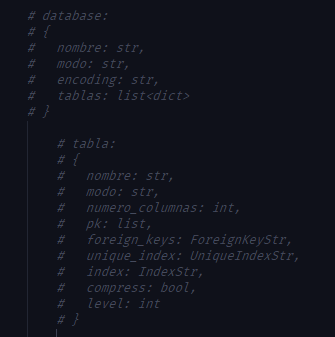
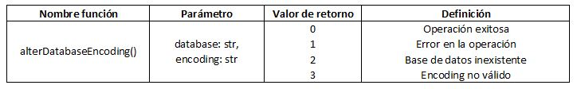
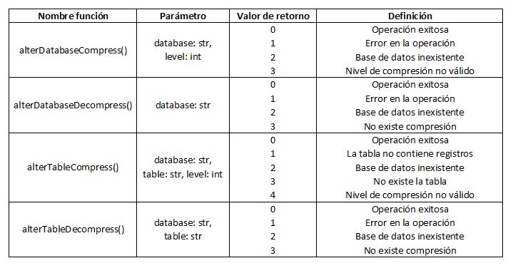
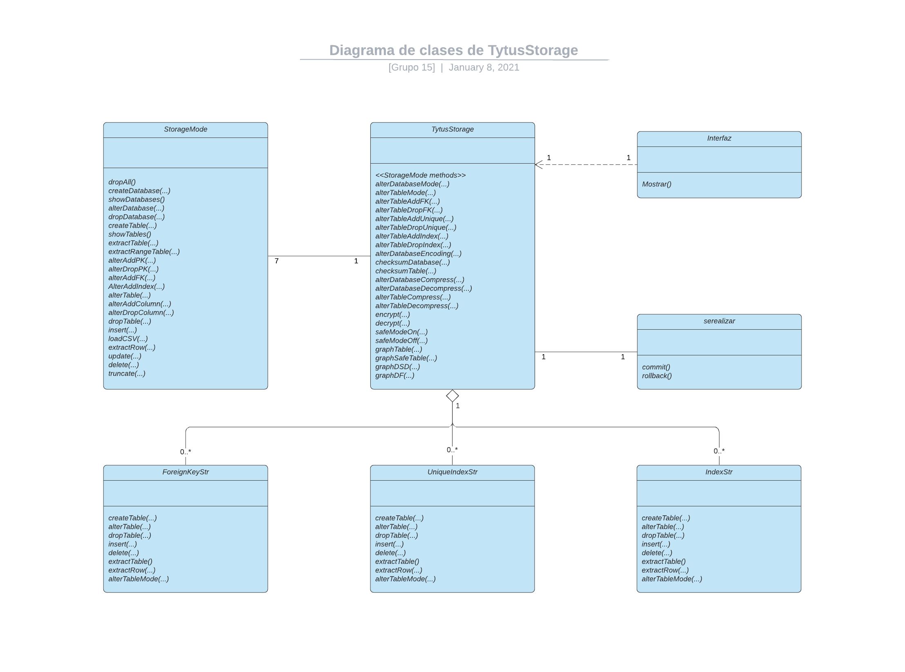
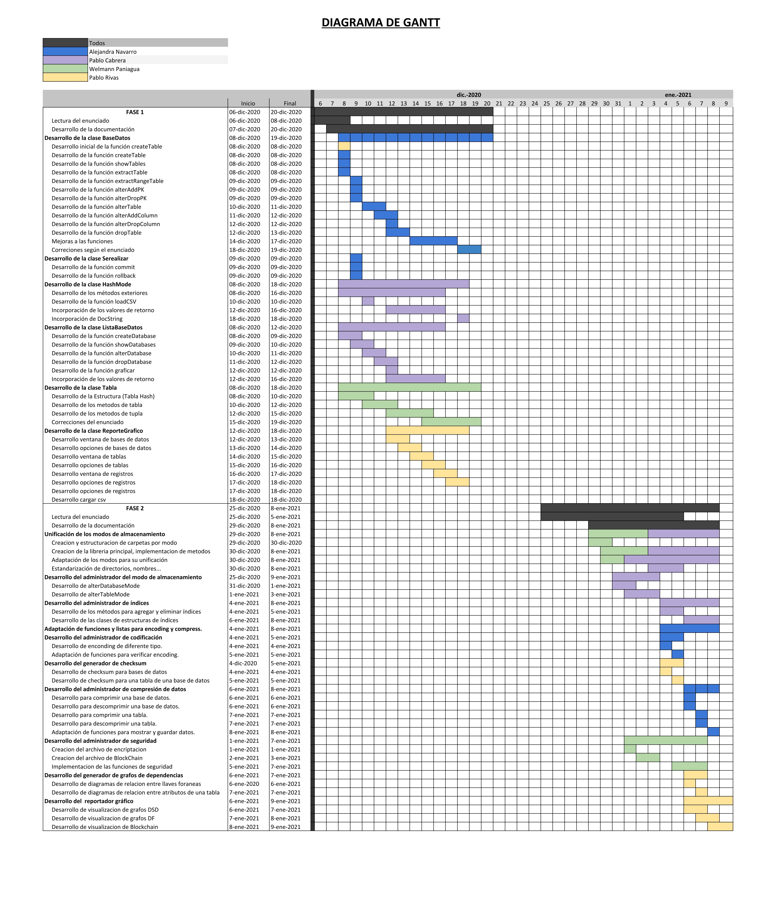

# Manual Técnico

## Índice

- [Introducción](#introducción)
- [Objetivos](#objetivos)
- [Alcances del proyecto](#alcances-del-proyecto)
- [Requerimentos funcionales](#requerimentos-funcionales)
- [Atributos del sistema](#atributos-del-sistema)
- [Administrador de almacenamiento](#administrador-de-almacenamiento)
- [Administrador del modo de almacenamiento](#administrador-del-modo-de-almacenamiento)
- [Administrador de índices](#administrador-de-índices)
- [Administrador de codificación](#administrador-de-codificación)
- [Generador de checksum](#generador-de-checksum)
- [Administrador de compresión de datos](#administrador-de-compresión-de-datos)
- [Administrador de seguridad](#administrador-de-seguridad)
- [Generador de diagramas de dependencias](#generador-de-diagramas-de-dependencias)
- [Repotrador gráfico](#reportador-grafico)
- [Diagrama de clases](#diagrama-de-clases)
- [Diagrama de Gantt](#diagrama-de-gantt)

## Introducción
TytusStorage busca ser una libreria capaz de proveer las funciones necesarias para ser usada como un DBMS, dicha libreria sera utilizada por los estudiantes del curso de Organizacion y Lenguajes de Compiladores 2 (Estudiantes con los cuales se esta trabajando en conjunto), para construir un lenguaje basado en SQL, que consumira las funciones de esta libreria.

La libreria pretende contar con todas las funciones de un DBMS como MySQL o PostgreSQL, entre ellas funciones de criptografia, encoding y hasta compresion de datos. 

Este manual pretende dar una explicacion del desarrollo de la libreria, para que cualquier desarrollador con conocimientos en estructuras y bases de datos pueda retomar el proyecto y fortalecer las debilidades que puedan ser evidenciadas en este.

## Objetivos

### General

Se espera que las nuevas funciones implementadas puedan dar un mejor rendimiento, soporte y alojamiento a la información que se desee guardar en las bases de datos a crear. Considerando encriptaciones, compresiones, entre otras funcionalidades que se detallarán en este manual. 

### Específicos

- Proporcionar seguridad sobre la información que se almacene en este gestor de bases de datos.
- Brindar un servicio funcional y beneficioso.
- Permitir que los recursos consumidos a traves de este gestor sean bajos.
- Brindar informes gráficos sobre los registros para verificar su integridad.
- Permitir elegir modos de almacenamiento para que el usuario pueda indicar las estructuras que desea implementar.
- Beindar al usuario graficos para mejor entendimiento de las funcionalidades de la estructura seleccionada.


## Alcances del proyecto

Este proyecto es la segunda fase de un proyecto de nombre HashMode, el cual se puede revisar su documentacion [aqui](https://github.com/tytusdb/tytus/blob/main/storage/team15/docs/Manual%20tecnico.md). Como se puede observar en la primera fase de este proyecto se desarrollo la estuctura para el almacenamiento interno de un DBMS, buscando crear las funciones necesarias para poder crear un administrador de bases de datos funcional y eficaz, en dicha fase la estructura utilizada fue una tabla hash, por las ventajas ahi descritas. Sin embargo, ese proyecto solo fue una de las partes que constituiran esta segunda fase, el proyecto fue construido en conjunto a otros compañeros del curso Estructuras de Datos, el objetivo de otros grupos era la construccion del mismo administrador pero con estructuras de datos distintas, arbol b, arbol b+, AVL, json, diccionarios e isam.

Esta segunda fase consiste en la unificacion de todos los modos de almacenamiento en una sola libreria universal, la cual tendra las mismas funciones que cada una de las librerias individuales y ciertos agregados extra, esta libreria hace posible la eleccion del modo de almacenamineto a utilizar en la creacion de las bases de datos, asi como tambien permite cambiar de modo una tabla en especifico, ademas de esta posibilidad, la libreria permite tambien la eleccion del encoding a utilizar, teniendo entre sus opciones ascii, iso-8859-1 y utf-8.

Adicionalmente, la libreria provee de una forma de compresion de datos, con la cual segun el modo elegido es posible la reduccion del espacio que una tabla o base de datos ocupa en nuestra computadora, siendo esto de gran beneficio para el almacenamiento de las bases de datos, dandonos un almacenaminto mas ligero y efectivo.

En caso del envio de datos, se provee de una funcion de cheksum, la cual permite verificar la integridad de los datos enviados, asi mismo, la libreria cuenta con funciones de seguridad especificamente de criptografia y una forma de monitorear la integridad de los datos por medio de blockchain, este metodo se conoce como Tablas Seguras, lo cual consiste en un modo en el cual cada nuevo insert constituye un bloque de BLockChain, y un update de uno de los nuevos datos representa la perdida de la integridad de los datos, lo cual indica que la tabla fue modificada. 

## Requerimentos funcionales

- Los nombres de base de datos deben respetar las reglas de nombrado.
- Los nombres de tablas deben respetar las reglas de nombrado.
- Los datos ingresados deben cumplir con la codificación de la base de datos.
- Para crear una base de datos debe enviar un nombre, el cual no debe existir ya almacenado.
- Para crear una tabla debe enviar el nombre de la base de datos, nombre de la tabla y número de columnas, dicho nombre no debe existir ya almacenado.
- La interfaz gráfica es un componente que aprovecha la librería, para su uso se deberá llamar de forma independiente a TytusStorage.
- Debe tener graphviz para poder observar la estructura de cada almacenamiento de forma grafica por medio de la interfaz gráfica.

## Atributos del sistema

- Todas las estructuras proveerán un alojamiento seguro y eficiente.
- TytusStorage es una librería propia para que sea más fácil de implementar.
- Las funciones existentes retornaran valores numéricos para informar el estado de la operación.
- Los valores de retorno se podrán consultar en el docstring de TytusStorage
- Las estructuras serán capaces de evitar la duplicidad de datos.
- Brindará una interfaz gráfica para visualizar el funcionamiento interno de las estructuras, entre otras cosas.
- Serealizará los objetos creados para evitar perdidas de datos.
- La librería implementa métodos de serealización que ayuda a la eficiencia y fluidez del sistema.
- Proporcionará métodos de detección de cambios, en aras de mantener la información segura.
- Proporcionará maneras eficaces de reducir el tamaño de la información.
- TytusStorage podrá cambiar entre métodos sin pérdida de datos.

## Administrador de almacenamiento

El funcionamiento del administrador de almacenamiento fue detallado en el [manual técnico](https://github.com/tytusdb/tytus/blob/main/storage/team15/docs/Manual%20tecnico.md "Fase 1") de la fase 1 del proyecto.

Además, se crea una estructura auxiliar que consiste en una lista de bases de datos (diccionarios), que además de almacenar los metadatos de las bases de datos almacenadas, contiene una lista de tablas (diccionarios). Dichas tablas contienen los metadatos de las tablas almacenadas, y 3 estructuras para almacenar índices.



La estructura se mantiene actualizada localmente en el archivo *data/data*, haciendo uso de la archivo *serealizar.py*.

## Administrador del modo de almacenamiento

Debido a que se unificaron 7 modos de almacenar registros con distintas estructuras de datos se realizaron dos métodos que cambiaran dicho modo a voluntad, tanto para una base de datos como para una tabla específica.

Al llamar al método alterDatabaseMode con los parámetros database y mode, se le indica a la librería que debe cambiar dicha base de datos a un nuevo modo. 
esto incluye todas las tablas dentro de la base de datos especificada.

Para cambiar el modo de almacenamiento de una base de datos se valida que la base de datos exista y que el modo especificado sea válido (que exista y que no sea el mismo que el de la base de datos). Luego se almacenan en una variable las tablas que esta contiene, llamando al método extractTable con el nombre de la tabla. Al almacenar el contenido se procede a crear una base de datos temporal (de mismo nombre que la base de datos actual con el sufijo '_temp') en el nuevo modo, que pueda almacenar la tabla con el nuevo modo, para luego crear las tablas e insertarles el contenido previamente almacenado. Si todo este procedimiento es exitoso entonces se elimina la anterior base de datos y se renombra la base de datos temporal al nombre original de la base de datos.

Al llamar al método alterTableMode con los parámetros database, table y mode, se le indica a la librería que debe cambiar una tabla *table* dentro de *database* a un nuevo modo *mode*.

Para cambiar el modo de almacenamiento de una tabla se valida que la base de datos exista, que la tabla exista y que el modo especificado sea válido (que exista y que no sea el mismo que el de la tabla). Luego se almacenan en una variable el contenido de la tabla, llamando al método extractTable con el nombre de la tabla. Al almacenar el contenido se procede a crear una base de datos temporal en el nuevo modo, que pueda almacenar la tabla con el nuevo modo, para luego crear la tabla e insertarl el contenido previamente almacenado. Si todo este procedimiento es exitoso entonces se elimina la anterior tabla.

Todos los cambios se ven almacenados en los directorios dentro de la carpeta *data*.

## Administrador de índices

Cuando se crea una tabla con el método createTable automáticamente se crean 3 estructuras adicionales:

- Estructura de llaves foráneas
- Estructura de índices únicos
- Estructura de índices

Cuyo modo de estructuración corresponde al modo de la tabla. En dichas estructuras se almacenan los índices correspondientes, siendo el nombre del índice la llave primaria de dicha estructura. Dicho modo de almacenamiento cambia cuando el modo de almacenamiento de la tabla cambia.

Las clases de las estructuras se encuentran en sus propios archivos:

- ForeignKeyStr
- UniqueIndexStr
- IndexStr

Al almacenar un objeto de dichas clases en una tabla se crea en su interior una estructura del modo especificado, aprovechando los modos que estos contienen (insert, delete, extractRow, etc...)

Los objetos creados con estas clases se almacenan en el archivo *data/data*, serializando tras cada cambio pertinente a estos objetos.

### alterTableAddFK(database, table, indexName, columns, tableRef, columnsRef)

En este método se valida la existencia de la base de datos *database*, de las tablas *table* y *tableRef*, y de la igualdad del número de columnas. Luego se inserta un registro en la estructura mediante el método insert de la estructura de llaves foráneas, que llama al método insert del modo de almacenamiento que este contiene.

### alterTableDropFK(database, table, indexName)

En este método se valida la existencia de la base de datos *database*, de la tabla *table*, para luego llamar al método delete de la estructura de llaves foráneas, que llama al método delete del modo de almacenamiento correspondiente, para eliminar el registro de la llave foránea (si existe).

### alterTableAddUnique(database, table, indexName, columns)

En este método se valida la existencia de la base de datos *database*, de las tablas *table* y *tableRef*, además de la unicidad de datos de las columnas *columns* especificadas, es decir, que no se repitan valores en estas columnas. Luego se inserta un registro en la estructura mediante el método insert de la estructura de índices únicos, que llama al método insert del modo de almacenamiento que este contiene.

### alterTableDropUnique(database, table, indexName)

En este método se valida la existencia de la base de datos *database*, de la tabla *table*, para luego llamar al método delete de la estructura de índices únicos, que llama al método delete del modo de almacenamiento correspondiente, para eliminar el registro del índice único (si existe).

### alterTableAddIndex(database, table, indexName, columns)

En este método se valida la existencia de la base de datos *database*, de las tablas *table* y *tableRef*, y de la igualdad del número de columnas. Luego se inserta un registro en la estructura mediante el método insert de la estructura de índices, que llama al método insert del modo de almacenamiento que este contiene.

### alterTableDropIndex(database, table, indexName)

En este método se valida la existencia de la base de datos *database*, de la tabla *table*, para luego llamar al método delete de la estructura de índices, que llama al método delete del modo de almacenamiento correspondiente, para eliminar el registro del índice (si existe).

## Administrador de codificación

Método que recibe nombre de la base de datos a codificar y el tipo de codificación que se aplicará. Para este método se utilizan .encode() y .decode() propios de python. 

El método se encuentra de la siguiente manera: 

```sh
def alterDatabaseEncoding(database, encoding)
```

La codificación a utilizar puede ser *ASCII*, *ISO-8859-1* o *UTF8*.

En este método se puede codificar una base de datos que anteriormente estaba codificada, es decir camnbiar por ejemplo de *utf-8* a *iso-8859-1*.

La lógica de dicho método consiste en buscar la base de datos seleccionada, verificar si contiene tablas y en caso de contener tablas, cada una de ellas es recorrida para que sus registros (tuplas) sean codificados.

### Información sobre el método utilizado para el encoding



## Generador de checksum

Metodo que recibe una cadenas de texto y retorna un valor hash conforme lo hace SQL, con el uso de la siguiente libreria la cual es proveniente de Pyhton y no necesita de una instalacion o configuracion externa:
```sh
import hashlib
```
La libreria se utilizo para calcular los valores hash con los algoritmos de MD5 Y SHA256. 
#### Obtener el valor hash
Este metodo genera un diggest a partir del contenido de la base de datos incluyendo sus tablas.
Para obtener el valor hash con los algoritmos se obtiene de la siguiente forma:

```sh
Con MD5:
    hashlib.md5("text".encode("encoding"))
Con SHA256:
    hashlib.sha256("text".encode("encoding"))
```
Donde "text" es la cadena a convertir (todas las tuplas de bases de datos o tablas), "encording" para la codificacion que se esta utilizando. El valor hash que se obtiene tiene que retornarse de forma hexadecimal para eso se utiliza:
```sh
.hexdigest()
```


## Administrador de compresión de datos

Este administrador permite comprimir una base de datos completa o una unica tabla, al igual que se puede descomprimir una una base de datos completa o una unica tabla, para que funcione de la manera correcta se hacen las comprobaciones adecuadas para que los valores de retorno sean más específicos al ocurrir un error.

Para comprimir se hizo uso de la siguiente libreria, la cual es proveniente de Pyhton y no necesita de una instalacion y/o configuracion externa:
```sh
import zlib
```
Se realizarón los siguientes 4 métodos en esta sección:

### def alterDatabaseCompress(database, level)

El método se encarga de comprimir cada una de las tablas que contenga la base de datos especificada, se debe indicar el nivel de compresión que se desea. Los niveles permitidos son números del 1 al 9. Por lo que el método es capaz de identificar cuando se ingresan valores inválidos informando estos por medio de los valores de retorno.

### def alterDatabaseDecompress(database)
El método se encarga de descomprimir cada una de las tablas que contenga la base de datos especificada solo si ha sido comprimida, Si la base de datos no esta comprimida el método es capaz de reconocerlo informando esto por medio de los valores de retorno, así como también cualquier otra falla en el proceso de este.

### def alterTableCompress(database, table, level)
El método se encarga de comprimir una tabla especifica de la base de datos especificada, se debe indicar el nivel de compresión que se desea. Los niveles permitidos son números del 1 al 9. Por lo que el método es capaz de identificar cuando se ingresan valores inválidos informando estos por medio de los valores de retorno.

### def alterTableDecompress(database, table)
El método se encarga de descomprimir na tabla especifica de la base de datos especificada solo si ha sido comprimida, Si la base de datos no esta comprimida el método es capaz de reconocerlo informando esto por medio de los valores de retorno, así como también cualquier otra falla en el proceso de este.

### Información sobre el administrador


## Administrador de seguridad

El administrador de seguridad es una parte de la libreria que se encarga, como su nombre lo inidica, de proporcionar metodos de seguridad en base a criptografia y BlockChain.

Para estos metodos se manejaron dos archivos py extras que se utilizan como librerias, para tener en la libreria principal un codigo mas sencillo y legible, en el cual solo se invocan las funciones de las librerias creadas, los archivos py utilizados fueron llamadas BlockChain y compresion, dichos archivos estan alojados en la carpeta /misc, en ella se puede visualizar dichos archivos para poder examinar los metodos codificados, a continuacion se explican mas a detalle estos archivos.

### Archivo compresion
Para el archivo de compresion se hizo uso de la libreria cryptography proveida por python, dicha libreria no es nativa, por lo cual se debe instalar, para instalarla y hacer uso de sus metodos se requiere ejecutar el siguiente comando:

```sh
pip install cryptography
```
Si requiere una explicacion mas detallada de la libreria *cryptography* puede consultarla [aqui.](https://pypi.org/project/cryptography/ "Documentacion Cryptography")

Con esta libreria la encriptacion y desencriptacion es bastante sencilla, se invoca un objeto fernet, de la libreria cryptography, pasandole la llave con la que se hara la encriptacion o desencriptacion, para luego invocar el metodo encrypt o decrypt respectivamente.

El metodo que involucra algo mas conplejo es la generacion de la llave en base a la password que se brinda, pues fernet lo hace de manera aleatoria, se hizo uso de la misma libreria cryptography pero utilizando sus sublibrerias, para lograrlo se requiere de las siguientes importaciones:

`
from cryptography.hazmat.primitives import hashes
`

`
from cryptography.hazmat.backends import default_backend
`

`
from cryptography.hazmat.primitives.kdf.pbkdf2 import PBKDF2HMAC
`


Con estos imports el metodo que genera la llave es bastante sencillo, siendo el siguiente, donde _nombre_ es la contraseña con la que se hara la encriptacion:
```sh
      kript = PBKDF2HMAC(hashes.SHA256(), 32, b'team15', 100, default_backend())
      key = base64.urlsafe_b64encode(kript.derive(nombre.encode()))
```

De esta manera se generan los metodos de encriptacion y desencriptacion, siendo los siguientes:
```sh
    def encriptar(mensaje, llave):
        f = Fernet(GenerarLlave(llave))
        byteMessage = mensaje.encode()
        return f.encrypt(byteMessage).decode()

    def desencriptar(mensaje, llave):
        f = Fernet(GenerarLlave(llave))
        return f.decrypt(mensaje.encode()).decode()
```
Dichos metodos son solo llamados en la libreria principal, haciendo una importacion de compresion y nombrandola como *comp*, acomodandolos en un try por cualquier error, el codigo en la libreria principal queda implementado de la siguient manera:

```sh
    try:
        return comp.encriptar(backup, password)
    except:
        return '1'
```

### Archivo BlockChain
El blockchain se utiliza como un metodo para proporcionar tablas seguras, es decir todo insert que se hace mientras el modo esta activo se almacena en bloques, que generan un hash con los datos ingresados y guardan el hash anterior, esto genera una cadena consistente en la cual se puede comprobar que los datos no hallan cambiado, en caso se haga un update el hash del bloque cambiara, pero el atributo anterior de el siguiente bloque no, lo cual creara una inconsistencia con lo cual se comprobara que la tabla fue modificada.

Al igual que con el archivo compresion todas las funciones se crearon desde aqui para solo ser invocadas en la libreria principal.

El hash de los datos es generado usando la libreria *hashlib*, dicha libreria es nativa, por lo cual no es necesaria ninguna instalacion, la funcion para generar el hash de los datos es la siguiente:
```sh
def GenerarHash(cadena):
    return hashlib.sha256(cadena.encode()).hexdigest(
```

Al activar el modo seguro se crea el archivo json de la tabla como *data/SafeTable/nombreTabla.json*, esto se usa para la comprobacion de si una tabla tiene modo seguro, la comprobacion es sencilla, solo se comprueba si existe un json con el nombre de la tabla de la siguiente manera:
```sh
def EsUnaTablaSegura(nombreTabla, ruta):
    ruta = ruta + "\\SafeTables\\" + str(nombreTabla) + ".json"
    return os.path.isfile(ruta)
```

Esta comprobacion es util para saber si una tabla esta en modo seguro, esto se comprueba en los inserts y los updates de la libreria principal, si el insert fue exitoso y la tabla esta en modo seguro se debe llamar al metodo *InsertSafeTable* de la libreria BlockChain, el metodo recibe el nombre de la tabla y los datos a ingresar, busca el archivo json por medio de la ruta y el nombre de la tabla, lo lee y recupera la lista de bloques, esto lo hace para ingresar el nuevo bloque y volver a escribir el archivo, el metodo es el siguiente:
```sh
def insertSafeTable(nombreTabla, datos, ruta):
    cadena = ''
    contador = 0
    ruta = ruta + "\\SafeTables\\" + str(nombreTabla) + ".json"

    for dato in datos:
        if contador == len(datos) - 1:
            cadena += str(dato)
        else:
            cadena += (str(dato) + ',')
        contador += 1

    file = open(ruta, "r")
    lista = js.loads(file.read())
    file.close()

    id = len(lista)
    h = GenerarHash(cadena)
    if id == 1 and lista[0] == 'inicio':
        DatosBloque = [0, cadena, '000000000000000000', h]
        lista.pop()
    else:
        id -= 1
        DatosBloque = [id, cadena, lista[id-1][3], h]
        lista.pop()
    lista.append(DatosBloque)
    lista.append([45612, 'datofinalParaComprobacionFinal', h, h])
    file = open(ruta, "w+")
    file.write(js.dumps(lista))
    file.close()
```

La misma logica funciona con los updates, si la tabla esta en modo seguro se debe extraer la tupla sin modificacion primero, si el update fue exitoso se debe hacer otro extractRow pero con los datos ya modificados, de esta manera recuperamos los datos necesarios para invocar el metodo update de BlockChain para cambiar el hash del dato modificado, el update de la libreria es el siguiente:
```sh
def updateSafeTable(nombreTabla, datos, datosmodificados, ruta):
    cadena = ''
    cadenaModificcada = ''
    contador = 0
    ruta = ruta + "\\SafeTables\\" + str(nombreTabla) + ".json"

    for dato in datos:
        if contador == len(datos) - 1:
            cadena += str(dato)
        else:
            cadena += (str(dato) + ',')
        contador += 1
    contador = 0

    for dato in datosmodificados:
        if contador == len(datos) - 1:
            cadenaModificcada += str(dato)
        else:
            cadenaModificcada += (str(dato) + ',')
        contador += 1

    file = open(ruta, "r")
    lista = js.loads(file.read())
    file.close()

    for bloque in lista:
        if cadena == bloque[1]:
            bloque[1] = cadenaModificcada
            bloque[3] = GenerarHash(cadenaModificcada)
            file = open(ruta, "w+")
            file.write(js.dumps(lista))
            file.close()
            return True
```

Para graficar estos bloques se hace uso de graphviz, con una funcion que genera el dot y luego lo convierte a imagen.

Como ya se menciono los metodos solo se llaman en la libreria principal, importando BlockChain con el nombre BC, los metodos se ven de la siguiente manera, haciendo las comprobaciones necesarias de existencia de bases de datos y tablas.
```sh
def safeModeOn(database: str, table: str) -> int:
    nombreST = str(database) + '-' + str(table)
    if not _database(database):
        return 2

    if not _table(database, table):
        return 3

    if BC.EsUnaTablaSegura(nombreST, _main_path):
        return 4

    try:
        BC.CreateBlockChain(nombreST, _main_path)
        return 0
    except:
        return 1
```

## Generador de diagramas de dependencias

Diagramas de estructuras de datos basado en GraphViz se generaron diagramas de dependecias para realaciones entre llaves foraneas de tablas y relaciones de llaves primarias y llaves unicas.
#### Relaciones entre llaves foraneas
Genera un diagrama que muestra las relaciones que tiene los atributos de las tablas mediante un diccionario de tablas se encuentra cuales tienen llaves foraneas a que tablas hacen referencia.

### Relacion entre llaves primarias y unicas 
Genera un diagrama que muestra las relaciones que tiene los atributos de una tabla formando dependencias de las llaves unicas y primarias hacia le resto de atributos.


## Reportador gráfico
En la creacion del reporte grafico se inclino en la creacion de una interfaz interactiva con el usuario para gestionar todo el funcionamiento del programa. Para ello se declino a la utilizacion de la libreia Tkinter la cual proporciono un conjunto de herramientas para la administracion de ventanas.
```sh
import tkinter
```
Tkinter es un conjunto de funciones que envuelven las implementaciones widgets Tk como clases de Python y tiene ventajas como su velocidad que generalmente se suministra de forma nativa con Python.

#### Widgets
Utilizando los widgets Tk y Toplevel donde se proporciona un lienzo (ventanas) y con un conjunto adicional de widgets se utilizaron para darle un excelente diseño en diferentes areas de las ventanas, algunos de estos fueron.
```sh
Frame: Espacio donde se almacenan un definido conjunto de widgets.
Button: Creacion de botones.
Label: Espacios de textos definidos.
PhotoImage: Proyeccion de imagenes buscadas en un directorio actual.
Entry: Entradas de texto por parte del usuario
```
#### Clases y atributos
###### Window Databases
Ventana que administra todas las gestiones de las bases de datos, utilizando todos los recursos disponibles que ofrece la libreria se logro un diseño sencillo y funcional.

###### Window Tables
Ventana que permite gestionar todas las funcionalidades sobre las tablas que puede almacenar una base de datos, su funcionalidad proviene de la clase window databases quien acomoda las gestiones de las tablas dependiendo de la base seleccionada previamente.

###### Window Tuples
Ventana al igual que las otras permite el gestionamiento de los registros almacenados en una tabla, con uso de metodos propios en el sistema se logra adaptar la clase dependiendo de la base de datos y tabla previamente seleccionadas, ademas dando una visualizacion de la estructura utilizada.

###### Window Blockchain
Ventana que permite la gestiones que tiene el blockchain utililizando la base de datos y tabla donde se accedio. Las opciones para gestionar son las siguientes:
- SafeModeOn: Activar el modo seguro.
- SafeModeOff: Desactivar el modo seguro.
- GraphSafeTable: Visualizar un grafico del blockchain.

## Diagrama de clases



## Diagrama de Gantt


