# __Manual de usuario__

## Introducción
El siguiente manual tiene como fin introducir al usuario al manejo y conocimiento de TytusDB para su uso funcional.  

### __TytusDB__
TytusDB es un administrador de bases de datos, el cual está compuesto en este caso por un administrador de almacenamiento y una interfaz gráfica para el manejo de operaciones y reportes.

El software desarrollado cuenta con dos distintas ventanas de opciones para que el usuario pueda interactuar y hacer uso de la misma, las cuales se detallan más adelante.
 

### Requerimientos del sistema
Cualquier computadora funcional en el que se pueda ejecutar archivos '.exe' y tener una versión del intérprete de Python instalada. Se recomienda Python 3.
  

## Menú principal

  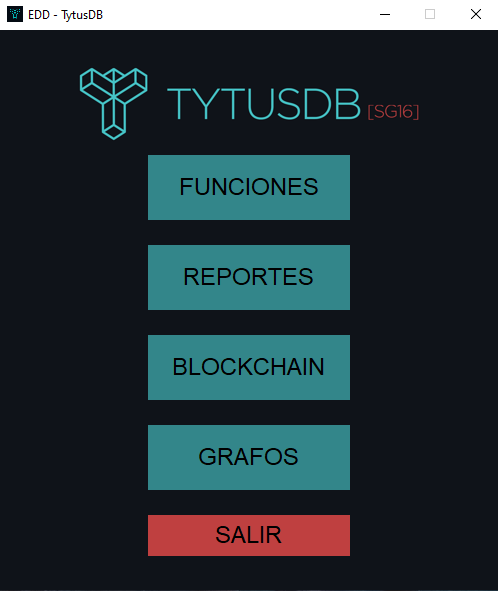

En ella el usuario puede acceder a las funcionalidades básicas de la aplicación, tales como las operaciones entre bases de datos, los repores gráficos y salir del sistema.

  

## Funciones

  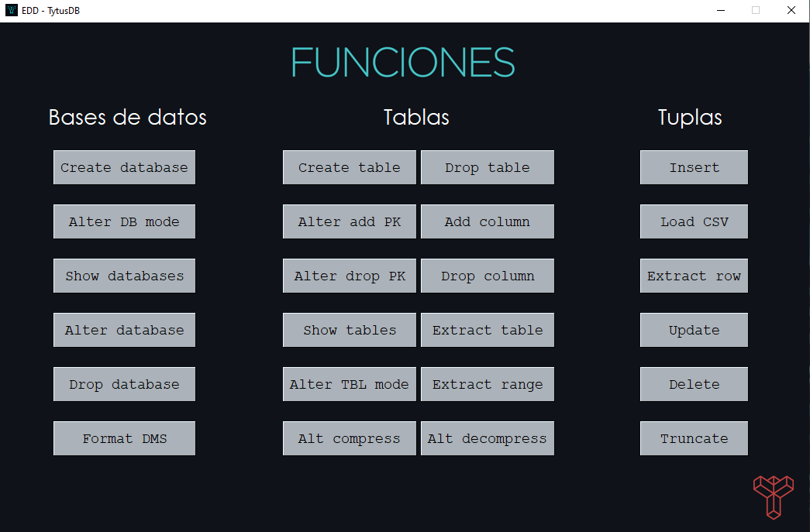

Es la primera ventana que ofrece todas operaciones que se pueden realizar entre las bases de datos, sus tablas pertenecientes y los registros que conforman cada tabla.
  

+ ### __Bases de datos:__
   - Create database:  
   Crea una base de datos nueva. Recibe el nombre con el que se identificará la base de datos.
    

    
    

     

    - Show databases:  
    Devuelve una lista de los nombres de las bases de datos existentes.
      

    - Alter database:  
    Renombra la base de datos databaseOld por databaseNew.
    

    
    

     

    - Alter database mode:
    Cambiar el modo de almacenamiento de una base de datos o de una tabla en cualquier momento. Debe ser un modo cualquiera entre 'avl', 'b', 'bplus', 'dict', 'isam', 'json', 'hash'.
    

    
    

     
    
    - Drop database:  
    Elimina por completo la base de datos indicada en database.
    

    
    

     

    - Format DMS:  
    Elimina por completo todo la información almacenada en el administrador de base de datos.

     

+ ### __Tablas:__
    - Create table:  
    Crea una tabla en una base de datos especificada recibiendo el nombre de la base de datos a la que pertenece, el nombre de la tabla, y una lista de índices referentes a la llave primaria.
    

    
    

     

    - Show tables:  
    Devuelve una lista de los nombres de las tablas de la base de datos que se solicita.
    

    
    

     

    - Extract table:  
    Extrae y devuelve una lista con elementos que corresponden a cada registro de la tabla y base de datos en cuestión.
    

    
    

     

    - Extract range table:  
    Extrae y devuelve una lista con los elementos que corresponden a un rango de registros de la tabla.
    Upper y lower corresponden a los límites superior e inferior del rango a extraer de la columna indicada de la tabla.
    

    
    

     

    - Alter table mode:
    Cambia el modo de almacenamiento de una tabla de una base de datos especificada. Debe ser un modo cualquiera entre 'avl', 'b', 'bplus', 'dict', 'isam', 'json', 'hash'.
    

    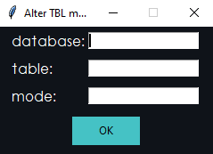
    

     

    - Alter add PK:  
    Asocia a la tabla una llave primaria simple o compuesta mediante la lista de número de columnas, esto para anticipar el índice de la estructura de la tabla cuando se inserten registros a la tabla de una base de datos.
    

    
    

     

    - Alter drop PK:  
    Elimina la llave(s) primaria actual en la información de la tabla de una base de datos.
    

    
    

     

    - Alter table:  
    Renombra el nombre de la tabla de una base de datos especificada.
    

    
    

     

    - Alter add column:  
    Agrega una columna al final de cada registro de la tabla y base de datos especificada.
    

    
    

     

    - Alter drop column:  
    Eliminar una n-ésima columna de cada registro de la tabla de una base de datos, excepto si son llaves primarias.
    

    
    

     

    - Drop table:  
    Elimina por completo una tabla de una base de datos especificada.
    

    
    

     

    - Alter table compress:
    Comprime la información asociada a una tabla de una base de datos especificada.
    

    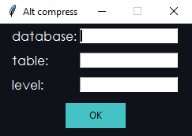
    

     

    - Alter table compress:
    Descomprime la información asociada a una tabla de una base de datos especificada.
    

    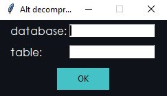
    

     

+ ### __Tuplas:__
    - Insert:  
    Inserta un registro en la estructura de datos asociada a la tabla y la base de datos.
    

    
    

     

    - Load CSV:  
    Carga un archivo CSV de una ruta especificada indicando la base de datos y tabla donde será almacenado. La base de datos y la tabla deben existir, y coincidir con el número de columnas. Si hay llaves primarias duplicadas se ignorarán. No se utilizan títulos de columnas y la separación es mediante comas (',').
    

    
    

     

    - Extract row:  
    Extrae y devuelve una lista de un registro especificado por su llave primaria de una tabla perteneciente a una base de datos especificada.
    

    
    

     

    - Update:  
    Actualiza un registro de acuerdo a la llave primaria en la estructura de datos asociada a la tabla y la base de datos.
    

    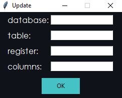
    

     

    - Delete:  
    Elimina un registro de una tabla y base de datos especificados por la llave primaria.
    

    
    

     

    - Truncate:  
    Elimina todos los registros de una tabla y base de datos existente.
    

    
    

 

### Manejo de errores:

Es frecuente que puedan ocurrir ciertos errores al momento de ingresar datos y manejar las funciones del administrador, para ello se le retornará un mensaje de error con un número que le indica que error ha cometido.

 

+ __Error 1:__  
Cualquier error en la operación no contemplado

+ __Error 2:__  
Base de datos no existente

+ __Error 3:__  
Tabla no existente

+ __Error 4:__  
Conflicto con una llave primaria o al momento de renombrar algo que ya existe

+ __Error 5:__  
Columna fuera de límites

 

  

## Reportes y navegación

La aplicación muestra de manera gráfica y navegable las siguientes estructuras:

+ Bases de datos
+ Conjunto de tablas
+ Estructura de datos asociada al modo de la base de datos. ['avl', 'b', 'bplus', 'dict', 'isam', 'json', 'hash'].
+ Tupla

 

### Reporte de bases de datos:

Al iniciar la ventana de 'Reportes' lo primero que se despliega en el apartado izquierdo es una lista de todas las bases de datos que se hayan creado. Asimismo en el panel se encuentra gráficamente cada una de ellas.  
Contiene al inicio entre corchetes el modo de almacenamiento de la base de datos.

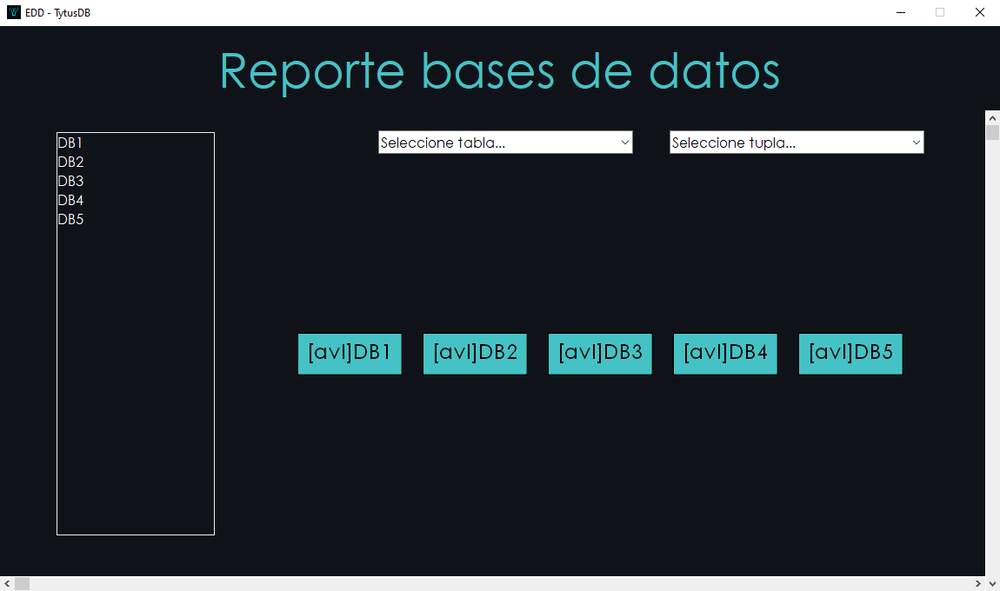

  

### Reporte de tablas:

Al hacer click sobre una base de datos de la lista izquierda, se visualiza el conjunto de tablas pertenecientes a esa base de datos y se llena la lista desplegable de cada una de las tablas.  
Contiene al inicio entre corchetes el modo de almacenamiento de la base de datos.

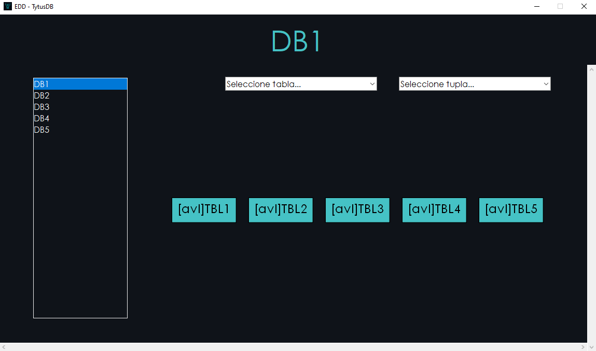

  

### Reporte de tabla (EDD):

Se selecciona una de las tablas de la lista desplegable 'Tablas' y aparece la estructura de datos en forma gráfica que muestra la distribución en referencia al contenido de la tabla de la base de datos.

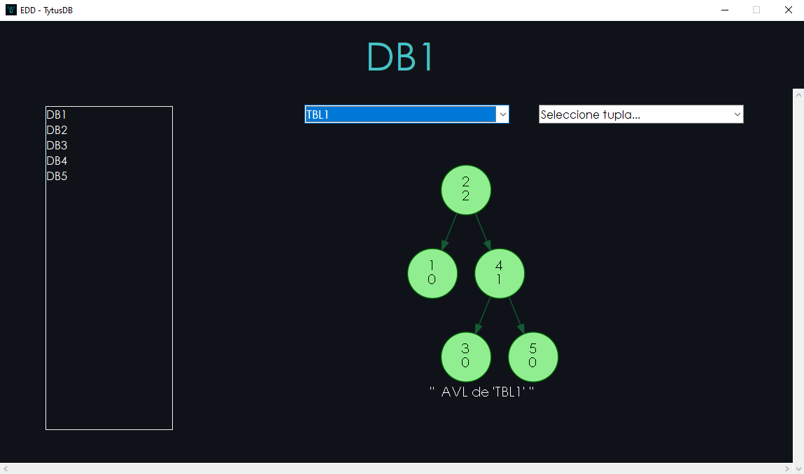

  

### Reporte de tupla:

Se selecciona un registro perteneciente a la llave primaria que se encuentra en la lista desplegable 'Tuplas'. En seguida se muestra el conjunto de registros que pertenecen a la tupla.

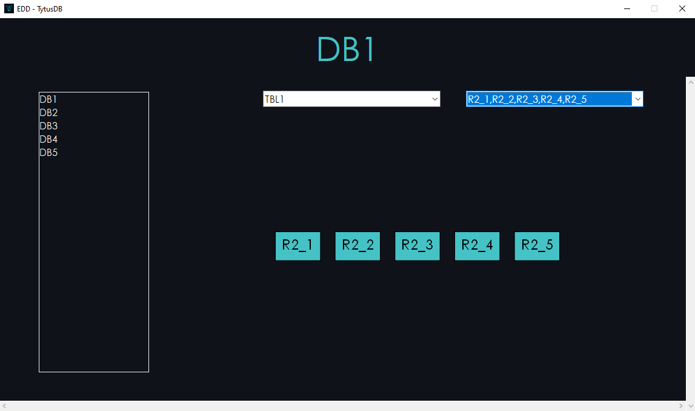

  

### Operación imposible:

Ocurre cuando se ingresa a la ventana de reportes, Blockchain o grafos, y no se encuentran bases de datos o tablas disponibles para completar el proceso gráfico.

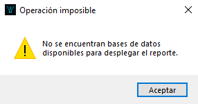

  

## Blockchain

La aplicación provee un mecanismo para trabajar en modo seguro una tabla. Es decir, al activar el modo seguro de una tabla, cuando se realicen operaciones de inserción se debe ir creando bloques con sus respectivos valores Hash.
 
Será posible acceder a esta funcionalidad sólo si existe al menos una tabla con el modo seguro activado en una base de datos.
  

### Seguridad verificada:
Al momento de validar que la información no sea incosistente y se verifique la integridad de los datos, se mostrarán todos los bloques de color verde, indicando que todo se encuentra correcto.

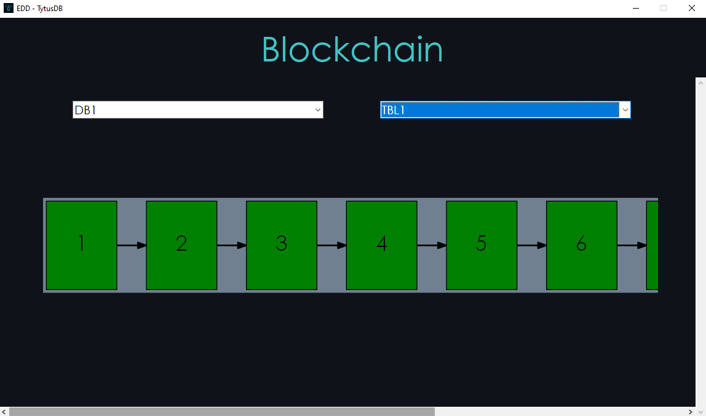

  

### Violación a la seguridad:
Si en caso se modifica cualquier registro en el momento de que la tabla ya cuenta con el modo seguro, se pintará de color rojo el primer bloque que rompe la integridad de seguridad y todos los bloques que le siguen después también serán coloreados de rojo.

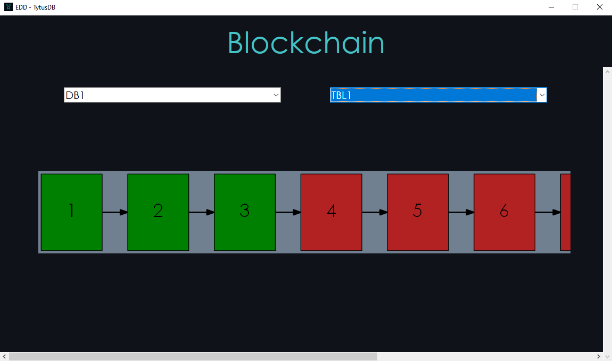

  

## Grafos:

La aplicación posee un paquete de generación de diagramas de estructuras de datos basado en GraphViz. El cual le permite visualizarlo llenando el cuadro de diálogo con la función que desee ejecutar.
  

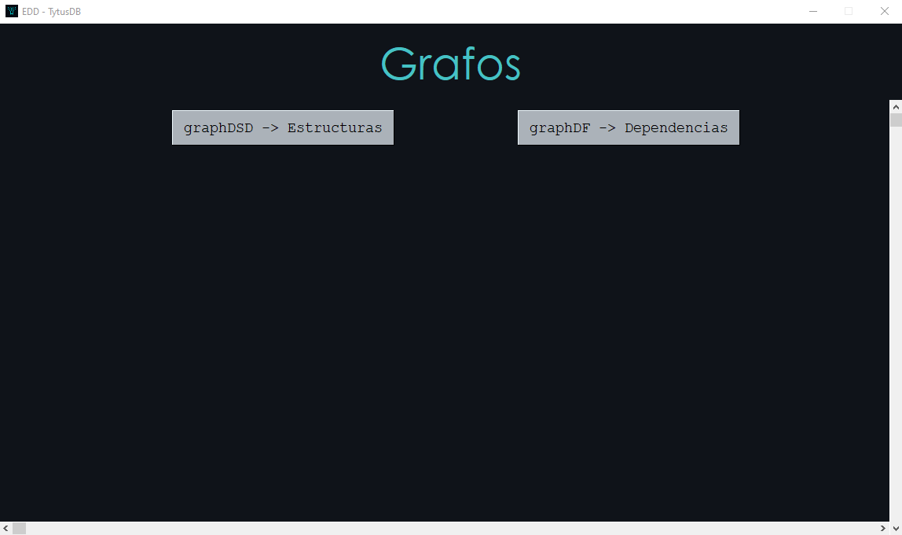

  

- graphDSD:  
Se visualiza el diagrama de estructura de datos de la base de datos especificada.

  

- graphDF:  
Este grafo muestra las dependencias funcionales que existen en una tabla específica de una base de datos.

  

## Soporte técnico

* romeo11marroquin@gmail.com
* fernandovasquez.castillo@gmail.com
* luis.danniel@hotmail.com
* esavilaortiz@gmail.com
